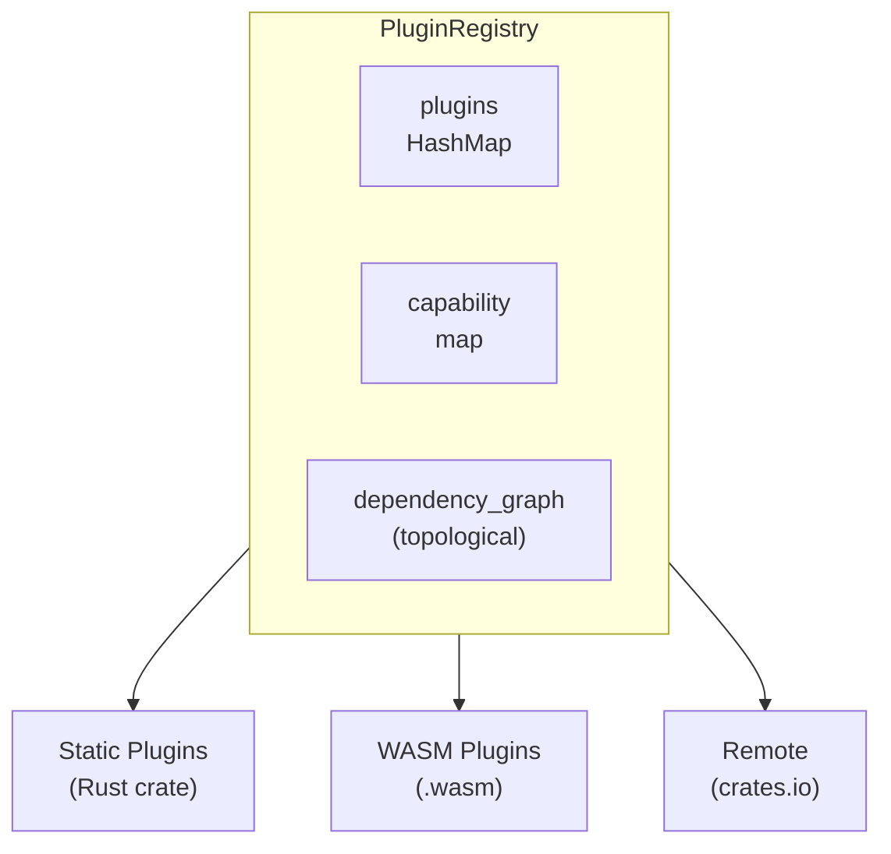

# reinhardt-dentdelion

Plugin system for the Reinhardt framework - easy to create, distribute, and install.

## Overview

**Dentdelion** (French for "lion's tooth" = dandelion) provides a comprehensive plugin architecture for extending Reinhardt applications. It supports both static plugins (Rust crates compiled into your application) and dynamic plugins (WebAssembly modules loaded at runtime).

## Key Features

- **Static Plugins**: Compile-time integration via Rust crates
- **Dynamic Plugins**: Runtime loading via WebAssembly (WASM) modules
- **Capability System**: Fine-grained access control for plugin features
- **Dependency Management**: Automatic dependency resolution with cycle detection
- **crates.io Integration**: Install plugins directly from crates.io
- **Lifecycle Hooks**: `on_load`, `on_enable`, `on_disable`, `on_unload`

## Installation

Add `reinhardt` to your `Cargo.toml`:

```toml
[dependencies]
reinhardt = { version = "0.1.0-alpha.1", features = ["dentdelion"] }

# Or use a preset:
# reinhardt = { version = "0.1.0-alpha.1", features = ["standard"] }  # Recommended
# reinhardt = { version = "0.1.0-alpha.1", features = ["full"] }      # All features
```

Then import dentdelion features:

```rust
use reinhardt::dentdelion::prelude::*;
```

**Note:** Dentdelion features are included in the `standard` and `full` feature presets.

### Feature Flags

| Feature | Description |
|---------|-------------|
| `default` | Core plugin system only |
| `wasm` | WebAssembly plugin support (requires wasmtime) |
| `cli` | CLI support for crates.io integration |
| `full` | All features enabled |

## Quick Start

### Creating a Static Plugin

```rust
use reinhardt::dentdelion::prelude::*;

pub struct MyPlugin {
    metadata: PluginMetadata,
}

impl MyPlugin {
    pub fn new() -> Self {
        Self {
            metadata: PluginMetadata::builder("my-plugin", "1.0.0")
                .description("My custom plugin")
                .author("Your Name")
                .build()
                .unwrap(),
        }
    }
}

impl Plugin for MyPlugin {
    fn metadata(&self) -> &PluginMetadata {
        &self.metadata
    }

    fn capabilities(&self) -> &[Capability] {
        &[
            Capability::Core(PluginCapability::Middleware),
            Capability::Core(PluginCapability::Commands),
        ]
    }
}
```

### Registering Plugins

```rust
use reinhardt::dentdelion::prelude::*;
use std::sync::Arc;

let mut registry = PluginRegistry::new();

// Register a plugin
let plugin = Arc::new(MyPlugin::new());
registry.register(plugin)?;

// Enable the plugin
registry.enable("my-plugin")?;

// Query plugins by capability
let middleware_plugins = registry.plugins_with_capability(&Capability::Core(PluginCapability::Middleware));
```

### Implementing Lifecycle Hooks

```rust
use reinhardt::dentdelion::prelude::*;

#[async_trait]
impl PluginLifecycle for MyPlugin {
    async fn on_load(&self, ctx: &PluginContext) -> PluginResult<()> {
        // Initialize resources
        Ok(())
    }

    async fn on_enable(&self, ctx: &PluginContext) -> PluginResult<()> {
        // Activate plugin features
        Ok(())
    }

    async fn on_disable(&self, ctx: &PluginContext) -> PluginResult<()> {
        // Deactivate plugin features
        Ok(())
    }

    async fn on_unload(&self, ctx: &PluginContext) -> PluginResult<()> {
        // Cleanup resources
        Ok(())
    }
}
```

## Core Types

### Plugin Trait

The fundamental interface all plugins must implement:

```rust
pub trait Plugin: Send + Sync {
    fn metadata(&self) -> &PluginMetadata;
    fn capabilities(&self) -> &[Capability];
    fn has_capability(&self, capability: &Capability) -> bool;
    fn is_dynamic(&self) -> bool;
    fn name(&self) -> &str;
    fn version(&self) -> &semver::Version;
}
```

### PluginCapability

Standard capabilities that plugins can provide:

| Capability | Description | WASM Support |
|------------|-------------|--------------|
| `Middleware` | HTTP middleware components | ✅ |
| `Models` | Database models and migrations | ❌ (Static only) |
| `Commands` | CLI management commands | ✅ |
| `ViewSets` | REST API ViewSets | ✅ |
| `Signals` | Custom signals | ✅ |
| `Services` | DI services | ✅ |
| `Auth` | Authentication backends | ✅ |
| `Templates` | Template engines or filters | ✅ |
| `StaticFiles` | Static file handling | ✅ |
| `Routing` | URL routing | ✅ |
| `SignalReceivers` | Signal receivers | ✅ |
| `Handlers` | HTTP handlers/views | ✅ |
| `NetworkAccess` | HTTP client for external requests | ✅ |
| `DatabaseAccess` | SQL query execution | ✅ |

### PluginRegistry

Central plugin management:

- Register and unregister plugins
- Enable and disable plugins
- Query plugins by capability
- Manage dependencies with topological sorting
- Detect circular dependencies

### PluginMetadata

Plugin identification information:

```rust
let metadata = PluginMetadata::builder("my-plugin", "1.0.0")
    .description("My plugin description")
    .author("Author Name")
    .license("MIT")
    .repository("https://github.com/example/my-plugin")
    .add_dependency("other-plugin", ">=1.0.0")
    .build()?;
```

### ProjectManifest (dentdelion.toml)

Plugin configuration file:

```toml
[plugins]
my-plugin = { version = "1.0.0", enabled = true }
other-plugin = { version = "2.0.0", enabled = false }

[wasm]
plugins_dir = "plugins/"
memory_limit = 134217728  # 128MB
timeout_seconds = 30
```

## WASM Plugin Development

### Requirements

- Enable the `wasm` feature
- WASM plugins must be compiled with the Component Model
- Plugins must implement the `dentdelion-plugin` WIT world
- Use `wit-bindgen` or `cargo-component` for code generation

### WIT Interface Definition

Dentdelion uses the WebAssembly Interface Types (WIT) standard for plugin interfaces. The complete interface is defined in `wit/dentdelion.wit`:

```wit
package reinhardt:dentdelion@0.1.0;

// Host functions available to plugins
interface host {
    get-config: func(key: string) -> option<list<u8>>;
    set-config: func(key: string, value: list<u8>) -> result<_, plugin-error>;

    log-info: func(message: string);
    log-warn: func(message: string);
    log-error: func(message: string);

    http-get: func(url: string, headers: list<tuple<string, string>>) -> result<http-response, plugin-error>;
    db-query: func(sql: string, params: list<u8>) -> result<list<u8>, plugin-error>;
}

// Plugin functions that must be implemented
interface plugin {
    get-metadata: func() -> plugin-metadata;
    get-capabilities: func() -> list<capability>;
    on-load: func(config: list<u8>) -> result<_, plugin-error>;
    on-enable: func() -> result<_, plugin-error>;
    on-disable: func() -> result<_, plugin-error>;
    on-unload: func() -> result<_, plugin-error>;
}
```

### WasmRuntime Configuration

```rust
use reinhardt::dentdelion::wasm::{WasmRuntime, WasmRuntimeConfigBuilder};
use std::time::Duration;

let config = WasmRuntimeConfigBuilder::new()
    .memory_limit_mb(128)
    .timeout(Duration::from_secs(30))
    .fuel_metering(true)
    .initial_fuel(100_000_000)
    .build();

let runtime = WasmRuntime::new(config)?;
```

### Host API

WASM plugins can access the following host functions:

| Category | Functions | Capability Required |
|----------|-----------|---------------------|
| Config | `get_config`, `set_config` | None |
| Logging | `log_debug`, `log_info`, `log_warn`, `log_error` | None |
| Services | `register_service`, `get_service`, `unregister_service` | `Services` |
| HTTP | `http_get`, `http_post` | `NetworkAccess` |
| Database | `db_query`, `db_execute` | `DatabaseAccess` |

**Data Serialization:**
- Configuration values, query parameters, and results are serialized using MessagePack
- This provides compact binary encoding for efficient WASM boundary crossing
- Use `rmp-serde` crate in Rust plugins for MessagePack serialization

### Capability-Based Security

WASM plugins must declare required capabilities in their manifest:

```toml
[wasm.my-plugin]
capabilities = ["NetworkAccess", "DatabaseAccess"]
```

Host functions check capabilities at runtime:
- `http_get`/`http_post` require `NetworkAccess` capability
- `db_query`/`db_execute` require `DatabaseAccess` capability
- Unauthorized calls return `PluginError` with code 403

### Loading WASM Plugins

```rust
use reinhardt::dentdelion::wasm::{WasmPluginLoader, WasmRuntime};
use std::sync::Arc;

let runtime = Arc::new(WasmRuntime::new(Default::default())?);
let loader = WasmPluginLoader::new("plugins/", runtime);

// Discover .wasm files
let discovered = loader.discover().await?;

// Load and instantiate
for path in discovered {
    let instance = loader.load(&path).await?;

    // Initialize plugin
    let ctx = PluginContext::default();
    instance.on_load(&ctx).await?;
    instance.on_enable(&ctx).await?;
}
```

### Limitations

- **Models capability is NOT supported** for WASM plugins (requires compile-time integration)
- Memory limit: 128MB default (configurable via `WasmRuntimeConfig`)
- Execution timeout: 30 seconds default (configurable)
- Fuel-based CPU metering: 100M instructions default (configurable)
- Config values must be MessagePack-serializable

## CLI Integration

When using the `cli` feature, the following commands are available:

```bash
# List installed plugins
reinhardt plugin list

# Show plugin details
reinhardt plugin info <name>

# Install from crates.io
reinhardt plugin install <name>

# Remove a plugin
reinhardt plugin remove <name>

# Enable/disable plugins
reinhardt plugin enable <name>
reinhardt plugin disable <name>

# Search crates.io
reinhardt plugin search <query>

# Update a plugin
reinhardt plugin update <name>
```

## Architecture



## Related Crates

- `reinhardt-commands`: CLI command integration
- `reinhardt-di`: Dependency injection for services
- `reinhardt-middleware`: Middleware integration
- `reinhardt-signals`: Signal system

## License

Licensed under the MIT license.
