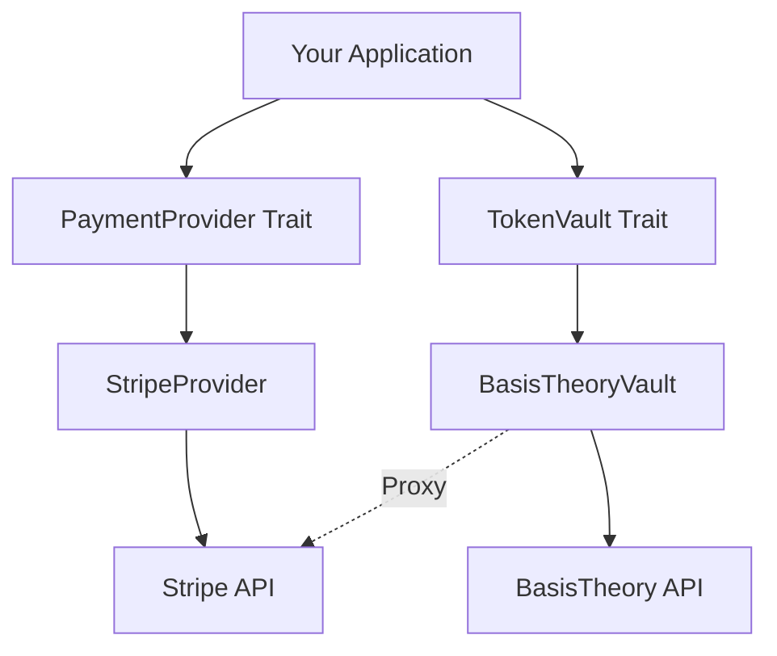

# reinhardt-payment

Payment abstraction layer with Stripe and BasisTheory integration for the Reinhardt web framework.

## Features

- **PaymentProvider Trait**: Abstract interface for multiple payment processors
- **Stripe Integration**: Full support for PaymentIntent, Checkout Sessions, and Subscriptions
- **BasisTheory TokenVault**: PCI-compliant card tokenization
- **Webhook Processing**: Signature verification and event handling with HMAC-SHA256
- **Idempotency**: Safe payment retry with UUID-based keys
- **Retry Strategy**: Exponential backoff with jitter for network resilience

## Installation

```toml
[dependencies]
reinhardt-payment = "0.1.0"
```

## Quick Start

### Creating a Payment Intent

```rust
use reinhardt_payment::{PaymentProvider, PaymentIntentParams};
use reinhardt_payment_mocks::MockStripeProvider;

#[tokio::main]
async fn main() -> Result<(), Box<dyn std::error::Error>> {
    // Initialize mock provider (for testing)
    let provider = MockStripeProvider::new("sk_test_...".to_string());

    // Create payment intent
    let params = PaymentIntentParams {
        amount: 1000, // $10.00
        currency: "usd".to_string(),
        confirm: false,
        ..Default::default()
    };

    let intent = provider.create_payment_intent(params).await?;
    println!("Payment intent created: {}", intent.id);
    println!("Client secret: {}", intent.client_secret.unwrap());

    Ok(())
}
```

### Creating a Checkout Session

```rust
use reinhardt_payment::{CheckoutParams, CheckoutMode};

let params = CheckoutParams {
    success_url: "https://example.com/success".to_string(),
    cancel_url: "https://example.com/cancel".to_string(),
    price_id: "price_...".to_string(),
    customer_id: None,
    mode: CheckoutMode::Payment,
};

let session = provider.create_checkout_session(params).await?;
// Redirect user to session.url
```

### Handling Webhooks

```rust
// In your webhook endpoint
let payload = request.body(); // Raw bytes
let signature = request.header("Stripe-Signature");

let event = provider.handle_webhook(payload, signature).await?;

match event {
    WebhookEvent::PaymentSucceeded { payment_intent_id, .. } => {
        // Fulfill order
        println!("Payment succeeded: {}", payment_intent_id);
    }
    WebhookEvent::PaymentFailed { payment_intent_id, error } => {
        // Notify customer
        println!("Payment failed: {:?}", error);
    }
    _ => {}
}
```

### Tokenizing Card Data (BasisTheory)

```rust
use reinhardt_payment::{TokenVault, CardData};
use reinhardt_payment_mocks::MockBasisTheoryVault;

let vault = MockBasisTheoryVault::new("bt_api_key_...".to_string());

let card = CardData {
    number: "4242424242424242".to_string(),
    exp_month: 12,
    exp_year: 2030,
    cvc: "123".to_string(),
};

let token = vault.tokenize_card(card).await?;
println!("Token ID: {}", token.id);

// Later, use token for payment
let result = vault.process_payment_with_token(
    &token.id,
    1000,
    "usd",
).await?;
```

## Architecture



## Security

### PCI DSS Compliance

- Use BasisTheory TokenVault to keep card data out of your application
- Application never touches raw card numbers
- Tokens are used for all payment operations

### Webhook Verification

- HMAC-SHA256 signature verification prevents replay attacks
- Constant-time comparison prevents timing attacks
- Timestamp validation (5-minute tolerance)

### Best Practices

- Never log sensitive data (card numbers, API keys, tokens)
- Use idempotency keys for all mutating operations
- Implement retry with exponential backoff
- Validate all inputs from external sources

## Testing

### Unit Tests

```bash
cargo test --package reinhardt-payment
```

### Integration Tests

Set up test API keys:

```bash
export STRIPE_SECRET_KEY="sk_test_..."
export BASISTHEORY_API_KEY="bt_test_..."
```

Run integration tests:

```bash
cargo test --package reinhardt-payment --test integration_stripe
cargo test --package reinhardt-payment --test integration_basistheory
```

## Documentation

For detailed API documentation, run:

```bash
cargo doc --package reinhardt-payment --open
```

## Examples

See the `examples/` directory for complete examples:

- `payment_intent.rs` - One-time payment flow
- `checkout_session.rs` - Hosted payment page
- `subscription.rs` - Recurring payments
- `tokenization.rs` - Card tokenization with BasisTheory
- `webhook_handler.rs` - Webhook event processing

## Contributing

See [CONTRIBUTING.md](../../CONTRIBUTING.md) for development guidelines.

## License

This project is licensed under either of:

- Apache License, Version 2.0 ([LICENSE-APACHE](../../LICENSE-APACHE))
- MIT License ([LICENSE-MIT](../../LICENSE-MIT))

at your option.

## References

- [Stripe API Documentation](https://stripe.com/docs/api)
- [BasisTheory Documentation](https://docs.basistheory.com/)
- [PCI DSS Standards](https://www.pcisecuritystandards.org/)
