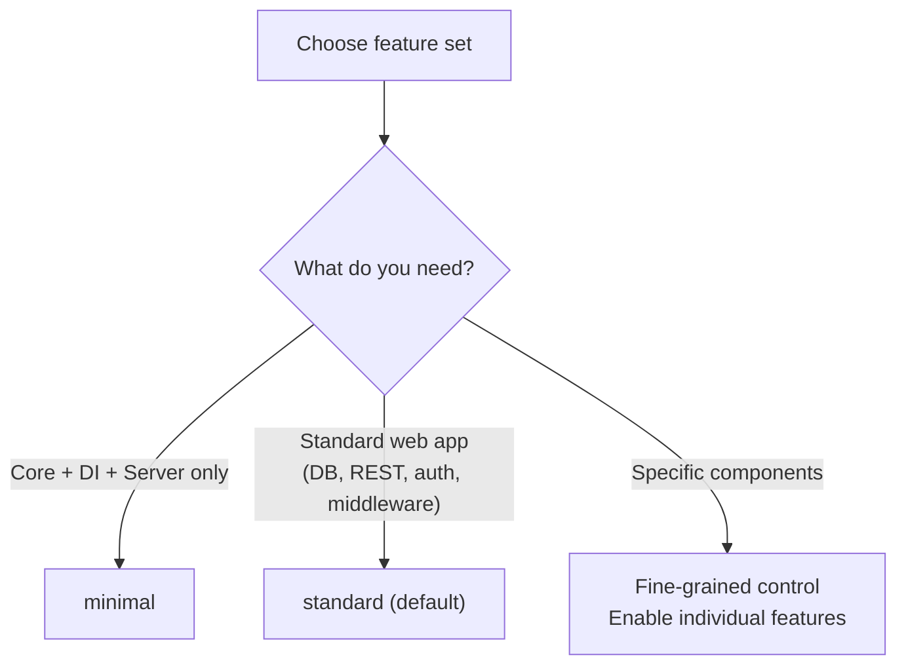
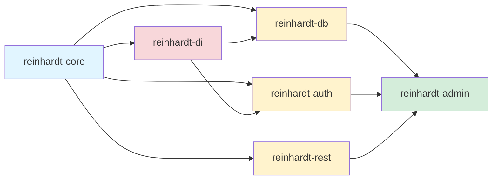

# Crate Structure

This document explains the overall structure of the Reinhardt project, including how crates are organized within the Cargo workspace.

## Overview

The Reinhardt project uses a **flat workspace architecture**:

1. **Root Facade** (`reinhardt-web`) - Feature gate control and unified API
2. **Workspace Crates** (44 crates under `crates/`) - Modular functionality organized by domain
3. **Test Crates** (3 crates under `tests/`) - Integration tests and benchmarks
4. **Example Crates** (8 crates under `examples/`) - Separate workspace with usage examples

All crates under `crates/` are published to crates.io and share versioned workspace dependencies.

## Workspace Crates (45 total)

The main workspace consists of 1 root facade crate + 44 crates under `crates/`:

### Root Facade

| Crate | Package Name | Description |
|-------|-------------|-------------|
| `.` (root) | `reinhardt-web` | Full-stack API framework facade with feature flags |

### Core Framework

| Crate | Package Name | Description |
|-------|-------------|-------------|
| `reinhardt-core` | `reinhardt-core` | Core components for Reinhardt framework |
| `reinhardt-core/macros` | `reinhardt-macros` | Procedural macros for Reinhardt framework |
| `reinhardt-apps` | `reinhardt-apps` | Application registry and management |
| `reinhardt-conf` | `reinhardt-conf` | Configuration management with encryption and secrets |
| `reinhardt-http` | `reinhardt-http` | HTTP primitives, request and response handling |
| `reinhardt-server` | `reinhardt-server` | HTTP server implementation |
| `reinhardt-di` | `reinhardt-di` | Dependency injection system (FastAPI-inspired) |
| `reinhardt-di/macros` | `reinhardt-di-macros` | Procedural macros for dependency injection |

### Database Layer

| Crate | Package Name | Description |
|-------|-------------|-------------|
| `reinhardt-db` | `reinhardt-db` | Django-style database layer (ORM, migrations, pool, backends) |
| `reinhardt-db-macros` | `reinhardt-db-macros` | Procedural macros for database layer (ORM and NoSQL ODM) |
| `reinhardt-query` | `reinhardt-query` | SQL query builder |
| `reinhardt-query/macros` | `reinhardt-query-macros` | Procedural macros for SQL identifier derivation |

### API Development

| Crate | Package Name | Description |
|-------|-------------|-------------|
| `reinhardt-rest` | `reinhardt-rest` | REST API framework aggregator (DRF-style) |
| `reinhardt-rest/openapi-macros` | `reinhardt-openapi-macros` | Procedural macros for OpenAPI schema generation |
| `reinhardt-openapi` | `reinhardt-openapi` | OpenAPI router wrapper |
| `reinhardt-graphql` | `reinhardt-graphql` | GraphQL API support (facade crate) |
| `reinhardt-graphql/macros` | `reinhardt-graphql-macros` | Procedural macros for GraphQL schema generation |
| `reinhardt-grpc` | `reinhardt-grpc` | gRPC support for RPC services |
| `reinhardt-grpc/macros` | `reinhardt-grpc-macros` | Procedural macros for gRPC DI integration |

### Authentication & Authorization

| Crate | Package Name | Description |
|-------|-------------|-------------|
| `reinhardt-auth` | `reinhardt-auth` | Authentication and authorization system |

### URL Routing

| Crate | Package Name | Description |
|-------|-------------|-------------|
| `reinhardt-urls` | `reinhardt-urls` | URL routing and proxy utilities |
| `reinhardt-urls/routers-macros` | `reinhardt-routers-macros` | Procedural macros for compile-time URL path validation |
| `reinhardt-dispatch` | `reinhardt-dispatch` | URL dispatcher and request routing |

### Frontend & Pages

| Crate | Package Name | Description |
|-------|-------------|-------------|
| `reinhardt-pages` | `reinhardt-pages` | WASM-based frontend framework (Django-like API) |
| `reinhardt-pages/macros` | `reinhardt-pages-macros` | Procedural macros for WASM frontend |
| `reinhardt-pages/ast` | `reinhardt-pages-ast` | AST definitions for pages macro DSLs |
| `reinhardt-manouche` | `reinhardt-manouche` | DSL definitions for pages macros (Manouche Jazz DSL) |
| `reinhardt-forms` | `reinhardt-forms` | Form handling and validation |

### Admin & CLI

| Crate | Package Name | Description |
|-------|-------------|-------------|
| `reinhardt-admin` | `reinhardt-admin` | Admin panel functionality (Django admin-style) |
| `reinhardt-admin-cli` | `reinhardt-admin-cli` | Command-line tool for project management |
| `reinhardt-commands` | `reinhardt-commands` | Django-style management command framework |

### Middleware & Views

| Crate | Package Name | Description |
|-------|-------------|-------------|
| `reinhardt-views` | `reinhardt-views` | View layer aggregator for viewsets and views-core |
| `reinhardt-middleware` | `reinhardt-middleware` | Middleware system for request/response pipeline |

### Utilities & Extensions

| Crate | Package Name | Description |
|-------|-------------|-------------|
| `reinhardt-utils` | `reinhardt-utils` | Utility functions aggregator |
| `reinhardt-shortcuts` | `reinhardt-shortcuts` | Django-style shortcut functions (redirects, rendering, 404) |
| `reinhardt-tasks` | `reinhardt-tasks` | Background task execution and scheduling |
| `reinhardt-throttling` | `reinhardt-throttling` | Throttling and rate limiting |
| `reinhardt-mail` | `reinhardt-mail` | Email sending with multiple backends |
| `reinhardt-i18n` | `reinhardt-i18n` | Internationalization and localization |
| `reinhardt-websockets` | `reinhardt-websockets` | WebSocket support for real-time communication |
| `reinhardt-dentdelion` | `reinhardt-dentdelion` | Plugin system |
| `reinhardt-deeplink` | `reinhardt-deeplink` | Mobile deep linking (iOS Universal Links, Android App Links) |

### Testing

| Crate | Package Name | Description |
|-------|-------------|-------------|
| `reinhardt-test` | `reinhardt-test` | Testing utilities and helpers |
| `reinhardt-testkit` | `reinhardt-testkit` | Core testing infrastructure (no functional crate dependencies) |

## Test & Benchmark Crates

These are workspace members under `tests/` used for integration testing and benchmarking:

| Path | Package Name | Description |
|------|-------------|-------------|
| `tests/` | `reinhardt-test-support` | Test support crate |
| `tests/integration/` | `reinhardt-integration-tests` | Integration tests |
| `tests/bench/` | `reinhardt-benchmarks` | Benchmark tests |

## Example Crates (Separate Workspace)

Examples are excluded from the main workspace and form their own independent workspace:

| Path | Package Name |
|------|-------------|
| `examples/examples-hello-world/` | `examples-hello-world` |
| `examples/examples-rest-api/` | `examples-rest-api` |
| `examples/examples-tutorial-basis/` | `examples-tutorial-basis` |
| `examples/examples-tutorial-rest/` | `examples-tutorial-rest` |
| `examples/examples-database-integration/` | `examples-database-integration` |
| `examples/examples-di-showcase/` | `examples-di-showcase` |
| `examples/examples-github-issues/` | `examples-github-issues` |
| `examples/examples-twitter/` | `examples-twitter` |

## Physical Structure

```
reinhardt/
├── Cargo.toml              # Root facade (reinhardt-web) + workspace definition
├── src/lib.rs              # Re-exports with feature gates
├── crates/
│   ├── reinhardt-core/     # Core framework
│   │   ├── Cargo.toml
│   │   ├── src/
│   │   └── macros/         # reinhardt-macros (sub-crate)
│   ├── reinhardt-db/       # Database layer
│   │   ├── Cargo.toml
│   │   └── src/
│   ├── reinhardt-db-macros/ # DB macros (separate crate)
│   ├── reinhardt-pages/    # WASM frontend
│   │   ├── Cargo.toml
│   │   ├── src/
│   │   ├── macros/         # reinhardt-pages-macros (sub-crate)
│   │   └── ast/            # reinhardt-pages-ast (sub-crate)
│   ├── reinhardt-rest/     # REST API
│   │   ├── Cargo.toml
│   │   ├── src/
│   │   └── openapi-macros/ # reinhardt-openapi-macros (sub-crate)
│   └── ...                 # Other crates follow flat structure
├── tests/
│   ├── Cargo.toml          # Test support
│   ├── integration/        # Integration tests
│   └── bench/              # Benchmarks
└── examples/               # Separate workspace (excluded from main)
    ├── Cargo.toml          # Examples workspace root
    └── examples-*/         # Individual example crates
```

Some crates contain sub-crates for procedural macros or AST definitions within their directory (e.g., `reinhardt-core/macros/`, `reinhardt-pages/ast/`). These are separate workspace members, not internal unpublished modules.

## Feature Flags

Users enable functionality through feature flags on the root `reinhardt-web` crate:

```toml
[dependencies]
reinhardt = { version = "0.1.0-rc.13", features = ["standard"] }
```

The following diagram summarizes how to choose the right feature set:


```mermaid
flowchart TD
    A[Choose feature set] --> B{What do you need?}
    B -->|"Core + DI + Server only"| C["minimal"]
    B -->|"Standard web app<br/>(DB, REST, auth, middleware)"| D["standard (default)"]
    B -->|"Specific components"| E["Fine-grained control<br/>Enable individual features"]
```

### Common Feature Flag Patterns

#### Minimal Setup
```toml
reinhardt = { version = "0.1.0-rc.13", features = ["minimal"] }
# Includes: core, di, server
```

#### Standard Setup (Default)
```toml
reinhardt = { version = "0.1.0-rc.13" }
# Or explicitly: features = ["standard"]
# Includes: minimal + database, db-postgres, rest, auth, middleware, pages, and more
```

#### Fine-Grained Control
```toml
reinhardt = { version = "0.1.0-rc.13", default-features = false, features = [
    "core",
    "database",
    "db-postgres",
    "rest",
    "auth",
] }
```

## Dependency Graph (Simplified)


```mermaid
graph LR
    A[reinhardt-core] --> B[reinhardt-db]
    A --> C[reinhardt-auth]
    A --> D[reinhardt-rest]

    B --> E[reinhardt-admin]
    C --> E
    D --> E

    A --> F[reinhardt-di]
    F --> B
    F --> C

    style A fill:#e1f5ff
    style B fill:#fff3cd
    style C fill:#fff3cd
    style D fill:#fff3cd
    style E fill:#d4edda
    style F fill:#f8d7da
```

## Publishing Strategy

### What Gets Published

- All crates under `crates/` are published to crates.io
- Test crates (`tests/`) are not published
- Example crates (`examples/`) are not published

### Version Synchronization

All workspace crates share version coordination through `[workspace.dependencies]` in the root `Cargo.toml`.

### Release Process

See [RELEASE_PROCESS.md](RELEASE_PROCESS.md) for detailed release procedures.

## Testing Strategy

### Unit Tests

Each crate has its own unit tests:

```bash
# Test specific crate
cargo test -p reinhardt-db --all-features

# Test all crates
cargo test --workspace --all-features
```

### Integration Tests

Integration tests are in the `tests/integration/` crate:

```bash
cargo nextest run --package reinhardt-integration-tests
```

## Related Documentation

- [MODULE_SYSTEM.md](MODULE_SYSTEM.md) - Module organization guidelines
- [RELEASE_PROCESS.md](RELEASE_PROCESS.md) - Release and publishing procedures
- Individual crate README files - Detailed feature documentation

---

**Last Updated**: 2026-03-20
