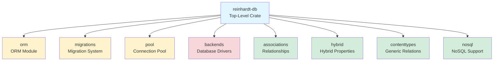
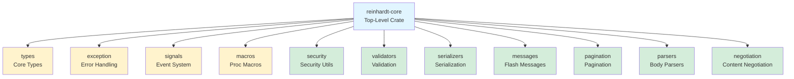
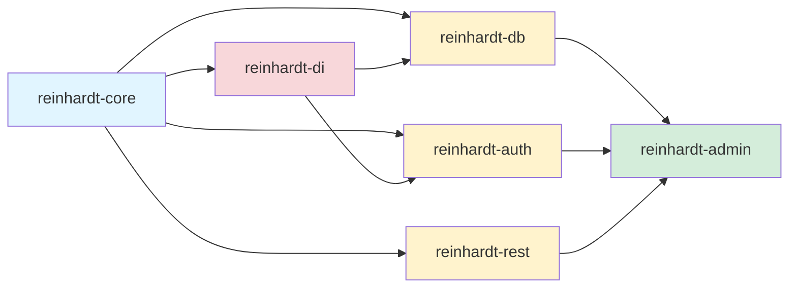

# Crate Structure

This document explains the overall structure of the Reinhardt project, including how top-level crates and internal modules are organized.

## Overview

The Reinhardt project uses a **3-tier architecture**:

1. **Root Facade** (`reinhardt`) - Feature gate control and unified API
2. **Top-Level Crates** (31 crates) - Public API and module organization
3. **Internal Modules** (`publish = false`) - Implementation organized by functionality

This structure provides modularity internally while offering a simple, unified interface to users.

## Top-Level Crates

The following crates are published to crates.io:

### Core Framework
- `reinhardt` - Root facade crate with feature flags
- `reinhardt-core` - Core components (types, exception, signals, validators, etc.)
- `reinhardt-http` - HTTP types and request/response handling
- `reinhardt-server` - HTTP server implementation (Hyper-based)

### Database Layer
- `reinhardt-db` - Database abstraction (ORM, migrations, pool, backends)
- `reinhardt-apps` - Application registry and configuration

### Authentication & Authorization
- `reinhardt-auth` - Authentication and authorization system

### API Development
- `reinhardt-rest` - REST API framework (DRF-style)
- `reinhardt-graphql` - GraphQL integration

### Configuration & Settings
- `reinhardt-conf` - Settings management with hot-reload and encryption

### Frontend & Pages
- `reinhardt-pages` - SSR and page generation
- `reinhardt-forms` - Form handling and validation
- `reinhardt-admin` - Admin interface (Django admin-style)

### Utilities
- `reinhardt-di` - Dependency injection (FastAPI-style)
- `reinhardt-urls` - URL routing and pattern matching
- `reinhardt-commands` - CLI command framework
- `reinhardt-middleware` - Middleware implementations
- `reinhardt-tasks` - Background task processing
- `reinhardt-dentdelion` - WASM and plugin system
- ... and 12 more utility crates

## Internal Module Organization

Each top-level crate contains internal modules organized under `crates/` directory. These modules have `publish = false` and are only accessible through the parent crate's public API.

### Example: reinhardt-db Structure



### Example: reinhardt-core Structure



## Physical vs Logical Structure

### Physical Structure (File System)

```
crates/
├── reinhardt-db/
│   ├── Cargo.toml           # Top-level crate definition
│   ├── src/
│   │   └── lib.rs           # Public API (re-exports modules)
│   └── crates/              # Internal modules
│       ├── orm/             # publish = false
│       ├── migrations/      # publish = false
│       ├── pool/            # publish = false
│       ├── backends/        # publish = false
│       └── ...
```

### Logical Structure (User View)

Users access functionality through module paths:

```rust
// Accessing ORM module
use reinhardt::db::orm::{Model, QuerySet};

// Accessing migrations module
use reinhardt::db::migrations::{Migration, MigrationExecutor};

// Accessing pool module
use reinhardt::db::pool::ConnectionPool;
```

## Feature Flags

Users enable functionality through feature flags in `Cargo.toml`:

```toml
[dependencies]
reinhardt = { version = "0.1.0-alpha.1", features = ["db-postgres", "orm", "migrations"] }
```

### Common Feature Flag Patterns

#### Minimal Setup
```toml
reinhardt = { version = "0.1.0-alpha.1", features = ["minimal"] }
# Includes: core, di, server
```

#### Standard Setup (Recommended)
```toml
reinhardt = { version = "0.1.0-alpha.1", features = ["standard"] }
# Includes: minimal + database, db-postgres, rest, auth
```

#### Full Features
```toml
reinhardt = { version = "0.1.0-alpha.1", features = ["full"] }
# Includes: all features from all crates
```

#### Fine-Grained Control
```toml
reinhardt = { version = "0.1.0-alpha.1", features = [
    "core",
    "db-postgres",
    "orm",
    "migrations",
    "rest",
    "auth-jwt"
] }
```

## Why This Structure?

### For Users

**Benefits**:
- **Simple Dependency Management**: Add one crate (`reinhardt`) to `Cargo.toml`
- **Feature-Based Selection**: Enable only what you need via feature flags
- **Unified API**: All functionality accessible through consistent module paths
- **Easy Upgrades**: Single version number to manage

**Example**:
```toml
# Before (if modules were separate crates)
reinhardt-orm = "0.1.0"
reinhardt-migrations = "0.1.0"
reinhardt-pool = "0.1.0"
reinhardt-backends = "0.1.0"

# After (unified structure)
reinhardt = { version = "0.1.0-alpha.1", features = ["db-postgres", "orm", "migrations"] }
```

### For Maintainers

**Benefits**:
- **Modularity**: Each module can be developed independently
- **Code Reuse**: Modules can share internal utilities
- **Workspace Efficiency**: Shared build artifacts and dependencies
- **Clear Boundaries**: Each module has well-defined responsibilities
- **Version Synchronization**: All modules share the same version

### For Contributors

**Benefits**:
- **Easy Navigation**: Clear module boundaries and responsibilities
- **Isolated Changes**: Work on one module without affecting others
- **Consistent Patterns**: Similar structure across all crates
- **Comprehensive Tests**: Each module has its own test suite

## Module Dependencies

### Cross-Module Dependencies

Modules can depend on other modules within the same crate:

```rust
// In reinhardt-db/crates/migrations
use reinhardt_db::backends;  // Depends on backends module
use reinhardt_db::orm;        // Depends on orm module
```

### Cross-Crate Dependencies

Top-level crates can depend on other top-level crates:

```rust
// reinhardt-admin depends on reinhardt-db
use reinhardt_db::orm::Model;

// reinhardt-rest depends on reinhardt-core
use reinhardt_core::types::Handler;
```

### Dependency Graph (Simplified)



## Module Naming Conventions

### Internal Module Names

Internal modules use descriptive names without the `reinhardt-` prefix:

- ✅ `orm` (not `reinhardt-orm`)
- ✅ `migrations` (not `reinhardt-migrations`)
- ✅ `pool` (not `reinhardt-pool`)

### Cargo Package Names

Internal modules still have full package names in `Cargo.toml` for disambiguation:

```toml
[package]
name = "reinhardt-orm"
publish = false  # Not published to crates.io
```

### Module Paths in Code

Users access modules through the parent crate:

```rust
use reinhardt::db::orm::Model;        // ✅ Correct
// NOT: use reinhardt_db::Model;     // ❌ Won't work
```

## Testing Strategy

### Unit Tests

Each module has its own unit tests:

```bash
# Test specific module
cargo test -p reinhardt-orm --all-features

# Test all modules in a crate
cargo test -p reinhardt-db --all-features
```

### Integration Tests

Integration tests are located in the `tests/` directory of each crate:

```bash
cargo test --test orm_integration_tests
```

### Workspace Tests

Run all tests across the workspace:

```bash
cargo test --workspace --all-features
```

## Publishing Strategy

### What Gets Published

- ✅ Top-level crates (`reinhardt`, `reinhardt-core`, `reinhardt-db`, etc.)
- ❌ Internal modules (all have `publish = false`)

### Version Synchronization

All top-level crates share the same version number, managed through workspace inheritance:

```toml
[workspace]
version = "0.1.0-alpha.1"

[package]
version.workspace = true
```

### Release Process

See [RELEASE_PROCESS.md](RELEASE_PROCESS.md) for detailed release procedures.

## Migration from Old Structure

### Before (Hypothetical Separate Crates)

```toml
[dependencies]
reinhardt-orm = "0.1.0"
reinhardt-migrations = "0.1.0"
reinhardt-pool = "0.1.0"
```

### After (Current Unified Structure)

```toml
[dependencies]
reinhardt = { version = "0.1.0-alpha.1", features = ["db-postgres", "orm", "migrations"] }
```

### Code Changes

**Before**:
```rust
use reinhardt_db::Model;
use reinhardt_migrations::Migration;
```

**After**:
```rust
use reinhardt::db::orm::Model;
use reinhardt::db::migrations::Migration;
```

## Related Documentation

- [MODULE_SYSTEM.md](MODULE_SYSTEM.md) - Module organization guidelines
- [FEATURE_FLAGS.md](FEATURE_FLAGS.md) - Complete feature flags reference
- [RELEASE_PROCESS.md](RELEASE_PROCESS.md) - Release and publishing procedures
- Individual crate README files - Detailed feature documentation

---

**Last Updated**: 2026-01-18 (during subcrate integration)
