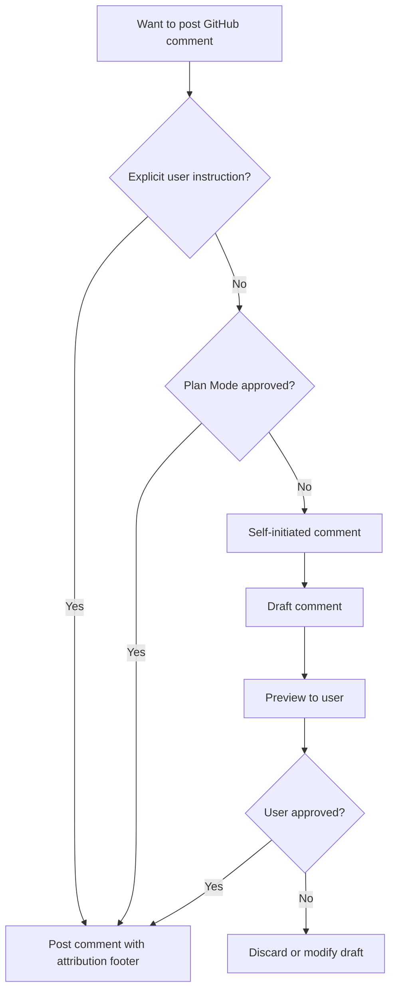
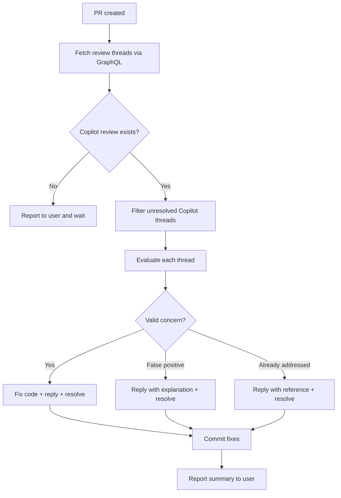

# GitHub Interaction Guidelines

## Purpose

This file defines the policy for Claude Code to participate in GitHub discussions on existing pull requests and issues in the Reinhardt project. These rules ensure appropriate authorization, consistent formatting, and useful technical context when commenting on PRs and Issues.

---

## Language Requirements

### LR-1 (MUST): English-Only Comments

- **ALL** comments on PRs and Issues MUST be written in English
- Code references, file paths, and technical terms should use their original form
- This ensures accessibility for international contributors and maintainers

**Rationale:**
- Consistent with LR-1 in PR_GUIDELINE.md and ISSUE_GUIDELINES.md
- GitHub is an international platform
- English is the lingua franca of software development

---

## Posting Policy

### PP-1 (MUST): Posting Authorization Flow

Claude Code MUST follow this authorization model before posting any comment:

| Authorization Source | Action |
|---------------------|--------|
| Explicit user instruction | Post directly |
| Plan Mode approval | Post directly |
| Self-initiated (no instruction) | MUST preview and get user confirmation |

**Self-Initiated Comment Flow:**

1. Draft the comment content
2. Present the full preview to the user
3. Wait for explicit approval
4. Post only after confirmation

**Important Notes:**
- This mirrors CE-1 (Commit Execution Policy) authorization model
- "Post directly" still means using proper tools (PP-3), not bypassing quality standards
- When in doubt about authorization, always preview and confirm

The following diagram summarizes the comment authorization decision flow:



### PP-2 (MUST): Content Preview Before Posting

Before posting any self-initiated comment:

1. Show the complete comment text to the user
2. Identify the target (PR number, Issue number, review thread)
3. Explain why this comment would be helpful
4. Wait for explicit approval or modification request

**Example Preview Format:**
```
Target: PR #42 - Review comment reply
Thread: src/auth/jwt.rs line 15

---
[Comment content here]
---

Shall I post this comment?
```

### PP-3 (MUST): Use GitHub MCP or CLI for Posting

- **MUST** prefer GitHub MCP tools for posting comments when available
- **Fallback**: Use GitHub CLI (`gh`) when GitHub MCP is not available
- **NEVER** use raw `curl` or web browser for posting comments

**GitHub MCP Tools:**
- `add_issue_comment` - Comment on issues
- `add_comment_to_pending_review` - Add PR review comments
- `pull_request_review_write` - Submit PR reviews

**GitHub CLI Fallback:**
```bash
# Comment on a PR
gh pr comment <number> --body "Comment text"

# Comment on an issue
gh issue comment <number> --body "Comment text"

# Review a PR
gh pr review <number> --comment --body "Review comment"
```

---

## PR Review Response

### RR-1 (MUST): Responding to Review Comments

When responding to PR review comments:

1. Address the specific concern raised by the reviewer
2. Reference the exact code location being discussed
3. Provide technical justification for implementation decisions
4. Offer alternatives when the reviewer suggests changes

**Authorization:** Responding to review comments typically requires explicit user instruction, unless the response was part of an approved plan.

### RR-2 (SHOULD): Response Content Structure

Use this template for PR review responses:

```markdown
**Re: [Reviewer's concern summary]**

[Direct answer to the concern]

[Technical justification or explanation]

[Code reference if applicable]:
`path/to/file.rs:L42` - [Description of relevant code]

[Action taken or proposed]:
- [What was changed, or what will be changed]

🤖 Generated with [Claude Code](https://claude.com/claude-code)
```

**Guidelines:**
- Be concise — answer the concern directly
- Include code references with repository-relative paths
- If changes were made in response, reference the commit
- If proposing alternatives, list trade-offs

### RR-3 (MUST): Code Reference Format

When referencing code in GitHub comments:

- **MUST** use repository-relative paths: `crates/reinhardt-core/src/lib.rs`
- **MUST** include line numbers when referring to specific code: `crates/reinhardt-core/src/lib.rs:L42`
- **MUST** use markdown code blocks with language specifiers for code snippets
- **NEVER** use absolute local paths (`/Users/...`, `/home/...`)

**Examples:**
```markdown
✅ Good: See `crates/reinhardt-orm/src/query/builder.rs:L150`
✅ Good: The implementation in `crates/reinhardt-core/src/model.rs:L42-L58`
❌ Bad: See `/Users/kent8192/Projects/reinhardt/crates/reinhardt-orm/src/query/builder.rs`
❌ Bad: Check line 150 (no file reference)
```

---

## PR Implementation Context

### PIC-1 (SHOULD): Providing Change Context for Reviewers

When providing implementation context on PRs, include:

```markdown
## Implementation Context

**Approach:** [Brief description of the approach taken]

**Key Changes:**
- `path/to/file.rs` - [What was changed and why]
- `path/to/other.rs` - [What was changed and why]

**Design Decisions:**
- [Decision 1]: [Rationale]
- [Decision 2]: [Rationale]

**Testing:**
- [What was tested and how]
- [Edge cases covered]

🤖 Generated with [Claude Code](https://claude.com/claude-code)
```

### PIC-2 (SHOULD): Impact Analysis Comments

When changes affect multiple crates or modules, provide impact analysis:

```markdown
## Impact Analysis

**Changed Crates:**
| Crate | Change Type | Impact |
|-------|------------|--------|
| `reinhardt-core` | API addition | Non-breaking |
| `reinhardt-orm` | Behavior change | Breaking (see migration) |

**Cross-Crate Dependencies:**
- `reinhardt-orm` depends on `reinhardt-core` — changes are forward-compatible
- `reinhardt-database` is not affected

**Migration Required:** [Yes/No]
- [Migration steps if applicable]

🤖 Generated with [Claude Code](https://claude.com/claude-code)
```

---

## Copilot Review Handling

### CR-1 (MUST): Post-PR Copilot Review Workflow

After creating a PR, Claude Code MUST handle GitHub Copilot's automated review comments as part of the PR workflow when authorized by PP-1 (explicit user instruction or Plan Mode approval).

**Workflow:**



**Authorization:**
- Follows PP-1: requires explicit user instruction or Plan Mode approval
- When Plan Mode approves a PR creation workflow, Copilot review handling is included in that authorization scope
- Fix commits follow standard commit policy (CE-1)

### CR-2 (MUST): Fetching Copilot Review Threads

Use `gh api graphql` to retrieve review threads from a PR:

```bash
gh api graphql -f query='
query($owner: String!, $repo: String!, $pr: Int!) {
  repository(owner: $owner, name: $repo) {
    pullRequest(number: $pr) {
      reviewThreads(first: 100) {
        nodes {
          id
          isResolved
          comments(first: 10) {
            nodes {
              author {
                login
              }
              body
              path
              line
              diffHunk
            }
          }
        }
      }
    }
  }
}' -f owner='kent8192' -f repo='reinhardt' -F pr=<PR_NUMBER>
```

**Filtering Criteria:**
- Filter by `author.login` matching Copilot bot (e.g., `copilot-pull-request-reviewer[bot]`)
- Filter by `isResolved == false` to process only unresolved threads

**Polling Prohibition:**
- **NEVER** poll in a loop waiting for Copilot review to appear
- If no Copilot review exists yet, report to user once and wait for further instruction

### CR-3 (MUST): Evaluating and Responding to Comments

Evaluate each Copilot comment against these categories:

| Category | Action | Response |
|----------|--------|----------|
| Valid concern | Fix code | Reply with fix description → Resolve |
| False positive | No code change | Reply with technical explanation → Resolve |
| Already addressed | No code change | Reply with reference to existing handling → Resolve |

**Response Template (extends RR-2):**

For valid concerns with code fix:
```markdown
**Fixed:** [Brief description of the fix]

[Technical explanation of the change]

Commit: [commit hash] — `path/to/file.rs:L42`

🤖 Generated with [Claude Code](https://claude.com/claude-code)
```

For false positives or already addressed:
```markdown
**Re: [Copilot's concern summary]**

[Technical explanation of why this is not an issue or is already handled]

Reference: `path/to/file.rs:L42` — [Description of existing handling]

🤖 Generated with [Claude Code](https://claude.com/claude-code)
```

**Guidelines:**
- Follow RR-3 for code reference format (repository-relative paths)
- Follow FF-1 for Claude Code attribution footer
- Follow CG-2 content restrictions (no absolute paths, no user request details)
- Every thread MUST receive a reply before being resolved (no silent resolves)

### CR-4 (MUST): Resolving Threads via GraphQL

**Step 1: Reply to the thread**

```bash
gh api graphql -f query='
mutation($threadId: ID!, $body: String!) {
  addPullRequestReviewThreadReply(input: {
    pullRequestReviewThreadId: $threadId,
    body: $body
  }) {
    comment {
      id
    }
  }
}' -f threadId='<THREAD_ID>' -f body='<REPLY_BODY>'
```

**Step 2: Resolve the thread**

```bash
gh api graphql -f query='
mutation($threadId: ID!) {
  resolveReviewThread(input: {
    threadId: $threadId
  }) {
    thread {
      isResolved
    }
  }
}' -f threadId='<THREAD_ID>'
```

**Rules:**
- **MUST** reply before resolving (CR-3 compliance)
- **NEVER** resolve a thread without posting a reply first
- Verify `isResolved: true` in the mutation response

### CR-5 (SHOULD): Completion Summary

After processing all Copilot review threads, report a summary to the user:

**Summary Format:**

```markdown
## Copilot Review Handling Summary

| # | File | Line | Category | Action |
|---|------|------|----------|--------|
| 1 | `path/to/file.rs` | L42 | Valid concern | Fixed (commit abc1234) |
| 2 | `path/to/other.rs` | L15 | False positive | Explained |
| 3 | `path/to/third.rs` | L88 | Already addressed | Referenced |

**Commits created:** 1
**Threads resolved:** 3 / 3
```

---

## Issue Discussion

### ID-1 (MUST): Issue Comment Guidelines

When commenting on issues:

1. **Stay on topic** — address the specific issue being discussed
2. **Be actionable** — provide information that helps resolve the issue
3. **Reference code** — link to relevant source code using repository-relative paths
4. **Avoid noise** — do not post comments that add no value (e.g., "+1", "same here")

### ID-2 (SHOULD): Implementation Context for Issues

When providing implementation context for issue discussion:

```markdown
## Technical Analysis

**Current Behavior:**
[Description of current behavior with code references]

**Root Cause:**
[Analysis of why the issue occurs]
- `path/to/file.rs:L42` - [Relevant code explanation]

**Proposed Solution:**
[Description of proposed fix or implementation]

**Affected Components:**
- [Component 1]: [How it's affected]
- [Component 2]: [How it's affected]

**Estimated Scope:** [Small/Medium/Large]
- Files to modify: [count]
- Tests to add/update: [count]

🤖 Generated with [Claude Code](https://claude.com/claude-code)
```

---

## GitHub Discussions

### GD-1 (SHOULD): Discussions vs Issues

Use GitHub Discussions for:
- Usage questions and how-to inquiries
- Ideas and brainstorming
- General community discussion
- Show and tell (sharing projects built with Reinhardt)

Use Issues for:
- Bug reports with reproduction steps
- Feature requests with clear requirements
- Documentation errors
- Performance issues with benchmarks

**Discussion URL:** https://github.com/kent8192/reinhardt-web/discussions

### GD-2 (SHOULD): Redirecting Questions

When encountering question-type Issues that are better suited for Discussions:
- Politely suggest GitHub Discussions as a more appropriate venue
- Provide the Discussions URL
- Follow PP-1 authorization policy before posting redirect comments

---

## Agent Context Provision

### AC-1 (SHOULD): Structured Context for Coding Agents

When providing context for external coding agents (GitHub Copilot, Devin, etc.) on Issues or PRs, use structured formats that are easily parseable by both humans and machines.

**When to Provide Agent Context:**
- Issue is assigned to an external coding agent
- PR review requests implementation changes that could be automated
- Issue discussion would benefit from structured task specification

### AC-2 (SHOULD): Agent Context Template

```markdown
## Agent Context

### Task
- **Type:** [Bug Fix | Feature | Refactor | Test | Docs]
- **Scope:** [Affected crate(s) and module(s)]
- **Priority:** [Critical | High | Medium | Low]

### Entry Points
| File | Symbol | Description |
|------|--------|-------------|
| `crates/reinhardt-core/src/model.rs` | `Model::validate` | Primary validation entry point |
| `crates/reinhardt-orm/src/query.rs` | `QueryBuilder::build` | Query construction |

### Reference Implementations
- Pattern to follow: `crates/reinhardt-core/src/existing_feature.rs`
- Test pattern: `crates/reinhardt-core/tests/existing_test.rs`

### Project Constraints
- **Module system:** Rust 2024 edition (`module.rs` + `module/` directory, NO `mod.rs`)
- **SQL construction:** `reinhardt-query` (no raw SQL or direct SeaQuery usage)
- **Testing:** `rstest` framework with Arrange-Act-Assert pattern
- **Comments:** English only
- **Indent:** Tab (not spaces)

### Acceptance Criteria
- [ ] [Criterion 1 — verifiable statement]
- [ ] [Criterion 2 — verifiable statement]
- [ ] All existing tests pass (`cargo test --workspace --all --all-features`)
- [ ] Clippy clean (`cargo make clippy-check`)
- [ ] Format clean (`cargo make fmt-check`)

### Files NOT to Modify
- `Cargo.toml` version fields (managed by release-plz)
- `CHANGELOG.md` files (auto-generated)
- `.github/workflows/` (CI configuration)

🤖 Generated with [Claude Code](https://claude.com/claude-code)
```

---

## Content Guidelines

### CG-1 (MUST): What to Include

- Technical explanations and justifications
- Code references with repository-relative paths and line numbers
- Relevant error messages or log output (wrapped in `<details>` if long)
- Links to related issues, PRs, or documentation
- Structured data (tables, lists) for complex information

### CG-2 (MUST): What to Avoid

- **User requests or AI interaction details** — never mention "user asked me to..." or "I was instructed to..."
- **Absolute local paths** — never include `/Users/...`, `/home/...`, or other machine-specific paths
- **Sensitive information** — never include credentials, tokens, API keys, or private configuration
- **Unfolded long output** — wrap long logs, stack traces, or code blocks in `<details>` tags:

```markdown
<details>
<summary>Full error output</summary>

\`\`\`
[long output here]
\`\`\`

</details>
```

- **Speculation without evidence** — state uncertainty explicitly ("This may be caused by..." not "This is caused by...")
- **Non-actionable comments** — every comment should provide value or move discussion forward

---

## Footer Format

### FF-1 (MUST): Claude Code Attribution

All GitHub comments posted by Claude Code MUST include the following footer:

```markdown
🤖 Generated with [Claude Code](https://claude.com/claude-code)
```

**Rules:**
- Place at the very end of the comment
- Separate from content with one blank line
- Do NOT include `Co-Authored-By` in comments (that is for commits only)
- This footer is consistent with the PR description footer format

---

## Quick Reference

### ✅ MUST DO

- Get authorization before posting (explicit instruction or Plan Mode approval)
- Preview self-initiated comments and wait for user confirmation
- Write ALL comments in English
- Use GitHub MCP tools or CLI for posting
- Include Claude Code attribution footer on all comments
- Use repository-relative paths for code references
- Include line numbers when referencing specific code
- Use markdown code blocks with language specifiers
- Wrap long output in `<details>` tags
- Stay on topic and be actionable
- Evaluate and respond to Copilot review threads after PR creation (CR-1 ~ CR-4)
- Reply to every Copilot review thread before resolving (no silent resolves)
- Use GraphQL mutations for thread replies and resolution (CR-4)
- Report Copilot review handling summary after completion (CR-5)

### ❌ NEVER DO

- Post comments without authorization (explicit instruction or Plan Mode approval)
- Post self-initiated comments without previewing and getting confirmation
- Include absolute local paths (`/Users/...`, `/home/...`)
- Include user requests or AI interaction details in comments
- Include sensitive information (credentials, tokens, API keys)
- Post non-actionable or noise comments ("+1", "same here")
- Skip Claude Code attribution footer
- Post vague comments without code references or technical detail
- Use raw `curl` for GitHub operations when MCP or CLI is available
- Reference code without file path and line number
- Resolve Copilot review threads without posting a reply first
- Poll in a loop waiting for Copilot review to appear
- Dismiss valid Copilot review concerns without fixing the code

---

## Related Documentation

- **Pull Request Guidelines**: instructions/PR_GUIDELINE.md
- **Issue Guidelines**: instructions/ISSUE_GUIDELINES.md
- **Commit Guidelines**: instructions/COMMIT_GUIDELINE.md
- **Documentation Standards**: instructions/DOCUMENTATION_STANDARDS.md
- **Main Quick Reference**: CLAUDE.md (see Quick Reference section)

---

**Note**: This document focuses on commenting and interacting with existing PRs and Issues. For creating PRs, see instructions/PR_GUIDELINE.md. For creating Issues, see instructions/ISSUE_GUIDELINES.md.
