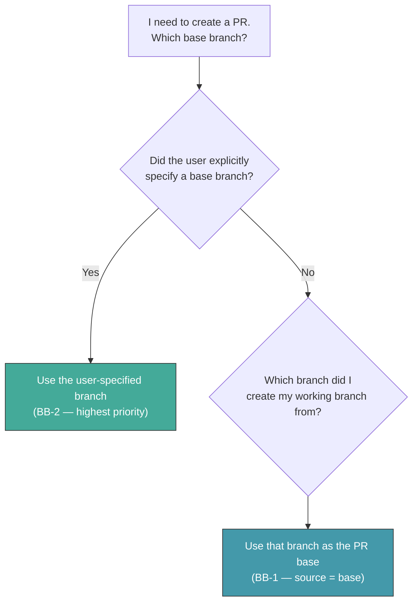

# PR Base Branch Policy

## Purpose

This document defines the rules for choosing the correct base branch when creating a pull request in the Reinhardt project. It is the single source of truth for PR base branch decisions, consolidating rules that were previously scattered across STABILITY_POLICY.md, PR_GUIDELINE.md, QUICK_REFERENCE.md, and CLAUDE.md.

---

## Core Principles

### BB-1 (MUST): PR Base Branch Defaults to the Source Branch

The PR base branch MUST default to the branch from which the working branch was created (the source branch). This is the fundamental rule — no decision matrix or change-type classification is needed.

**Example — bug fix branched from `main`:**

```bash
git checkout main
git checkout -b fix/my-bug-fix
# ... make changes ...
gh pr create --base main --title "fix: resolve connection pool leak"
```

**Example — feature branched from `develop/0.2.0`:**

```bash
git checkout develop/0.2.0
git checkout -b feature/my-new-feature
# ... make changes ...
gh pr create --base develop/0.2.0 --title "feat: add MySQL backend support"
```

**Rationale:** This principle is self-consistent with the existing develop branch strategy. Developers choose the source branch based on what they are changing (see BB-3 for guidance), and the PR base follows automatically. No separate base-branch decision is required.

### BB-2 (MUST): Explicit User Specification Overrides Everything

If the user explicitly specifies a base branch, that specification takes highest priority — overriding the source-branch default (BB-1) and any other guidance. This includes:

- Direct verbal or written instruction in the conversation
- Configuration in CLAUDE.md, AGENTS.md, or project settings
- Instructions in an Issue description or PR description
- Any other explicit user directive

**Example:**

```bash
# User says: "target develop/0.2.0 for this PR"
# Even though the branch was created from main:
gh pr create --base develop/0.2.0 --title "fix: backport security patch"
```

**NEVER** override or ignore an explicit user base-branch instruction based on BB-1 or any other rule.

---

## Source Branch Selection Guidance

### BB-3 (SHOULD): How to Choose the Source Branch

While BB-1 makes the base branch automatic, the developer must still choose which branch to branch FROM. The following table provides guidance for selecting the correct source branch.

**During RC Phase** (a `develop/*` branch exists — see BB-4):

| Change Type | Source Branch | Reference |
|---|---|---|
| Bug fix | `main` | STABILITY_POLICY.md DB-3 |
| Security fix | `main` | Always target `main` |
| New feature (`feat:`) | `develop/0.x+1.0` | STABILITY_POLICY.md DB-2 |
| Breaking change (`feat!:`) | `develop/0.x+1.0` | STABILITY_POLICY.md DB-2 |
| Non-breaking API addition (SP-6 approved) | `main` | STABILITY_POLICY.md SP-6 |
| Interface-changing refactoring | `develop/0.x+1.0` | STABILITY_POLICY.md DB-2 |
| Internal refactoring (no public API change) | `main` | Safe for RC |
| New crate dependency | `develop/0.x+1.0` | STABILITY_POLICY.md DB-2 |
| Dependency version bump (security / PATCH) | `main` | Equivalent to bug fix |
| Dependency version bump (MINOR / MAJOR) | `develop/0.x+1.0` | May introduce new API surface |
| Documentation | `main` | Safe in any phase |
| CI/CD changes | `main` | Apply to all branches |
| Tests (for existing functionality) | `main` | Safe in any phase |
| Tests (for develop-only features) | `develop/0.x+1.0` | Code under test only exists on develop |
| Performance improvements (no API change) | `main` | Safe for RC |
| Performance improvements (API change) | `develop/0.x+1.0` | Equivalent to breaking change |

**During Normal Phase** (no `develop/*` branch exists):

All changes branch from and target `main`. There is no develop branch active.

**Decision heuristic for ambiguous cases:**

- Does the change affect the public API? → During RC, use `develop/0.x+1.0`
- Can existing downstream code break? → During RC, use `develop/0.x+1.0`
- Is it purely additive without changing existing behavior? → `main` is safe
- When in doubt, ask a maintainer. Favor `main` for conservative choices.

---

## Decision Flowchart



The decision is two questions: (1) did the user say something? (2) where did I branch from? No change-type classification is needed for the base branch decision itself.

---

## RC Phase Context

### BB-4 (—): Phase Awareness

The develop branch strategy is active when a `develop/*` remote branch exists. To check the current phase:

```bash
git branch -r | grep 'origin/develop/'
```

| Result | Phase | Meaning |
|---|---|---|
| One or more `origin/develop/*` branches exist | **RC Phase** | `main` is frozen to bug fixes only (SP-2). New features and breaking changes go to `develop/0.x+1.0`. |
| No `origin/develop/*` branches exist | **Normal Phase** | All changes go to `main`. |

The develop branch follows the naming convention `develop/0.x+1.0` where `x` is the major version currently in RC on `main`. For example, if `main` carries `0.1.0-rc.N`, the develop branch is `develop/0.2.0`.

See STABILITY_POLICY.md DB-1 ~ DB-7 for the full develop branch lifecycle, and RELEASE_PROCESS.md DBR-1 ~ DBR-3 for the release workflow gates.

---

## Forward-Merge Obligations

### BB-5 (MUST): Forward-Merge `main` into develop After Bug Fixes

When a bug fix PR is merged into `main` during the RC phase, the fix MUST be forward-merged into the `develop/0.x+1.0` branch. This ensures the develop branch does not diverge with unfixed bugs.

**Procedure (worktree-based merge, per PR_GUIDELINE.md CR-1):**

```bash
git worktree add /tmp/reinhardt-forward-merge develop/0.2.0
cd /tmp/reinhardt-forward-merge
git merge origin/main
# Resolve conflicts if any
git push origin develop/0.2.0
cd -
git worktree remove /tmp/reinhardt-forward-merge
```

**Minimum frequency:** After each RC version bump (e.g., `rc.1` → `rc.2`).
**Recommended frequency:** After each significant bug fix merge.

**IMPORTANT:** Forward-merging to `develop/*` is a push to a protected branch. This operation REQUIRES explicit user authorization. The Autonomous Operation Policy does NOT cover direct pushes to `develop/*`.

**NEVER** skip forward-merging. Unfixed bugs on the develop branch will reappear when develop is merged into `main` at the end of the RC cycle (DB-5).

*Cross-reference: STABILITY_POLICY.md DB-3, DB-4*

---

## Interaction with Autonomous Operation Policy

### BB-6 (MUST): `develop/*` Is a Protected Branch

The `develop/*` branch is classified as a **protected branch** under the Reinhardt-family Autonomous Operation Policy (see CLAUDE.md). The following rules apply:

| Operation | On `feature/...`, `fix/...`, etc. | On `develop/*` |
|---|---|---|
| `git commit` | Autonomous | Requires explicit user authorization |
| `git push` | Autonomous | Requires explicit user authorization |
| Create Draft PR | Autonomous | N/A (PRs target develop, not push to it) |
| Convert Draft → Ready | Autonomous | N/A |

**Workflow for develop-targeting changes:**

1. Create a feature branch FROM `develop/0.x+1.0`:
   ```bash
   git checkout develop/0.2.0
   git checkout -b feature/my-next-version-change
   ```
2. Make changes, commit, and push to the feature branch (autonomous).
3. Create a Draft PR targeting `develop/0.2.0` (autonomous):
   ```bash
   gh pr create --draft --base develop/0.2.0 --title "feat: ..."
   ```
4. Convert to Ready for Review when implementation is complete (autonomous).

**NEVER** push directly to `develop/*` without explicit user authorization. All changes to `develop/*` MUST go through the PR workflow via a feature/fix branch created from `develop/*`.

*Cross-reference: CLAUDE.md "Autonomous Operation Policy" section*

---

## Edge Cases

### Multiple develop branches exist. Which one do I target?

Target the **latest** develop branch (highest version number). In practice, the project maintains only one develop branch at a time (see STABILITY_POLICY.md DB-1).

### I have a bug fix that only affects code on the develop branch.

If the bug exists only in code introduced on `develop/*` and does NOT exist on `main`, the fix MAY branch from `develop/*` and target `develop/*` directly. However, always verify: could this bug also exist on `main`? When in doubt, fix on `main` first (BB-3).

### My change mixes a bug fix with a new feature.

Split into separate PRs:
1. Bug fix: branch from `main` → PR targets `main`
2. New feature: branch from `develop/0.x+1.0` → PR targets `develop/0.x+1.0`

Do NOT mix concerns in a single PR — it creates an unresolvable branch-targeting conflict.

### What about release-plz PRs?

Release PRs created by release-plz target whichever branch release-plz is monitoring. Do NOT manually change the base branch of release-plz PRs. See STABILITY_POLICY.md DB-6 and RELEASE_PROCESS.md for details.

### I branched from the wrong source branch. Can I change the PR base?

Yes. If you branched from `main` but the change should target `develop/0.2.0` (or vice versa), you can:

1. Re-create the branch from the correct source:
   ```bash
   git checkout develop/0.2.0
   git checkout -b feature/my-corrected-branch
   git cherry-pick <commits-from-wrong-branch>
   ```
2. Or, if the user explicitly instructs, override the base when creating the PR (BB-2).

### Do I need to forward-merge after every bug fix?

SHOULD forward-merge after each significant bug fix merge. At minimum, MUST forward-merge before each RC version bump. Accumulating un-forward-merged fixes increases the risk of complex merge conflicts.

---

## Quick Reference

### MUST DO

- Default the PR base branch to the branch you branched FROM (BB-1)
- Follow the user's explicit base branch instruction above all else (BB-2)
- Branch from `main` for bug fixes during RC phase (BB-3)
- Branch from `develop/0.x+1.0` for new features and breaking changes during RC phase (BB-3)
- Forward-merge `main` into develop after bug fix merges during RC (BB-5)
- Use the PR workflow for all changes to `develop/*` — NEVER push directly (BB-6)
- Split mixed bug-fix/feature work into separate PRs with correct source branches
- Obtain explicit user authorization before pushing to `develop/*`

### NEVER DO

- Override the user's explicit base branch instruction with BB-1 or any other rule
- Merge next-version features or breaking changes into `main` during RC phase
- Apply bug fixes only to the develop branch without fixing on `main` first (DB-3)
- Add new crate dependencies to `main` during RC (unless for a security fix)
- Push directly to `develop/*` without explicit user authorization
- Skip forward-merging after bug fixes land on `main` (BB-5)
- Change the base branch of release-plz PRs manually
- Mix bug fixes and features in a single PR during RC phase

---

## Related Documentation

- **Stability Policy**: instructions/STABILITY_POLICY.md — DB-1 ~ DB-7 (develop branch strategy), SP-1 ~ SP-7 (RC phase rules)
- **PR Guidelines**: instructions/PR_GUIDELINE.md — PC-3 (branch naming), CR-1 (worktree merge strategy)
- **Release Process**: instructions/RELEASE_PROCESS.md — DBR-1 ~ DBR-3 (develop branch release workflow gates)
- **Quick Reference**: instructions/QUICK_REFERENCE.md
- **Autonomous Operation Policy**: CLAUDE.md (protected branch classification)

---

**Note**: This document is the single source of truth for PR base branch decisions. If a discrepancy exists between this document and another source regarding base branch selection, this document takes precedence.
