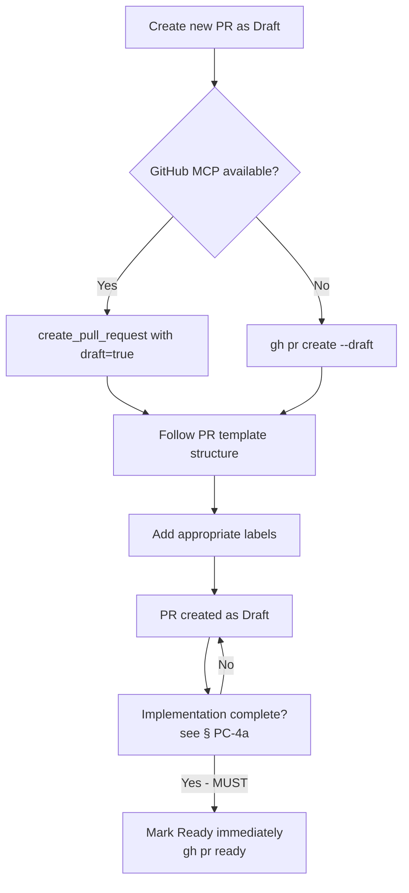
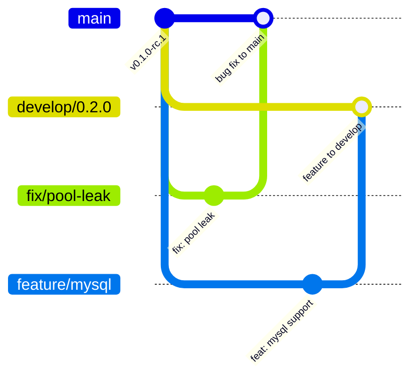
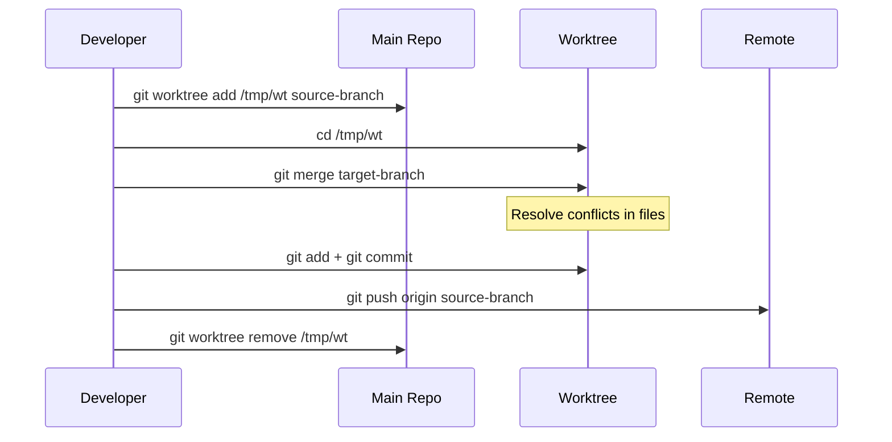
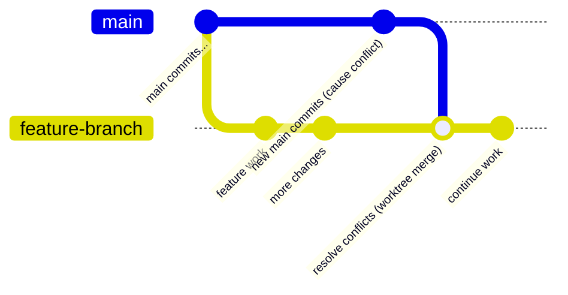
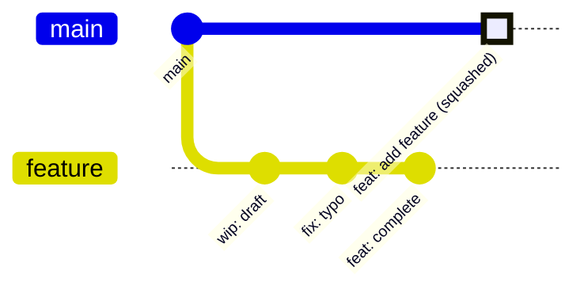
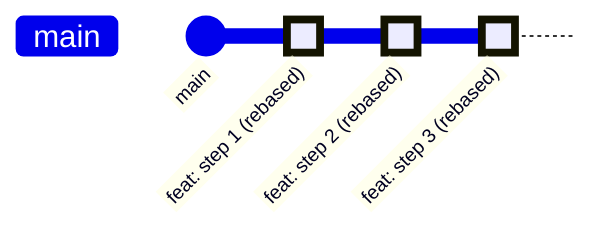
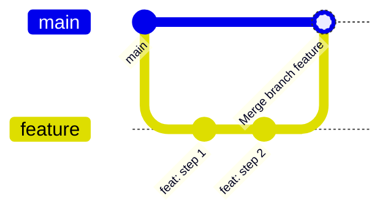

# Pull Request Guidelines

## Purpose

This file defines the pull request (PR) policy for the Reinhardt project. These rules ensure clear communication, proper review process, and consistent PR formatting across the development lifecycle.

---

## Language Requirements

### LR-1 (MUST): English-Only Policy

- **ALL** PR titles MUST be written in English
- **ALL** PR descriptions MUST be written in English
- **ALL** PR comments and discussions MUST be written in English
- This ensures accessibility for international contributors and maintainers

**Rationale:**
- GitHub is an international platform
- English is the lingua franca of software development
- Enables broader collaboration and code review
- Facilitates automated tooling and CI/CD integration

---

## PR Creation Policy

### PC-1 (MUST): Use GitHub MCP or CLI

- **MUST** prefer GitHub MCP tools (`create_pull_request`) for creating pull requests when available
- **Fallback**: Use GitHub CLI (`gh pr create`) when GitHub MCP is not available
- **NEVER** use web browser UI for PR creation when MCP or CLI is available
- MCP and CLI both ensure consistency and can be automated
- **Autonomy (Reinhardt family)**: Creating a **Draft** PR is authorized without further user confirmation in `reinhardt-web` / `reinhardt-cloud` / `awesome-delions` / `reinhardt-cc` (see Autonomous Operation Policy in `CLAUDE.md` / `AGENTS.md`); the Draft PR body MUST still follow `.github/PULL_REQUEST_TEMPLATE.md` and `--draft` MUST be passed. Marking a PR as Ready for Review is **REQUIRED** (MUST) immediately once the implementation is complete; CI completion is **not** a prerequisite. See § PC-4a.

The following diagram summarizes the PR creation flow. Ready-for-Review conversion is governed separately by § PC-4a (MUST immediately upon implementation completion — CI completion is NOT a prerequisite):



**PR Template Location:** `.github/PULL_REQUEST_TEMPLATE.md`

When creating PRs via `gh pr create`, the `--body` content MUST follow the PR template structure defined in `.github/PULL_REQUEST_TEMPLATE.md`.

**CLI Note:** GitHub CLI (`gh pr create`) does not automatically apply the PR template like the Web UI. You must manually include the template structure in the `--body` content. See PC-2 for the complete template structure and example.

**Example:**
```bash
gh pr create --title "feat(auth): add JWT token validation" \
  --body "$(cat <<'EOF'
## Summary

- Implement JWT token validation with RS256 algorithm
- Add token expiration checking
- Include unit tests for edge cases

## Test plan

- [x] `cargo test --package reinhardt-auth` passes
- [x] All existing tests pass
- [x] Manual testing with expired tokens

🤖 Generated with [Claude Code](https://claude.com/claude-code)
EOF
)"
```

### PC-2 (MUST): Follow PR Template Structure

**PR Template Location:** `.github/PULL_REQUEST_TEMPLATE.md`

When creating PRs via `gh pr create`, the `--body` content MUST follow the PR template structure defined in `.github/PULL_REQUEST_TEMPLATE.md`.

**CLI Note:** GitHub CLI does not automatically apply the PR template like the Web UI. Read the template file and include its structure in your `--body` content.

### PC-3 (MUST): Branch Naming

- Branch names SHOULD follow the pattern: `<type>/<scope>-<short-description>`
- Types: `feature`, `fix`, `refactor`, `docs`, `test`, `chore`, etc.
- Scope: Module or component name
- Short description: Kebab-case brief summary

**Examples:**
```
feature/auth-jwt-validation
fix/orm-connection-pool-race-condition
refactor/http-middleware-pipeline
docs/api-openapi-spec
test/database-integration-tests
chore/ci-github-actions-update
```

**Issue-Linked Branch Naming:**

When a branch addresses specific GitHub Issues, include the issue number(s) in the branch name:

| Pattern | Format | Example |
|---------|--------|---------|
| Single issue | `<type>/issue-XXXX-<description>` | `fix/issue-2636-retrieve-view-integer-pk` |
| Consecutive range | `<type>/issue-XXXX-to-YYYY-<description>` | `fix/issue-3017-to-3019-feature-gate-compilation` |
| Multiple ranges | `<type>/issue-XXXX-to-YYYY-and-WWWW-to-ZZZZ-<description>` | `fix/issue-1570-to-1572-and-1591-to-1596-workspace-deps` |

**Rules for issue-linked branches:**
- Use `to` to express consecutive issue number ranges (NOT hyphens between numbers)
- Use `and` to separate multiple consecutive ranges
- Single (non-consecutive) issues do NOT use `to` — just `<type>/issue-XXXX-<description>`
- The `<description>` suffix MUST be kebab-case and describe the fix/feature

**Exception:** Release branches follow the format `release/<crate>/vX.Y.Z` for compatibility with automated workflows.

**RC Phase: Next-Version Feature Branches**

During the RC phase, feature branches for the next version (breaking changes, new features) MUST target the `develop/0.x+1.0` branch instead of `main`:

```
# Feature branch targeting develop branch during RC
feature/mysql-backend       → PR target: develop/0.2.0
feat/new-query-builder      → PR target: develop/0.2.0
refactor/trait-redesign     → PR target: develop/0.2.0

# Bug fix branches still target main during RC
fix/connection-pool-leak    → PR target: main
```

See instructions/STABILITY_POLICY.md § DB-2 for permitted changes on the develop branch.

The following diagram illustrates branch targeting during the RC phase:



### PC-4 (SHOULD): Draft PRs for Work in Progress

Use Draft PRs for incomplete work. Permission to create one follows
COMMIT_GUIDELINE.md CE-1. Keep an explicit task request for Draft state; otherwise
apply PC-4a when the work is ready.

### PC-4a (MUST): Draft to Ready Criteria

Ready for Review means the implementation is complete, relevant documentation
and the PR description are current, and applicable local format/lint checks
pass. Absence of placeholder markers alone does not establish completion.

- Verify the acceptance criteria and remove new unfinished placeholders.
- Complete applicable local verification under AGENT_WORKFLOW.md.
- Follow the PR template, update relevant docs, and complete RP-1a for public APIs.
- When these criteria are met, the Reinhardt-family policy authorizes conversion
  without another confirmation. CI completion is not a prerequisite.
- Preserve an explicit instruction to keep the PR in Draft.
- An explicit instruction to mark Ready overrides these readiness criteria;
  report any unverified checks or known failures accurately.

Use `gh pr ready <number>` or the equivalent GitHub tool, then read back
`isDraft`. Readiness is separate from merge permission and RP-1 merge gates.

### PC-5 (MUST): PR Labels

- **MUST** add appropriate labels to every PR
- Labels help categorize, prioritize, and track PRs
- Use the available GitHub tools or CLI to add labels (GITHUB_INTERACTION.md PP-3)

**Required Labels by PR Type:**

| PR Type | Required Label | Additional Labels |
|---------|---------------|-------------------|
| New feature | `enhancement` | Scope-specific labels |
| Bug fix | `bug` | Severity labels if available |
| Documentation | `documentation` | - |
| Dependency updates | `dependencies` | - |
| Release preparation | `release` | **CRITICAL** - See special notes below |

**Additional Labels (apply alongside the type label above):**

| Condition | Additional Label | Note |
|-----------|-----------------|------|
| Breaking change | `breaking-change` | **MUST** apply *in addition to* the normal type label (e.g., `enhancement` + `breaking-change`) |

**Common Labels:**

| Label | Usage | When to Apply |
|-------|-------|---------------|
| `enhancement` | New feature or improvement | All feature PRs |
| `bug` | Bug fix | All bug fix PRs |
| `documentation` | Documentation changes | Docs-only or significant doc updates |
| `dependencies` | Dependency updates | Automated or manual dependency version bumps |
| `release` | **Release preparation (SPECIAL)** | **Version bump PRs for crates.io publication** |
| `good first issue` | Beginner-friendly | Simple, well-defined changes |
| `help wanted` | Needs additional input | Complex decisions or blocked PRs |
| `question` | Further information requested | When clarification or discussion is needed |
| `duplicate` | Duplicate PR | When PR duplicates existing work |
| `invalid` | Invalid PR | When PR doesn't meet standards |
| `wontfix` | Will not be merged | When PR is rejected |

**CRITICAL: `release` Label Special Behavior:**

The `release` label has special significance and triggers automated workflows:

1. **GitHub Actions Integration:**
   - PRs with `release` label are automatically processed by release automation
   - Triggers CI/CD pipeline for crates.io publication preparation
   - May trigger additional validation and checks

2. **When to Use:**
   - **ONLY** for PRs that bump crate versions in `Cargo.toml`
   - **ONLY** for PRs that prepare for crates.io publication
   - **NEVER** for regular feature or bug fix PRs

3. **Requirements for `release` Label:**
   - PR title MUST follow format: `chore(release): bump [crate-name] to v[version]`
   - PR MUST include both `Cargo.toml` version update AND `CHANGELOG.md` updates
   - PR MUST be from a branch following pattern: `release/[crate-name]/v[version]`
   - All tests and checks MUST pass before merging

4. **Example Release PR with Label:**
   ```bash
   # Create release branch
   git checkout -b release/reinhardt-core/v0.2.0
   
   # Make version changes
   # ... update Cargo.toml and CHANGELOG.md ...
   
   # Create PR with release label
   gh pr create \
     --title "chore(release): bump reinhardt-core to v0.2.0" \
     --label release \
     --body "$(cat <<'EOF'
   ## Summary
   
   Prepare reinhardt-core for publication to crates.io.
   
   Version Changes:
   - crates/reinhardt-core/Cargo.toml: version 0.1.0 -> 0.2.0
   - crates/reinhardt-core/CHANGELOG.md: Add release notes for v0.2.0
   
   ## Test plan
   
   - [x] All tests pass
   - [x] `cargo publish --dry-run -p reinhardt-core` succeeds
   - [ ] Ready for publication after merge
   
   🤖 Generated with [Claude Code](https://claude.com/claude-code)
   EOF
   )"
   ```

5. **Post-Merge Automation:**
   - After merging PR with `release` label, automated workflows may:
     - Create Git tag automatically
     - Trigger crates.io publication
     - Generate GitHub Release
     - Update documentation
   - **IMPORTANT**: Check repository's `.github/workflows/` for specific automation

6. **DO NOT Use `release` Label For:**
   - ❌ Regular feature additions
   - ❌ Bug fixes
   - ❌ Documentation updates
   - ❌ Refactoring PRs
   - ❌ Any PR that doesn't bump crate version

**Label Application Examples:**

```bash
# Feature PR with label
gh pr create --title "feat(auth): add JWT validation" \
  --label enhancement

# Bug fix PR with label
gh pr create --title "fix(orm): resolve connection leak" \
  --label bug

# Documentation PR with label
gh pr create --title "docs(api): update OpenAPI spec" \
  --label documentation

# Dependency update PR with label
gh pr create --title "chore(deps): bump tokio from 1.0 to 1.1" \
  --label dependencies

# Release PR with label (CRITICAL - special handling)
gh pr create --title "chore(release): bump reinhardt-core to v0.2.0" \
  --label release

# Multiple labels
gh pr create --title "feat(auth): add OAuth support" \
  --label enhancement,help wanted
```

**Adding Labels to Existing PR:**

```bash
# Add single label
gh pr edit <number> --add-label enhancement

# Add multiple labels
gh pr edit <number> --add-label bug,help wanted

# Remove label
gh pr edit <number> --remove-label invalid

# CRITICAL: Add release label (use with caution)
gh pr edit <number> --add-label release
```

**Label Best Practices:**

- Add labels immediately when creating PR
- Update labels as PR status changes
- Use `release` label **ONLY** for version bump PRs (triggers release automation)
- Combine labels to provide more context (e.g., `enhancement` + `help wanted`)
- Don't over-label - typically 1-3 labels per PR is sufficient
- Double-check before adding `release` label - it has special behavior
- If unsure about `release` label, consult with maintainers first

---

## PR Title Format

### TF-1 (MUST): Follow Conventional Commits

PR titles MUST follow the same format as commit messages:

```
<type>[optional scope][optional !]: <description>

Examples:
feat(auth): add JWT token validation with RS256 algorithm
fix(orm): resolve race condition in connection pool
feat(api)!: change response format to JSON:API specification
```

**Requirements:**
- **Type**: One of the defined types (feat, fix, refactor, docs, etc.)
- **Scope**: Module or component name (OPTIONAL but RECOMMENDED)
- **Breaking Change Indicator**: Append `!` for breaking changes
- **Description**: Concise summary in English
  - **MUST** start with lowercase letter
  - **MUST** be specific and descriptive
  - **MUST NOT** end with a period
  - Keep under 72 characters for readability

**See**: @instructions/COMMIT_GUIDELINE.md for detailed commit type definitions

---

## PR Description Format

### DF-1 (MUST): Standard Structure

PR descriptions MUST follow the structure defined in `.github/PULL_REQUEST_TEMPLATE.md`.

**Required Sections:** Summary, Type of Change, Motivation and Context, How Was This Tested, Checklist, Labels to Apply

**Optional Sections:** Performance Impact, Breaking Changes, Screenshots, Related Issues, Additional Context

**Footer:** Include the actual agent's attribution under GITHUB_INTERACTION.md FF-1

**See:** `.github/PULL_REQUEST_TEMPLATE.md` for the complete template structure.

### DF-2 (MUST): Linking PRs to Issues

PRs should be linked to related issues using GitHub's supported keywords. When a linked PR is merged into the default branch, the linked issues are automatically closed.

**Supported Keywords:**
- `close`, `closes`, `closed`
- `fix`, `fixes`, `fixed`
- `resolve`, `resolves`, `resolved`

**Syntax for Linking:**

| Linked Issue | Syntax | Example |
|--------------|--------|---------|
| Issue in same repository | `KEYWORD #ISSUE-NUMBER` | `Closes #10` |
| Issue in different repository | `KEYWORD OWNER/REPOSITORY#ISSUE-NUMBER` | `Fixes octo-org/octo-repo#100` |
| Multiple issues | Use full syntax for each | `Resolves #10, resolves #123` |

**Examples:**
```markdown
## Related Issues

Fixes #42
Closes #43, closes #44
Refs #50 (related but not closed)
```

**Important Notes:**
- Keywords only work when PR targets the **default branch** (main)
- Up to 10 issues can be manually linked via the sidebar
- Use `Refs #N` for related issues that should NOT be auto-closed

**Reference:** [GitHub Docs - Linking a PR to an Issue](https://docs.github.com/en/issues/tracking-your-work-with-issues/using-issues/linking-a-pull-request-to-an-issue)

### DF-3 (SHOULD): Additional Context

Include additional sections when relevant:

- **Migration Guide**: For breaking changes with complex migration
- **Performance Impact**: For performance-related changes
- **Security Considerations**: For security-related changes
- **Documentation**: Links to updated documentation
- **Screenshots**: For UI changes (use relative paths or URLs)

---

## PR Review Process

### RP-1 (MUST): Pre-Merge Checklist

Before **merging**, confirm explicit merge authorization under CE-1 and ensure:

- [ ] All CI checks pass
- [ ] Applicable local verification passes under AGENT_WORKFLOW.md; record its scope
- [ ] Code follows project style guidelines
- [ ] Documentation is updated
- [ ] Commit history is clean and logical
- [ ] PR description is complete and accurate

**Local checks:** Use [Verification Scope](AGENT_WORKFLOW.md#verification-scope).
Run the workspace matrix for broad Rust changes. Prose-only documentation and
prompt edits use document/format checks; Rustdoc and executable examples use
the affected documentation build and doctests. Required remote CI gates remain
in force, and local results must not be described as remote CI results.

**Breaking-change warning check:**
`Warn Invalid Breaking Change Target` is required alongside `CI Success` on
`main`. A breaking title or `breaking-change` label fails this check unless the
source is a versioned `develop/X.Y.Z` branch. It reads current PR metadata on
title, label, base, and source changes, including label removal. The failed
result is independent of warning-comment delivery or deduplication; an existing
warning never makes an invalid target pass. Retarget the breaking change to the
appropriate develop branch, or correct an inaccurate classification.

The trusted `pull_request_target` workflow publishes this named check explicitly
on the current `pr.head.sha` through the Checks API with `checks: write`. Both
success and failure are published before comment delivery. The automatic job
check belongs to the base commit and has a distinct name,
`Publish Breaking Change Target Check`; it is not the required PR check.

The workflow also posts to the PR conversation through the issue-comment API
and requires `pull-requests: write` alongside `issues: write`.
A `403 Resource not accessible by integration` during comment creation is a
workflow permission failure. This `pull_request_target` workflow runs from the
base branch, so permission repairs must reach that branch before a new PR event
can validate them; changing only the affected PR head does not update the workflow.

CI runs the policy suite through `scripts/tests/test-breaking-change-target.sh`,
which is discovered by `bash scripts/tests/run-all.sh` in the Version Markers
Lint job. Run `node --test scripts/tests/test-breaking-change-target.cjs` and
`actionlint .github/workflows/warn-invalid-breaking-change.yml` after changing
the policy. Keep its check name synchronized with the required status check in
the main-branch ruleset.

### RP-1a (MUST): Local SemVer Evidence for Public API Changes

For a PR touching public API, run `cargo make semver-check` locally once, capture
the output and exit status, and assess the result against the intended base and
STABILITY_POLICY.md. Preserve the result for the checked revision; rerun only
when changes invalidate it. A failed or unavailable check is not a pass.

Before Ready conversion, include the result in the PR comment marked
`<!-- local-semver-check -->`. Reuse and update an existing marked comment
instead of adding duplicates. Posting requires GITHUB_INTERACTION.md PP-1
authorization; running the check does not grant it. If posting is not authorized,
prepare the comment and request that specific permission after completing
independent work. An explicit Ready instruction is handled under PC-4a.

### RP-2 (SHOULD): Self-Review

- Review your own PR before requesting review from others
- Check for:
  - Unnecessary debug code or comments
  - Proper error handling
  - Test coverage
  - Documentation completeness
  - Code clarity and readability

### RP-3 (MUST): Address Review Comments

- Within GITHUB_INTERACTION.md PP-1 authorization, address all in-scope review comments
- Verify pushed fixes and post a reply before resolving an addressed thread
- Fetch a fresh complete inventory after each push and before reporting completion
- Request re-review only when authorized and useful
- Be respectful and constructive in discussions

### RP-4 (SHOULD): Keep PRs Small

- Aim for PRs under 400 lines of changes
- Split large features into multiple PRs
- Each PR should have a single, clear purpose
- Smaller PRs are easier to review and less risky to merge

**For batch issue handling**: See instructions/ISSUE_HANDLING.md for work unit principles (WU-1 ~ WU-3) on how to scope PRs when addressing multiple issues.

### RP-5 (MUST): Use Three-Dot Diff for PR Verification

Use three-dot diff for verifying PR changes.

- **MUST** use three-dot diff (`...`) to verify PR changes from the merge base
- Three-dot diff excludes merge history noise and shows only changes introduced by the PR
- This applies to both manual review and automated diff verification

**Commands:**
```bash
# Three-dot diff: shows changes from merge base (CORRECT)
git diff main...feature-branch

# Two-dot diff: includes merge history noise (AVOID)
git diff main..feature-branch
```

**GitHub CLI:**
```bash
# View PR diff (GitHub uses three-dot diff by default)
gh pr diff <number>
```

**Rationale:**
- Two-dot diff includes all commits reachable from one branch but not the other, polluting the diff with merge history
- Three-dot diff compares the tip of the feature branch against the merge base (common ancestor), showing only the PR's actual changes

---

## PR Conflict Resolution

### CR-1 (MUST): Worktree-Based Merge Strategy

PR conflicts MUST be resolved using a worktree-based merge strategy. Rebase and force-push are NOT allowed for conflict resolution.

**Procedure:**

1. Create a worktree for the source branch:
   ```bash
   git worktree add /tmp/<worktree-name> <source-branch>
   ```
2. In the worktree, merge the target branch:
   ```bash
   cd /tmp/<worktree-name>
   git merge <target-branch>
   ```
3. Resolve conflicts and commit:
   ```bash
   # Resolve conflicts in files
   git add <resolved-files>
   git commit
   ```
4. Push and clean up:
   ```bash
   git push origin <source-branch>
   cd -
   git worktree remove /tmp/<worktree-name>
   ```

**Rationale:**
- Preserves complete commit history
- Avoids force-push risks (overwriting upstream changes)
- Merge commits clearly document conflict resolution
- Worktree isolation prevents interference with current work

The following sequence diagram shows the worktree-based conflict resolution workflow:



The following git graph shows how the merge commit appears in the branch history:



### CR-2 (NEVER): Prohibited Approaches

- **NEVER** use `git rebase` to resolve PR conflicts
- **NEVER** use `git push --force` or `git push --force-with-lease` for conflict resolution
- **NEVER** use `git reset --hard` as part of conflict resolution workflow

**Exception:** Rebase may be used ONLY when explicitly requested by the user, with clear understanding of the implications.

---

## PR Merge Policy

### MP-1 (MUST): Merge Requirements

A PR can only be merged when:

- All CI checks pass
- All conversations are resolved
- At least one approval from a maintainer (if required by repo settings)
- No merge conflicts with base branch
- All commits follow commit guidelines (@instructions/COMMIT_GUIDELINE.md)

### MP-2 (MUST): Merge Strategy

**Squash and Merge** (Default):
- Combine all PR commits into a single commit
- Use PR title as commit message
- Include PR description in commit body
- Use for feature branches with multiple interim commits

**Rebase and Merge**:
- Preserve individual commits
- Use when commits are already well-structured
- Each commit MUST follow commit guidelines
- Prefer for PRs with clean, logical commit history

**Merge Commit** (Avoid):
- Creates additional merge commit
- Only use for merging long-lived branches
- Generally avoid for feature branches

The following diagrams compare the three merge strategies:

**Squash and Merge (Default):**



**Rebase and Merge:**



**Merge Commit (Avoid for features):**



### MP-3 (SHOULD): Delete Branch After Merge

- Delete feature branches after successful merge
- Keeps repository clean
- Use GitHub's automatic branch deletion feature

---

## Special Cases

### Release PRs

For release preparation PRs (version bumps):

**Title Format:**
```
chore(release): bump [crate-name] to v[version]

Example:
chore(release): bump reinhardt-core to v0.2.0
```

**Description Format:**
```markdown
## Summary

Prepare for crate publication to crates.io.

Version Changes:
- crates/[crate-name]/Cargo.toml: version [old-version] -> [new-version]
- crates/[crate-name]/CHANGELOG.md: Add release notes for v[new-version]

## Breaking Changes (if MAJOR version bump)

- List breaking changes here
- API changes that affect backward compatibility

## New Features (if MINOR version bump)

- List new features here
- Enhancements and additions

## Bug Fixes (if PATCH version bump)

- List bug fixes here
- Resolved issues and corrections

## Test plan

- [x] `cargo check -p [crate-name] --all-features`
- [x] `cargo test -p [crate-name] --all-features`
- [x] `cargo publish --dry-run -p [crate-name]`
- [ ] Ready for publish after PR merge

🤖 Generated with [Claude Code](https://claude.com/claude-code)
```

**See**: @instructions/RELEASE_PROCESS.md for detailed release procedures

### Develop Branch PRs

For PRs from `develop/*` branches targeting `main` (version transitions):

**Requirements:**

- **MUST** have `migration-approved` label applied by maintainer
- Branch name MUST follow `develop/X.Y.Z` format
- Version transition MUST be valid: `develop_minor == main_minor + 1` and `patch == 0`
- CI workflow `Develop Merge Guard` validates these requirements automatically

**Guard Behavior:**

| Source Branch | `migration-approved` Label | Version Valid | Result |
|--------------|---------------------------|---------------|--------|
| Non-develop | N/A | N/A | Pass (guard skipped) |
| `develop/*` | Missing | Any | Fail |
| `develop/*` | Present | Invalid | Fail |
| `develop/*` | Present | Valid | Pass |

**Title Format:**
```
feat!: merge develop/X.Y.Z into main

Example:
feat!: merge develop/0.2.0 into main
```

**Example:**
```bash
# Apply migration-approved label (maintainer only)
gh pr edit <number> --add-label migration-approved

# Create develop branch PR
gh pr create --title "feat!: merge develop/0.2.0 into main" \
  --base main \
  --head develop/0.2.0 \
  --label migration-approved,breaking-change
```

**See**: `.github/workflows/develop-merge-guard.yml` for CI guard implementation

### Documentation-Only PRs

For documentation changes:

**Title Format:**
```
docs(<scope>): <description>

Example:
docs(api): update OpenAPI specification for v0.2.0
docs(readme): add installation instructions
```

**Description:**
- List all documentation files changed
- Note what information was added/updated/removed
- Include links to rendered documentation if available

---

## Quick Reference

### ✅ MUST DO
- Write all PR content in English
- Use GitHub MCP (`create_pull_request`) or `gh pr create` for creating PRs
- Follow PR template structure from `.github/PULL_REQUEST_TEMPLATE.md`
- Follow Conventional Commits format for titles
- Include Summary, Type of Change, Breaking Change Assessment, Motivation and Context, How Was This Tested, Checklist sections
- Include Labels to Apply section with appropriate type and scope labels
- Complete applicable local verification and required remote checks before merging (RP-1)
- Address all review comments
- Ensure all CI checks pass before merge
- Use three-dot diff (`main...branch`) for PR verification to exclude merge history noise
- Apply PC-4a for Ready conversion; preserve explicit Draft state and do not wait for CI
- Apply the `breaking-change` label to ALL breaking change PRs
- Complete the "Breaking Change Assessment" section (Yes/No) on every PR
- Fill the "Breaking Changes" section with migration guide when the assessment is "Yes"

### ❌ NEVER DO
- Write PR titles or descriptions in non-English languages
- Create PRs without following PR template structure from `.github/PULL_REQUEST_TEMPLATE.md`
- Create PRs without proper description
- Skip required sections (Summary, Type of Change, Breaking Change Assessment, Motivation and Context, How Was This Tested, Checklist)
- Submit a breaking change PR without the `breaking-change` label
- Skip Labels to Apply section
- Merge with failing CI checks
- Leave unresolved review comments
- Force push after review has started (unless explicitly requested)
- Use rebase or force-push to resolve PR conflicts (use worktree merge instead)
- Use two-dot diff (`main..branch`) for PR verification (includes merge history noise)
- Mark Ready with unmet PC-4a criteria unless the user explicitly overrides them
- Override an explicit request to keep a PR in Draft

---

## Related Documentation

- **Main Quick Reference**: @CLAUDE.md (see Quick Reference section)
- **Issue Handling Principles**: instructions/ISSUE_HANDLING.md
- **Commit Guidelines**: @instructions/COMMIT_GUIDELINE.md
- **Release Process**: @instructions/RELEASE_PROCESS.md
- **GitHub MCP Tools**: Available when GitHub MCP server is configured
- **GitHub CLI Documentation (fallback)**: https://cli.github.com/manual/
