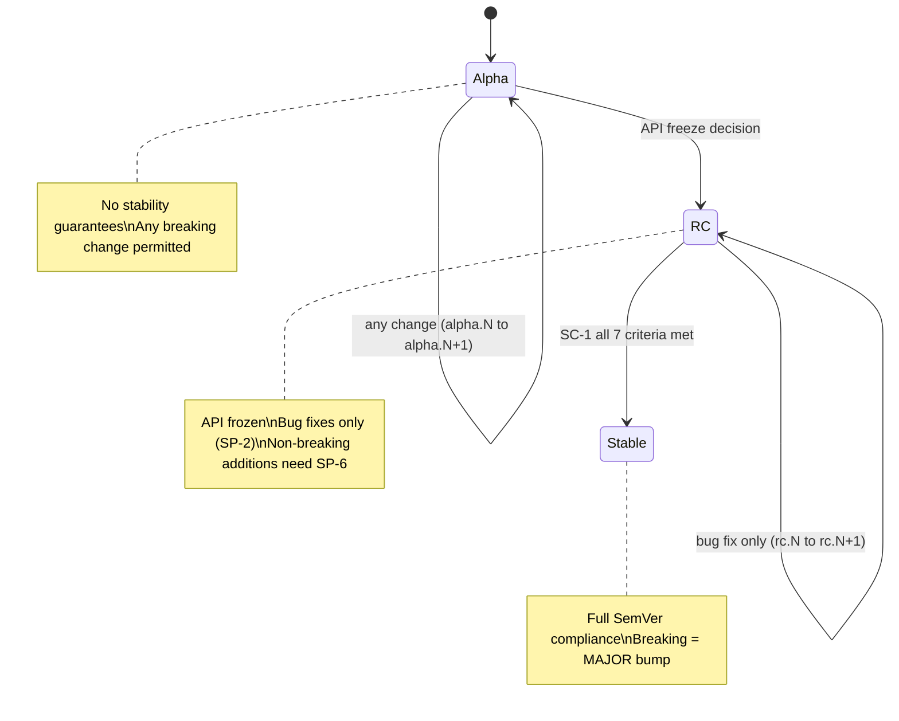
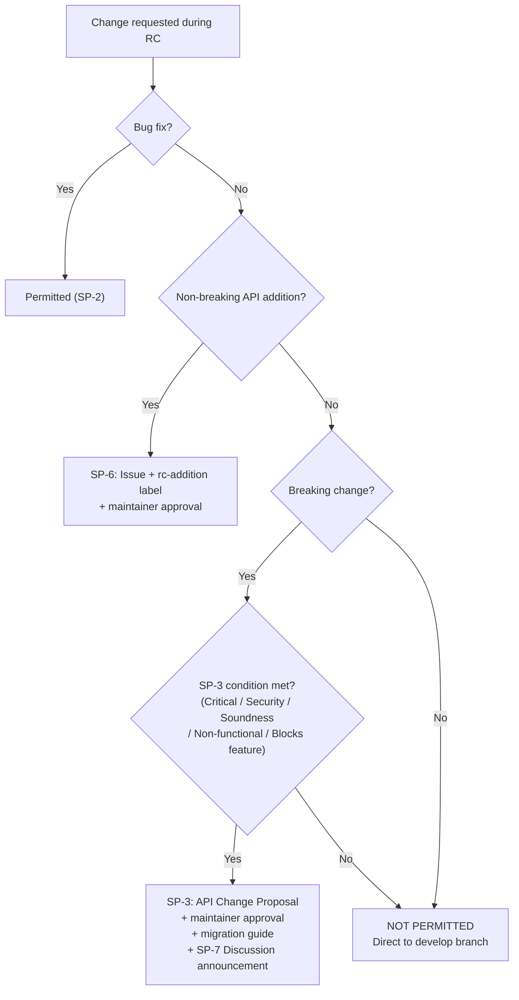
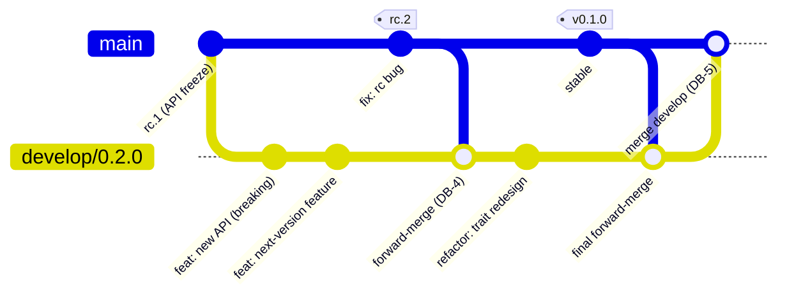
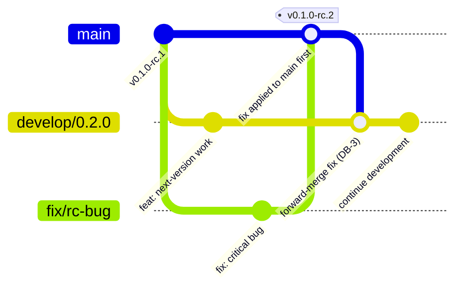
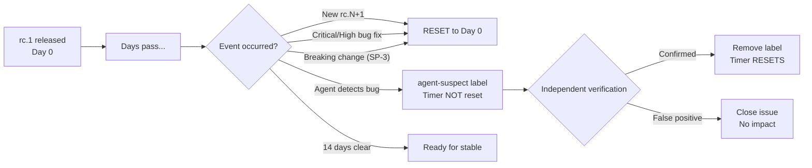

# Stability Policy

## Purpose

This document defines the stability guarantees and versioning policies for the Reinhardt project across its lifecycle phases: alpha, release candidate (RC), and stable. These rules ensure predictable API stability for downstream users and guide contributors on what changes are permitted during each phase.

---

## Table of Contents

- [Version Lifecycle](#version-lifecycle)
- [Alpha Phase](#alpha-phase)
- [RC Phase](#rc-phase)
- [Develop Branch Strategy](#develop-branch-strategy)
- [Stable Phase](#stable-phase)
- [RC to Stable Criteria](#rc-to-stable-criteria)
- [Version Bump Rules During RC](#version-bump-rules-during-rc)
- [Quick Reference](#quick-reference)

---

## Version Lifecycle

Reinhardt follows a three-phase lifecycle for each release:

```
alpha (0.1.0-alpha.N) → RC (0.1.0-rc.N) → stable (0.1.0)
```

| Phase | Version Format | API Stability | Permitted Changes |
|-------|---------------|---------------|-------------------|
| Alpha | `0.1.0-alpha.N` | No guarantees | Any change (features, breaking changes, experiments) |
| RC | `0.1.0-rc.N` | Frozen | Bug fixes only; breaking changes require explicit approval |
| Stable | `0.1.0` | Guaranteed | Follows SemVer strictly |

### VL-1 (MUST): Monotonic Progression

Versions MUST progress monotonically through the lifecycle:
- Alpha versions increment: `alpha.1` → `alpha.2` → ... → `alpha.N`
- RC versions increment: `rc.1` → `rc.2` → ... → `rc.N`
- Stable is the final target: `rc.N` → `0.1.0`
- **NEVER** regress from RC back to alpha

### VL-2 (MUST): Per-Crate Versioning

Each crate in the workspace follows its own lifecycle independently. One crate may be in RC while another is still in alpha.

The following diagram shows the version lifecycle state transitions:



---

## Alpha Phase

### AP-1: No Stability Guarantees

During the alpha phase (`0.1.0-alpha.N`):

- Public APIs may change without notice
- Breaking changes do not require special approval
- New features, experiments, and refactoring are all permitted
- APIs may be added, modified, or removed freely

### AP-2: Deprecation Before Removal

APIs deprecated during alpha **MAY** be removed when transitioning to RC. Deprecation warnings should be present for at least one alpha release before removal.

---

## RC Phase

The RC phase is a stabilization period. The primary goal is to validate the API surface and fix bugs before the stable release.

### SP-0 (MUST): 0.x Series Exception Clause

While Reinhardt is on a `0.x.y` version, the RC rules defined below (SP-1
through SP-7) and the stable-release timer described in [RC to Stable
Criteria](#rc-to-stable-criteria) are applied as the **default**, but may be
waived when a blocking design issue is discovered. Specifically, during the
pre-1.0 period:

- A breaking RC API change may ship **without** the full SP-3 / SP-6 /
  API Change Proposal workflow if the maintainer determines that deferring
  the fix would block the `0.1.0` stable release or compromise framework
  correctness. A migration guide is still required.
- The 2-week stability window before `0.1.0` (see SC-2) may be shortened or
  reset outside the normal reset triggers when a new RC is cut to fix a
  blocking issue.

Both waivers **end at `1.0.0`**. From `1.0.0` onward, SP-1 through SP-7 and the
stability timer are enforced without exception, and full SemVer 2.0 applies.

Any SP-0 waiver MUST be:

1. Recorded in the affected crate's `CHANGELOG.md` under the appropriate
   section (`Changed` for breaking, `Fixed` for timer resets) with a link to
   the triggering Issue / PR.
2. Announced in the PR description with the `stability-waiver` label (or an
   equivalent marker if the label is not yet defined).
3. Consistent with [Design Philosophy](DESIGN_PHILOSOPHY.md) — the waiver
   exists to ship *correct* design, not to skip review of convenient changes.

SP-0 does **not** override SP-2 (bug-fix-only default posture) or SP-4
(deprecation policy); it only relaxes the blocking conditions on SP-1 / SP-3 /
SP-6 and the stable-release timer. Routine RC work still follows SP-1 through
SP-7.

### SP-1 (MUST): API Freeze

During the RC phase (`0.1.0-rc.N`):

- **NO** new public API additions — **except** backward-compatible (non-breaking) additions approved through the RC Non-Breaking Addition Review process (see SP-6)
- **NO** new feature flags
- **NO** new public re-exports (unless part of an SP-6-approved addition)
- Private/internal APIs may still be modified if they do not affect the public surface

**Exception: Backward-Compatible Renames via Deprecation Alias**

Renaming public API items is permitted during RC **only if** backward compatibility is preserved through a deprecation alias:

```rust
// Original (RC.1): poorly named type
pub struct ConnectionParams { ... }

// Renamed (RC.2): improved name + backward-compatible alias
pub struct ConnectionConfig { ... }

#[deprecated(since = "0.1.0-rc.2", note = "Renamed to `ConnectionConfig`. Will be removed in 0.2.0.")]
pub type ConnectionParams = ConnectionConfig;
```

Requirements for deprecation-alias renames:
- The old name MUST remain as a type alias or re-export with `#[deprecated]`
- The alias MUST survive until the next major version (per SP-4)
- Existing code using the old name MUST continue to compile without modification
- The rename MUST be documented in the CHANGELOG

**Rationale:** The RC phase validates the existing API surface. Unrestricted API additions during RC could introduce untested surface area. However, non-breaking additions that have been reviewed and approved through SP-6 maintain quality while providing necessary flexibility. Deprecation aliases ensure no existing code breaks when renaming.

The following diagram provides a decision tree for determining whether a change is permitted during the RC phase:



### SP-2 (MUST): Bug-Fix-Only Policy

Only the following changes are permitted during RC:

| Permitted | Examples |
|-----------|----------|
| Bug fixes | Fix incorrect behavior, panics, data corruption |
| Documentation fixes | Typo corrections, clarification of existing docs |
| Test additions | Additional test coverage for existing functionality |
| Performance fixes | Optimization of existing behavior (no API changes) |
| Dependency updates | Security patches, bug fix versions only |
| Deprecation-alias renames | Rename public items with backward-compatible aliases (see SP-1 exception) |
| Approved non-breaking additions | New APIs approved through SP-6 review process |

| NOT Permitted | Examples |
|---------------|----------|
| New features without SP-6 approval | New API endpoints, new configuration options |
| Unapproved API additions | New public methods, new public types without SP-6 approval |
| Refactoring | Code restructuring that changes public interfaces |
| New dependencies | Adding new crate dependencies |

**Non-breaking additions during RC:**
Non-breaking API additions (new functions, types, traits) are permitted during RC only when approved through the SP-6 review process. This ensures that additions are intentional and reviewed, while avoiding unnecessary restrictions that conflict with SemVer conventions and industry practice.

### SP-3 (MUST): Breaking Changes Require Approval

Breaking changes during RC are **strongly discouraged** and only permitted for:

1. **Critical bugs** that cannot be fixed without an API change (e.g., data corruption, panics)
2. **Security vulnerabilities** that require API modification (e.g., unsafe API surface)
3. **Soundness issues** that make the existing API unsafe (e.g., memory safety violations)
4. **Non-functional API** — the existing API does not behave as documented or expected, making it effectively unusable regardless of how it is called
5. **API blocks new feature** — the current API design makes it impossible or unreasonably complex to add a required feature without restructuring the API

A breaking change during RC triggers:
- A new RC version (`rc.N+1`)
- A stability timer reset (per SC-2)
- A mandatory migration guide
- An automatic announcement posted to the GitHub Discussion breaking change category (per SP-7)

**Approval Process:**

1. Create a GitHub issue using the API Change Proposal template (`.github/ISSUE_TEMPLATE/8-api_change.yml`)
2. Label with `breaking-change` and `rc-migration`
3. Document the technical justification for why a non-breaking fix is impossible
4. Obtain explicit maintainer approval before implementing
5. Update all affected documentation and migration guides
6. Include a migration guide in the PR description

### SP-7 (MUST): Breaking Change Announcement

When a pull request labeled `breaking-change` is merged into `main`, an announcement is automatically posted to the GitHub Discussion breaking change category.

- **Trigger**: PR merge with the `breaking-change` label
- **Destination**: GitHub Discussion — breaking change category
- **Content**: PR title, migration summary, and link to the merged PR
- **Who posts**: Automated (GitHub Actions workflow); no manual announcement required

This ensures all breaking changes — including those permitted during RC under SP-3 — are visible to downstream users without relying on manual communication. The `breaking-change` label MUST be applied to every PR that introduces a breaking change, regardless of lifecycle phase.

### SP-4 (MUST): Deprecation Policy

- APIs deprecated during alpha **MAY** be removed when entering RC
- APIs deprecated during RC **MUST** survive until the next major version (`0.2.0`)
- New deprecations during RC are permitted only to mark APIs that will be removed in the next major version
- All deprecations MUST use `#[deprecated(since = "version", note = "reason")]`

**Example:**
```rust
// Deprecated in alpha, removed in RC - ALLOWED
// (was: pub fn old_method())

// Deprecated in RC, must survive until 0.2.0
#[deprecated(since = "0.1.0-rc.1", note = "Use `new_method` instead. Will be removed in 0.2.0.")]
pub fn legacy_method() {
	// ...
}
```

### SP-5 (SHOULD): Commit Message Convention for RC

During the RC phase, commit messages should clearly indicate the nature of the fix:

```
fix(scope): description of bug fix

fix(orm): resolve panic when empty query result is returned
fix(auth): correct token expiration calculation off-by-one error
```

Feature commits (`feat:`) are **NOT** permitted during RC unless approved through SP-6 (enforced by review).

### SP-6 (MUST): RC Non-Breaking Addition Review

Non-breaking API additions during the RC phase require a lightweight approval process:

1. Create a GitHub Issue documenting the technical justification for the addition
2. Apply `enhancement` and `rc-addition` labels
3. Obtain maintainer approval before implementation
4. Migration guide is **not required** (the addition is non-breaking)

**Permitted additions:**
- New public functions, methods, structs, traits, or modules that do not affect existing API surface
- Additions where all existing code compiles and behaves identically without modification

**Not permitted (even with approval):**
- New feature flags (remains prohibited under SP-1)
- Additions that require changes to existing API signatures
- Additions that alter the behavior of existing APIs

**Rationale:** SemVer and industry practice (e.g., Bevy) permit non-breaking additions in pre-release versions. A lightweight approval process ensures quality without unnecessarily blocking improvements. The `cargo-semver-checks --release-type minor` CI check already validates that additions are non-breaking.

---

## Develop Branch Strategy

During the RC phase, `main` is restricted to bug fixes only (SP-2). To continue development of features and breaking changes for the next version, a dedicated develop branch is used.

### DB-1 (MUST): Branch Creation

When the version group enters the RC phase (first `rc.1` tag is created), a `develop/0.x+1.0` branch MUST be created from `main`:

```bash
# Example: when 0.1.0-rc.1 is released, create develop branch for 0.2.0
git checkout main
git checkout -b develop/0.2.0
git push origin develop/0.2.0
```

Since all crates follow a unified version group, only one develop branch exists per RC cycle.

The following diagram illustrates the develop branch lifecycle from creation through merge:



### DB-2 (MUST): Permitted Changes

The `develop/0.x+1.0` branch accepts changes that are NOT permitted on `main` during RC:

| Permitted on develop | Examples |
|---------------------|----------|
| Breaking changes | API modifications, trait signature changes |
| New features (`feat:`) | New API endpoints, new configuration options |
| New API additions | New public methods, types, traits, modules |
| New dependencies | Adding new crate dependencies |
| Interface-changing refactoring | Code restructuring that changes public interfaces |

All changes MUST follow the same coding standards, testing requirements, and commit conventions as `main`.

### DB-3 (MUST): Bug Fix Flow

Bug fixes during the RC phase MUST be applied to `main` first, then propagated to the develop branch via forward-merge (DB-4). This ensures:

- RC releases always contain the latest fixes
- The develop branch inherits all stability improvements
- No bug fix is lost when the develop branch is eventually merged back

**NEVER** apply a bug fix only to the develop branch. If the bug exists in the RC version, it must be fixed on `main` first.

The following diagram shows the RC bug fix flow where fixes are applied to main first, then forward-merged to the develop branch:



### DB-4 (SHOULD): Forward-Merge from Main

Bug fixes merged to `main` SHOULD be regularly forward-merged into the develop branch:

- **Minimum frequency**: After each RC version bump (e.g., `rc.1` → `rc.2`)
- **Recommended frequency**: Weekly, or after each significant bug fix merge
- **Merge strategy**: Use the worktree-based merge strategy (per PR_GUIDELINE.md CR-1)

```bash
# Forward-merge main into develop branch using worktree
git worktree add /tmp/reinhardt-develop develop/0.2.0
cd /tmp/reinhardt-develop
git merge main
# Resolve conflicts if any
git push origin develop/0.2.0
cd -
git worktree remove /tmp/reinhardt-develop
```

### DB-5 (MUST): Lifecycle End

After the stable release (e.g., `0.1.0` is published):

1. **Final forward-merge**: Merge `main` into the develop branch to incorporate the stable release
2. **Merge into main**: Merge the develop branch into `main` using a merge commit (NOT squash)
3. **Delete the branch**: Remove the develop branch after successful merge

```bash
# After 0.1.0 stable release
git checkout develop/0.2.0
git merge main                    # Final forward-merge
git checkout main
git merge --no-ff develop/0.2.0   # Merge commit preserves full history
git push origin main
git branch -d develop/0.2.0
git push origin --delete develop/0.2.0
```

**NEVER** squash-merge the develop branch. A merge commit preserves the complete development history and makes it easier to trace the origin of changes.

### DB-6 (MUST): release-plz Interaction

release-plz is configured to monitor `main` only:

- The develop branch is **NOT** monitored by release-plz
- No Release PRs, publishing, or tag creation occurs for the develop branch
- `Cargo.toml` versions in the develop branch do NOT need manual management
- After the develop branch is merged into `main`, release-plz will detect the changes and generate appropriate Release PRs for the next version cycle

**No changes to `release-plz.toml` are required** for the develop branch workflow.

### DB-7 (SHOULD): CI Coverage

The existing CI configuration (`ci.yml`) runs on all pull requests regardless of target branch:

- PRs targeting `develop/0.x+1.0` are automatically covered by CI
- `cargo-semver-checks` may report breaking changes on develop branch PRs — this is expected and informational, not blocking
- All other CI checks (tests, clippy, fmt, docs) apply normally

---

## Stable Phase

### ST-1 (MUST): SemVer Compliance

Once a crate reaches stable (`0.1.0`), it follows [Semantic Versioning 2.0.0](https://semver.org/) strictly:

- **MAJOR** (`0.x.0` → `0.y.0`): Breaking API changes
- **MINOR** (`0.1.x` → `0.1.y`): New features, backward-compatible
- **PATCH** (`0.1.0` → `0.1.1`): Bug fixes only

**Note:** Per SemVer, versions with major version `0` (e.g., `0.1.0`) have relaxed stability rules -- the MINOR version may contain breaking changes. Reinhardt treats `0.1.0` as its first stable release within the `0.x` series and follows the spirit of SemVer for patch releases.

---

## RC to Stable Criteria

### SC-1 (MUST): All Criteria Must Be Met

A crate may transition from RC to stable **only** when ALL of the following criteria are satisfied:

| # | Criterion | Verification Method |
|---|-----------|-------------------|
| 1 | All CI checks passing | GitHub Actions status |
| 2 | No open critical or high severity bugs | `gh issue list --label critical,high` |
| 3 | Documentation complete for all public APIs | `cargo doc --no-deps` with no warnings |
| 4 | Minimum 2 weeks of RC stability | No critical fixes required during this period |
| 5 | Community testing period completed | At least one RC release publicly available for feedback |
| 6 | All `todo!()` resolved in public APIs | `cargo make clippy-todo-check` passes |
| 7 | CHANGELOG updated for stable release | Reviewed and finalized |

### SC-2 (MUST): Stability Timer Reset

The 2-week stability timer (criterion #4) **resets** whenever:

- A new RC version is published (e.g., `rc.1` → `rc.2`)
- A critical or high severity bug is discovered and fixed
- A breaking change is applied (with approval per SP-3)

**Example Timeline:**
```
rc.1 released          → Timer starts (Day 0)
Critical bug found     → Timer resets (Day 5)
rc.2 released (fix)    → Timer restarts (Day 0)
No issues for 14 days  → Ready for stable (Day 14)
```

The following diagram visualizes the stability timer behavior including agent-detected bug handling:



### SC-2a (MUST): Agent-Detected Bug Verification (Two-Step Process)

Bugs detected by LLM agents follow a **two-step verification process** before affecting the stability timer:

**Step 1: Initial Detection**
- Agent creates an Issue with the `agent-suspect` label
- Issues with `agent-suspect` label are **excluded** from SC-2 stability timer reset
- Even if labeled `critical` or `high`, the timer does NOT reset while `agent-suspect` is present

**Step 2: Independent Verification**
- An independent agent (with separate context) OR a human reviewer verifies the issue
- Verification must be performed by an entity that did NOT participate in the initial detection
- If confirmed as a real bug:
  - Remove the `agent-suspect` label
  - The issue now counts toward SC-2 stability timer reset (if `critical` or `high`)
- If determined to be a false positive:
  - Close the issue with explanation
  - No impact on stability timer

**Rationale:** LLM agents have a 5-15% false positive rate. Without verification, agent-detected issues could repeatedly reset the stability timer and indefinitely delay stable releases.

**Example Timeline:**
```
rc.1 released                          → Timer starts (Day 0)
Agent finds critical bug (agent-suspect) → Timer NOT reset (Day 5)
Human verifies bug is real             → agent-suspect removed, Timer resets (Day 7)
rc.2 released (fix)                    → Timer restarts (Day 0)
No issues for 14 days                  → Ready for stable (Day 14)
```

### SC-3 (SHOULD): Pre-Release Validation

Before publishing the stable release:

```bash
# Full test suite
cargo nextest run --workspace --all-features

# Documentation check
cargo doc --workspace --no-deps --all-features

# Publish dry-run for each crate
cargo publish --dry-run -p <crate-name>

# Check for TODO/FIXME
cargo make clippy-todo-check
```

---

## Version Bump Rules During RC

### VB-1 (MUST): RC Increment for Bug Fixes

When a bug fix is applied during the RC phase:

```
0.1.0-rc.1 → 0.1.0-rc.2 (bug fix)
0.1.0-rc.2 → 0.1.0-rc.3 (another bug fix)
```

Each RC increment MUST:
- Include bug fixes and/or approved non-breaking additions (per SP-2, SP-6)
- Update the CHANGELOG with fix descriptions
- Reset the stability timer (per SC-2)

### VB-2 (MUST): Stable Release When Criteria Met

When all SC-1 criteria are satisfied:

```
0.1.0-rc.N → 0.1.0 (stable release)
```

The stable release MUST:
- Include the finalized CHANGELOG
- Be published via the standard release-plz workflow
- Create a Git tag in the format `<crate-name>@v0.1.0`

### VB-3 (NEVER): No Feature Bumps During RC

During the RC phase:
- **NEVER** bump to a new minor or major version
- **NEVER** add unapproved `feat:` commits (approved SP-6 additions may use `feat:`)
- **NEVER** introduce new pre-release identifiers (e.g., `0.1.0-rc.1-beta.1`)

---

## Quick Reference

### MUST DO
- Follow the monotonic lifecycle progression: alpha → RC → stable
- Freeze public API surface during RC phase (non-breaking additions require SP-6 approval)
- Apply bug-fix-only policy during RC phase
- Preserve backward compatibility when renaming APIs during RC (deprecation alias required)
- Obtain explicit maintainer approval for any breaking change during RC
- Apply `breaking-change` label to every PR that introduces a breaking change (triggers SP-7 Discussion announcement)
- Use `#[deprecated]` with `since` and `note` fields for all deprecations
- Keep APIs deprecated during RC until the next major version
- Reset the 2-week stability timer on each new RC release
- Meet ALL SC-1 criteria before transitioning to stable
- Increment RC version for each bug fix release (`rc.1` → `rc.2`)
- Use the API Change Proposal template for breaking changes during RC
- Obtain SP-6 approval (issue + `rc-addition` label + maintainer sign-off) before adding non-breaking APIs during RC
- Verify agent-detected bugs independently before removing `agent-suspect` label (SC-2a)
- Exclude `agent-suspect` labeled issues from stability timer reset
- Create `develop/0.x+1.0` branch when version group enters RC phase (DB-1)
- Direct next-version features and breaking changes to `develop/0.x+1.0` during RC (DB-2)
- Apply RC bug fixes to `main` first, then forward-merge to develop (DB-3)
- Forward-merge `main` into develop branch regularly (DB-4)
- Merge develop branch into `main` after stable release using merge commit (DB-5)

### NEVER DO
- Regress from RC back to alpha
- Add new public APIs during the RC phase without SP-6 approval
- Add unapproved `feat:` commits during the RC phase (SP-6-approved additions may use `feat:`)
- Rename public APIs during RC without a backward-compatible deprecation alias
- Remove APIs deprecated during RC before the next major version
- Apply breaking changes during RC without explicit maintainer approval (SP-3)
- Apply breaking changes during RC for reasons other than SP-3 approved conditions (critical / security / soundness / non-functional / blocks feature)
- Merge a breaking change PR without applying the `breaking-change` label (SP-7)
- Transition to stable without meeting ALL SC-1 criteria
- Skip the 2-week stability period
- Publish stable release with open critical or high severity bugs
- Introduce new pre-release identifiers during RC (e.g., `-beta`)
- Remove `agent-suspect` label without independent verification (separate agent or human)
- Count `agent-suspect` labeled issues toward stability timer reset
- Merge next-version features or breaking changes directly into `main` during RC (use `develop/0.x+1.0`)
- Apply bug fixes only to the develop branch without fixing on `main` first (DB-3)
- Configure release-plz to monitor the develop branch (DB-6)
- Delete the develop branch before merging into `main` (DB-5)
- Squash-merge the develop branch into `main` (DB-5)

---

## Related Documentation

- **Release Process**: instructions/RELEASE_PROCESS.md
- **Commit Guidelines**: instructions/COMMIT_GUIDELINE.md
- **PR Guidelines**: instructions/PR_GUIDELINE.md
- **Issue Guidelines**: instructions/ISSUE_GUIDELINES.md

---

**Note**: This document governs the stability guarantees of Reinhardt's public API surface. For release mechanics (publishing, tagging, CI/CD), see instructions/RELEASE_PROCESS.md.
