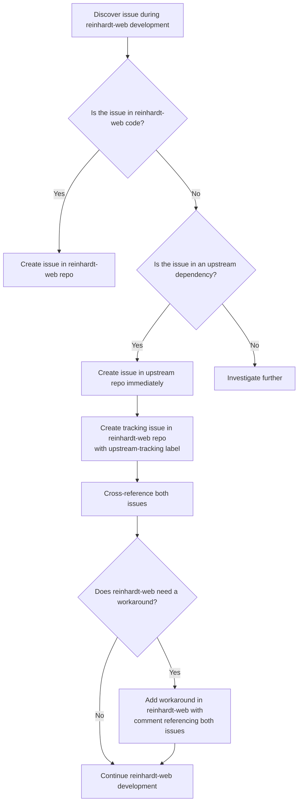
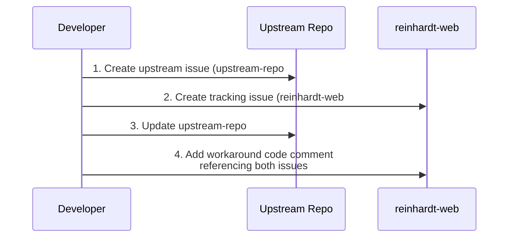

# Upstream Issue Reporting

## Purpose

This file defines the policy for reporting issues discovered in upstream dependencies during reinhardt-web development. reinhardt-web depends on several external crates, and issues found in these dependencies MUST be reported to the upstream repository promptly.

---

## Scope

### US-1 (MUST): Target Repositories

This policy applies to the following upstream repositories (non-exhaustive):

| Repository | URL | Relationship |
|------------|-----|-------------|
| tokio | `https://github.com/tokio-rs/tokio` | Async runtime |
| hyper | `https://github.com/hyperium/hyper` | HTTP implementation |
| serde | `https://github.com/serde-rs/serde` | Serialization framework |
| sea-query | `https://github.com/SeaQL/sea-query` | SQL query builder |
| tower | `https://github.com/tower-rs/tower` | Service middleware |
| tracing | `https://github.com/tokio-rs/tracing` | Diagnostics/logging |
| sqlx | `https://github.com/launchbadge/sqlx` | Database driver |

**Future upstream dependencies** should be added to this table as the project grows.

---

## Reporting Policy

### UR-1 (MUST): Immediate Reporting

When a bug, missing feature, documentation gap, or unexpected behavior in an upstream dependency is discovered during reinhardt-web development, an issue MUST be created in the upstream repository **immediately** upon discovery.

**Rationale:** Delaying upstream issue reporting increases the risk of:
- Forgetting the issue details
- Building workarounds that mask the root cause
- Other contributors hitting the same problem without context

The following diagram summarizes the upstream issue reporting flow:



### UR-2 (MUST): Use GitHub CLI with Repository Flag

Issues in upstream repositories MUST be created using `gh issue create` with the `-R` flag:

```bash
# Create issue in an upstream repository (example: sea-query)
gh issue create -R SeaQL/sea-query \
  --title "Bug: description of the issue" \
  --body "$(cat <<'EOF'
## Description

[Clear description of the issue]

## Reproduction Steps

1. [Step 1]
2. [Step 2]

## Expected Behavior

[What should happen]

## Actual Behavior

[What actually happens]

## Context

Discovered during reinhardt-web development while [brief context].

reinhardt-web tracking issue: https://github.com/kent8192/reinhardt-web/issues/N

🤖 Generated with [Claude Code](https://claude.com/claude-code)
EOF
)"
```

### UR-3 (MUST): Issue Content Requirements

Upstream issues MUST:
- Be written in **English**
- Follow the upstream repository's issue templates and contribution guidelines if available
- Include clear reproduction steps
- Include the discovery context (e.g., "discovered during reinhardt-web ORM implementation")
- Reference related reinhardt-web issues or PRs if applicable
- Include Claude Code attribution footer
- **NOT** include absolute local paths or user-specific information

**Note:** External upstream projects may have their own contributing guidelines, issue templates, and community norms. Always review the upstream project's CONTRIBUTING.md or issue template before filing.

### UR-4 (MUST): Tracking Issues in reinhardt-web

When an upstream issue is created, a corresponding **tracking issue** MUST also be created in the reinhardt-web repository.

**Rationale:** Creating a tracking issue in reinhardt-web ensures that:
- Upstream dependencies are visible in the reinhardt-web issue tracker
- Workaround removal can be tracked alongside reinhardt-web development milestones
- Contributors can discover upstream blockers without checking external repositories

**Procedure:**

1. **Create the upstream issue** in the external repository (UR-1, UR-2)
2. **Create a tracking issue** in the reinhardt-web repository referencing the upstream issue
3. **Update the upstream issue** to reference the reinhardt-web tracking issue (SHOULD — external projects may not accept downstream cross-references)
4. **In the reinhardt-web codebase**: Add a comment referencing both issues where a workaround is applied

The following diagram shows the cross-referencing workflow:



**reinhardt-web tracking issue template:**

```bash
gh issue create \
  --title "Upstream: [brief description] (upstream-repo#N)" \
  --label upstream-tracking \
  --body "$(cat <<'EOF'
## Upstream Issue

Tracking upstream issue: https://github.com/[owner]/[repo]/issues/N

## Impact on reinhardt-web

[Describe how this upstream issue affects reinhardt-web]

## Workaround

- [ ] Workaround applied in reinhardt-web (if needed)
- [ ] Code comment added referencing upstream issue

## Resolution Criteria

This issue should be closed when:
- The upstream issue is resolved AND
- The reinhardt-web workaround (if any) is removed

🤖 Generated with [Claude Code](https://claude.com/claude-code)
EOF
)"
```

**Workaround comment format:**
```rust
// Workaround for upstream-repo#42 (tracked in reinhardt-web#15)
// Remove this workaround when the upstream issue is resolved.
//
// Ideal implementation (without workaround):
//   [code showing the intended implementation without the workaround]
```

### UR-5 (SHOULD): Label Application

Apply appropriate labels to upstream issues based on the issue type:

| Issue Type | Labels |
|------------|--------|
| Bug | `bug` |
| Missing feature | `enhancement` |
| Documentation gap | `documentation` |
| Performance issue | `performance` |

**Note:** Available labels depend on the upstream repository's configuration. Check available labels before applying.

---

## Issue Categories

### IC-1: What Qualifies as an Upstream Issue

Report to the upstream repository when:

- An upstream crate's API behaves unexpectedly or inconsistently with its documentation
- An upstream crate is missing a feature that reinhardt-web requires for correct operation
- Upstream crate documentation is incorrect, incomplete, or misleading
- An upstream dependency causes a conflict or vulnerability
- An upstream crate's build or test infrastructure has issues that affect downstream consumers
- An upstream crate's type signatures or trait implementations are incorrect

### IC-2: What Does NOT Qualify

Do **NOT** report to the upstream repository when:

- The issue is in reinhardt-web-specific code (report in reinhardt-web repo)
- The issue is a reinhardt-web design decision that differs from upstream conventions
- The issue is a feature request specific to reinhardt-web's use case with no general applicability
- The issue is a misunderstanding of the upstream crate's intended behavior (check docs and discussions first)
- The upstream crate has a discussion forum — use that for usage questions instead of filing issues

---

## Workaround Policy

### WP-1 (SHOULD): Temporary Workarounds

When an upstream issue blocks reinhardt-web development:

1. Create the upstream issue first (UR-1)
2. Create the reinhardt-web tracking issue with `upstream-tracking` label (UR-4)
3. Cross-reference both issues (UR-4)
4. Implement a minimal workaround in reinhardt-web
5. Mark the workaround with a comment referencing both issues (UR-4)
6. Track the upstream issue for resolution; close the reinhardt-web tracking issue when resolved

**Workaround rules:**
- Keep workarounds minimal and isolated
- Document the workaround clearly
- Remove the workaround when the upstream issue is resolved

### WP-2 (MUST): No Silent Workarounds

**NEVER** implement workarounds for upstream issues without:
1. Creating an upstream issue first
2. Adding a reference comment in the workaround code

### WP-3 (MUST): Include Ideal Implementation in Workaround Comments

Every workaround comment MUST include the **ideal implementation** — the code that should replace the workaround once the upstream issue is resolved. This enables future developers to remove the workaround without re-investigating the intended design.

**Rationale:**
- Issue references explain *why* a workaround exists, but not *what the code should look like* without it
- The ideal implementation reduces the cost and risk of workaround removal
- Without it, developers must reverse-engineer the intended behavior from issue discussions

**Extended workaround comment template:**
```rust
// Workaround for SeaQL/sea-query#42 (tracked in reinhardt-web#15)
// Remove this workaround when the upstream issue is resolved.
//
// Ideal implementation (without workaround):
//   let query = Query::select()
//       .from(Users::Table)
//       .column(Users::Id)
//       .build(PostgresQueryBuilder);
```

**Rules:**
- The ideal implementation MUST be syntactically plausible (not necessarily compilable against the current upstream API)
- Keep the ideal implementation concise — show only the key difference, not the entire function
- If the ideal implementation depends on an upstream API that does not yet exist, describe it in pseudocode with a brief note

**Example with pseudocode:**
```rust
// Workaround for tokio-rs/tokio#99 (tracked in reinhardt-web#30)
// Remove this workaround when the upstream issue is resolved.
//
// Ideal implementation (without workaround):
//   // Requires tokio to expose `Runtime::shutdown_timeout_with_reason()`
//   runtime.shutdown_timeout_with_reason(Duration::from_secs(5), "graceful").await;
```

---

## Quick Reference

### MUST DO
- Create issues in upstream repos immediately upon discovering dependency bugs (UR-1)
- Use `gh issue create -R [owner]/[repo]` for upstream issue creation (UR-2)
- Write all upstream issues in English (UR-3)
- Follow upstream repository's issue templates and contribution guidelines when available (UR-3)
- Create a tracking issue in reinhardt-web for every upstream issue with `upstream-tracking` label (UR-4)
- Add workaround comments referencing both upstream and reinhardt-web tracking issues (UR-4)
- Include ideal implementation in all workaround comments (WP-3)
- Create upstream issue before implementing any workaround (WP-2)

### NEVER DO
- Delay reporting upstream issues discovered during reinhardt-web development
- Implement workarounds without creating upstream issues first (WP-2)
- Introduce workaround code without an ideal implementation comment (WP-3)
- Create upstream issues without corresponding reinhardt-web tracking issues (UR-4)
- Include absolute local paths in upstream issues (UR-3)
- Report reinhardt-web-specific issues to upstream repositories (IC-2)
- File usage questions as issues when the upstream project has a discussion forum (IC-2)

---

## Related Documentation

- **Issue Guidelines**: instructions/ISSUE_GUIDELINES.md
- **Issue Handling**: instructions/ISSUE_HANDLING.md
- **GitHub Interaction**: instructions/GITHUB_INTERACTION.md
- **Main Quick Reference**: CLAUDE.md (see Quick Reference section)

---

**Note**: This document focuses on reporting issues to upstream dependencies. For reinhardt-web-specific issue management, see instructions/ISSUE_GUIDELINES.md. For batch issue handling strategy, see instructions/ISSUE_HANDLING.md.
