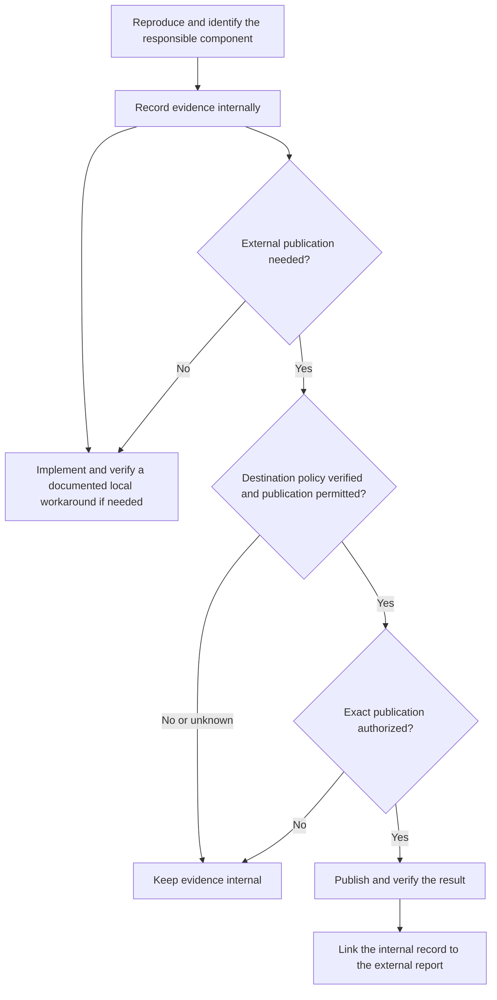

# Upstream Issue Reporting

## Purpose

Preserve evidence about dependency problems without making external publication
a prerequisite for fixing Reinhardt. Record findings internally first; report
externally only when the destination policy and posting authorization permit it.

## Scope

### US-1 (MUST): Target Repositories

This workflow covers Reinhardt-family dependencies and third-party upstreams.
Resolve the repository responsible for the affected package or behavior instead
of inferring ownership from a crate name, organization, or source-file path.

The exact destination allowlist in
[COMMIT_GUIDELINE.md CE-1](COMMIT_GUIDELINE.md#ce-1-must-execution-authorization)
defines standing authorization. Every other destination must satisfy
[GITHUB_INTERACTION.md PP-0](GITHUB_INTERACTION.md#pp-0-must-external-publication).
The current checkout does not confer permission to publish elsewhere.

## Reporting Policy

### UR-1 (MUST): Internal Evidence Before External Reporting

When a dependency problem is discovered:

1. Preserve the exact error, minimal reproduction, environment, affected versions,
   dependency graph, and observed impact. Distinguish reproduced facts from an
   inferred cause or unsupported expectation.
2. Verify the intended behavior and the responsible repository. Search existing
   open and closed issues and the relevant contribution documentation. An
   intentional assertion or unsupported dependency combination is not by itself
   proof of an upstream defect.
3. Create or update an internal record under UR-4. A local-only task may use a
   repository note instead of publishing an Issue. Security-sensitive evidence
   follows [SECURITY.md](../SECURITY.md), never a public tracker.
4. Continue a documented, verified local workaround when needed. An external
   issue is optional and is never a prerequisite for that work.
5. Before any external publication, complete PP-0. If publication is prohibited
   or unverified, retain the internal evidence and report that boundary. Do not
   post an Issue, policy question, apology, or follow-up to work around the gate.

```mermaid
flowchart TD
    A[Reproduce and identify the responsible component] --> B[Record evidence internally]
    B --> C[Implement and verify a documented local workaround if needed]
    B --> D{External publication needed?}
    D -->|No| C
    D -->|Yes| E{Destination policy verified and publication permitted?}
    E -->|No or unknown| F[Keep evidence internal]
    E -->|Yes| G{Exact publication authorized?}
    G -->|No| F
    G -->|Yes| H[Publish and verify the result]
    H --> I[Link the internal record to the external report]
```

### UR-2 (MUST): Explicit Destination and Approved Tools

After the applicable authorization checks, use
[GITHUB_INTERACTION.md PP-3](GITHUB_INTERACTION.md#pp-3-must-github-tool-selection).
Specify the complete destination repository in the tool arguments; with `gh`,
use `--repo owner/repository`. For multiline content, use a structured argument
or a task-owned temporary body file, not shell interpolation. Read back the
published result. A tool fallback must preserve the same destination, content,
policy requirements, and authorization.

### UR-3 (MUST): Evidence and Authorship Requirements

A permitted report must follow the destination's template, contribution rules,
and authorship/AI policy. Include verified reproduction steps, actual and
expected behavior with a basis for the expectation, relevant versions, and
only the context necessary to assess the report. Mark untested environments
and uncertainty explicitly; omit private data and absolute local paths.

Reinhardt-family reports use English and the applicable agent attribution.
For external destinations, disclosure does not make otherwise prohibited
AI-generated text acceptable. Follow PP-0, including its human-authorship,
translation, and quotation boundaries. Supply private factual materials when
human authorship is required; do not generate a public report on that person's
behalf. Do not copy a family template into an external tracker without checking
its policy.

### UR-4 (MUST): Internal Tracking

Maintain a Reinhardt record for a dependency workaround, whether or not an
external issue exists. Search and reuse an existing record before creating one.
For a new internal Issue, follow [Issue Guidelines](ISSUE_GUIDELINES.md), use
an appropriate template and type label, and add `upstream-tracking`. Creating
or updating the record still follows CE-1 and PP-1; internal tracking does not
independently authorize comments or body edits.

Record:

- The affected component and package versions, reproduction, and evidence.
- The compatibility requirement or suspected defect, with uncertainty stated.
- The workaround location, validation performed, and concrete removal conditions.
- The external reporting status: not submitted, policy prohibits submission,
  policy not verified, awaiting specific authorization, or submitted with a URL.
- Policy references and check date, without private conversation details.

When an external report is submitted, link it from the internal record under
the applicable update authorization. An external cross-reference, body edit,
or follow-up needs its own PP-0 check; creating the original Issue does not
implicitly authorize subsequent messages.

Track reporting disposition separately from technical resolution. Closure of
an external Issue or internal tracker does not demonstrate a dependency fix
and does not justify removing a working compatibility constraint.

### UR-5 (SHOULD): Label Application

Use the destination's available labels and template requirements for permitted
reports. Do not assume Reinhardt's type or agent-discovery labels exist in an
external repository. Policy and authorization checks precede label mutations.

## Issue Categories

### IC-1: Candidates for Upstream Investigation

Unexpected API behavior, missing generally applicable functionality, incorrect
documentation, dependency incompatibility, or infrastructure failures may merit
upstream investigation. Establish the responsible component and supported
contract before describing the finding as an upstream bug. Qualification as a
technical finding does not grant external posting permission.

### IC-2: Findings to Keep Local

Reinhardt-specific behavior, deliberate design differences, misunderstood APIs,
or unsupported usage belong in internal investigation. Usage questions may
belong in the destination's discussion forum, but that forum is not a bypass
for policy or authorization checks. Follow private disclosure rules for
vulnerabilities.

## Workaround Policy

### WP-1 (SHOULD): Temporary Workarounds

Use the smallest isolated compatibility repair supported by the evidence.
Document and verify the affected behavior. For dependency constraints, verify
fresh resolution and relevant external consumers rather than relying only on
a workspace lockfile. Reassess the workaround when the dependency changes.

### WP-2 (MUST): Documented Workarounds Without Mandatory Publication

Before adding a workaround, preserve an internal record under UR-4 and add a
code comment referencing that record, the technical reason, and the removal
condition. Include an external Issue reference only if one actually exists.
A local record is sufficient when publication is not authorized or appropriate.

External reporting is not required to implement or retain the workaround.
Remove it only after its technical removal conditions are verified, not because
an Issue was closed, rejected, or withdrawn. Closing trackers requires the
separate authorization in CE-1.

### WP-3 (MUST): Include Ideal Implementation in Workaround Comments

Include the intended implementation without the workaround. Keep it concise
and syntactically plausible; clearly identify pseudocode or an API that does
not yet exist. For a dependency constraint, describe the dependency/feature
entries that should remain after removal. The comment must make the intended
replacement clear without repeating the investigation.

## Related Documentation

- [GitHub publication policy](GITHUB_INTERACTION.md#pp-0-must-external-publication)
- [Commit and destination authorization](COMMIT_GUIDELINE.md#ce-1-must-execution-authorization)
- [Issue Guidelines](ISSUE_GUIDELINES.md)
- [Issue Handling](ISSUE_HANDLING.md)
- [Quick Reference](QUICK_REFERENCE.md)
