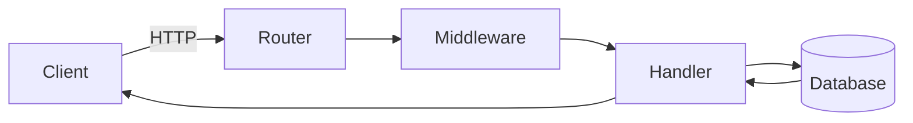
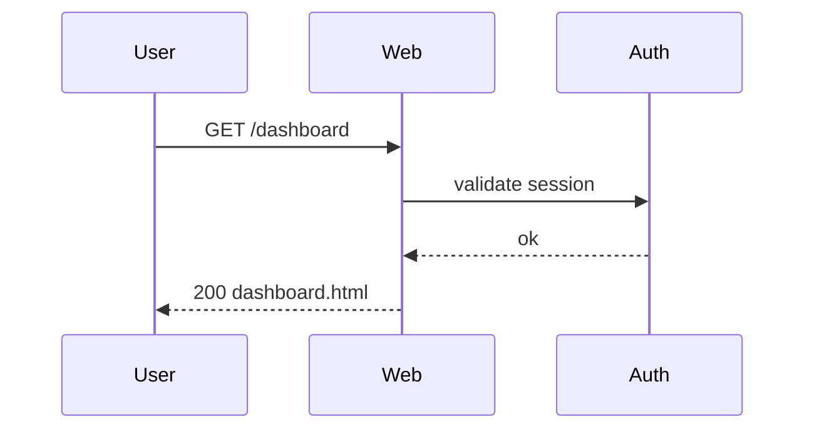

+++
title = "Diagrams"
description = "Embedding Mermaid diagrams in Reinhardt documentation."
weight = 90
+++

Reinhardt's documentation site renders fenced code blocks tagged
` ```mermaid ` as live diagrams. Use them for architecture overviews,
sequence flows, and state machines instead of ASCII art.

## Flowchart



## Sequence diagram



## Authoring notes

- Diagrams render client-side via [Mermaid](https://mermaid.js.org/),
  loaded from cdnjs only on pages that contain at least one
  ` ```mermaid ` block.
- Colors follow the site's light/dark theme automatically and
  re-render on theme toggle.
- Keep the diagram source readable in the Markdown — it ships as the
  fallback if the Mermaid runtime fails to load.
