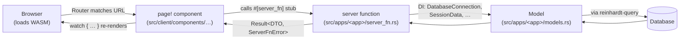

+++
title = "Part 1: Project Setup"
weight = 10

[extra]
sidebar_weight = 10
+++

# Part 1: Project Setup

In this tutorial, we'll install the Reinhardt CLI, generate a new project from the **pages** template, walk through the layout it emits, and run it locally. By the end of the chapter your tree will be logically equivalent to [`examples/examples-tutorial-basis`](https://github.com/kent8192/reinhardt-web/tree/main/examples/examples-tutorial-basis); the chapters that follow add models, server functions, forms, tests, and admin customization on top of this scaffold.

## Verifying Your Installation

Before we begin, let's verify that Rust and Cargo are installed correctly:

```bash
rustc --version
cargo --version
```

You should see version information for both commands. If not, visit [rust-lang.org](https://www.rust-lang.org/tools/install) to install Rust.

The tutorial also assumes you have `cargo-make` installed for the `cargo make …` task runner:

```bash
cargo install cargo-make
```

## Installing Reinhardt Admin CLI

Install the global tool for project generation. The command below pins this tutorial to the documented release for reproducibility; omit `--version` to let Cargo choose the latest stable release. The literal below is release-managed.

<!-- reinhardt-version-sync -->
```bash
cargo install reinhardt-admin-cli --version "0.2.0-rc.5"
```

## Creating a Project

This tutorial uses the **reinhardt-pages template** — a WASM client + server functions + shared types layout. Generate the project from that template with explicit features so the setup is reproducible in non-interactive shells:

```bash
reinhardt-admin startproject polls_project --template pages \
  --features standard,pages,admin,conf,commands,db-sqlite,forms,auth-session,argon2-hasher \
  --no-interactive
cd polls_project
```

`startproject` creates the project shell. Now create the two tutorial apps:

```bash
reinhardt-admin startapp polls --template pages
reinhardt-admin startapp users --template pages
```

`startapp` creates `src/apps/<app>/...`, updates `src/apps.rs`, and appends each app to `src/config/apps.rs`. You do not need to edit `installed_apps!` by hand.

After those commands, the scaffold has the same high-level shape as the reference implementation in [`examples/examples-tutorial-basis/`](https://github.com/kent8192/reinhardt-web/tree/main/examples/examples-tutorial-basis):

```text
polls_project/
├── Cargo.toml                 # cdylib + rlib; native reinhardt dependency with the explicit tutorial features above; WASM dependency with "pages" + "client-router"
├── Makefile.toml              # cargo make runserver / migrate / dev / wasm-build-dev / collectstatic / test / …
├── build.rs                   # cfg_aliases: `native` vs `wasm`; also emits `with_reinhardt` cfg after auto-detecting the parent workspace
├── index.html                 # SPA shell — single #root mount + UnoCSS runtime
├── README.md
├── favicon.png
├── migrations/                # Generated by `cargo make makemigrations`
├── scripts/                   # Helper shell scripts for wasm-build-*, run-dev-server, clean-cache
├── static/                    # Project-level static assets (css/, images/, …)
├── settings/
│   ├── base.toml              # always loaded
│   ├── ci.toml                # loaded when REINHARDT_ENV=ci or CI is set
│   └── local.toml             # local development settings (tracked in version control)
├── src/
│   ├── lib.rs                 # Crate root; declares apps / config / shared / client modules with cfg gates
│   ├── apps.rs                # pub mod polls; pub mod users;
│   ├── config.rs              # pub mod admin/settings/wasm (cfg native); apps / urls compile both targets
│   ├── shared.rs              # pub mod forms (cfg native); pub mod types (both targets)
│   ├── client.rs              # pub mod lib / pages / components (gated to cfg wasm at the crate root)
│   ├── bin/
│   │   └── manage.rs          # CLI binary (Django's manage.py equivalent), required-features = ["with-reinhardt"]
│   ├── config/
│   │   ├── settings.rs        # #[settings(core: CoreSettings | contacts: ContactSettings)] ProjectSettings + SettingsBuilder + profile loading
│   │   ├── apps.rs            # installed_apps! entries added by startapp
│   │   ├── urls.rs            # #[routes] routes() -> UnifiedRouter (app server-router mounts, admin mount, session middleware, client-router aggregation)
│   │   ├── wasm.rs            # AppStaticFilesConfig for dist-wasm/, registered via inventory::submit!
│   │   └── admin.rs           # configure_admin() -> AdminSite + register Question/Choice admins
│   ├── shared/
│   │   ├── types.rs           # Shared DTOs (filled in Part 2 onward)
│   │   └── forms.rs           # Server-only Form definitions (filled in Part 4)
│   ├── apps/
│   │   ├── polls/             # Filled in Part 2 onward (models, di, server_fn, client, urls/, admin, serializers)
│   │   └── users/             # Filled in Part 2 (User model + auth server functions)
│   └── client/                # Filled in Part 3 (lib.rs entry, pages.rs, shared components/)
│       └── …
└── tests/
    ├── integration.rs         # Native integration tests, required-features = ["with-reinhardt"]
    └── wasm/
        └── polls_mock_test.rs # WASM mock tests, required-features = ["msw"] (#![cfg(wasm)]-gated)
```

Three rules keep this layout predictable:

1. **`#[cfg(native)]` vs `#[cfg(wasm)]`** — server-only code (models, server function bodies, forms, admin) is gated on `native`; browser-only code (`src/client/` plus app-local `client` modules) is gated on `wasm`. `src/shared/types.rs` compiles on both so DTOs stay in sync, and each app's `server_fn` and `urls` modules are both targets so the typed client stubs work in the browser.
2. **Server functions are the bridge, and they live per-app** — every `#[server_fn]` lives in `src/apps/<app>/server_fn.rs`, sitting next to that app's models, DI helpers, client UI, and admin. There is no top-level `src/server_fn/` directory.
3. **Routing is per-app, with a `urls/` directory module** — `src/apps/<app>/urls.rs` declares `pub mod server_urls;` (`#[cfg(native)]`) and `pub mod client_router;` (`#[cfg(wasm)]`). App-local `server_urls.rs` files register `#[server_fn]` markers, and the project-level `src/config/urls.rs` mounts those app server routers while aggregating the app-local client routers.

**Available `cargo make` tasks (defined in `Makefile.toml`):**

| Task | Purpose |
|------|---------|
| `cargo make runserver` | Build the WASM bundle, then run `cargo run --bin manage runserver --with-pages --no-override-wasm` |
| `cargo make dev` | One-shot: `clean-cache` → `wasm-build-dev` → `run-dev-server` (the most common command during a tutorial session) |
| `cargo make makemigrations` | Generate migrations from model changes |
| `cargo make migrate` | Apply migrations to the configured database |
| `cargo make wasm-build-dev` | Compile the WASM bundle (debug) and emit it under `dist-wasm/` |
| `cargo make wasm-build-release` | Compile + optimise (`wasm-opt`) the WASM bundle for release |
| `cargo make collectstatic` | Collect static assets (including `dist-wasm/`) into `staticfiles/` |
| `cargo make test` | `cargo nextest run --all-features` |
| `cargo make wasm-test` | Run WASM tests under `wasm-pack test --headless --chrome` (passes `--no-default-features` so the `manage` binary is skipped) |
| `cargo make showurls` | Print every registered URL pattern |
| `cargo make check` | Project self-check (Django-style `check`) |
| `cargo make fmt-check` / `fmt-fix` | `reinhardt-formatter fmt` for the `page!` DSL + rustfmt |
| `cargo make clippy-check` / `clippy-fix` | Clippy with `-D warnings` |
| `cargo make quality` / `quality-fix` | Run both `fmt-*` and `clippy-*` |

> **Note**: This tutorial targets the **reinhardt-pages** architecture end-to-end. If you are instead building a pure JSON backend consumed by an external SPA or mobile client, start with the [REST Tutorial](../rest/0-http-macros/).

## Understanding the Project Structure

Each generated file has a specific role. Walking top-down:

- `Cargo.toml` — declares `crate-type = ["cdylib", "rlib"]` (cdylib for WASM, rlib for the server binary), `default-run = "manage"`, and a `manage` binary for the native management CLI. It splits the `reinhardt` dependency between two `[target.'cfg(...)'.dependencies]` blocks: the native side uses the explicit tutorial features from the `startproject` command, while the WASM side only enables `pages + client-router`.
- `build.rs` — uses the `cfg_aliases` crate to register two custom cfgs: `wasm` = `all(target_family = "wasm", target_os = "unknown")` and `native` = its negation. You will see these throughout the source as `#[cfg(wasm)]` / `#[cfg(native)]`. The build script also auto-detects whether the parent directory is the `reinhardt-web` workspace (subtree development) versus a standalone checkout, and unconditionally emits `cargo:rustc-cfg=with_reinhardt` in both modes so the integration test target compiles either way.
- `index.html` — the SPA shell. It loads UnoCSS from a CDN, defines a `#root` div that the launcher mounts into, and shows a `Loading…` spinner while the WASM bundle downloads.
- `settings/` — TOML settings files. `base.toml` is always loaded; `{profile}.toml` (resolved from `REINHARDT_ENV`, or `local` otherwise) layers on top. `local.toml` contains local development settings (tracked in version control).
- `src/lib.rs` — the crate root. It declares `pub mod apps;`, `pub mod config;`, `pub mod shared;`, and `#[cfg(wasm)] pub mod client;`. Server-only re-exports (`async_trait`, the `reinhardt_apps` / `reinhardt_core` / `reinhardt_di::params` / `reinhardt_http` shims) are gated on `#[cfg(native)]`.
- `src/bin/manage.rs` — the server-side binary. It sets `REINHARDT_SETTINGS_MODULE = "examples_tutorial_basis.config.settings"` (rename to your crate name in the generated tree) and calls `reinhardt::commands::execute_from_command_line_with_settings(get_settings())`. The WASM build still needs a `main` symbol for `bin` crate-types, so the file also defines an empty `fn main() {}` under `#[cfg(target_arch = "wasm32")]`.
- `src/config/`
  - `settings.rs` — `#[settings(core: CoreSettings | contacts: ContactSettings)] pub struct ProjectSettings;` plus a `get_settings()` function that builds the layered `SettingsBuilder` (`DefaultSource` → `TomlFileSource("base.toml")` → `TomlFileSource("{profile}.toml")` → `HighPriorityEnvSource("REINHARDT_")`).
  - `apps.rs` — `startapp` appends `installed_apps!` entries here. The macro generates the app labels used by settings, migrations, admin metadata, and routing namespaces.
  - `urls.rs` — `#[routes] pub fn routes() -> UnifiedRouter`. Mounts each app's `server_url_patterns()` under `#[cfg(native)]`, aggregates each app's `client_url_patterns()` with `mount_unified` under `#[cfg(wasm)]`, mounts the admin at `/admin/` (plus `/static/admin/`) via `admin_routes_with_di(Arc::new(configure_admin()))`, and applies the session middleware.
  - `wasm.rs` — an `inventory::submit!` entry that registers `dist-wasm/` as an `AppStaticFilesConfig`, so `cargo make collectstatic` discovers the WASM build artifacts and copies them into `staticfiles/`.
  - `admin.rs` — `configure_admin() -> AdminSite` instantiates the admin site, names it, and registers each app's `ModelAdmin` implementations (`QuestionAdmin`, `ChoiceAdmin`).
- `src/shared/`
  - `types.rs` — DTOs shared between WASM and server. On native it re-exports the model-generated `QuestionInfo`, `ChoiceInfo`, and `UserInfo` aliases; on WASM it keeps fallback serde structs until those generated companion types are exported there. `LoginRequest` and `RegisterRequest` use `#[dto]` so validation derives stay native-only.
  - `forms.rs` — `#[cfg(native)]`-only form metadata/runtime contract checks built from `form!` and `use_form(&form).build()`.
- `src/apps/` — Reinhardt apps. Each app owns its models, server functions, app-local WASM components, URLs, admin, serializers, and DI helpers. We fill these in starting from Part 2.
- `src/client/` — WASM-only cross-app shell. `lib.rs` is the `#[wasm_bindgen(start)]` entry that calls `ClientLauncher::new("#root").register_routes_from_inventory().launch()`. `pages.rs` exposes page factories and wraps app-local components in the shared nav bar; `components/nav.rs` contains the shared navigation shell. App-specific page bodies live under `src/apps/<app>/client/`.

### Architecture: WASM + SSR (reinhardt-pages)

This tutorial uses the **WASM + SSR** architecture with **reinhardt-pages**, ideal for:

- Full-stack web applications with an integrated frontend and backend
- Single Page Applications (SPAs) with server-side rendering
- Type-safe client-server communication
- Modern reactive user interfaces

The data flow for one user interaction looks like this:



**Key characteristics:**

- Unified codebase for frontend and backend
- Type-safe RPC-style communication via `#[server_fn]`
- Client-side reactivity (`page!` + `form!` + `use_resource`)
- Single deployment artifact
- WASM compilation for the client-side UI

**Alternative: RESTful API architecture.** If you're building a backend API for separate frontends (React, Vue, mobile apps), see the [REST API Tutorial](../rest/0-http-macros/) instead.

## Configuring `settings/base.toml`

`settings/base.toml` holds the always-loaded base layer of your settings. Open it and confirm it contains at least the keys consumed by the `[core]`, `[core.databases.default]`, and `[contacts]` fragments. For the tutorial, switch the generated PostgreSQL default to SQLite and keep empty contact lists:

```toml
[core]
debug = false
secret_key = "CHANGE_THIS_IN_PRODUCTION"
allowed_hosts = []
middleware = []
root_urlconf = ""

[core.security]
secure_ssl_redirect = false
secure_hsts_include_subdomains = false
secure_hsts_preload = false
session_cookie_secure = false
csrf_cookie_secure = false
append_slash = true

[core.databases.default]
engine = "sqlite"
name = "db.sqlite3"

[contacts]
admins = []
managers = []
```

A few things worth knowing as you edit:

- `TomlFileSource::new(path)` applies `${VAR}` interpolation **by default** (changed in 0.1.0-rc.27). If you want a literal `${...}` to survive the load, opt out per file with `.without_interpolation()`. The deprecated `with_interpolation(bool)` setter still works in 0.1.x but will be removed in 0.2.0.
- The JSON file source (`JsonFileSource`, `auto_source`) is deprecated and will be removed in 0.2.0. Stick to TOML.
- Project templates do not ignore `settings/*.toml`. Commit shared non-secret settings intentionally; add a project-specific ignore rule if you create a private local copy with secrets.

`settings/{profile}.toml` is selected dynamically. The resolution order is:

1. `$REINHARDT_ENV` if set (e.g., `staging`, `production`).
2. Else `local`.

Look in `src/config/settings.rs` to see this wired up:

```rust
use reinhardt::conf::settings::builder::SettingsBuilder;
use reinhardt::conf::settings::profile::Profile;
use reinhardt::conf::settings::sources::{
	DefaultSource, HighPriorityEnvSource, TomlFileSource,
};
use reinhardt::settings;
use std::env;

#[settings(core: CoreSettings | contacts: ContactSettings)]
pub struct ProjectSettings;

pub fn get_settings() -> ProjectSettings {
	let profile_str = env::var("REINHARDT_ENV").unwrap_or_else(|_| "local".to_string());
	let profile = Profile::parse(&profile_str);
	let base_dir = env::current_dir().expect("Failed to get current directory");
	let settings_dir = base_dir.join("settings");

	SettingsBuilder::new()
		.profile(profile)
		.add_source(DefaultSource::new())
		.add_source(TomlFileSource::new(settings_dir.join("base.toml")))
		.add_source(TomlFileSource::new(
			settings_dir.join(format!("{}.toml", profile_str)),
		))
		.add_source(HighPriorityEnvSource::new().with_prefix("REINHARDT_"))
		.build_composed::<ProjectSettings>()
		.unwrap_or_else(|err| {
			panic!("Failed to build/compose settings for profile `{profile_str}`: {err}")
		})
}
```

`execute_from_command_line_with_settings(get_settings())` requires settings that satisfy `HasCommonSettings`, which includes both `CoreSettings` and `ContactSettings`. The empty `[contacts]` arrays above are valid defaults; without the section, startup fails while composing `ProjectSettings`.

> Need another project-specific setting beyond the common fragments? Compose it with `|`, e.g., `#[settings(core: CoreSettings | contacts: ContactSettings | cache: CacheSettings)] pub struct ProjectSettings;`. The basis tutorial keeps the project settings otherwise minimal and reads the database configuration from `core.databases.default`.

## What `startapp` Registered

The two `startapp` commands updated `src/config/apps.rs` so the framework can discover the `polls` and `users` apps:

```rust
use reinhardt::installed_apps;

installed_apps! {
	polls: "polls",
	users: "users",
}

pub fn get_installed_apps() -> Vec<String> {
	InstalledApp::all_apps()
}
```

Treat this file as generated project wiring unless you have a reason to rename or remove an app. The `installed_apps!` macro generates the app label metadata that the rest of the codebase uses for settings, migrations, admin metadata, and route namespaces. Two consequences worth knowing:

- The left-hand side (`polls:`) is the stable app identifier.
- The right-hand side (`"polls"`) is the app label that matches `#[model(app_label = "polls", ...)]`, migration directories such as `migrations/polls/`, and app route namespaces.

Reinhardt's *framework features* (auth, sessions, admin, REST, etc.) are **not** registered through `installed_apps!`; they are enabled through Cargo feature flags. See the [Feature Flags Guide](/docs/feature-flags/) for the full mapping.

## Running the Development Server

You have two choices for running the dev server locally.

### `cargo make runserver` — WASM build + server

Use this when you want the standard generated runserver task:

```bash
cargo make runserver
```

`runserver` first builds the WASM bundle, then executes `cargo run --bin manage runserver --with-pages --no-override-wasm`. It starts the server on `http://127.0.0.1:8000/` and serves the SPA shell at `/`. After Part 2 adds models, run `cargo make migrate` before using routes that read or write the database.

### `cargo make dev` — WASM build + dev server

This is the most common command during the tutorial. It cleans the WASM cache, rebuilds the bundle in debug mode, and starts the dev server:

```bash
cargo make dev
```

You should see output similar to:

```
    Compiling polls_project v0.1.0 (/path/to/polls_project)
     Finished dev [unoptimized + debuginfo] target(s) in 2.34s
      Running `target/debug/manage runserver --with-pages`

Reinhardt Development Server
──────────────────────────────────────────────────

  ✓ http://127.0.0.1:8000
  Environment: Debug

Quit the server with CTRL+C
```

Open your web browser and visit `http://127.0.0.1:8000/`. You will see the SPA shell from `index.html` mount the WASM bundle and (once Part 3 lands) display the polls index page.

For a production-grade build, the `dev-release` family of tasks does the same orchestration but invokes `wasm-build-release` (with `wasm-opt`) and `collectstatic`:

```bash
cargo make dev-release
```

## Understanding What Happened

The pages template gave you a five-section project:

- **Server-side modules** (`src/apps/*/models.rs`, `di.rs`, `server_fn.rs`, `urls/server_urls.rs`, `admin.rs`, `serializers.rs`) — gated on `#[cfg(native)]` so they vanish from the WASM build.
- **WASM-side modules** (`src/client/*`, `src/apps/*/urls/client_router.rs`) — gated on `#[cfg(wasm)]`.
- **Shared modules** (`src/shared/types.rs`, each app's `server_fn.rs` signatures) — compile for both targets so DTOs and typed RPC stubs stay in sync.
- **Project-level glue** (`src/config/*`, `src/bin/manage.rs`) — the entry points the framework looks up: `routes()`, `get_installed_apps()`, `get_settings()`, `configure_admin()`, `execute_from_command_line_with_settings()`.
- **Task automation** (`Makefile.toml`) — every command you will use throughout the tutorial, from `cargo make migrate` to `cargo make wasm-build-release`.

## What's Next?

We've created a working pages project with URL routing scaffolding, settings, the management CLI, and the SPA shell. In the next chapter we add the `Question`, `Choice`, and `User` models, wire them through migrations, and prepare the database for the rest of the tutorial.

When you're ready, move on to [Part 2: Models and Database](../2-models-and-database/).

## Summary

In this tutorial you learned:

- How to install `reinhardt-admin-cli`, generate a project from the `pages` template, and create `polls` / `users` apps with `startapp`
- How the `src/{lib, apps, config, shared, client, bin}` layout maps to native vs WASM code paths via `cfg_aliases`
- How `settings/base.toml` + profile overlays are loaded through `SettingsBuilder` (with `${VAR}` interpolation enabled by default)
- How `startapp` updates `src/apps.rs` and `src/config/apps.rs`, and how `installed_apps!` exposes stable app labels to settings, migrations, admin metadata, and routing
- How `cargo make runserver` and `cargo make dev` differ — and which `cargo make` tasks ship in `Makefile.toml`
- The reinhardt-pages data flow: page component → `#[server_fn]` stub → model → database → DTO → reactive re-render
