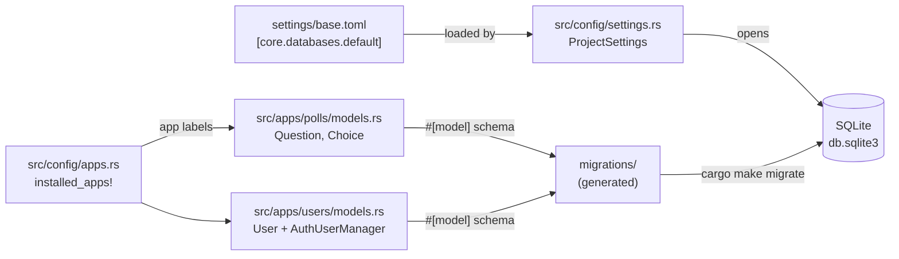

+++
title = "Part 2: Models and Database"
weight = 20

[extra]
sidebar_weight = 20
+++

# Part 2: Models and Database

Part 1 generated the pages project layout, created the tutorial apps, and configured SQLite for local development. In this chapter we fill in the model layer that backs the rest of the tutorial: the `polls` app with `Question` and `Choice`, the `users` app with a session-aware `User` and a project-local `AuthUserManager`, and the migration workflow that turns those Rust definitions into a SQLite schema.

By the end of the chapter your data model will match [`examples/examples-tutorial-basis/src/apps/`](https://github.com/kent8192/reinhardt-web/tree/main/examples/examples-tutorial-basis/src/apps): the same `User`, `Question`, and `Choice` fields, the same model attributes, and the same builder shape. The generated app module tree remains the pages-template tree; later chapters replace its placeholders with the tutorial's server functions, routes, client pages, forms, and admin customization.

## Where We're Headed

The model layer is the bridge between the SQLite file on disk and the typed handlers in `src/apps/<app>/server_fn.rs`. The data flow we're about to assemble:



Three pieces fit together: settings tell Reinhardt **where** the database lives, the `#[model]`-annotated structs tell it **what** the schema looks like, and the app labels that `startapp` added to `installed_apps!` tell it **which apps to scan** for models, server functions, and URL routers. The migration commands stitch the schema and the file together.

## Database Configuration Recap

Part 1 already set up `settings/base.toml` with a SQLite section. Open it and confirm the `[core.databases.default]` block looks like this:

```toml
# File: settings/base.toml
[core.databases.default]
engine = "sqlite"
name = "db.sqlite3"
```

That is the entire database configuration the tutorial needs. `engine = "sqlite"` selects the `db-sqlite` backend (enabled by the explicit `startproject --features ...,db-sqlite,...` command from Part 1), and `name = "db.sqlite3"` is the relative path to the on-disk SQLite file Reinhardt will create on first `migrate`. There is no separate database server to install or start, and no `DATABASE_URL` to export.

If you ever need to point a single run at a different file (for example, an integration test), set `REINHARDT_CORE__DATABASES__DEFAULT__NAME=/tmp/throwaway.sqlite3` in the environment. The `HighPriorityEnvSource` registered in `src/config/settings.rs` picks up `REINHARDT_`-prefixed variables and folds them into the layered settings. Stick with `db.sqlite3` for the tutorial.

> Migrating to PostgreSQL or MySQL later is a settings change (`engine = "postgresql"` plus host/user/password, or `engine = "mysql"`) plus the matching `db-postgres` / `db-mysql` feature on `reinhardt` in `Cargo.toml`. The same `#[model]` definitions in this chapter work unchanged.

## Declaring the `polls` App Module Tree

The `startapp polls --template pages` command from Part 1 already created the app module entry and placeholder files. The generated tree looks like this:

```text
# Project tree: src/apps/polls
src/apps/
├── polls.rs
└── polls/
    ├── admin.rs
    ├── client.rs
    ├── client/
    │   ├── components.rs
    │   └── pages.rs
    ├── models.rs
    ├── serializers.rs
    ├── server_fn.rs
    ├── urls.rs
    ├── urls/
    │   ├── client_router.rs
    │   └── server_urls.rs
    └── views.rs
```

Open `src/apps/polls.rs` and confirm it matches the generated pages-app module entry:

```rust
// File: src/apps/polls.rs
//! polls application module
//!
//! A Reinhardt Pages app whose server-side and client-side code both live
//! under this directory:
//!
//! - `admin` / `models` / `serializers` / `views` — server-only
//! - `server_fn` / `urls` — bi-target (gate internally)
//! - `client` — WASM-only (per-app UI + page wrappers)

#[cfg(server)]
use reinhardt::app_config;

#[cfg(server)]
pub mod admin;
#[cfg(server)]
pub mod models;
#[cfg(server)]
pub mod serializers;
#[cfg(server)]
pub mod views;

// Bi-target modules: both server and client portions live inside, gated internally.
pub mod server_fn;
pub mod urls;

#[cfg(client)]
pub mod client;

#[cfg(server)]
#[app_config(name = "polls", label = "polls")]
pub struct PollsConfig;
```

A few things to notice before we move on to the model file:

- `admin`, `models`, `serializers`, and `views` are gated on `#[cfg(server)]`. They depend on database access, admin macros, serializers, or server-side HTTP plumbing that has no place in the WASM bundle. The browser never sees these files.
- `client` is gated on `#[cfg(client)]`. It owns the polls app's `page!`, `watch`, and `form!` components instead of putting app-specific UI under the cross-app `src/client/` shell.
- `server_fn` and `urls` are **not** cfg-gated at this level. Server functions need their typed signatures visible on both targets so the WASM client can generate stubs; the routing module declares cfg-gated submodules of its own (`urls/server_urls.rs` for server, `urls/client_router.rs` for client). Splitting the gating across the parent module and the children is what lets the same `urls::` path resolve on both compile targets without duplication.
- `PollsConfig` is the typed app handle. `#[app_config(name = "polls", label = "polls")]` registers it with the framework so admin pages, migration metadata, and signal dispatch can find the app under the label that matches the right-hand side of `installed_apps! { polls: "polls", ... }`. Without it, `cargo make makemigrations` would not know which app a new model belongs to.

Do not create these files by hand; `startapp` already did that. In this chapter we replace `models.rs` with the real data model and leave the generated placeholders in `admin.rs`, `serializers.rs`, `views.rs`, `server_fn.rs`, `urls.rs`, and `client/` for later chapters.

## Adding the `users` App

The `polls` app's `Question.author` field will reference `User`, so define the `users` model first. If you write `Question` before `User` exists, `use crate::apps::users::models::User;` fails immediately.

### Module Tree

Like `polls`, the `users` app already has a generated pages-app module entry. Open `src/apps/users.rs` and confirm the shape before replacing `models.rs`:

```rust
// File: src/apps/users.rs
//! users application module
//!
//! A Reinhardt Pages app whose server-side and client-side code both live
//! under this directory:
//!
//! - `admin` / `models` / `serializers` / `views` — server-only
//! - `server_fn` / `urls` — bi-target (gate internally)
//! - `client` — WASM-only (per-app UI + page wrappers)

#[cfg(server)]
use reinhardt::app_config;

#[cfg(server)]
pub mod admin;
#[cfg(server)]
pub mod models;
#[cfg(server)]
pub mod serializers;
#[cfg(server)]
pub mod views;

// Bi-target modules: both server and client portions live inside, gated internally.
pub mod server_fn;
pub mod urls;

#[cfg(client)]
pub mod client;

#[cfg(server)]
#[app_config(name = "users", label = "users")]
pub struct UsersConfig;
```

The tutorial does not use `admin.rs`, `serializers.rs`, or `views.rs` for `users`, but keeping the generated placeholders is harmless and keeps the app layout consistent with the pages template. The important part for this chapter is `src/apps/users/models.rs`, because `Question.author` depends on it.

### The `User` Model

Replace the generated `src/apps/users/models.rs` placeholder with:

> The generated placeholder contains only a small generic model example. Do not adapt that placeholder for the tutorial `User`: it does not include `#[user]` or the project-local manager. Replace the whole file with the code below.

```rust
// File: src/apps/users/models.rs
//! User model for the tutorial-basis example.
//!
//! Uses the `#[user]` attribute macro to derive `BaseUser`,
//! `PermissionsMixin`, and `AuthIdentity` implementations from the
//! conventional field set (`username`, `password_hash`, `last_login`,
//! `is_active`, `is_superuser`). `full = true` is intentionally **not**
//! enabled — the tutorial keeps the model minimal (no `email` /
//! `first_name` / `last_name` / `date_joined` / `is_staff`), which keeps
//! both the schema and the SignupForm small.
//!
//! All registration / authentication-state changes from application code
//! go through [`AuthUserManager`] (a project-local implementation of
//! `BaseUserManager<User>`) rather than constructing `User` instances
//! by hand — see the `register` server function in
//! `crate::apps::users::server_fn`.
//!
//! The `createsuperuser` management command takes a **different** path:
//! it drives `TypedSuperuserCreator<User>` (via the `SuperuserInit` impl
//! that the `#[user] + #[model]` macro pair auto-generates and the
//! matching `inventory::submit!(SuperuserCreatorRegistration)` entry that
//! the framework discovers at startup), which calls
//! `User::objects().create(&user)` directly. That path therefore
//! **bypasses** the password-length / username trim / uniqueness checks
//! that [`AuthUserManager::build_user`] performs for the application signup
//! flow. Acceptable for the tutorial CLI. Auto-registration for minimal
//! user models without `full = true` is the resolution of
//! reinhardt-web#4522 — no manual `SuperuserInit` impl or
//! `register_superuser_creator` call is required.

use chrono::{DateTime, Utc};
use reinhardt::Argon2Hasher;
use reinhardt::macros::user;
use reinhardt::prelude::*;
use serde::{Deserialize, Serialize};

// `manager = false` opts out of the auto-generated manager that
// `#[user(...)]` emits by default since reinhardt-web#4451 — the tutorial
// keeps its own DB-backed `AuthUserManager` below (registered via
// `#[injectable_factory]`) which would otherwise be shadowed. The
// auto-manager is also gated to `Uuid` / `Option<Uuid>` primary keys
// (issue #4455), and this model uses `i64` to demonstrate auto-increment
// integer PKs in the tutorial.
#[user(hasher = Argon2Hasher, username_field = "username", manager = false)]
#[model(app_label = "users", table_name = "users")]
#[derive(Default, Clone, Serialize, Deserialize)]
pub struct User {
    #[field(primary_key = true)]
    pub id: i64,

    #[field(max_length = 150, unique = true)]
    pub username: String,

    #[field(max_length = 255, skip_info = true)]
    pub password_hash: Option<String>,

    #[field(default = true)]
    pub is_active: bool,

    #[field(default = false, skip_info = true)]
    pub is_superuser: bool,

    #[field(include_in_new = false, skip_info = true)]
    pub last_login: Option<DateTime<Utc>>,

    #[field(auto_now_add = true, skip_info = true)]
    pub created_at: DateTime<Utc>,
}

// SuperuserInit is auto-generated by the `#[user] + #[model]` macro pair
// (since reinhardt-web#4522 relaxed the guard from `full && has_model` to
// `has_model`). The generated impl drops the `email` argument because the
// minimal user has no email column, and the i64 PK is left as 0 so the
// DB assigns the real value on insert.
```

There is one new attribute macro and a handful of new field options. Let's unpack them.

### The `#[user]` Attribute

```rust
// File: src/apps/users/models.rs
#[user(hasher = Argon2Hasher, username_field = "username", manager = false)]
#[model(app_label = "users", table_name = "users")]
#[derive(Default, Clone, Serialize, Deserialize)]
```

`#[user]` layers the auth traits on top of `#[model]`. It implements `BaseUser`, `PermissionsMixin`, and `AuthIdentity` on the struct, hooks the password-hashing pipeline up to the chosen hasher, and (by default) generates a `UserManager` companion type. Three arguments matter:

- `hasher = Argon2Hasher` — the algorithm `set_password(&str)` uses. Argon2 is what the framework recommends; alternatives exist for legacy interop.
- `username_field = "username"` — which field is the identity column. The framework needs to know this so session-based authentication can look users up by username.
- `manager = false` — **opt out of the auto-generated `UserManager`.** This is the critical flag for the tutorial. Reinhardt-web#4451 added a default `UserManager` so simple projects don't need to write one, but if we want to layer custom validation (username trimming, password length, uniqueness checks) and register the manager through the DI container, the auto-generated manager would shadow ours. Setting `manager = false` makes room for the project-local one we're about to write.

`#[derive(Default, Clone, Serialize, Deserialize)]` is needed for a few reasons: `Default` lets the framework construct a stand-in `User` for the request extensions when no user is logged in; `Clone` lets server functions pull an owned `AuthUserManager` out of `Depends<_>` later; `Serialize`/`Deserialize` are propagated by `#[model]` to the generated `UserInfo` companion that `src/shared/types.rs` re-exports in Part 3.

Notice that we did **not** pass `full = true`. The `full` flag would also implement `FullUser`, which requires `email`, `first_name`, `last_name`, `is_staff`, and `date_joined` fields. The tutorial keeps the schema small on purpose: fewer signup fields, fewer migration columns, less to explain. The doc comment in the example file calls this out explicitly.

### New Field Attributes

`User` introduces three field options we haven't seen yet:

| Attribute | What it does |
|-----------|--------------|
| `#[field(max_length = 150, unique = true)]` | Adds a `UNIQUE` constraint on `username`. Two users cannot register with the same name. |
| `#[field(max_length = 255, skip_info = true)]` on `Option<String>` | `password_hash` is nullable because OAuth users (a future feature) would not have a password. The `Option` is what makes it nullable; `max_length` is still the column width. `skip_info = true` keeps the generated public info DTO from exposing password metadata. |
| `#[field(include_in_new = false)]` | Excludes `last_login` from the `User::build()` typestate. `last_login` is only ever set by the login server function in Part 3 (it stamps the timestamp on a successful login), so it should not be required at construction time. Without this attribute, every test fixture would have to supply a meaningless value. |
| `#[field(..., skip_info = true)]` | Excludes internal/auth-state fields such as `password_hash`, `is_superuser`, `last_login`, and `created_at` from the generated `{Model}Info` companion type used on the client side. |

`is_active` defaults to `true`, `is_superuser` defaults to `false`, and `created_at` is `auto_now_add`. These four defaults plus `include_in_new = false` on `last_login` mean the typestate builder for `User` only requires the two fields the manager actually needs to fill in: `username` and `password_hash`. That keeps the manager small.

### How `createsuperuser` Finds This Model

The `cargo run --bin manage createsuperuser` command needs a way to construct a `User` from `(username, email)` without running the application-side `AuthUserManager` validation. That constructor is the `SuperuserInit` trait, and since [reinhardt-web#4522](https://github.com/kent8192/reinhardt-web/pull/4522) the `#[user] + #[model]` macro pair **auto-generates** the `impl SuperuserInit for User` block plus the matching `inventory::submit!(SuperuserCreatorRegistration)` entry. You do not write either by hand.

Two details worth knowing:

- The generated `init_superuser(username, _email)` intentionally drops `email` because the tutorial's minimal `User` has no `email` column — the macro inspects the struct fields and only writes back the ones that exist. `full = true` would add the column; we opted out of that on purpose.
- The primary key is left as `Default::default()` (`0` for `i64`). The database fills it in on insert thanks to `auto_increment`.

The `createsuperuser` path **bypasses** the password-length / username-trim / uniqueness checks that `AuthUserManager::build_user` (below) performs for the application signup flow. That is acceptable for the tutorial CLI, where the operator is trusted.

### The Project-Local `AuthUserManager`

The example file follows the model struct with a `#[cfg(server)] mod manager { ... }` block. The full source is long; here is the shape, with the key registration call highlighted:

```rust
// File: src/apps/users/models.rs
#[cfg(server)]
mod manager {
    use super::User;
    use reinhardt::BaseUser;
    use reinhardt::DatabaseConnection;
    use reinhardt::Model;
    use reinhardt::core::async_trait;
    use reinhardt::core::exception::Error;
    use reinhardt::di::{Depends, injectable_factory};
    use reinhardt::reinhardt_auth::BaseUserManager;
    use serde_json::Value;
    use std::collections::HashMap;

    /// Project-local `BaseUserManager<User>` implementation.
    ///
    /// Named `AuthUserManager` (rather than `UserManager`) to avoid
    /// confusion with the auto-generated manager that `#[user(...)]` can
    /// emit — the tutorial opts out via `manager = false`.
    #[derive(Clone)]
    pub struct AuthUserManager {
        db: DatabaseConnection,
    }

    #[injectable_factory(scope = "transient")]
    async fn auth_user_manager_factory(#[inject] db: Depends<DatabaseConnection>) -> AuthUserManager {
        AuthUserManager { db: (*db).clone() }
    }

    impl AuthUserManager {
        async fn build_user(
            &self,
            username: &str,
            password: Option<&str>,
            extra: &HashMap<String, Value>,
        ) -> Result<User, Error> {
            // Trim username, enforce length, check uniqueness, then:
            let mut user = User::build()
                .username(username.to_string())
                .password_hash(None)
                .is_active(/* … */)
                .is_superuser(false)
                .finish();
            if let Some(pw) = password {
                // Enforce min length, then hash:
                user.set_password(pw)
                    .map_err(|e| Error::Internal(format!("Password hashing failed: {}", e)))?;
            }
            Ok(user)
        }
    }

    #[async_trait]
    impl BaseUserManager<User> for AuthUserManager {
        async fn create_user(
            &mut self,
            username: &str,
            password: Option<&str>,
            extra: HashMap<String, Value>,
        ) -> Result<User, Error> {
            let new_user = self.build_user(username, password, &extra).await?;
            User::objects()
                .create_with_conn(&self.db, &new_user)
                .await
                .map_err(|e| Error::Database(e.to_string()))
        }

        async fn create_superuser(
            &mut self,
            username: &str,
            password: Option<&str>,
            extra: HashMap<String, Value>,
        ) -> Result<User, Error> {
            let mut new_user = self.build_user(username, password, &extra).await?;
            new_user.is_superuser = true;
            User::objects()
                .create_with_conn(&self.db, &new_user)
                .await
                .map_err(|e| Error::Database(e.to_string()))
        }
    }
}

#[cfg(server)]
pub use manager::AuthUserManager;
```

Use the manager logic from [`examples/examples-tutorial-basis/src/apps/users/models.rs`](https://github.com/kent8192/reinhardt-web/tree/main/examples/examples-tutorial-basis/src/apps/users/models.rs) as the reference for the full implementation: the validation logic (`username.is_empty()`, `chars().count() > 150`, password length checks) is what the `register` server function in Part 3 relies on. Generated pages projects declare both cfg alias pairs: `server` / `client` for generated source and `native` / `wasm` for framework macro expansions and in-repository examples.

The mechanism worth understanding here is the registration line:

```rust
// File: examples/examples-tutorial-basis/src/apps/users/models.rs
#[injectable_factory(scope = "transient")]
async fn auth_user_manager_factory(#[inject] db: Depends<DatabaseConnection>) -> AuthUserManager {
    AuthUserManager { db: (*db).clone() }
}
```

`#[injectable_factory]` is the dependency-injection primitive that makes `AuthUserManager` accessible to server functions. The macro registers the factory at compile time (via `inventory::submit!`), and at request time the DI container resolves any handler parameter declared as `#[inject] um: Depends<AuthUserManager>` by calling this function — which in turn requests a `Depends<DatabaseConnection>`. The chain composes itself; you never write `let db = ctx.get::<DatabaseConnection>();` by hand.

Two details worth knowing:

- `scope = "transient"` — a fresh `AuthUserManager` per resolution. `BaseUserManager::create_user(&mut self, …)` needs unique mutable access, so we cannot share an `Arc` across requests. Transient is the right scope; the manager itself only holds a cloned `DatabaseConnection` (which is internally an `Arc` over a connection pool), so the cost is trivial.
- **Why factory, not `#[injectable]` on the struct?** The doc comment on the example calls it out. `#[injectable]` emits `#[async_trait::async_trait]` directly, which would force the consuming crate to add `async-trait` to its `Cargo.toml`. That breaks examples-project rule DM-1 ("Reinhardt Dependencies Only"). `#[injectable_factory]` does not have that requirement. Until reinhardt-web#4445 reworks the macro, the factory form is the right pick for project code.


## Defining `Question` and `Choice`

Now that `User` exists, replace the generated `src/apps/polls/models.rs` placeholder with the following contents:

```rust
// File: src/apps/polls/models.rs
use chrono::{DateTime, Utc};
use reinhardt::db::associations::ForeignKeyField;
use reinhardt::prelude::*;
use serde::{Deserialize, Serialize};

use crate::apps::users::models::User;

/// Question model representing a poll question
#[model(app_label = "polls", table_name = "questions")]
#[derive(Serialize, Deserialize)]
pub struct Question {
    #[field(primary_key = true)]
    pub id: i64,

    #[field(max_length = 200)]
    pub question_text: String,

    #[field(auto_now_add = true)]
    pub pub_date: DateTime<Utc>,

    // Author of the question. Only the author can edit or delete it
    // (enforced server-side in `crate::apps::polls::server_fn`).
    #[rel(foreign_key, related_name = "questions")]
    pub author: ForeignKeyField<User>,
}

impl Question {
    /// Check if the question was published recently (within last day)
    pub fn was_published_recently(&self) -> bool {
        let now = Utc::now();
        let one_day_ago = now - chrono::Duration::days(1);
        self.pub_date >= one_day_ago && self.pub_date <= now
    }
}

/// Choice model representing an answer option for a question
#[model(app_label = "polls", table_name = "choices")]
#[derive(Serialize, Deserialize)]
pub struct Choice {
    #[field(primary_key = true)]
    pub id: i64,

    // ⚠️ IMPORTANT: related_name is REQUIRED for #[rel(foreign_key)]
    #[rel(foreign_key, related_name = "choices")]
    pub question: ForeignKeyField<Question>,

    #[field(max_length = 200)]
    pub choice_text: String,

    #[field(default = 0)]
    pub votes: i32,
}

impl Choice {
    /// Increment the vote count and persist it.
    ///
    /// Uses Django-style `Model::save()` (see
    /// `crates/reinhardt-db/src/orm/model.rs` `Model::save`) so the row is
    /// updated in place; `before_update` / `after_update` signals fire as part
    /// of the standard model lifecycle. Call sites can therefore drop a
    /// separate `manager.update(&choice).await?` and treat `vote()` as the
    /// canonical "increment + flush" operation.
    pub async fn vote(&mut self) -> reinhardt::core::exception::Result<()> {
        self.votes += 1;
        self.save().await
    }
}
```

This file is small but every attribute pulls its weight. Let's walk through what each one does.

### The `#[model]` Attribute

```rust
// File: src/apps/polls/models.rs
#[model(app_label = "polls", table_name = "questions")]
#[derive(Serialize, Deserialize)]
pub struct Question { ... }
```

`#[model]` is what turns a plain struct into a Reinhardt model. The macro generates a `Model` trait implementation, type-safe field accessors (`Question::field_id()`, `Question::field_question_text()`, `Question::field_pub_date()`, `Question::field_author()`), the schema metadata that `cargo make makemigrations` reads, and a typestate `build()` constructor we'll come back to in a minute.

Two arguments matter:

- `app_label = "polls"` ties the model back to the `polls:` entry in `installed_apps!`. The framework uses it to decide which migration directory the model belongs to (`migrations/polls/`) and which `AdminSite` section to render the model under.
- `table_name = "questions"` overrides the default. Reinhardt does **not** auto-pluralize struct names — that would push English grammar into projects whose schemas live in another language. The convention is opt-in: pick the SQL table name explicitly. (The design philosophy entry "CoC must be predictable without domain knowledge" formalizes this: `Person` does not become `People` behind your back.)

`#[derive(Serialize, Deserialize)]` is for serde. The order is important: `#[model]` runs first (outermost attribute), expanding `ForeignKeyField<T>` into the underlying integer column and adding helper impls. If you put `#[derive]` above `#[model]`, the derive sees the unexpanded struct and fails. Examples-project CS-3 documents this ordering explicitly.

### Field Attributes

Each `#[field(...)]` attribute is read at compile time by `#[model]` to drive schema generation:

| Attribute | What it does |
|-----------|--------------|
| `#[field(primary_key = true)]` | Marks the column as the primary key. `i64` becomes an auto-incrementing `INTEGER PRIMARY KEY` on SQLite. |
| `#[field(max_length = 200)]` | Compiles to `VARCHAR(200)` on engines that support it; SQLite stores it as `TEXT` but still records the constraint metadata for migrations. |
| `#[field(auto_now_add = true)]` | Populates the timestamp once at insert. The migration emits a server-side default; the `build()` constructor leaves the slot in `Unset` until `finish()`, then writes `Utc::now()`. |
| `#[field(default = 0)]` | The column's default. New rows that don't set `votes` start at zero. |

There is no `null = true` or `unique = true` here because every field in `Question` and `Choice` is required (or has a default). The `User` model later will use both.

### The `#[rel]` Attribute

```rust
// File: src/apps/polls/models.rs
#[rel(foreign_key, related_name = "questions")]
pub author: ForeignKeyField<User>,
```

This is where the magic that powers the rest of the app lives. `ForeignKeyField<User>` is *not* a wrapper struct you assign to manually — `#[model]` rewrites the field into the actual integer column (`author_id: i64`) and exposes accessor methods so you can dereference the relationship from a query later (`Question::field_author()`, `User::questions_accessor(...)`).

Two design constraints to remember:

- **`related_name` is required.** The macro panics at compile time if you omit it. The name you pick is what the *target* model exposes as a reverse accessor: with `related_name = "questions"` on `Question.author`, you get `User::questions_accessor(...)`. Names are explicit on purpose — Reinhardt refuses to guess "questions" from "Question" because the underlying pluralization rule would have to encode English grammar. The user picks the name; the framework uses it verbatim.
- **The cross-app import is fine.** `use crate::apps::users::models::User;` works because both apps are declared in the same workspace crate. There is no awkward "register related models with the framework" step. The compiler is the registry.

The same pattern shows up on `Choice.question`. The pair `Question.author` / `Choice.question` is what gives us two reverse accessors on the related models: `User::questions_accessor(...)` (a user's polls) and `Question::choices_accessor(...)` (a question's choices). Part 3's server functions use the second one to load the choices for a detail page.

### The Typestate Builder

Once `#[model]` has expanded, the struct gains a `build()` associated function that returns a typestate builder. The example's unit test shows the call site:

```rust
// File: src/apps/polls/models.rs
let mut choice = Choice::build()
    .choice_text("Choice 1")
    .votes(0)
    .question(1_i64) // FK accepts any IntoPrimaryKey — &Question or raw PK
    .finish();
assert_eq!(choice.votes(), 0);
```

```rust
// File: src/apps/polls/models.rs
let question = Question::build()
    .question_text("What's your favorite color?")
    .author(1_i64)
    .finish();
assert_eq!(question.question_text(), "What's your favorite color?");
assert!(question.was_published_recently());
```

Two properties make this the recommended way to construct rows:

1. **Every required field has its own named setter, and `finish()` is only callable once every required slot has been set.** That is per-field typestate: if you forget `.choice_text(...)`, the call to `.finish()` does not compile. Adding a new required field to `Choice` later does not break this call site — the new field shows up as an additional setter rather than a positional parameter rewrite at every call site.
2. **Defaults and `auto_now_add` fields are handled automatically.** You don't pass `id` (it's the primary key, set by the database). You don't pass `pub_date` (it's `auto_now_add`; `finish()` populates it the same way `Utc::now()` would). You don't have to pass `votes` if you're happy with the `default = 0`.

The FK setter accepts `IntoPrimaryKey`, so both `.author(&user)` (when you already have a loaded `User`) and `.author(user_id)` (when you only have an `i64`) compile. The unit test uses the latter form.

You will see `Question::build()` and `Choice::build()` in every server function in Part 3.

### The Helper Methods

`was_published_recently()` is a plain `impl` method — nothing Reinhardt-specific, just a small helper that lives on the model because that's where the data lives. `vote()` is more interesting: it's `async fn` and calls `self.save().await` after incrementing the counter, so the increment **and** the row-level UPDATE happen together. Part 3's `vote` server function therefore just wraps `Choice::vote(&mut self).await?` in an `atomic(&db, …)` block so two concurrent voters do not race — there is no separate `manager.update(&choice).await?` step. The helper is the only place the increment is spelled out, which means the future "rate-limit a vote per user" or "audit-log the increment" change has exactly one site to edit.

## Confirming App Registration

`src/config/apps.rs` is where the framework learns which apps it should scan. The `startapp` commands from Part 1 already updated it; confirm it matches:

```rust
// File: src/config/apps.rs
use reinhardt::installed_apps;

installed_apps! {
    polls: "polls",
    users: "users",
}

pub fn get_installed_apps() -> Vec<String> {
    InstalledApp::all_apps()
}
```

`installed_apps!` does two things at once. It is the closest thing the framework has to a Django `INSTALLED_APPS` setting, but it is also a code generator:

- It expands into the app label metadata used by migrations, admin registration, and route namespaces.
- The left-hand side of each entry (`polls:`) is the enum variant name. The right-hand side (`"polls"`) is the **app label** that becomes the URL prefix the framework auto-applies to each app's routers and that matches the `app_label = "polls"` you typed on the model attribute.

Why does this matter for Part 2? Because the same app labels are wired through migrations, admin metadata, server-function registration, and client route namespaces. With the labels already registered by `startapp`, `cargo make makemigrations` can place new model changes under the right migration directory.

We don't fill in app-local routers until Part 3 — keep the generated `urls.rs`, `urls/server_urls.rs`, and `urls/client_router.rs` placeholders as they are for now. This chapter only needs the existing app registration so that `cargo make makemigrations` knows about both apps.

## Generating and Applying Migrations

With the models defined and the `startapp` registration in place, we can ask Reinhardt to compile the schema and write it to the database. Two commands, both defined in `Makefile.toml`:

```bash
# Terminal: project root
cargo make makemigrations
```

This is `manage makemigrations`. The command walks the `inventory` registry, finds every `#[model]`-decorated struct, groups them by `app_label`, diffs each group against the most recent migration on disk, and writes out a new migration file when the schema has changed. The first run for a new app produces `migrations/<app_label>/_0001_initial.rs` (or `_0001_initial.sql` depending on your settings). For our tutorial:

```
# Project tree: migrations
migrations/
├── polls/
│   └── _0001_initial.rs
└── users/
    └── _0001_initial.rs
```

The files describe the schema in Rust (typed CREATE TABLE / CREATE INDEX statements), which means later changes — adding `email` to `User`, renaming a `Choice` column — generate readable diffs that fit into commits and code review.

Once the migration files exist, apply them:

```bash
# Terminal: project root
cargo make migrate
```

You should see something like:

```
# Output: terminal
Running migrations:
  Applying users.0001_initial... OK
  Applying polls.0001_initial... OK
```

`users` runs before `polls` because `Question.author` references `User` — the framework topologically sorts migrations by foreign-key dependency. After both migrations apply, `db.sqlite3` exists in your project root with a `users` table and a `questions` / `choices` pair. The `Question.author` column is a real `BIGINT NOT NULL REFERENCES users(id)`.

> If you change a model, re-run both commands. `makemigrations` generates a diff against the previous migration (typically named `_0002_add_<column>.rs`); `migrate` applies whatever new files exist. The pair is idempotent; running them on an up-to-date schema is a no-op.

If anything looks unexpected, inspect the routing surface and the model registry with:

```bash
# Terminal: project root
cargo make showurls
```

This dumps every URL pattern the framework currently knows about. It will be sparse at this point in the tutorial (the `urls/server_urls.rs` and `urls/client_router.rs` files are still empty), but `cargo make showurls` is the right tool to come back to once Part 3 lands the routers and server-function registrations.

## A Note on `serializers.rs`

The generated `serializers.rs` file can stay as a placeholder for now. The current example fills it in with `QuestionSerializer`, `ChoiceSerializer`, and matching response types for the ownership-checked question/choice mutation flow. Server functions hand back generated `QuestionInfo` / `ChoiceInfo` companions re-exported from `src/shared/types.rs`, while the serializer structs keep form validation and response mapping close to the polls app. We leave `serializers.rs` alone in this chapter and come back to it in Part 3 when we wire up the server function layer and client routes.

The same goes for `admin.rs`: Part 7 fills in the `#[admin(model, for = Question, ...)]` and `#[admin(model, for = Choice, ...)]` annotations and registers them in `src/config/admin.rs`. We can leave the file empty for now.

## What's Next?

You now have the data plane of the tutorial in place: two `polls` models, one `users` model with a project-local manager, both apps registered by `startapp`, and a SQLite database with the right schema. The dev server (`cargo make dev` from Part 1) will start cleanly against it, even though there are no routes that read from the database yet.

In Part 3 we add the read side — `get_questions`, `get_question_detail`, `get_question_results` — as `#[server_fn]` declarations in `src/apps/polls/server_fn.rs`, plus the matching client routes in `src/apps/polls/urls/client_router.rs`. We also wire up the `users` app's `login`, `register`, `logout`, and `current_user` server functions and connect them to the session middleware mounted from `src/config/urls.rs`.

Continue to [Part 3: Server Functions and URLs](../3-views-and-urls/).

## Summary

In this chapter you learned:

- How `settings/base.toml`'s `[core.databases.default]` block selects SQLite for the tutorial without any external server
- How the generated `src/apps/polls.rs` declares server-only modules with `#[cfg(server)]`, app-local UI with `#[cfg(client)]`, and keeps `server_fn` / `urls` available on both compile targets
- How `#[model(app_label = ..., table_name = ...)]` plus `#[field(...)]` plus `#[rel(foreign_key, related_name = ...)]` define `Question` and `Choice`, including the rule that `related_name` is required
- How the `#[model]`-generated typestate `build()` constructor (`Question::build()...finish()`, `Choice::build()...finish()`) keeps call sites stable as the schema grows
- How `#[user(hasher = Argon2Hasher, username_field = "username", manager = false)]` layers auth traits on top of `#[model]`, and why `manager = false` is the right pick when you have a project-local manager
- How the `#[user] + #[model]` macro pair auto-generates the `SuperuserInit` impl (plus its `inventory` registration) that makes `cargo run --bin manage createsuperuser` work, and why that path intentionally bypasses the application-side `AuthUserManager` validation
- How a project-local `AuthUserManager` is registered with the DI container through `#[injectable_factory(scope = "transient")]`, and why the factory form sidesteps the `async-trait` dependency that `#[injectable]` would otherwise force
- How the `installed_apps! { polls: "polls", users: "users" }` entries created by `startapp` generate stable app labels used by migrations, admin metadata, and routing
- How `cargo make makemigrations` + `cargo make migrate` (with `cargo make showurls` as the inspection tool) compile and apply the schema to `db.sqlite3`
