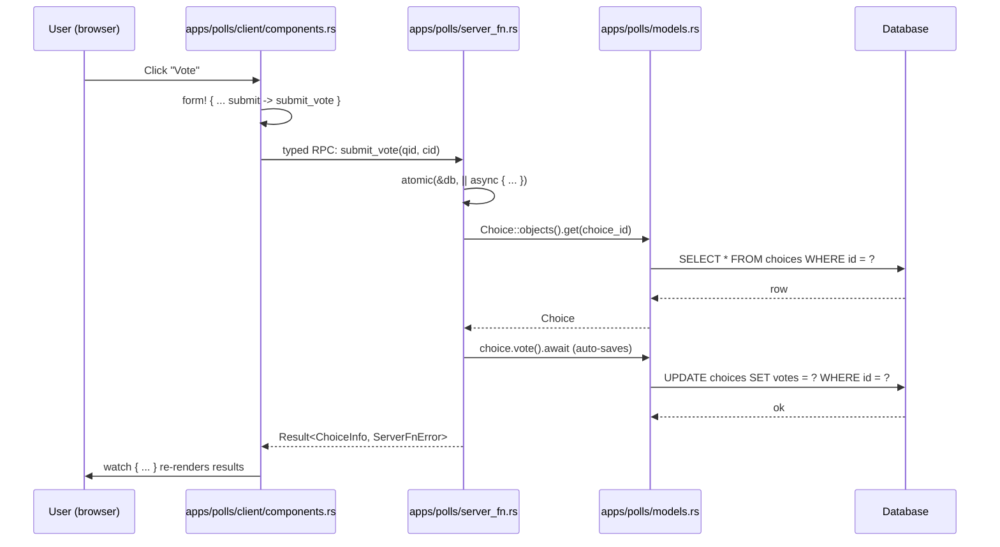

+++
title = "Part 3: Server Functions and URLs"
weight = 30

[extra]
sidebar_weight = 30
+++

# Part 3: Server Functions and URLs

By the end of this chapter your project will behave like a real polling
application: typed RPC calls from the WASM client, per-app routing
tables, a per-app SPA router, and a launcher that mounts every page on
`#root`. The structure follows the generated pages template and the
reference implementation in
[`examples/examples-tutorial-basis/`](https://github.com/kent8192/reinhardt-web/tree/main/examples/examples-tutorial-basis).

The "views" layer in the pages architecture is the typed server-function
surface. The WASM client calls these handlers through generated stubs,
and the server registers the same handlers as server-side routes:

1. **Server functions** (`src/apps/<app>/server_fn.rs`) — typed RPC the WASM
   client calls as if it were a local `async fn`. Every reactive component
   built in Part 4 calls one of these.
2. **Per-app URL modules** (`src/apps/<app>/urls/`) — explicit homes for
   server and client route tables. The server-side `server_urls.rs` files
   register each app's `#[server_fn]` markers, while the client-side
   `client_router.rs` files register page routes and reverse helpers.

Both halves live next to the models they touch and share the same
authentication gate. We introduce them in that order.

## Recap: `#[cfg(client)]`, `#[cfg(server)]`, and Cargo target cfg

Part 1 added the custom cfg aliases that gate generated files. They come
from the project's `build.rs`, which uses
[`cfg_aliases`](https://docs.rs/cfg_aliases) to register the names:

```rust
// File: build.rs
use cfg_aliases::cfg_aliases;

fn main() {
	// Rust 2024 edition requires explicit check-cfg declarations
	println!("cargo::rustc-check-cfg=cfg(client)");
	println!("cargo::rustc-check-cfg=cfg(server)");
	println!("cargo::rustc-check-cfg=cfg(wasm)");
	println!("cargo::rustc-check-cfg=cfg(native)");

	cfg_aliases! {
		// Platform aliases for simpler conditional compilation
		// Use `#[cfg(client)]` instead of `#[cfg(target_arch = "wasm32")]`
		client: { target_arch = "wasm32" },
		// Use `#[cfg(server)]` instead of `#[cfg(not(target_arch = "wasm32"))]`
		server: { not(target_arch = "wasm32") },
		// Compatibility aliases used by framework macro expansions.
		wasm: { target_arch = "wasm32" },
		native: { not(target_arch = "wasm32") },
	}
}
```

Two important consequences carry through the entire chapter:

- **In generated Rust source**, use `#[cfg(client)]` for browser-only
  items and `#[cfg(server)]` for server-only items. The `wasm` and
  `native` aliases stay available for framework macro expansions and
  compatibility with older generated or example code.
- **In `Cargo.toml`**, the two `[target.'cfg(...)'.dependencies]` headers
  must use raw target cfgs because Cargo evaluates them before `build.rs`
  runs. The generated pages template uses `target_arch = "wasm32"`:

```toml
# File: Cargo.toml
# Browser/WASM-specific dependencies
[target.'cfg(target_arch = "wasm32")'.dependencies]
reinhardt = {
	version = "...",
	package = "reinhardt-web",
	default-features = false,
	features = ["pages", "client-router"],
}
wasm-bindgen = "=0.2.122"
web-sys = { version = "0.3", features = [
	"Window",
	"Document",
	"Element",
	"HtmlInputElement",
	"HtmlFormElement",
	"Event",
	"EventTarget",
	"Location",
	"History",
] }
js-sys = "0.3"
console_error_panic_hook = "0.1"
wasm-bindgen-futures = "0.4"

# Server-specific dependencies
[target.'cfg(not(target_arch = "wasm32"))'.dependencies]
reinhardt = {
	version = "...",
	package = "reinhardt-web",
	default-features = false,
	features = [
		"standard",
		"pages",
		"admin",
		"conf",
		"commands",
		"db-sqlite",
		"forms",
		"auth-session",
		"argon2-hasher",
	],
}
clap = { version = "4", features = ["derive"] }
console = "0.16.1"
tokio = { version = "1", features = ["full"] }
```

The `[lib] crate-type = ["cdylib", "rlib"]` declaration (already added in
Part 1) is what allows the same crate to produce both a server-side `rlib`
and a browser-side `cdylib`.

## The Two Parallel Routing Layers

Before we touch any code, here is the picture of one user interaction. The
WASM client never constructs URLs or parses JSON by hand — it calls a
function. The function happens to run on the server.



The typed-RPC path is deliberately the single dynamic data path in the
basis example. If you need classic JSON endpoints for a non-WASM client,
use the REST tutorial instead; mixing both styles in this introductory
pages tutorial made the example harder to reason about and drifted from
the current crate.

The client route table still gets wired into the framework through a
per-app `urls/` directory module. We unpack that next.

## The `urls/` Directory Module

Each app exposes routing through a small directory whose layout is fixed
by the framework. For `polls` it looks like this:

```text
# Project tree: 3-views-and-urls
src/apps/polls/
├── urls.rs                       app-level router functions
└── urls/
    ├── server_urls.rs            ServerRouter with server_fn markers
    └── client_router.rs          ClientRouter
```

The aggregator `apps/polls/urls.rs` is tiny. It gates the submodules on
the right target and exposes app-level functions that the project router
can aggregate without importing individual server functions:

```rust
// File: src/apps/polls/urls.rs
//! URL configuration for the polls application.
//!
//! - `server_url_patterns()` — server-side app router.
//! - `client_url_patterns()` — client-side app router.

#[cfg(server)]
pub mod server_urls;

#[cfg(client)]
pub mod client_router;

#[cfg(server)]
pub fn server_url_patterns() -> reinhardt::ServerRouter {
	server_urls::server_url_patterns()
}

#[cfg(client)]
pub fn client_url_patterns() -> reinhardt::ClientRouter {
	client_router::client_url_patterns()
}
```

Three rules govern every file under `urls/`:

1. **The module names are stable.** `server_urls` compiles only on the
   server, `client_router` compiles only on the client, and the parent
   `urls.rs` exists on both targets.
2. **Client paths are declared next to the app UI.** The polls client
   router imports page factories from `src/client/pages.rs`, and those
   factories call the app-local components in
   `src/apps/polls/client/components.rs`.
3. **Project-level aggregation happens in `src/config/urls.rs`.** It calls
   each app's `urls::server_url_patterns()` and `urls::client_url_patterns()`
   functions, without importing individual `#[server_fn]` handlers.

The same shape repeats for the `users` app. Its server-side router owns
the authentication server-function registrations:

```rust
// File: src/apps/users/urls/server_urls.rs
//! Server-side URL patterns for the users application.
//!
//! Authentication is exposed via `#[server_fn]` handlers. Register them
//! here so the users app owns its server surface.

use crate::apps::users::server_fn::{current_user, login, logout, register};
use reinhardt::ServerRouter;
use reinhardt::pages::server_fn::ServerFnRouterExt;

pub fn server_url_patterns() -> ServerRouter {
	ServerRouter::new()
		.server_fn(login::marker)
		.server_fn(logout::marker)
		.server_fn(register::marker)
		.server_fn(current_user::marker)
}
```

With the scaffolding in place, we can fill in the actual handlers.

## Writing `#[server_fn]`s

Server functions live in `src/apps/<app>/server_fn.rs`. The `#[server_fn]`
attribute comes from `reinhardt::pages::server_fn::server_fn`. Every
function in this section follows the same five conventions:

- It is an `async fn` returning `std::result::Result<T, ServerFnError>`.
  The fully-qualified `Result` keeps the macro from getting confused with
  `anyhow::Result` if it is in scope.
- Parameters marked `#[inject]` are resolved by the DI container before
  the body runs. Common injections are `reinhardt::DatabaseConnection`,
  `SessionData`, `Depends<SessionStore>`, and project-local services like
  `Depends<AuthUserManager>`.
- The body is server-only — the macro generates a typed client stub for
  the WASM side so callers only see the signature.
- DTOs at the boundary come from `src/shared/types.rs`, so renaming a
  field there fails to compile on both sides simultaneously.
- For mutations called from `form!`, form fields still arrive as
  `String` values today. CSRF is handled by the generated `#[server_fn]`
  client stub through the `X-CSRFToken` header and verified by
  middleware before the handler runs; it is not part of the business
  function signature.

### The polls read functions

Start with the three read endpoints. Each one talks to the ORM and
returns a serialisable DTO. The `_db: reinhardt::DatabaseConnection`
parameter is injected purely to make sure the DI container has wired
the database up before the handler runs — the actual queries go through
`Model::objects()`.

```rust
// File: src/apps/polls/server_fn.rs
//! Poll server functions
//!
//! These functions provide the server-side API for the polling application.

use crate::shared::types::{ChoiceInfo, QuestionInfo};
use reinhardt::pages::server_fn::{ServerFnError, server_fn};

// Server-only imports. Each addition here MUST also be wired in `[cfg(server)]`
// at the call site — see the per-handler `use` blocks below for examples.
#[cfg(server)]
use {
	crate::apps::users::models::User,
	reinhardt::Model,
	reinhardt::di::{Depends, injectable_factory},
	reinhardt::middleware::session::{SessionData, USER_ID_SESSION_KEY},
};

// WASM-only imports
// (None needed - all forms logic is server-side)

/// Get all questions (latest 5)
#[server_fn]
pub async fn get_questions(
	#[inject] _db: reinhardt::DatabaseConnection,
) -> std::result::Result<Vec<QuestionInfo>, ServerFnError> {
	use crate::apps::polls::models::Question;
	use reinhardt::Model;

	let manager = Question::objects();
	let questions = manager
		.all()
		.all()
		.await
		.map_err(|e| ServerFnError::application(e.to_string()))?;

	let latest: Vec<QuestionInfo> = questions
		.into_iter()
		.take(5)
		.map(QuestionInfo::from)
		.collect();

	Ok(latest)
}
```

`get_question_detail` extends the same pattern to filtered queries via
`Choice::field_question_id()` — the typed field accessor that the
`#[model]` macro generated for you in Part 2:

```rust
// File: src/apps/polls/server_fn.rs
/// Get question detail with choices
#[server_fn]
pub async fn get_question_detail(
	question_id: i64,
	#[inject] _db: reinhardt::DatabaseConnection,
) -> std::result::Result<(QuestionInfo, Vec<ChoiceInfo>), ServerFnError> {
	use crate::apps::polls::models::{Choice, Question};
	use reinhardt::Model;

	let question_manager = Question::objects();
	let question = question_manager
		.get(question_id)
		.first()
		.await
		.map_err(|e| ServerFnError::application(e.to_string()))?
		.ok_or_else(|| ServerFnError::server(404, "Question not found"))?;

	let choice_manager = Choice::objects();
	let choices = choice_manager
		.filter(Choice::field_question_id().eq(question_id))
		.all()
		.await
		.map_err(|e| ServerFnError::application(e.to_string()))?;

	let question_info = QuestionInfo::from(question);
	let choice_infos: Vec<ChoiceInfo> = choices.into_iter().map(ChoiceInfo::from).collect();

	Ok((question_info, choice_infos))
}
```

`get_question_results` adds an aggregate computed on the server so the
client only has to render numbers:

```rust
// File: src/apps/polls/server_fn.rs
/// Get question results
///
/// Returns the question and all its choices with vote counts.
#[server_fn]
pub async fn get_question_results(
	question_id: i64,
	#[inject] _db: reinhardt::DatabaseConnection,
) -> std::result::Result<(QuestionInfo, Vec<ChoiceInfo>, i32), ServerFnError> {
	use crate::apps::polls::models::{Choice, Question};
	use reinhardt::Model;

	let question_manager = Question::objects();
	let question = question_manager
		.get(question_id)
		.first()
		.await
		.map_err(|e| ServerFnError::application(e.to_string()))?
		.ok_or_else(|| ServerFnError::server(404, "Question not found"))?;

	let choice_manager = Choice::objects();
	let choices = choice_manager
		.filter(Choice::field_question_id().eq(question_id))
		.all()
		.await
		.map_err(|e| ServerFnError::application(e.to_string()))?;

	let total_votes: i32 = choices.iter().map(|c| c.votes()).sum();

	let question_info = QuestionInfo::from(question);
	let choice_infos: Vec<ChoiceInfo> = choices.into_iter().map(ChoiceInfo::from).collect();

	Ok((question_info, choice_infos, total_votes))
}
```

### The vote function and `atomic`

Voting is a read-modify-write: read the `Choice`, increment its counter,
write the row back. Two simultaneous voters can race here — both reading
the same row before either has written — so the body runs inside
`atomic(&db, || async { … })`, which opens a transaction and rolls back
if the closure returns `Err`.

```rust
// File: src/apps/polls/server_fn.rs
/// Vote for a choice
///
/// Increments the vote count for the selected choice.
#[server_fn]
pub async fn vote(
	request: VoteRequest,
	#[inject] db: reinhardt::DatabaseConnection,
) -> std::result::Result<ChoiceInfo, ServerFnError> {
	vote_internal(request, db).await
}

/// Internal vote implementation (shared between vote and submit_vote)
#[cfg(server)]
async fn vote_internal(
	request: VoteRequest,
	db: reinhardt::DatabaseConnection,
) -> std::result::Result<ChoiceInfo, ServerFnError> {
	use crate::apps::polls::models::Choice;
	use reinhardt::Model;
	use reinhardt::atomic;

	// Wrap read-modify-write in a transaction to prevent race conditions
	let updated_choice = atomic(&db, || async {
		let choice_manager = Choice::objects();

		let mut choice = choice_manager
			.get(request.choice_id)
			.first()
			.await
			.map_err(|e| anyhow::anyhow!(e.to_string()))?
			.ok_or_else(|| anyhow::anyhow!("Choice not found"))?;

		if *choice.question_id() != request.question_id {
			return Err(anyhow::anyhow!("Choice does not belong to this question"));
		}

		// `Choice::vote()` is `async fn` and calls `self.save().await`
		// internally, so the increment AND the row-level UPDATE happen in
		// one call. No separate `choice_manager.update(&choice).await?`
		// step is needed.
		choice.vote().await
			.map_err(|e| anyhow::anyhow!(e.to_string()))?;

		Ok(choice)
	})
	.await
	.map_err(|e| ServerFnError::application(e.to_string()))?;

	Ok(ChoiceInfo::from(updated_choice))
}
```

### `submit_vote`: the `form!` adapter

The WASM client built in Part 4 will use the `form!` macro to render the
voting form. `form!` now preserves typed field values, so the hidden
`question_id` and selected `choice_id` reach `submit_vote` as `i64`
arguments. `submit_vote` is still a thin adapter, but it no longer has to
parse strings before reusing `vote_internal`.

```rust
// File: src/apps/polls/server_fn.rs
/// Submit vote via form! macro
///
/// Wrapper function that accepts individual typed field values from form!'s
/// submit path and calls the underlying vote function.
///
/// CSRF is supplied by the `#[server_fn]` client stub through `X-CSRFToken`
/// and verified by middleware before this handler runs.
#[server_fn]
pub async fn submit_vote(
	question_id: i64,
	choice_id: i64,
	#[inject] db: reinhardt::DatabaseConnection,
) -> std::result::Result<ChoiceInfo, ServerFnError> {
	let request = VoteRequest {
		question_id,
		choice_id,
	};

	vote_internal(request, db).await
}
```

The same typed-field contract applies to the CUD handlers below:
`HiddenField<i64>` reaches the server function as `i64`, while text
inputs stay `String`. There is no longer a separate "ideal implementation"
comment because the typed signature is the implementation.

### `SessionError`: the DI-resolved 401/403/500 gate

Every authenticated mutation needs the same three steps: pull `user_id`
out of the session, look up the row, check `is_active`. Putting that
inline at the top of every handler would be noisy and easy to skip, so
the project pushes the "load user_id from session, look up the row,
classify as `Ok(user)` / `Anonymous` / `Inactive` / `Unavailable`"
pipeline into a request-scoped **DI factory** in `apps::polls::server_fn`. The
factory returns `Result<User, SessionError>`, so each authenticated
handler receives `Depends<Result<User, SessionError>>` from the DI
container and calls `(*session_user).as_ref().map_err(ServerFnError::from)?`
to surface the 401/403/500:

```rust
// File: src/apps/polls/server_fn.rs (excerpt)
//
// The factory is registered with `#[injectable_factory(scope = "request")]`
// so each request resolves its own `Result<User, SessionError>` once. The
// classification closes over `SessionData` (cookie-loaded) and looks the
// row up through the ORM, returning one of:
//
//   - Ok(user)                       — row exists and `is_active`
//   - Err(SessionError::Anonymous)   — no `user_id` in session, or the row
//                                      no longer exists (surfaces 401)
//   - Err(SessionError::Inactive)    — row exists but `is_active == false`
//                                      (surfaces 403)
//   - Err(SessionError::Unavailable) — DB lookup query failed (surfaces
//                                      500, distinct from "no user" so an
//                                      outage is not rewritten into a fake
//                                      401)
//
// `From<&SessionError> for ServerFnError` maps each variant to the right
// HTTP status, and handlers convert via
// `(*session_user).as_ref().map_err(ServerFnError::from)?`.
pub enum SessionError {
	Anonymous,
	Inactive,
	Unavailable(String),
}

impl From<&SessionError> for ServerFnError {
	fn from(err: &SessionError) -> Self {
		match err {
			SessionError::Anonymous => ServerFnError::server(401, "Authentication required"),
			SessionError::Inactive => ServerFnError::server(403, "User account is inactive"),
			SessionError::Unavailable(_) => {
				ServerFnError::server(500, "User lookup temporarily unavailable")
			}
		}
	}
}
```

The three variants keep the "DB outage" branch (`Unavailable`) separate
from "user is anonymous" (`Anonymous`) so an availability problem cannot
be silently rewritten into a fake 401: `Unavailable` surfaces a **500**
while a missing/deleted user surfaces a **401**.

`create_question`, `update_question`, `delete_question`, `create_choice`,
`update_choice`, and `delete_choice` all start with the same two lines:
`#[inject] session_user: Depends<Result<User, SessionError>>` in the
signature, `let user = (*session_user).as_ref().map_err(ServerFnError::from)?;`
as the first statement. The Question CUD handlers additionally enforce
that the caller authored the row:

```rust
// File: src/apps/polls/server_fn.rs
/// Update a question's text. Only the author may update.
#[server_fn]
pub async fn update_question(
	question_id: i64,
	question_text: String,
	#[inject] _db: reinhardt::DatabaseConnection,
	#[inject] session_user: Depends<Result<User, SessionError>>,
) -> std::result::Result<QuestionInfo, ServerFnError> {
	use crate::apps::polls::models::Question;

	let user = (*session_user).as_ref().map_err(ServerFnError::from)?;

	let trimmed = question_text.trim();
	if trimmed.is_empty() || trimmed.len() > 200 {
		return Err(ServerFnError::server(
			400,
			"Question text must be between 1 and 200 characters",
		));
	}

	let manager = Question::objects();
	let mut question = manager
		.get(question_id)
		.first()
		.await
		.map_err(|e| ServerFnError::application(format!("Database error: {}", e)))?
		.ok_or_else(|| ServerFnError::server(404, "Question not found"))?;

	if *question.author_id() != user.id() {
		return Err(ServerFnError::server(
			403,
			"Only the question's author can edit it",
		));
	}

	question.question_text = trimmed.to_string();

	let updated = manager
		.update(&question)
		.await
		.map_err(|e| ServerFnError::application(format!("Database error: {}", e)))?;

	Ok(QuestionInfo::from(updated))
}
```

The Choice CUD handlers add a second private helper,
`require_question_author`, which loads the parent `Question` and verifies
ownership before touching the `Choice`. That keeps the 401/403/404
matrix in one place and makes each handler body very small.

## Authentication Server Functions (`apps/users/server_fn.rs`)

The `users` app's server functions follow the same conventions but talk
to `SessionData` and `Depends<SessionStore>` instead of business models.
They are the only server-side handlers in the project that read
passwords, so they're the right place to introduce the session-cookie
machinery.

The imports illustrate which pieces come from where: `SessionAuthExt`
provides the `login` / `logout` methods on `SessionData`,
`USER_ID_SESSION_KEY` is the canonical key under which the user id is
stored, and `BaseUserManager::create_user` does the password-hashing
work.

```rust
// File: src/apps/users/server_fn.rs
use crate::shared::types::UserInfo;
#[cfg(server)]
use crate::shared::types::{LoginRequest, RegisterRequest};
use reinhardt::pages::server_fn::{ServerFnError, server_fn};

#[cfg(server)]
use {
	crate::apps::users::models::{AuthUserManager, User},
	reinhardt::BaseUser,
	reinhardt::DatabaseConnection,
	reinhardt::Validate,
	reinhardt::Model,
	reinhardt::di::Depends,
	reinhardt::middleware::session::{
		SessionAuthExt, SessionData, SessionStore, USER_ID_SESSION_KEY,
	},
	reinhardt::reinhardt_auth::BaseUserManager,
	std::collections::HashMap,
};
```

`login` validates the request (Reinhardt re-exports the `Validate` derive
from the `validator` crate for the server build), looks up the
user, checks the password through `BaseUser::check_password`, then calls
`SessionAuthExt::login` to rotate the session id (fixation prevention)
and persist `user_id`:

```rust
// File: src/apps/users/server_fn.rs
/// Authenticate a user by username/password and persist the session.
///
/// CSRF is supplied by the `#[server_fn]` client stub through `X-CSRFToken`
/// and verified by middleware before this handler runs.
#[server_fn]
pub async fn login(
	username: String,
	password: String,
	#[inject] _db: DatabaseConnection,
	#[inject] session: SessionData,
	#[inject] store: Depends<SessionStore>,
) -> std::result::Result<UserInfo, ServerFnError> {
	let mut session = session;

	let request = LoginRequest { username, password };

	// Run the field-level validators declared on `LoginRequest` before
	// touching the database — empty/oversized credentials should reject
	// at the request boundary rather than slip through to the password
	// comparison below.
	request
		.validate()
		.map_err(|e| ServerFnError::application(format!("Validation failed: {}", e)))?;

	let manager = User::objects();
	let user = manager
		.filter(User::field_username().eq(request.username.trim().to_string()))
		.first()
		.await
		.map_err(|e| ServerFnError::application(format!("Database error: {}", e)))?
		.ok_or_else(|| ServerFnError::server(401, "Invalid credentials"))?;

	let valid = user
		.check_password(&request.password)
		.map_err(|e| ServerFnError::application(format!("Password check failed: {}", e)))?;

	if !valid {
		return Err(ServerFnError::server(401, "Invalid credentials"));
	}

	if !user.is_active() {
		return Err(ServerFnError::server(403, "User account is inactive"));
	}

	// Session fixation prevention: `SessionAuthExt::login` rotates the session
	// ID, writes the authenticated user's primary key under
	// `USER_ID_SESSION_KEY`, deletes the old store entry, and persists the
	// rotated session in one step. See issue #4446.
	session
		.login(&store, user.id())
		.map_err(|e| ServerFnError::application(format!("Session error: {}", e)))?;

	Ok(UserInfo::from(user))
}
```

`register` follows the same shape and delegates to the project-local
`AuthUserManager` introduced in Part 2:

```rust
// File: src/apps/users/server_fn.rs
#[server_fn]
pub async fn register(
	username: String,
	password: String,
	password_confirmation: String,
	#[inject] user_manager: Depends<AuthUserManager>,
	#[inject] session: SessionData,
	#[inject] store: Depends<SessionStore>,
) -> std::result::Result<UserInfo, ServerFnError> {
	let mut session = session;

	let request = RegisterRequest {
		username,
		password,
		password_confirmation,
	};

	request
		.validate()
		.map_err(|e| ServerFnError::application(format!("Validation failed: {}", e)))?;

	// Password confirmation lives outside the derived `Validate` —
	// see the `validate_passwords_match` rationale on `RegisterRequest`.
	request
		.validate_passwords_match()
		.map_err(ServerFnError::application)?;

	// `BaseUserManager::create_user` takes `&mut self`, but DI hands us a
	// shared `Depends<AuthUserManager>` (an `Arc` under the hood). Clone the
	// inner manager — its only field is another `Depends<DatabaseConnection>`,
	// which is itself an `Arc` clone — so this is cheap and gives us the
	// `&mut` access the trait method needs.
	let mut user_manager: AuthUserManager = (*user_manager).clone();
	let saved = user_manager
		.create_user(
			request.username.trim(),
			Some(&request.password),
			HashMap::new(),
		)
		.await
		.map_err(|e| ServerFnError::application(e.to_string()))?;

	session
		.login(&store, saved.id())
		.map_err(|e| ServerFnError::application(format!("Session error: {}", e)))?;

	Ok(UserInfo::from(saved))
}
```

Two details in `login` and `register` are worth pausing on:

- **Manual validation instead of `pre_validate`.** Both functions call
  `request.validate()` by hand rather than using
  `#[server_fn(pre_validate = true)]`. That flag only triggers when each
  parameter is an extractor whose inner DTO derives `Validate` (e.g.,
  `body: Json<RegisterRequest>`). Because `form!` sends each form field
  as an individual `String`, the macro-generated synthetic `Args` struct
  only derives `Deserialize`; nothing on the auto-path knows about the
  field-level `#[validate(...)]` attributes on `RegisterRequest`.
  Building the DTO by hand and validating it recovers the same
  guarantees without giving up `form!` ergonomics.
- **`validate_passwords_match` is a manual helper.** The `validator`
  crate's `must_match` rule has been brittle across versions, so the
  password confirmation check lives in a regular method on
  `RegisterRequest` rather than the derived `Validate`. It runs after
  the field-level validators so a too-short password does not silently
  match a too-short confirmation.

`logout` and `current_user` round out the file. `logout` refuses to act
on an unauthenticated session and then defers to `SessionAuthExt::logout`
for the actual rotation:

```rust
// File: src/apps/users/server_fn.rs
#[server_fn]
pub async fn logout(
	#[inject] session: SessionData,
	#[inject] store: Depends<SessionStore>,
) -> std::result::Result<(), ServerFnError> {
	let mut session = session;

	if session.get::<i64>(USER_ID_SESSION_KEY).is_none() {
		return Err(ServerFnError::server(401, "Not authenticated"));
	}

	session.logout(&store);
	Ok(())
}

#[server_fn]
pub async fn current_user(
	#[inject] _db: DatabaseConnection,
	#[inject] session: SessionData,
) -> std::result::Result<Option<UserInfo>, ServerFnError> {
	let user_id = match session.get::<i64>(USER_ID_SESSION_KEY) {
		Some(id) => id,
		None => return Ok(None),
	};

	let user = User::objects()
		.filter(User::field_id().eq(user_id))
		.first()
		.await
		.map_err(|e| ServerFnError::application(format!("Database error: {}", e)))?;

	Ok(user.map(UserInfo::from))
}
```

That's the entire authentication surface. The nav bar built in Part 4
calls `current_user()` to decide whether to show "Sign in" or
"Sign out".

## App Server Routers (`urls/server_urls.rs`)

The basis example does not expose classic `#[get]` / `#[post]` JSON views
from the polls app anymore. Every dynamic data path is a typed
`#[server_fn]`, and each app registers its own markers in
`urls/server_urls.rs`. The polls server router is therefore the app-local
server surface:

```rust
// File: src/apps/polls/urls/server_urls.rs
//! Server-side URL configuration for the polls application.
//!
//! The polls app exposes its dynamic data path through `#[server_fn]`
//! handlers. Register them here so the per-app server surface lives next
//! to the app's models, client router, and handler bodies.

use crate::apps::polls::server_fn::{
	create_choice, create_question, delete_choice, delete_question, get_question_detail,
	get_question_results, get_questions, submit_vote, update_choice, update_question, vote,
};
use reinhardt::ServerRouter;
use reinhardt::pages::server_fn::ServerFnRouterExt;

pub fn server_url_patterns() -> ServerRouter {
	ServerRouter::new()
		.server_fn(get_questions::marker)
		.server_fn(get_question_detail::marker)
		.server_fn(get_question_results::marker)
		.server_fn(vote::marker)
		.server_fn(submit_vote::marker)
		.server_fn(create_question::marker)
		.server_fn(update_question::marker)
		.server_fn(delete_question::marker)
		.server_fn(create_choice::marker)
		.server_fn(update_choice::marker)
		.server_fn(delete_choice::marker)
}
```

The `users` router follows the same pattern for `login`, `register`,
`logout`, and `current_user`. That keeps server ownership local to the
app. `src/config/urls.rs` no longer imports every server function in the
project; it only mounts app routers.

## Registering Everything in `src/config/urls.rs`

The project-level `routes()` function plays three roles:

1. Mounts every app's server-side `server_url_patterns()` router. Those
   app routers own the `#[server_fn]` marker registrations. On the client, it
   aggregates every app's `client_url_patterns()` so the SPA launcher can
   collect the full route table.
2. On the server, mounts the admin panel at `/admin/` (and its static
   assets at `/static/admin/`) using `admin_routes_with_di`, which also
   wires the `AdminDatabase` DI registration.
3. On the server, applies the `SessionMiddleware` with a two-week TTL, `Lax`
   SameSite, `httpOnly`, and path `/`.

The attribute is plain `#[routes]`. The function body still compiles on
both targets: the server branch mounts app server routers, admin, and
session middleware, while the client branch aggregates each app's client
router so `ClientLauncher::register_routes_from_inventory()` has a
complete SPA route table.

```rust
// File: src/config/urls.rs
//! URL configuration for examples-tutorial-basis project
//!
//! The `routes` function defines the top-level project router.
//!
//! Middleware stack (server-only):
//! 1. `SessionMiddleware` — cookie-based session management used by the
//!    `users` app's login/logout server functions

use reinhardt::UnifiedRouter;
#[cfg(server)]
use reinhardt::admin::{admin_routes_with_di, admin_static_routes};
use reinhardt::routes;

#[cfg(server)]
use crate::config::admin::configure_admin;

#[cfg(server)]
use reinhardt::middleware::session::{SessionConfig, SessionMiddleware};
#[cfg(server)]
use std::time::Duration;

/// Build the session middleware with a two-week TTL and Lax SameSite.
///
/// Uses the production-oriented defaults shared by the tutorial examples.
#[cfg(server)]
fn create_session_middleware() -> SessionMiddleware {
	let config = SessionConfig::new("sessionid".to_string(), Duration::from_secs(1_209_600))
		.with_http_only(true)
		.with_same_site("Lax".to_string())
		.with_path("/".to_string());
	SessionMiddleware::new(config)
}

/// Build the top-level project router.
///
/// The `#[routes]` macro registers this function for automatic discovery
/// via `inventory::submit!(UrlPatternsRegistration)` and emits a linker
/// marker to enforce single-usage.
///
/// This function aggregates the app-level server routers, the app-level
/// client routers, the admin panel, and the session middleware.
#[routes]
pub fn routes() -> UnifiedRouter {
	let router = UnifiedRouter::new();

	// Each app owns its server-function marker registration in its own
	// `urls` module. The project router only aggregates app routers.
	#[cfg(server)]
	let router = router.server(|s| {
		s.mount("/", crate::apps::polls::urls::server_url_patterns())
			.mount("/", crate::apps::users::urls::server_url_patterns())
	});

	// Aggregate every app's client routes on the client so the SPA route table
	// carries every app's client-side URL patterns.
	//
	// Each `client_url_patterns()` already namespaces its routes
	// (`polls:` / `users:`). We compose them by wrapping each in a single-purpose
	// `UnifiedRouter` and stitching with `mount_unified`, which uses
	// `ClientRouter::merge` internally.
	//
	// The aggregation is `#[cfg(client)]` because the per-app `client_router`
	// submodules are themselves client-only (they import `crate::client::pages::*`,
	// which is client-only).
	#[cfg(client)]
	let router = router
		.mount_unified(
			"/",
			UnifiedRouter::new().client(|_| crate::apps::polls::urls::client_url_patterns()),
		)
		.mount_unified(
			"/",
			UnifiedRouter::new().client(|_| crate::apps::users::urls::client_url_patterns()),
		);

	// Mount the auto-generated admin panel at /admin/ (server-only).
	// `admin_routes_with_di` returns both the router and a DI registration
	// list that lazily provides `AdminDatabase` to admin handlers from the
	// project's `DatabaseConnection`.
	#[cfg(server)]
	let router = {
		let admin_site = std::sync::Arc::new(configure_admin());
		let (admin_router, admin_di) = admin_routes_with_di(admin_site);
		router
			.mount("/admin/", admin_router)
			.mount("/static/admin/", admin_static_routes())
			.with_di_registrations(admin_di)
	};

	// `SessionMiddleware` auto-registers its `SessionStore` as a DI singleton
	// via `Middleware::di_registrations` (keyed by `TypeId::of::<SessionStore>()`
	// post-#4437), so server functions that
	// `#[inject] session: SessionData` (or `#[inject] store: Depends<SessionStore>`)
	// can resolve the same store the middleware writes to without a parallel
	// `with_di_registrations(...)` call. See #4426 (and the original #4423
	// regression that motivated the auto-registration hook).
	#[cfg(server)]
	let router = router.with_middleware(create_session_middleware());

	router
}
```

Three registration conventions are worth memorising:

- Each server function exposes a unit-struct `marker` (e.g.,
  `submit_vote::marker`) that the macro generates. The app-local
  `urls/server_urls.rs::server_url_patterns()` function passes those markers into
  `ServerFnRouterExt::server_fn`.
- The import list is in snake_case and refers to the function names, not
  to a separate type — `use ... submit_vote;` then `submit_vote::marker`.
- `src/apps/<app>/urls.rs` exposes `server_url_patterns()` and
  `client_url_patterns()`; `src/config/urls.rs` aggregates those app-level
  functions rather than importing every server function from every app.
- The client-side aggregation lives in the `routes()` body itself, not in
  `client/lib.rs`. Every per-app `client_url_patterns()` it stitches in
  becomes part of the SPA route table that
  `ClientLauncher::register_routes_from_inventory()` consumes.

## Client Routing in `urls/client_router.rs`

The client-side router maps URLs to **page factories** that return
`Page` values. The factories live in `src/client/pages.rs`; the router
just plumbs them in. Each route is registered with a stable name, and
the app-local `reverse(name, params)` helper resolves concrete paths
from that same route table.

```rust
// File: src/client/pages.rs
//! Client-side routing for the polls SPA.
//!
//! The router applies the `polls` namespace to every named route.
//! Each route is registered with a stable name so that page components
//! can resolve URLs through the URL reverser instead of formatting
//! path strings inline.

use crate::client::pages::{
	choice_delete_page, choice_edit_page, choice_new_page, index_page, polls_detail_page,
	polls_results_page, question_delete_page, question_edit_page, question_new_page,
};
use reinhardt::ClientPath;
use reinhardt::ClientRouter;
use reinhardt::pages::component::Page;
use reinhardt::pages::page;

pub fn client_url_patterns() -> ClientRouter {
	ClientRouter::new()
		.route("index", "/", index_page)
		.route("question_new", "/polls/new/", question_new_page)
		.route_path(
			"choice_new",
			"/polls/{question_id}/choices/new/",
			|ClientPath(question_id): ClientPath<i64>| choice_new_page(question_id),
		)
		.route_path(
			"choice_edit",
			"/polls/{question_id}/choices/{choice_id}/edit/",
			|ClientPath(question_id): ClientPath<i64>, ClientPath(choice_id): ClientPath<i64>| {
				choice_edit_page(question_id, choice_id)
			},
		)
		.route_path(
			"choice_delete",
			"/polls/{question_id}/choices/{choice_id}/delete/",
			|ClientPath(question_id): ClientPath<i64>, ClientPath(choice_id): ClientPath<i64>| {
				choice_delete_page(question_id, choice_id)
			},
		)
		.route_path(
			"detail",
			"/polls/{question_id}/",
			|ClientPath(question_id): ClientPath<i64>| polls_detail_page(question_id),
		)
		.route_path(
			"question_edit",
			"/polls/{question_id}/edit/",
			|ClientPath(question_id): ClientPath<i64>| question_edit_page(question_id),
		)
		.route_path(
			"question_delete",
			"/polls/{question_id}/delete/",
			|ClientPath(question_id): ClientPath<i64>| question_delete_page(question_id),
		)
		.route_path(
			"results",
			"/polls/{question_id}/results/",
			|ClientPath(question_id): ClientPath<i64>| polls_results_page(question_id),
		)
		.not_found(|| error_page("Page not found"))
}

pub fn reverse(name: &str, params: &[(&str, &str)]) -> String {
	client_url_patterns()
		.reverse(name, params)
		.unwrap_or_else(|error| panic!("failed to reverse polls client route `{name}`: {error}"))
}

/// Error page used as the `not_found` fallback.
fn error_page(message: &str) -> Page {
	let message = message.to_string();
	page!(|message: String| {
		div {
			class: "layout-page",
			div {
				class: "alert-danger mb-4",
				{ message }
			}
			a {
				href: "/",
				class: "btn-primary",
				"Back to Home"
			}
		}
	})(message)
}
```

`ClientRouter` exposes route registration helpers that you will use over
and over:

- **`route(name, path, page_factory)`** — for parameter-less
  routes. `page_factory` is a `Fn() -> Page`.
- **`route_path(name, path, page_factory)`** — for any number of
  typed path parameters from 1 to 8. The factory takes one
  `ClientPath<T>` per parameter, and the arity is inferred from the
  closure signature via the sealed `Handler<Args>` trait.

The app-local `reverse` helper is intentionally small. Components call
`polls_routes::reverse("detail", &[("question_id", id.as_str())])`
instead of hand-formatting paths or carrying a separate helper module
that can drift from the route table.

The `users` app follows the same pattern with only three parameter-less
routes: `login`, `logout`, and `signup`, all under the `users:` namespace.

Each app keeps reverse lookup next to its router. That keeps navigation
helpers app-local without duplicating the route definitions in a
separate `src/client/links.rs` file.

## Bootstrapping the SPA in `src/client/lib.rs`

With `src/config/urls.rs` aggregating every app's client router, the
WASM entry point collapses to three lines.
`ClientLauncher::register_routes_from_inventory()` pulls the registered
route table out of `inventory`, merges it into a single SPA router, and
mounts the result on `#root`:

```rust
// File: src/client/lib.rs
//! WASM SPA entry point.
//!
//! [`ClientLauncher::register_routes_from_inventory`] consumes the
//! `#[routes]`-registered router at launch time and installs the SPA
//! route table on `#root`.

use reinhardt::pages::ClientLauncher;
use wasm_bindgen::prelude::*;

#[cfg_attr(not(feature = "msw"), wasm_bindgen(start))]
pub fn main() -> Result<(), JsValue> {
	ClientLauncher::new("#root")
		.register_routes_from_inventory()
		.launch()
}
```

Two earlier design points are worth knowing about, because older
tutorials and snippets still reference them:

- Per Breaking Change
  [#4117](https://github.com/kent8192/reinhardt-web/issues/4117) the
  launcher wires the SPA through `Router::on_navigate` callbacks
  internally — the public API did not change.
- [reinhardt-web#4219](https://github.com/kent8192/reinhardt-web/issues/4219)
  deduplicated `client_router::history` into a single module, so no
  import path mentions a duplicate history submodule any more — the
  bare `reinhardt::pages::ClientLauncher` import shown above is the
  only routing import this file ever needs.
- Client routers are now discovered through `inventory` instead of being
  stitched together with a hand-written `build_spa_router()` helper.

If you read older Reinhardt code, you may see a longer `client/lib.rs`
with manual router assembly. That is the older shape; the body of
`routes()` in `src/config/urls.rs` now does the app-router aggregation.

## Page Factories in `src/client/pages.rs`

`pages.rs` is the bridge between the client router and the components
that Part 4 will define. Each factory wraps a body component (defined in
`src/apps/polls/client/components.rs` or
`src/apps/users/client/components.rs`) in `with_nav(...)` from
`client::components::nav`, so every routed page gets the same header
without each component re-implementing it.

```rust
// File: src/client/pages.rs
//! Page components
//!
//! This module re-exports page-level components for the polling application.
//! Each page function returns a View that can be rendered.
//!
//! The shared site navigation (`nav_bar`) is composed at this layer so every
//! routed page receives the same header without each component reimplementing
//! it. Body components in `apps::<app>::client::components` stay focused
//! on page-specific markup.

use reinhardt::pages::component::Page;

use crate::client::components::nav::with_nav;

/// Index page - List all polls
pub fn index_page() -> Page {
	with_nav(crate::apps::polls::client::components::polls_index())
}

/// Poll detail page - Show question and voting form
pub fn polls_detail_page(question_id: i64) -> Page {
	with_nav(crate::apps::polls::client::components::polls_detail(
		question_id,
	))
}

/// Poll results page - Show voting results
pub fn polls_results_page(question_id: i64) -> Page {
	with_nav(crate::apps::polls::client::components::polls_results(
		question_id,
	))
}

/// New question page - Create a new poll question
pub fn question_new_page() -> Page {
	with_nav(crate::apps::polls::client::components::question_new())
}

// ... question_edit_page, question_delete_page, choice_new_page,
//     choice_edit_page, choice_delete_page,
//     login_page, logout_page, signup_page.
```

Each `..._page()` factory has the same shape: take any path parameters
the route exposes, call the matching body component, and pass the
resulting `Page` to `with_nav`. We do not show the body components here —
those are the subject of Part 4, where you will see the `page!`,
`form!`, and `use_resource` machinery that actually renders the polls
index, the voting form, and the auth pages.

## The SPA Shell: `index.html`

The reference example serves the SPA from a single `index.html` at the
project root. It mounts the WASM bundle on `#root`, shows a loading
indicator while the bundle downloads, and configures UnoCSS at runtime
with the project's design tokens (brand colours, dark-mode surfaces,
layout primitives). The CDN URLs for `@unocss/reset` and
`@unocss/runtime` are pinned to a specific version *and* carry
`integrity` + `crossorigin` so a CDN compromise cannot silently inject
script. A small inline script in the `<head>` resolves
`prefers-color-scheme` + `localStorage` before the first paint to avoid
the flash-of-unstyled-content that would otherwise happen when the
WASM bundle later sets `data-theme`.

The file is not strictly part of the routing story but it is the
document that `ClientLauncher::new("#root")` mounts into, so it is
worth seeing once in full:

```html
<!-- File: index.html -->
<!DOCTYPE html>
<html lang="en">
<head>
	<meta charset="UTF-8">
	<meta name="viewport" content="width=device-width, initial-scale=1.0">
	<title>Polls App - Reinhardt Tutorial</title>
	<link rel="icon" type="image/png" href="/favicon.png">

	<!-- UnoCSS Reset (pinned + SRI) -->
	<link rel="stylesheet"
		href="https://cdn.jsdelivr.net/npm/@unocss/reset@66.7.0/tailwind.min.css"
		integrity="sha384-T4Gl/JcT72kX7H+XBooHT+j5VH/xPcLgHXROFmUj1HF77ctera3Pu1390b73is5o"
		crossorigin="anonymous">

	<!-- Hand-written base styles + fallback component CSS.
	     Listed before the blocking UnoCSS runtime script below so the
	     browser preloader can discover it as early as possible, giving
	     the first paint a fully-styled view even before UnoCSS runs. -->
	<link rel="stylesheet" href="/static/css/style.css">

	<!-- Theme detection (runs before render to avoid FOUC) -->
	<script>
	(function() {
		var stored = null;
		try {
			stored = localStorage.getItem('theme');
		} catch (e) {
			// localStorage may be unavailable (private mode, sandboxed iframe,
			// storage disabled by user). Fall back to OS preference below.
		}
		var prefersDark = window.matchMedia('(prefers-color-scheme: dark)').matches;
		var theme = stored || (prefersDark ? 'dark' : 'light');
		document.documentElement.setAttribute('data-theme', theme);
		if (theme === 'dark') {
			document.documentElement.classList.add('dark');
		}
	})();
	</script>

	<!-- UnoCSS Configuration -->
	<script>
	window.__unocss = {
		theme: {
			colors: {
				brand: {
					DEFAULT: '#4A90E2',
					hover: '#357ABD',
					light: '#E8F1FB',
				},
				surface: {
					primary: 'var(--bg-primary)',
					secondary: 'var(--bg-secondary)',
					tertiary: 'var(--bg-tertiary)',
				},
				content: {
					primary: 'var(--text-primary)',
					secondary: 'var(--text-secondary)',
					tertiary: 'var(--text-tertiary)',
				},
				success: '#10B981',
				danger: '#EF4444',
				warning: '#F59E0B',
				border: {
					DEFAULT: 'var(--border-color)',
					secondary: 'var(--border-secondary)',
				},
			},
		},
		shortcuts: [
			// Layout
			['layout-container', 'max-w-4xl mx-auto px-4'],
			['layout-page', 'layout-container mt-12'],

			// Button base
			['btn', 'inline-flex items-center justify-center gap-2 px-4 py-2 rounded-full font-semibold text-sm leading-5 border border-transparent cursor-pointer transition-colors disabled:opacity-50 disabled:cursor-not-allowed no-underline'],
			['btn-primary',   'btn bg-brand text-white hover:bg-brand-hover active:scale-97'],
			['btn-secondary', 'btn bg-surface-tertiary text-content-primary hover:bg-border-secondary'],
			['btn-outline',   'btn bg-transparent text-content-primary border-border-secondary hover:bg-surface-tertiary'],
			['btn-danger',    'btn bg-danger text-white hover:opacity-90 active:scale-97'],
			['btn-success',   'btn bg-success text-white hover:opacity-90 active:scale-97'],

			// Card
			['card',       'bg-surface-primary border border-border rounded-xl shadow-sm overflow-hidden'],
			['card-body',  'p-6'],
			['card-title', 'text-xl font-bold mb-4'],

			// Form
			['form-control', 'block w-full px-3.5 py-2.5 bg-surface-primary text-content-primary border border-border rounded-lg placeholder-content-tertiary focus:outline-none focus:border-brand focus:ring-3 focus:ring-brand-light transition-colors'],
			['form-check',   'flex items-center gap-3 p-3 mb-2 bg-surface-primary border border-border rounded-lg cursor-pointer hover:bg-surface-secondary hover:border-border-secondary transition-colors'],
			['form-label',   'block text-sm font-medium text-content-primary mb-1.5'],

			// Alerts
			['alert',         'px-4 py-3 rounded-lg border text-sm'],
			['alert-danger',  'alert bg-red-50 border-red-200 text-danger dark:bg-red-950/30 dark:border-red-900/50'],
			['alert-warning', 'alert bg-yellow-50 border-yellow-200 text-yellow-700 dark:bg-yellow-950/30 dark:border-yellow-900/50'],
			['alert-success', 'alert bg-green-50 border-green-200 text-success dark:bg-green-950/30 dark:border-green-900/50'],

			// Nav
			['nav-bar', 'layout-container pt-4 mb-6 flex justify-between items-center border-b border-border pb-3'],

			// Spinner
			['spinner', 'inline-block animate-spin rounded-full border-2 border-surface-tertiary border-t-brand'],

			// Misc text helpers
			['text-muted', 'text-content-secondary'],
		],
	};
	</script>

	<!-- UnoCSS Runtime (pinned + SRI) -->
	<script
		src="https://cdn.jsdelivr.net/npm/@unocss/runtime@66.7.0"
		integrity="sha384-N01yk5TWd3fjp79erm4HVUYQXHk88RIDoYnTenU6JEnUSeIGyR37ZEcN1OQnG0U6"
		crossorigin="anonymous"></script>
</head>
<body>
	<div id="root">
		<div class="flex items-center justify-center min-h-screen">
			<div class="text-center">
				<div class="spinner w-12 h-12 mx-auto mb-4"></div>
				<p class="text-muted">Loading...</p>
			</div>
		</div>
	</div>
</body>
</html>
```

The `cargo make wasm-build-dev` task (and its release counterpart)
emits the WASM bundle into `dist-wasm/`, which `cargo make collectstatic`
picks up via the `AppStaticFilesConfig` inventory entry from
`src/config/wasm.rs`. The dev server registered by
`cargo make runserver --with-pages` serves this `index.html` for any
unknown route, so the client router can take over once the bundle
boots. Part 6 unpacks the static-asset pipeline end to end.

## Verifying What You've Built

You can run the project right now and inspect the registered routing
surface from the command line:

```bash
# Terminal: project root
# 1. Generate + apply migrations and start the dev server (one shot).
cargo make dev
```

```bash
# Terminal: project root
# 2. Inspect registered server functions, admin routes, and client routes.
cargo make showurls
```

The WASM client will exercise every server function as part of normal
usage once Part 4 lands. Until then, the `tests/integration.rs` and
`tests/wasm/polls_mock_test.rs` files (Part 5) drive the same code paths
directly.

`cargo make showurls` is a useful command for sanity-checking what got
registered — every server function mounted through the app
`server_url_patterns()` routers, every client route aggregated from
`client_url_patterns()`, and every admin path mounted by
`admin_routes_with_di` shows up there.

## Summary

In this chapter you have built the complete routing and "views" layer of
the polling application:

- **Conditional compilation aliases.** `build.rs` registers `client` and
  `server` for generated source and keeps `wasm` / `native` as
  compatibility aliases. The matching `[target.'cfg(...)']` blocks in
  `Cargo.toml` use raw `target_arch = "wasm32"` predicates because Cargo
  evaluates them before the build script runs.
- **Per-app `urls/` directory module.** `src/apps/<app>/urls.rs` gates
  `server_urls` (`#[cfg(server)]`) and `client_router` (`#[cfg(client)]`)
  and exposes app-level `server_url_patterns()` / `client_url_patterns()`;
  `urls/server_urls.rs` registers the app's server-side `#[server_fn]`
  markers, while `urls/client_router.rs` returns the app-local `ClientRouter`.
- **Typed RPC server functions.** Every reactive mutation the WASM
  client will call lives in `src/apps/<app>/server_fn.rs`. The DI
  container injects `DatabaseConnection`, `SessionData`,
  `Depends<SessionStore>`, and (for the polls mutations)
  `Depends<Result<User, SessionError>>`;
  `(*session_user).as_ref().map_err(ServerFnError::from)?` is the shared
  401/403/500 gate, layered on the `Result<User, SessionError>` factory
  in `apps::polls::server_fn`; `atomic(&db, || async { … })` guards
  read-modify-write; CSRF is supplied by the generated server-function
  client stub and verified by middleware before the handler runs.
- **Project-level glue.** `src/config/urls.rs` carries
  `#[routes]`. The function mounts each app's
  `server_url_patterns()` router on the server, aggregates every app's
  `client_url_patterns()` via `mount_unified` on the client, mounts the admin
  panel at `/admin/` via `admin_routes_with_di`, and applies
  `SessionMiddleware` with a two-week TTL and Lax SameSite.
- **Client routing and link resolution.** Each app's
  `urls/client_router.rs` registers routes by stable name through
  `route` / `route_path` and exposes a small app-local `reverse` helper
  for component `href` values.
- **SPA bootstrap.** `src/client/lib.rs` collapses to
  `ClientLauncher::new("#root").register_routes_from_inventory().launch()`
  and mounts the collected SPA router on `#root`.
- **Page factories.** `src/client/pages.rs` wraps each body component in
  `with_nav(...)` so every routed page shares the same header — the
  body components themselves are the subject of Part 4.

## What's Next?

The routing surface is now complete, but every `..._page()` factory in
`src/client/pages.rs` still points at a body component you have not
written yet. In the next chapter you build those components with the
`page!`, `watch`, and `form!` macros — the reactive UI layer that calls
`submit_vote`, `login`, and the rest of the server functions you wrote
here.

Continue to [Part 4: Forms and Generic Views](../4-forms-and-generic-views/).
