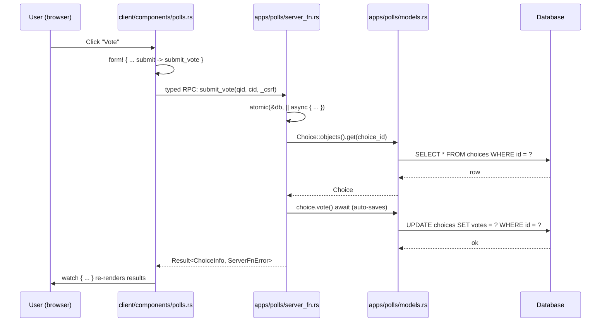
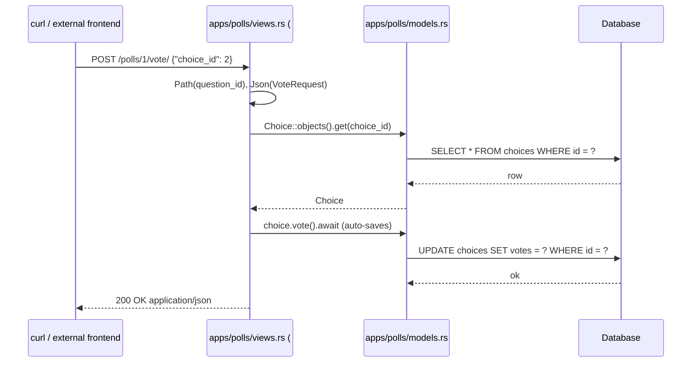

+++
title = "Part 3: Server Functions, Views, and URLs"
weight = 30

[extra]
sidebar_weight = 30
+++

# Part 3: Server Functions, Views, and URLs

By the end of this chapter your project will behave like a real polling
application: typed RPC calls from the WASM client, server-rendered JSON
endpoints for non-WASM consumers, per-app routing tables, a per-app SPA
router, and a launcher that mounts every page on `#root`. Each step is
verbatim from the reference implementation in
[`examples/examples-tutorial-basis/`](https://github.com/kent8192/reinhardt-web/tree/main/examples/examples-tutorial-basis).

The "views" layer in the pages architecture has **two** parallel halves —
and you build them both:

1. **Server functions** (`src/apps/<app>/server_fn.rs`) — typed RPC the WASM
   client calls as if it were a local `async fn`. Every reactive component
   built in Part 4 calls one of these.
2. **Server-rendered REST endpoints** (`src/apps/polls/views.rs`) — classic
   `#[get]` / `#[post]` handlers that produce JSON. A `curl` user or a
   non-Reinhardt frontend hits these directly.

Both halves live next to the models they touch, both are mounted through
the same `urls/` directory module, and both share the same authentication
gate. We introduce them in that order.

## Recap: `#[cfg(wasm)]` and `#[cfg(native)]`

Part 1 added the two custom cfg aliases that gate every file in this
project. They come from the workspace's `build.rs`, which uses
[`cfg_aliases`](https://docs.rs/cfg_aliases) to register the names:

```rust
// build.rs
use cfg_aliases::cfg_aliases;

fn main() {
	// Auto-detect: check if reinhardt workspace exists in parent
	let manifest_dir = std::env::var("CARGO_MANIFEST_DIR").unwrap();
	let examples_dir = std::path::Path::new(&manifest_dir).parent().unwrap();
	let parent_dir = examples_dir.parent().unwrap();
	let parent_cargo = parent_dir.join("Cargo.toml");

	let is_local_dev = parent_cargo.exists()
		&& std::fs::read_to_string(&parent_cargo)
			.map(|c| c.contains("name = \"reinhardt-web\""))
			.unwrap_or(false);

	if is_local_dev {
		// In subtree context - enable integration tests
		println!("cargo:rustc-cfg=with_reinhardt");

		// Warn if .cargo/config.toml is not set up for local override
		let config_path = examples_dir.join(".cargo/config.toml");
		if !config_path.exists() {
			println!(
				"cargo:warning=Local reinhardt workspace detected but .cargo/config.toml is missing. \
				 Copy the template: cp .cargo/config.local.toml .cargo/config.toml"
			);
		}
	} else {
		// Standalone mode - enable tests if crates.io versions are available
		println!("cargo:rustc-cfg=with_reinhardt");
	}

	println!("cargo:rerun-if-changed=build.rs");
	println!("cargo:rerun-if-changed=../.cargo/config.toml");

	// Declare custom cfg to avoid warnings in Rust 2024 edition
	println!("cargo::rustc-check-cfg=cfg(with_reinhardt)");
	println!("cargo::rustc-check-cfg=cfg(wasm)");
	println!("cargo::rustc-check-cfg=cfg(native)");

	cfg_aliases! {
		wasm: { all(target_family = "wasm", target_os = "unknown") },
		native: { not(all(target_family = "wasm", target_os = "unknown")) },
	}
}
```

Two important consequences carry through the entire chapter:

- **In Rust source**, use `#[cfg(wasm)]` for browser-only items and
  `#[cfg(native)]` for server-only items. The `with_reinhardt` cfg also
  declared here gates the integration tests in Part 5.
- **In `Cargo.toml`**, the two `[target.'cfg(...)'.dependencies]` headers
  must use the raw `target_family` / `target_os` predicates (Cargo does
  not yet resolve user-defined `cfg_aliases` on the left-hand side of a
  target predicate):

```toml
# WASM-specific dependencies
[target.'cfg(all(target_family = "wasm", target_os = "unknown"))'.dependencies]
reinhardt = { workspace = true, features = ["pages", "client-router"] }
wasm-bindgen = "0.2.106"
wasm-bindgen-futures = "0.4.56"
web-sys = { version = "0.3.83", features = [
	"Window",
	"Document",
	"Element",
	"HtmlFormElement",
	"HtmlInputElement",
	"Event",
	"EventTarget",
] }
console_error_panic_hook = "0.1"
gloo-net = "0.6"
# WASM-compatible chrono and uuid
chrono = { version = "0.4", features = ["serde", "wasmbind"] }
uuid = { version = "1.11.0", features = ["serde", "v4", "v7", "js"] }

# Server-specific dependencies
[target.'cfg(not(all(target_family = "wasm", target_os = "unknown")))'.dependencies]
reinhardt = { workspace = true, features = [
	"full",
	"pages",
	"conf",
	"commands",
	"db-sqlite",
	"forms",
	"client-router",
	"auth-session",
] }
tokio = { version = "1.48.0", features = ["full"] }
# Server-specific common dependencies
chrono = { version = "0.4", features = ["serde"] }
uuid = { version = "1.11.0", features = ["serde", "v4", "v7"] }
anyhow = { workspace = true }
ctor = "0.6.1"
inventory = "0.3"
linkme = "0.3"
```

The `[lib] crate-type = ["cdylib", "rlib"]` declaration (already added in
Part 1) is what allows the same crate to produce both a server-side `rlib`
and a browser-side `cdylib`.

## The Two Parallel Routing Layers

Before we touch any code, here is the picture of one user interaction. The
WASM client never constructs URLs or parses JSON by hand — it calls a
function. The function happens to run on the server.



The same diagram fits the REST counterpart almost exactly — only the first
two steps differ:



The two halves are **not** redundant: the typed-RPC half gives the WASM
client a compile-time guarantee that DTO names match server-side, while
the REST half gives a JSON consumer a stable, documentable URL surface
that does not depend on Reinhardt's macro-generated client stubs.

Both halves get wired into the framework through a per-app `urls/`
directory module. We unpack that next.

## The `urls/` Directory Module

Each app exposes routing through a small directory whose layout is fixed
by the framework. For `polls` it looks like this:

```text
src/apps/polls/
├── urls.rs                       declares the two submodules below
└── urls/
    ├── server_urls.rs            #[url_patterns(InstalledApp::polls, mode = server)]
    └── client_router.rs          #[url_patterns(InstalledApp::polls, mode = client)]
```

The aggregator `apps/polls/urls.rs` is tiny — it just gates the two
submodules on the right target:

```rust
//! URL configuration for the polls application.
//!
//! Both submodules use `#[url_patterns(InstalledApp::polls, mode = ...)]`,
//! so the framework auto-registers them via inventory. The WASM entry
//! point looks up the client router through
//! `ClientLauncher::router_client(client_url_patterns)`, and the native
//! aggregator does not need to mount the server router explicitly.
//!
//! - `server_urls` — `#[url_patterns(..., mode = server)]` → `ServerRouter`
//! - `client_router` — `#[url_patterns(..., mode = client)]` → `ClientRouter`

#[cfg(native)]
pub mod server_urls;

#[cfg(wasm)]
pub mod client_router;
```

Three rules govern every file under `urls/`:

1. **The function names are fixed.** They must be exactly
   `server_url_patterns` / `client_url_patterns` / `unified_url_patterns`
   to match the `mode = …` argument. The framework's discovery layer
   looks them up by name.
2. **The first argument is a typed `InstalledApp::<app>`.** It comes from
   the `installed_apps!` macro you wrote in Part 1, and the URL prefix
   the framework auto-applies to each router (`/polls/`, `/users/`) comes
   from the right-hand side of that macro. Discussion
   [#3770](https://github.com/kent8192/reinhardt-web/discussions/3770)
   and [#3918](https://github.com/kent8192/reinhardt-web/discussions/3918)
   replaced the older string-literal form with this typed identifier.
3. **The aggregator auto-mounts everything via `inventory`.** Once an
   app's `urls/server_urls.rs::server_url_patterns()` carries the
   attribute, `src/config/urls.rs` does not need any explicit
   `.mount("/polls/", ...)` call — the framework collects every
   registered router on its own.

The same shape repeats for the `users` app. Its server-side router is
intentionally empty (auth is exposed via server functions, not HTTP
endpoints) but the file still exists so that the `users:` namespace flows
through the same discovery mechanism:

```rust
//! Server-side URL patterns for the users application.
//!
//! Defines no HTTP endpoints of its own — authentication is exposed via
//! server functions registered in `crate::config::urls::routes`. This empty
//! aggregator exists so the app label `users` is reachable through the
//! same `#[url_patterns]` discovery path as `polls`.

use reinhardt::ServerRouter;
use reinhardt::url_patterns;

use crate::config::apps::InstalledApp;

#[url_patterns(InstalledApp::users, mode = server)]
pub fn server_url_patterns() -> ServerRouter {
	ServerRouter::new()
}
```

With the scaffolding in place, we can fill in the actual handlers.

## Writing `#[server_fn]`s

Server functions live in `src/apps/<app>/server_fn.rs`. The `#[server_fn]`
attribute comes from `reinhardt::pages::server_fn::server_fn`. Every
function in this section follows the same five conventions:

- It is an `async fn` returning `std::result::Result<T, ServerFnError>`.
  The fully-qualified `Result` keeps the macro from getting confused with
  `anyhow::Result` if it is in scope.
- Parameters marked `#[inject]` are resolved by the DI container before
  the body runs. Common injections are `reinhardt::DatabaseConnection`,
  `SessionData`, `Depends<SessionStore>`, and project-local services like
  `Depends<UserManager>`.
- The body is implicitly `#[cfg(native)]` — the macro generates a typed
  client stub for the WASM side so callers only see the signature.
- DTOs at the boundary come from `src/shared/types.rs`, so renaming a
  field there fails to compile on both sides simultaneously.
- For mutations called from `form!`, the **last** non-injected parameter
  is `_csrf_token: String`. The CSRF middleware verifies it before the
  handler runs; the value is present only so the macro-generated client
  stub's positional argument list matches the server signature
  (tracked upstream in
  [reinhardt-web#3971](https://github.com/kent8192/reinhardt-web/issues/3971)).

### The polls read functions

Start with the three read endpoints. Each one talks to the ORM and
returns a serialisable DTO. The `_db: reinhardt::DatabaseConnection`
parameter is injected purely to make sure the DI container has wired
the database up before the handler runs — the actual queries go through
`Model::objects()`.

```rust
//! Poll server functions
//!
//! These functions provide the server-side API for the polling application.

use crate::shared::types::{ChoiceInfo, QuestionInfo, VoteRequest};
use reinhardt::pages::server_fn::{ServerFnError, server_fn};

// Server-only imports
#[cfg(native)]
use {
	crate::apps::users::models::User,
	crate::shared::forms::create_vote_form,
	reinhardt::Model,
	reinhardt::db::orm::{FilterOperator, FilterValue},
	reinhardt::forms::wasm_compat::{FormExt, FormMetadata},
	reinhardt::middleware::session::{SessionData, USER_ID_SESSION_KEY},
};

/// Get all questions (latest 5)
#[server_fn]
pub async fn get_questions(
	#[inject] _db: reinhardt::DatabaseConnection,
) -> std::result::Result<Vec<QuestionInfo>, ServerFnError> {
	use crate::apps::polls::models::Question;
	use reinhardt::Model;

	let manager = Question::objects();
	let questions = manager
		.all()
		.all()
		.await
		.map_err(|e| ServerFnError::application(e.to_string()))?;

	let latest: Vec<QuestionInfo> = questions
		.into_iter()
		.take(5)
		.map(QuestionInfo::from)
		.collect();

	Ok(latest)
}
```

`get_question_detail` extends the same pattern to filtered queries via
`Choice::field_question_id()` — the typed field accessor that the
`#[model]` macro generated for you in Part 2:

```rust
/// Get question detail with choices
#[server_fn]
pub async fn get_question_detail(
	question_id: i64,
	#[inject] _db: reinhardt::DatabaseConnection,
) -> std::result::Result<(QuestionInfo, Vec<ChoiceInfo>), ServerFnError> {
	use crate::apps::polls::models::{Choice, Question};
	use reinhardt::Model;
	use reinhardt::db::orm::{FilterOperator, FilterValue};

	let question_manager = Question::objects();
	let question = question_manager
		.get(question_id)
		.first()
		.await
		.map_err(|e| ServerFnError::application(e.to_string()))?
		.ok_or_else(|| ServerFnError::server(404, "Question not found"))?;

	let choice_manager = Choice::objects();
	let choices = choice_manager
		.filter(
			Choice::field_question_id(),
			FilterOperator::Eq,
			FilterValue::Int(question_id),
		)
		.all()
		.await
		.map_err(|e| ServerFnError::application(e.to_string()))?;

	let question_info = QuestionInfo::from(question);
	let choice_infos: Vec<ChoiceInfo> = choices.into_iter().map(ChoiceInfo::from).collect();

	Ok((question_info, choice_infos))
}
```

`get_question_results` adds an aggregate computed on the server so the
client only has to render numbers:

```rust
/// Get question results
///
/// Returns the question and all its choices with vote counts.
#[server_fn]
pub async fn get_question_results(
	question_id: i64,
	#[inject] _db: reinhardt::DatabaseConnection,
) -> std::result::Result<(QuestionInfo, Vec<ChoiceInfo>, i32), ServerFnError> {
	use crate::apps::polls::models::{Choice, Question};
	use reinhardt::Model;
	use reinhardt::db::orm::{FilterOperator, FilterValue};

	let question_manager = Question::objects();
	let question = question_manager
		.get(question_id)
		.first()
		.await
		.map_err(|e| ServerFnError::application(e.to_string()))?
		.ok_or_else(|| ServerFnError::server(404, "Question not found"))?;

	let choice_manager = Choice::objects();
	let choices = choice_manager
		.filter(
			Choice::field_question_id(),
			FilterOperator::Eq,
			FilterValue::Int(question_id),
		)
		.all()
		.await
		.map_err(|e| ServerFnError::application(e.to_string()))?;

	let total_votes: i32 = choices.iter().map(|c| c.votes()).sum();

	let question_info = QuestionInfo::from(question);
	let choice_infos: Vec<ChoiceInfo> = choices.into_iter().map(ChoiceInfo::from).collect();

	Ok((question_info, choice_infos, total_votes))
}
```

### The vote function and `atomic`

Voting is a read-modify-write: read the `Choice`, increment its counter,
write the row back. Two simultaneous voters can race here — both reading
the same row before either has written — so the body runs inside
`atomic(&db, || async { … })`, which opens a transaction and rolls back
if the closure returns `Err`.

```rust
/// Vote for a choice
///
/// Increments the vote count for the selected choice.
#[server_fn]
pub async fn vote(
	request: VoteRequest,
	#[inject] db: reinhardt::DatabaseConnection,
) -> std::result::Result<ChoiceInfo, ServerFnError> {
	vote_internal(request, db).await
}

/// Internal vote implementation (shared between vote and submit_vote)
#[cfg(native)]
async fn vote_internal(
	request: VoteRequest,
	db: reinhardt::DatabaseConnection,
) -> std::result::Result<ChoiceInfo, ServerFnError> {
	use crate::apps::polls::models::Choice;
	use reinhardt::Model;
	use reinhardt::atomic;

	// Wrap read-modify-write in a transaction to prevent race conditions
	let updated_choice = atomic(&db, || async {
		let choice_manager = Choice::objects();

		let mut choice = choice_manager
			.get(request.choice_id)
			.first()
			.await
			.map_err(|e| anyhow::anyhow!(e.to_string()))?
			.ok_or_else(|| anyhow::anyhow!("Choice not found"))?;

		if *choice.question_id() != request.question_id {
			return Err(anyhow::anyhow!("Choice does not belong to this question"));
		}

		// `Choice::vote()` is `async fn` and calls `self.save().await`
		// internally, so the increment AND the row-level UPDATE happen in
		// one call. No separate `choice_manager.update(&choice).await?`
		// step is needed.
		choice.vote().await
			.map_err(|e| anyhow::anyhow!(e.to_string()))?;

		Ok(choice)
	})
	.await
	.map_err(|e| ServerFnError::application(e.to_string()))?;

	Ok(ChoiceInfo::from(updated_choice))
}
```

### `submit_vote`: the `form!` adapter

The WASM client built in Part 4 will use the `form!` macro to render the
voting form. `form!` currently serialises every field as a plain
`String` on submit — tracked upstream in
[reinhardt-web#4397](https://github.com/kent8192/reinhardt-web/issues/4397) —
so `submit_vote` exists as a thin adapter that takes strings, parses
them, and reuses `vote_internal`.

```rust
/// Submit vote via form! macro
///
/// Wrapper function that accepts individual field values from form! macro's
/// submit. Converts String field values to the required types and calls the
/// underlying vote function.
///
/// The trailing `_csrf_token: String` argument is supplied by `form!`'s
/// `strip_arguments` block (reinhardt-web#3971). Actual CSRF verification is
/// performed by the server-side CSRF middleware before this handler runs;
/// receiving the value here keeps the WASM client stub's positional argument
/// list aligned with the server signature.
#[server_fn]
pub async fn submit_vote(
	question_id: String,
	choice_id: String,
	_csrf_token: String,
	#[inject] db: reinhardt::DatabaseConnection,
) -> std::result::Result<ChoiceInfo, ServerFnError> {
	let question_id: i64 = question_id
		.parse()
		.map_err(|_| ServerFnError::application("Invalid question_id"))?;
	let choice_id: i64 = choice_id
		.parse()
		.map_err(|_| ServerFnError::application("Invalid choice_id"))?;

	let request = VoteRequest {
		question_id,
		choice_id,
	};

	vote_internal(request, db).await
}
```

Each CUD handler in `server_fn.rs` carries an "Ideal implementation"
comment showing the typed signature that becomes possible once #4397
ships — for example:

```rust
/// Create a new question owned by the current user.
///
/// Ideal implementation (without the form! String workaround tracked in #4397):
///   pub async fn create_question(
///       question_text: String,
///       _csrf_token: String,
///       #[inject] _db: reinhardt::DatabaseConnection,
///       #[inject] session_user: Depends<SessionUser>,
///   ) -> std::result::Result<QuestionInfo, ServerFnError> { ... }
```

This is the workaround comment convention the project uses everywhere:
the ideal code is written next to the workaround so that the upgrade path
is obvious when the upstream issue resolves.

### `SessionUser`: the DI-resolved 401 gate

Every authenticated mutation needs the same three steps: pull `user_id`
out of the session, look up the row, check `is_active`. Putting that
inline at the top of every handler would be noisy and easy to skip, so
the project pushes the "load user_id from session, look up the row,
classify as Anonymous / Authenticated / Unavailable" pipeline into a
**DI factory** that lives in `apps::polls::di::SessionUser`. Each
authenticated handler then receives `Depends<SessionUser>` from the DI
container and calls `.require_active()?` to surface the 401/403:

```rust
// src/apps/polls/di.rs (excerpt)
//
// The factory is registered with `#[injectable_factory(scope = "request")]`
// so each request resolves its own `SessionUser` once. The classification
// closes over `SessionData` (cookie-loaded) and `DatabaseConnection` (DI
// resolved), and returns one of:
//
//   - SessionUser::Anonymous            — no `user_id` in session
//   - SessionUser::Authenticated(User)  — row exists and `is_active`
//   - SessionUser::Inactive(User)       — row exists but `is_active == false`
//   - SessionUser::Unavailable          — DB lookup failed (surfaces 503,
//                                         distinct from "no user")
//
// `require_active()` returns `Result<User, ServerFnError>` and is what the
// handlers below call.
```

`create_question`, `update_question`, `delete_question`, `create_choice`,
`update_choice`, and `delete_choice` all start with the same two lines:
`#[inject] session_user: Depends<SessionUser>` in the signature,
`let user = session_user.require_active()?;` as the first statement. The
Question CUD handlers additionally enforce that the caller authored the
row:

```rust
/// Update a question's text. Only the author may update.
#[server_fn]
pub async fn update_question(
	question_id: String,
	question_text: String,
	_csrf_token: String,
	#[inject] _db: reinhardt::DatabaseConnection,
	#[inject] session_user: Depends<SessionUser>,
) -> std::result::Result<QuestionInfo, ServerFnError> {
	use crate::apps::polls::models::Question;

	let user = session_user.require_active()?;

	let question_id: i64 = question_id
		.parse()
		.map_err(|_| ServerFnError::application("Invalid question_id"))?;

	let trimmed = question_text.trim();
	if trimmed.is_empty() || trimmed.len() > 200 {
		return Err(ServerFnError::server(
			400,
			"Question text must be between 1 and 200 characters",
		));
	}

	let manager = Question::objects();
	let mut question = manager
		.get(question_id)
		.first()
		.await
		.map_err(|e| ServerFnError::application(format!("Database error: {}", e)))?
		.ok_or_else(|| ServerFnError::server(404, "Question not found"))?;

	if *question.author_id() != user.id() {
		return Err(ServerFnError::server(
			403,
			"Only the question's author can edit it",
		));
	}

	question.question_text = trimmed.to_string();

	let updated = manager
		.update(&question)
		.await
		.map_err(|e| ServerFnError::application(format!("Database error: {}", e)))?;

	Ok(QuestionInfo::from(updated))
}
```

The Choice CUD handlers add a second private helper,
`require_question_author`, which loads the parent `Question` and verifies
ownership before touching the `Choice`. That keeps the 401/403/404
matrix in one place and makes each handler body very small.

## Authentication Server Functions (`apps/users/server_fn.rs`)

The `users` app's server functions follow the same conventions but talk
to `SessionData` and `Depends<SessionStore>` instead of business models.
They are the only server-side handlers in the project that read
passwords, so they're the right place to introduce the session-cookie
machinery.

The imports illustrate which pieces come from where: `SessionAuthExt`
provides the `login` / `logout` methods on `SessionData`,
`USER_ID_SESSION_KEY` is the canonical key under which the user id is
stored, and `BaseUserManager::create_user` does the password-hashing
work.

```rust
use crate::shared::types::UserInfo;
#[cfg(native)]
use crate::shared::types::{LoginRequest, RegisterRequest};
use reinhardt::pages::server_fn::{ServerFnError, server_fn};

#[cfg(native)]
use {
	crate::apps::users::models::{User, UserManager},
	reinhardt::BaseUser,
	reinhardt::DatabaseConnection,
	reinhardt::Validate,
	reinhardt::db::orm::{FilterOperator, FilterValue, Model},
	reinhardt::di::Depends,
	reinhardt::middleware::session::{
		SessionAuthExt, SessionData, SessionStore, USER_ID_SESSION_KEY,
	},
	reinhardt::reinhardt_auth::BaseUserManager,
	std::collections::HashMap,
};
```

`login` validates the request (Reinhardt re-exports the `Validate` derive
from the `validator` crate, gated on `#[cfg(native)]`), looks up the
user, checks the password through `BaseUser::check_password`, then calls
`SessionAuthExt::login` to rotate the session id (fixation prevention)
and persist `user_id`:

```rust
/// Authenticate a user by username/password and persist the session.
///
/// `_csrf_token` is appended by `form!` for non-GET forms (reinhardt-web#3337);
/// CSRF is verified by middleware before this handler runs.
#[server_fn]
pub async fn login(
	username: String,
	password: String,
	_csrf_token: String,
	#[inject] _db: DatabaseConnection,
	#[inject] session: SessionData,
	#[inject] store: Depends<SessionStore>,
) -> std::result::Result<UserInfo, ServerFnError> {
	let mut session = session;

	let request = LoginRequest { username, password };

	// Run the field-level validators declared on `LoginRequest` before
	// touching the database — empty/oversized credentials should reject
	// at the request boundary rather than slip through to the password
	// comparison below.
	request
		.validate()
		.map_err(|e| ServerFnError::application(format!("Validation failed: {}", e)))?;

	let manager = User::objects();
	let user = manager
		.filter(
			User::field_username(),
			FilterOperator::Eq,
			FilterValue::String(request.username.trim().to_string()),
		)
		.first()
		.await
		.map_err(|e| ServerFnError::application(format!("Database error: {}", e)))?
		.ok_or_else(|| ServerFnError::server(401, "Invalid credentials"))?;

	let valid = user
		.check_password(&request.password)
		.map_err(|e| ServerFnError::application(format!("Password check failed: {}", e)))?;

	if !valid {
		return Err(ServerFnError::server(401, "Invalid credentials"));
	}

	if !user.is_active() {
		return Err(ServerFnError::server(403, "User account is inactive"));
	}

	// Session fixation prevention: `SessionAuthExt::login` rotates the session
	// ID, writes the authenticated user's primary key under
	// `USER_ID_SESSION_KEY`, deletes the old store entry, and persists the
	// rotated session in one step. See issue #4446.
	session
		.login(&store, user.id())
		.map_err(|e| ServerFnError::application(format!("Session error: {}", e)))?;

	Ok(UserInfo::from(user))
}
```

`register` follows the same shape and delegates to the project-local
`UserManager` introduced in Part 2:

```rust
#[server_fn]
pub async fn register(
	username: String,
	password: String,
	password_confirmation: String,
	_csrf_token: String,
	#[inject] user_manager: Depends<UserManager>,
	#[inject] session: SessionData,
	#[inject] store: Depends<SessionStore>,
) -> std::result::Result<UserInfo, ServerFnError> {
	let mut session = session;

	let request = RegisterRequest {
		username,
		password,
		password_confirmation,
	};

	request
		.validate()
		.map_err(|e| ServerFnError::application(format!("Validation failed: {}", e)))?;

	// Password confirmation lives outside the derived `Validate` —
	// see the `validate_passwords_match` rationale on `RegisterRequest`.
	request
		.validate_passwords_match()
		.map_err(ServerFnError::application)?;

	// `BaseUserManager::create_user` takes `&mut self`, but DI hands us a
	// shared `Depends<UserManager>` (an `Arc` under the hood). Clone the
	// inner manager — its only field is another `Depends<DatabaseConnection>`,
	// which is itself an `Arc` clone — so this is cheap and gives us the
	// `&mut` access the trait method needs.
	let mut user_manager: UserManager = (*user_manager).clone();
	let saved = user_manager
		.create_user(
			request.username.trim(),
			Some(&request.password),
			HashMap::new(),
		)
		.await
		.map_err(|e| ServerFnError::application(e.to_string()))?;

	session
		.login(&store, saved.id())
		.map_err(|e| ServerFnError::application(format!("Session error: {}", e)))?;

	Ok(UserInfo::from(saved))
}
```

Two details in `login` and `register` are worth pausing on:

- **Manual validation instead of `pre_validate`.** Both functions call
  `request.validate()` by hand rather than using
  `#[server_fn(pre_validate = true)]`. That flag only triggers when each
  parameter is an extractor whose inner DTO derives `Validate` (e.g.,
  `body: Json<RegisterRequest>`). Because `form!` sends each form field
  as an individual `String`, the macro-generated synthetic `Args` struct
  only derives `Deserialize`; nothing on the auto-path knows about the
  field-level `#[validate(...)]` attributes on `RegisterRequest`.
  Building the DTO by hand and validating it recovers the same
  guarantees without giving up `form!` ergonomics.
- **`validate_passwords_match` is a manual helper.** The `validator`
  crate's `must_match` rule has been brittle across versions, so the
  password confirmation check lives in a regular method on
  `RegisterRequest` rather than the derived `Validate`. It runs after
  the field-level validators so a too-short password does not silently
  match a too-short confirmation.

`logout` and `current_user` round out the file. `logout` refuses to act
on an unauthenticated session and then defers to `SessionAuthExt::logout`
for the actual rotation:

```rust
#[server_fn]
pub async fn logout(
	_csrf_token: String,
	#[inject] session: SessionData,
	#[inject] store: Depends<SessionStore>,
) -> std::result::Result<(), ServerFnError> {
	let mut session = session;

	if session.get::<i64>(USER_ID_SESSION_KEY).is_none() {
		return Err(ServerFnError::server(401, "Not authenticated"));
	}

	session.logout(&store);
	Ok(())
}

#[server_fn]
pub async fn current_user(
	#[inject] _db: DatabaseConnection,
	#[inject] session: SessionData,
) -> std::result::Result<Option<UserInfo>, ServerFnError> {
	let user_id = match session.get::<i64>(USER_ID_SESSION_KEY) {
		Some(id) => id,
		None => return Ok(None),
	};

	let user = User::objects()
		.filter(
			User::field_id(),
			FilterOperator::Eq,
			FilterValue::Int(user_id),
		)
		.first()
		.await
		.map_err(|e| ServerFnError::application(format!("Database error: {}", e)))?;

	Ok(user.map(UserInfo::from))
}
```

That's the entire authentication surface. The nav bar built in Part 4
calls `current_user()` to decide whether to show "Sign in" or
"Sign out".

## Server-Rendered REST Endpoints (`apps/polls/views.rs`)

The same business logic is also exposed as classic JSON endpoints so
that non-WASM consumers (a `curl` user, a separate frontend, an
integration test) can interact with the application without going
through the typed RPC stubs. Each handler uses the HTTP-method attributes
(`#[get]` / `#[post]`), takes typed extractors (`Path<i64>`,
`Json<VoteRequest>`), and returns a `Response` with a JSON body.

```rust
use json::json;
use reinhardt::Model;
use reinhardt::StatusCode;
use reinhardt::core::serde::json;
use reinhardt::db::orm::{FilterOperator, FilterValue};
use reinhardt::http::ViewResult;
use reinhardt::{Json, Path};
use reinhardt::{Response, get, post};
use serde::Deserialize;

use super::models::{Choice, Question};

/// Request body for voting
#[derive(Debug, Deserialize)]
pub struct VoteRequest {
	pub choice_id: i64,
}

/// Index view - List all polls
#[get("/", name = "polls_index")]
pub async fn index() -> ViewResult<Response> {
	let manager = Question::objects();
	let questions = manager.all().all().await?;
	let latest_questions: Vec<_> = questions.into_iter().take(5).collect();

	let response_data = json!({
		"message": "Polls index",
		"polls": latest_questions
	});

	let json = json::to_string(&response_data)?;
	Ok(Response::new(StatusCode::OK)
		.with_header("Content-Type", "application/json")
		.with_body(json))
}

/// Detail view - Show a specific poll
///
/// GET /polls/{question_id}/
#[get("/{question_id}/", name = "polls_detail")]
pub async fn detail(Path(question_id): Path<i64>) -> ViewResult<Response> {
	let question_manager = Question::objects();
	let question = question_manager
		.get(question_id)
		.first()
		.await?
		.ok_or("Question not found")?;

	let choice_manager = Choice::objects();
	let choices = choice_manager
		.filter(
			Choice::field_question_id(),
			FilterOperator::Eq,
			FilterValue::Int(question_id),
		)
		.all()
		.await?;

	let response_data = json!({
		"question": question,
		"choices": choices
	});

	let json = json::to_string(&response_data)?;
	Ok(Response::new(StatusCode::OK)
		.with_header("Content-Type", "application/json")
		.with_body(json))
}
```

The `results` and `vote` handlers continue the same pattern. Note that
`vote` accepts a small local `VoteRequest` DTO (declared in `views.rs`
itself, not the shared one) so that the REST endpoint's wire format does
not need a `question_id` field in the body — it comes from the path:

```rust
/// Vote view - Handle voting
///
/// POST /polls/{question_id}/vote/
#[post("/{question_id}/vote/", name = "polls_vote")]
pub async fn vote(
	Path(question_id): Path<i64>,
	Json(vote_req): Json<VoteRequest>,
) -> ViewResult<Response> {
	let choice_id = vote_req.choice_id;

	let choice_manager = Choice::objects();
	let mut choice = choice_manager
		.get(choice_id)
		.first()
		.await?
		.ok_or("Choice not found")?;

	if *choice.question_id() != question_id {
		return Err("Choice does not belong to this question".into());
	}

	// `Choice::vote()` is `async fn` and persists the row internally via
	// `self.save().await`, so a separate `manager.update(&choice)` call
	// is not needed.
	choice.vote().await?;
	let updated_choice = choice;

	let response_data = json!({
		"message": "Vote recorded successfully",
		"question_id": question_id,
		"choice_id": choice_id,
		"choice_text": updated_choice.choice_text(),
		"new_vote_count": updated_choice.votes()
	});

	let json = json::to_string(&response_data)?;
	Ok(Response::new(StatusCode::OK)
		.with_header("Content-Type", "application/json")
		.with_body(json))
}
```

`#[get(... , name = "polls_index")]` registers the path under a stable
name. The server-router aggregator picks all four handlers up:

```rust
//! Server-side URL configuration for the polls application.
//!
//! The `#[url_patterns]` macro auto-registers this router via inventory and
//! derives the path prefix from `InstalledApp::polls` (= `"polls"`), so the
//! aggregating `config/urls.rs` does not need an explicit `.mount("/polls/", ...)`
//! call.

use reinhardt::ServerRouter;
use reinhardt::url_patterns;

use crate::apps::polls::views;
use crate::config::apps::InstalledApp;

#[url_patterns(InstalledApp::polls, mode = server)]
pub fn server_url_patterns() -> ServerRouter {
	ServerRouter::new()
		.endpoint(views::index)
		.endpoint(views::detail)
		.endpoint(views::results)
		.endpoint(views::vote)
}
```

The `users` app has no REST endpoints in this tutorial, so its
`server_url_patterns()` returns an empty `ServerRouter::new()` as shown
earlier.

## Registering Everything in `src/config/urls.rs`

The project-level `routes()` function plays three roles:

1. Registers every server function via `.server(|s| s.server_fn(...))`.
   Per-app `ServerRouter`s are auto-mounted by `#[url_patterns(...,
   mode = server)]`, so this file does not call `.mount("/polls/", ...)`
   for them. On wasm, it also aggregates every app's
   `client_url_patterns()` so the `#[routes]`-emitted
   `ClientRouterRegistration` carries the full SPA route table (the
   `client_inventory` flag described below).
2. On native, mounts the admin panel at `/admin/` (and its static
   assets at `/static/admin/`) using `admin_routes_with_di`, which also
   wires the `AdminDatabase` DI registration.
3. On native, applies the `SessionMiddleware` with a two-week TTL, `Lax`
   SameSite, `httpOnly`, and path `/`.

The attribute is `#[routes(standalone, client_inventory)]`. Both flags
are unconditional:

- `client_inventory` (#4453) drops the macro's `native_only` cfg gate on
  the user function body and emits
  `inventory::submit!(ClientRouterRegistration)` on
  `wasm32-unknown-unknown`. The body therefore MUST compile on both
  targets — `.server(|s| ...)` (where `s` is a `ServerRouterStub` on
  wasm) and the `#[cfg(wasm)]` aggregation block below ensure that.
- `standalone` suppresses generation of `crate::urls::url_prelude` and
  the `ResolvedUrls::<app>()` accessor methods. This project does not
  consume `installed_apps!`-generated `client_url_resolvers` modules
  from a top-level `urls` directory — per-app
  `#[url_patterns(..., mode = client)]` declarations live in
  `apps/<app>/urls/client_router.rs` instead, and SPA URL resolution
  flows through `register_client_reverser` (called inside
  `collect_client_router_from_inventory`).

```rust
//! URL configuration for examples-tutorial-basis project
//!
//! The `routes` function defines the top-level project router. Per-app server
//! routes are auto-mounted via `#[url_patterns(InstalledApp::<app>, mode = server)]`,
//! and per-app client routes are aggregated through the `.client(|c| ...)`
//! closure below so that the `#[routes]` macro's WASM-side
//! `inventory::submit!(ClientRouterRegistration)` emission carries every
//! SPA route. `ClientLauncher::register_routes_from_inventory()` in
//! `client/lib.rs` then merges those entries and installs them as the SPA
//! route table.
//!
//! Middleware stack (server-only):
//! 1. `SessionMiddleware` — cookie-based session management used by the
//!    `users` app's login/logout server functions

use reinhardt::UnifiedRouter;
#[cfg(native)]
use reinhardt::admin::{admin_routes_with_di, admin_static_routes};
#[cfg(native)]
use reinhardt::pages::server_fn::ServerFnRouterExt;
use reinhardt::routes;

#[cfg(native)]
use crate::config::admin::configure_admin;

// Import server_fn marker modules (snake_case + ::marker)
#[cfg(native)]
use crate::apps::polls::server_fn::{
	create_choice, create_question, delete_choice, delete_question, get_question_detail,
	get_question_results, get_questions, submit_vote, update_choice, update_question, vote,
};
#[cfg(native)]
use crate::apps::users::server_fn::{current_user, login, logout, register};

#[cfg(native)]
use reinhardt::middleware::session::{SessionConfig, SessionMiddleware};
#[cfg(native)]
use std::time::Duration;

/// Build the session middleware with a two-week TTL and Lax SameSite.
///
/// Mirrors the production defaults used in `examples-twitter/src/config/middleware.rs`.
#[cfg(native)]
fn create_session_middleware() -> SessionMiddleware {
	let config = SessionConfig::new("sessionid".to_string(), Duration::from_secs(1_209_600))
		.with_http_only(true)
		.with_same_site("Lax".to_string())
		.with_path("/".to_string());
	SessionMiddleware::new(config)
}

/// Build the top-level project router.
///
/// `#[routes(standalone, client_inventory)]` opts into the new cross-target
/// convention introduced in #4453 without enabling per-app URL-resolver
/// generation (this project does not consume `installed_apps!`-generated
/// `client_url_resolvers` modules from a top-level `urls` directory; the
/// per-app `#[url_patterns(..., mode = client)]` declarations live in
/// `apps/<app>/urls/client_router.rs` instead). The flags compose:
///
/// - `client_inventory` (#4453): drops the macro's `native_only` cfg gate
///   from the user function body and emits
///   `inventory::submit!(ClientRouterRegistration)` on
///   `wasm32-unknown-unknown`. The body below MUST therefore compile on
///   both targets — `.server(|s| ...)` and the `#[cfg(wasm)]` aggregation
///   block ensure that.
/// - `standalone`: suppresses generation of `crate::urls::url_prelude` and
///   the `ResolvedUrls::<app>()` accessor methods. The project still
///   resolves SPA URLs via `register_client_reverser` (called inside
///   `collect_client_router_from_inventory`).
///
/// On native, the macro emits `inventory::submit!(UrlPatternsRegistration)`
/// for the `ServerRouter` carried by the returned `UnifiedRouter`. On wasm
/// it emits the parallel `ClientRouterRegistration`, and
/// `ClientLauncher::register_routes_from_inventory()` in
/// `client/lib.rs` consumes those entries to install the SPA route table.
///
/// Per-app server routers are still discovered through their own
/// `#[url_patterns(InstalledApp::<app>, mode = server)]` registrations; this
/// function only registers the project-level server functions, the admin
/// panel, and the session middleware on top of them.
#[routes(standalone, client_inventory)]
pub fn routes() -> UnifiedRouter {
	let router = UnifiedRouter::new().server(|s| {
		// On wasm the `s` parameter is a `ServerRouterStub` and every
		// builder call inside this closure is absorbed by the stub
		// (see `reinhardt_urls::routers::unified_router::ServerRouterStub`),
		// so the `server_fn` markers do not need to compile on wasm. We
		// still gate the marker references on `#[cfg(native)]` because
		// the `server_fn` marker modules themselves are native-only.
		#[cfg(native)]
		{
			s.server_fn(get_questions::marker)
				.server_fn(get_question_detail::marker)
				.server_fn(get_question_results::marker)
				.server_fn(vote::marker)
				.server_fn(submit_vote::marker)
				.server_fn(create_question::marker)
				.server_fn(update_question::marker)
				.server_fn(delete_question::marker)
				.server_fn(create_choice::marker)
				.server_fn(update_choice::marker)
				.server_fn(delete_choice::marker)
				.server_fn(login::marker)
				.server_fn(logout::marker)
				.server_fn(register::marker)
				.server_fn(current_user::marker)
		}
		#[cfg(not(native))]
		{
			s
		}
	});

	// Aggregate every app's client routes on wasm so the macro-emitted
	// `ClientRouterRegistration` carries the full SPA route table.
	//
	// Each `client_url_patterns()` already namespaces its routes
	// (`polls:` / `users:`) via its own `#[url_patterns(..., mode = client)]`
	// registration. We compose them by wrapping each in a single-purpose
	// `UnifiedRouter` and stitching with `mount_unified`, which uses
	// `ClientRouter::merge` internally (still `pub(crate)` upstream —
	// tracked in #4442). When #4442 ships, this collapses to
	// `.client(|c| c.merge(polls).merge(users))`.
	//
	// The aggregation is `#[cfg(wasm)]` because:
	// - The per-app `client_router` submodules are themselves wasm-only
	//   (they import `crate::client::pages::*`, which is wasm-only).
	// - On native, `#[routes(standalone, client_inventory)]` consumes the
	//   server portion of the returned `UnifiedRouter` via
	//   `UrlPatternsRegistration`; the `ClientRouter` field is unused on
	//   the native side.
	#[cfg(wasm)]
	let router = router
		.mount_unified(
			"/",
			UnifiedRouter::new()
				.client(|_| crate::apps::polls::urls::client_router::client_url_patterns()),
		)
		.mount_unified(
			"/",
			UnifiedRouter::new()
				.client(|_| crate::apps::users::urls::client_router::client_url_patterns()),
		);

	// Mount the auto-generated admin panel at /admin/ (server-only).
	// `admin_routes_with_di` returns both the router and a DI registration
	// list that lazily provides `AdminDatabase` to admin handlers from the
	// project's `DatabaseConnection`.
	#[cfg(native)]
	let router = {
		let admin_site = std::sync::Arc::new(configure_admin());
		let (admin_router, admin_di) = admin_routes_with_di(admin_site);
		router
			.mount("/admin/", admin_router)
			.mount("/static/admin/", admin_static_routes())
			.with_di_registrations(admin_di)
	};

	// `SessionMiddleware` auto-registers its `SessionStore` as a DI singleton
	// via `Middleware::di_registrations` (keyed by `TypeId::of::<SessionStore>()`
	// post-#4437), so server functions that
	// `#[inject] session: SessionData` (or `#[inject] store: Depends<SessionStore>`)
	// can resolve the same store the middleware writes to without a parallel
	// `with_di_registrations(...)` call. See #4426 (and the original #4423
	// regression that motivated the auto-registration hook).
	#[cfg(native)]
	let router = router.with_middleware(create_session_middleware());

	router
}
```

Three registration conventions are worth memorising:

- Each server function exposes a unit-struct `marker` (e.g.,
  `submit_vote::marker`) that the macro generates. The
  `s.server_fn(name::marker)` call passes that marker into the router.
- The import list is in snake_case and refers to the function names, not
  to a separate type — `use ... submit_vote;` then `submit_vote::marker`.
- The wasm-side aggregation lives in the `routes()` body itself, not in
  `client/lib.rs`. Because `#[routes(..., client_inventory)]` emits a
  `ClientRouterRegistration` from this function, every per-app
  `client_url_patterns()` it stitches in becomes part of the SPA route
  table that `ClientLauncher::register_routes_from_inventory()` consumes.

## Client Routing in `urls/client_router.rs`

The client-side router maps URLs to **page factories** that return
`Page` values. The factories live in `src/client/pages.rs`; the router
just plumbs them in. Each route is registered with a stable name so that
`ResolvedUrls::from_global().resolve_client_url("polls:detail", &[("question_id", "1")])`
returns the right path.

```rust
//! Client-side routing for the polls SPA.
//!
//! Routes are declared with `#[url_patterns(InstalledApp::polls, mode = client)]`,
//! which auto-registers the router via inventory and applies the `polls`
//! namespace to every named route (so the route name passed to `named_route`
//! is reachable as `polls:<name>` through `ResolvedUrls`). Each route is
//! registered with a stable name so that page components can resolve URLs
//! through `ResolvedUrls::resolve_client_url(...)` instead of formatting
//! path strings inline.

use reinhardt::ClientPath;
use reinhardt::ClientRouter;
use reinhardt::pages::component::Page;
use reinhardt::pages::page;
use reinhardt::url_patterns;

use crate::client::pages::{
	choice_delete_page, choice_edit_page, choice_new_page, index_page, polls_detail_page,
	polls_results_page, question_delete_page, question_edit_page, question_new_page,
};
use crate::config::apps::InstalledApp;

#[url_patterns(InstalledApp::polls, mode = client)]
pub fn client_url_patterns() -> ClientRouter {
	ClientRouter::new()
		.named_route("index", "/", index_page)
		.named_route("question_new", "/polls/new/", question_new_page)
		.named_route_path(
			"choice_new",
			"/polls/{question_id}/choices/new/",
			|ClientPath(question_id): ClientPath<i64>| choice_new_page(question_id),
		)
		.named_route_path2(
			"choice_edit",
			"/polls/{question_id}/choices/{choice_id}/edit/",
			|ClientPath(question_id): ClientPath<i64>, ClientPath(choice_id): ClientPath<i64>| {
				choice_edit_page(question_id, choice_id)
			},
		)
		.named_route_path2(
			"choice_delete",
			"/polls/{question_id}/choices/{choice_id}/delete/",
			|ClientPath(question_id): ClientPath<i64>, ClientPath(choice_id): ClientPath<i64>| {
				choice_delete_page(question_id, choice_id)
			},
		)
		.named_route_path(
			"detail",
			"/polls/{question_id}/",
			|ClientPath(question_id): ClientPath<i64>| polls_detail_page(question_id),
		)
		.named_route_path(
			"question_edit",
			"/polls/{question_id}/edit/",
			|ClientPath(question_id): ClientPath<i64>| question_edit_page(question_id),
		)
		.named_route_path(
			"question_delete",
			"/polls/{question_id}/delete/",
			|ClientPath(question_id): ClientPath<i64>| question_delete_page(question_id),
		)
		.named_route_path(
			"results",
			"/polls/{question_id}/results/",
			|ClientPath(question_id): ClientPath<i64>| polls_results_page(question_id),
		)
		.not_found(|| error_page("Page not found"))
}

/// Error page used as the `not_found` fallback.
fn error_page(message: &str) -> Page {
	let message = message.to_string();
	// `urls::index()` is the macro-emitted typed helper (issue #4656),
	// sibling to `client_url_patterns` at this module's parent scope.
	let home_href = urls::index();
	page!(|message: String, home_href: String| {
		div {
			class: "layout-page",
			div {
				class: "alert-danger mb-4",
				{ message }
			}
			a {
				href: home_href,
				class: "btn-primary",
				"Back to Home"
			}
		}
	})(message, home_href)
}
```

`ClientRouter` exposes three registration helpers that you will use over
and over:

- **`named_route(name, path, page_factory)`** — for parameter-less
  routes. `page_factory` is a `Fn() -> Page`.
- **`named_route_path(name, path, page_factory)`** — for a single
  typed path parameter. The factory receives a `ClientPath<T>`.
- **`named_route_path2(name, path, page_factory)`** — for two typed
  path parameters.

The `polls:` namespace in `ResolvedUrls` lookups comes from the
`InstalledApp::polls` argument to `#[url_patterns]`; you do not write it
into the call to `named_route` yourself.

The `users` app's client router is a much shorter version of the same
file. Three login/logout/signup pages, no path parameters, namespace
`users:`:

```rust
//! Client-side routing for the users application (login/logout pages).
//!
//! Routes are auto-prefixed with `/users/` from `InstalledApp::users`, so the
//! relative path `/login/` resolves to `/users/login/` at runtime. Each
//! route is registered with a stable name (`users:login`, `users:logout`)
//! so callers can resolve URLs via `ResolvedUrls::resolve_client_url(...)`.

use reinhardt::ClientRouter;
use reinhardt::url_patterns;

use crate::client::pages::{login_page, logout_page, signup_page};
use crate::config::apps::InstalledApp;

#[url_patterns(InstalledApp::users, mode = client)]
pub fn client_url_patterns() -> ClientRouter {
	ClientRouter::new()
		.named_route("login", "/login/", login_page)
		.named_route("logout", "/logout/", logout_page)
		.named_route("signup", "/signup/", signup_page)
}
```

### Typed URL helpers in `src/client/links.rs`

Components never construct URLs by hand. Every navigation goes through a
small helper in `src/client/links.rs` that delegates to
`ResolvedUrls::from_global().resolve_client_url(...)`. The benefit is
that if a route ever moves — say, `polls:detail` changes from
`/polls/{question_id}/` to `/p/{question_id}/` — the components do not
need to be updated; only the route definition does.

```rust
//! Typed URL helpers backed by `ResolvedUrls`.

use reinhardt::ClientUrlResolver;

use crate::config::urls::ResolvedUrls;

fn urls() -> ResolvedUrls {
	ResolvedUrls::from_global()
}

fn resolve(name: &str, params: &[(&str, &str)]) -> String {
	urls().resolve_client_url(name, params)
}

// ---- polls ---------------------------------------------------------------

/// `/` — polls index.
pub fn polls_index() -> String {
	resolve("polls:index", &[])
}

/// `/polls/new/` — new-question form.
pub fn question_new() -> String {
	resolve("polls:question_new", &[])
}

/// `/polls/{question_id}/` — poll detail / voting page.
pub fn poll_detail(question_id: i64) -> String {
	resolve("polls:detail", &[("question_id", &question_id.to_string())])
}

/// `/polls/{question_id}/results/` — voting results.
pub fn poll_results(question_id: i64) -> String {
	resolve(
		"polls:results",
		&[("question_id", &question_id.to_string())],
	)
}

// ... and so on for question_edit, question_delete, choice_new,
//     choice_edit, choice_delete, login, logout, signup.
```

The full file declares one helper per registered route, with a doc
comment that shows the expanded path. This is what Part 4 will use when
the polls components need an `href` for navigation.

## Bootstrapping the SPA in `src/client/lib.rs`

With `#[routes(..., client_inventory)]` carrying every app's
`ClientRouter` into the macro-emitted `ClientRouterRegistration`, the
WASM entry point collapses to three lines.
`ClientLauncher::register_routes_from_inventory()` pulls each
registration out of `inventory`, merges them into a single SPA route
table, installs the project-level client reverser (so
`ResolvedUrls::from_global()` lookups resolve in components and the nav
bar), and mounts the result on `#root`:

```rust
//! WASM SPA entry point.
//!
//! The `#[routes]`-annotated function in
//! [`crate::config::urls::routes`] aggregates every app's
//! `client_url_patterns()` through `UnifiedRouter::mount_unified` and the
//! macro submits the resulting `ClientRouter` into `inventory` at compile
//! time as a `ClientRouterRegistration`.
//!
//! [`ClientLauncher::register_routes_from_inventory`] consumes those
//! registrations at launch time, merges them into a single SPA route
//! table, registers the project-level client reverser so
//! `ResolvedUrls::from_global()` lookups resolve in components and the
//! nav bar, and installs the router as the SPA mount on `#root`. Refs
//! #4453.

use reinhardt::pages::ClientLauncher;
use wasm_bindgen::prelude::*;

#[wasm_bindgen(start)]
pub fn main() -> Result<(), JsValue> {
	ClientLauncher::new("#root")
		.register_routes_from_inventory()
		.launch()
}
```

Two earlier design points are worth knowing about, because older
tutorials and snippets still reference them:

- Per Breaking Change
  [#4117](https://github.com/kent8192/reinhardt-web/issues/4117) the
  launcher wires the SPA through `Router::on_navigate` callbacks
  internally — the public API did not change.
- [reinhardt-web#4219](https://github.com/kent8192/reinhardt-web/issues/4219)
  deduplicated `client_router::history` into a single module, so no
  import path mentions a duplicate history submodule any more — the
  bare `reinhardt::pages::ClientLauncher` import shown above is the
  only routing import this file ever needs.
- [reinhardt-web#4453](https://github.com/kent8192/reinhardt-web/issues/4453)
  is what made the file this short in the first place: client routers
  are now discovered through `inventory` (via the `client_inventory`
  flag on `#[routes]`) instead of being stitched together with a
  hand-written `build_spa_router()` helper.

If you read older Reinhardt code, you may see a longer
`client/lib.rs` that used `router_client(|| { … })` with a manual
`UnifiedRouter::mount_unified` + `into_client` helper and an explicit
`register_client_reverser(router.to_reverser())` call. That is the
pre-#4453 shape; the body of `routes()` in
`src/config/urls.rs` now does that aggregation, and
`register_routes_from_inventory()` handles the reverser implicitly.

## Page Factories in `src/client/pages.rs`

`pages.rs` is the bridge between the client router and the components
that Part 4 will define. Each factory wraps a body component (defined in
`src/client/components/polls.rs` or `users.rs`) in `with_nav(...)` from
`client::components::nav`, so every routed page gets the same header
without each component re-implementing it.

```rust
//! Page components
//!
//! This module re-exports page-level components for the polling application.
//! Each page function returns a View that can be rendered.
//!
//! The shared site navigation (`nav_bar`) is composed at this layer so every
//! routed page receives the same header without each component reimplementing
//! it. Body components in `client::components::polls` / `::users` stay focused
//! on page-specific markup.

use reinhardt::pages::component::Page;

use crate::client::components::nav::with_nav;

/// Index page - List all polls
pub fn index_page() -> Page {
	with_nav(crate::client::components::polls::polls_index())
}

/// Poll detail page - Show question and voting form
pub fn polls_detail_page(question_id: i64) -> Page {
	with_nav(crate::client::components::polls::polls_detail(question_id))
}

/// Poll results page - Show voting results
pub fn polls_results_page(question_id: i64) -> Page {
	with_nav(crate::client::components::polls::polls_results(question_id))
}

/// New question page - Create a new poll question
pub fn question_new_page() -> Page {
	with_nav(crate::client::components::polls::question_new())
}

// ... question_edit_page, question_delete_page, choice_new_page,
//     choice_edit_page, choice_delete_page,
//     login_page, logout_page, signup_page.
```

Each `..._page()` factory has the same shape: take any path parameters
the route exposes, call the matching body component, and pass the
resulting `Page` to `with_nav`. We do not show the body components here —
those are the subject of Part 4, where you will see the `page!`, `watch`,
`form!`, and `use_action` machinery that actually renders the polls
index, the voting form, and the auth pages.

## The SPA Shell: `index.html`

The reference example serves the SPA from a single `index.html` at the
project root. It mounts the WASM bundle on `#root`, shows a loading
indicator while the bundle downloads, and configures UnoCSS at runtime
with the project's design tokens (brand colours, dark-mode surfaces,
layout primitives). The CDN URLs for `@unocss/reset` and
`@unocss/runtime` are pinned to a specific version *and* carry
`integrity` + `crossorigin` so a CDN compromise cannot silently inject
script. A small inline script in the `<head>` resolves
`prefers-color-scheme` + `localStorage` before the first paint to avoid
the flash-of-unstyled-content that would otherwise happen when the
WASM bundle later sets `data-theme`.

The file is not strictly part of the routing story but it is the
document that `ClientLauncher::new("#root")` mounts into, so it is
worth seeing once in full:

```html
<!DOCTYPE html>
<html lang="en">
<head>
	<meta charset="UTF-8">
	<meta name="viewport" content="width=device-width, initial-scale=1.0">
	<title>Polls App - Reinhardt Tutorial</title>
	<link rel="icon" type="image/png" href="/favicon.png">

	<!-- UnoCSS Reset (pinned + SRI) -->
	<link rel="stylesheet"
		href="https://cdn.jsdelivr.net/npm/@unocss/reset@66.0.0/tailwind.min.css"
		integrity="sha384-LGhsJsqCgUoTJMa7Fmn8Q0Q5/3WY9D96e4lfXpNTzs54EqijDEpPD13nfjueItEK"
		crossorigin="anonymous">

	<!-- Hand-written base styles + fallback component CSS.
	     Listed before the blocking UnoCSS runtime script below so the
	     browser preloader can discover it as early as possible, giving
	     the first paint a fully-styled view even before UnoCSS runs. -->
	<link rel="stylesheet" href="/static/css/style.css">

	<!-- Theme detection (runs before render to avoid FOUC) -->
	<script>
	(function() {
		var stored = null;
		try {
			stored = localStorage.getItem('theme');
		} catch (e) {
			// localStorage may be unavailable (private mode, sandboxed iframe,
			// storage disabled by user). Fall back to OS preference below.
		}
		var prefersDark = window.matchMedia('(prefers-color-scheme: dark)').matches;
		var theme = stored || (prefersDark ? 'dark' : 'light');
		document.documentElement.setAttribute('data-theme', theme);
		if (theme === 'dark') {
			document.documentElement.classList.add('dark');
		}
	})();
	</script>

	<!-- UnoCSS Configuration -->
	<script>
	window.__unocss = {
		theme: {
			colors: {
				brand: {
					DEFAULT: '#4A90E2',
					hover: '#357ABD',
					light: '#E8F1FB',
				},
				surface: {
					primary: 'var(--bg-primary)',
					secondary: 'var(--bg-secondary)',
					tertiary: 'var(--bg-tertiary)',
				},
				content: {
					primary: 'var(--text-primary)',
					secondary: 'var(--text-secondary)',
					tertiary: 'var(--text-tertiary)',
				},
				success: '#10B981',
				danger: '#EF4444',
				warning: '#F59E0B',
				border: {
					DEFAULT: 'var(--border-color)',
					secondary: 'var(--border-secondary)',
				},
			},
		},
		shortcuts: [
			// Layout
			['layout-container', 'max-w-4xl mx-auto px-4'],
			['layout-page', 'layout-container mt-12'],

			// Button base
			['btn', 'inline-flex items-center justify-center gap-2 px-4 py-2 rounded-full font-semibold text-sm leading-5 border border-transparent cursor-pointer transition-colors disabled:opacity-50 disabled:cursor-not-allowed no-underline'],
			['btn-primary',   'btn bg-brand text-white hover:bg-brand-hover active:scale-97'],
			['btn-secondary', 'btn bg-surface-tertiary text-content-primary hover:bg-border-secondary'],
			['btn-outline',   'btn bg-transparent text-content-primary border-border-secondary hover:bg-surface-tertiary'],
			['btn-danger',    'btn bg-danger text-white hover:opacity-90 active:scale-97'],
			['btn-success',   'btn bg-success text-white hover:opacity-90 active:scale-97'],

			// Card
			['card',       'bg-surface-primary border border-border rounded-xl shadow-sm overflow-hidden'],
			['card-body',  'p-6'],
			['card-title', 'text-xl font-bold mb-4'],

			// Form
			['form-control', 'block w-full px-3.5 py-2.5 bg-surface-primary text-content-primary border border-border rounded-lg placeholder-content-tertiary focus:outline-none focus:border-brand focus:ring-3 focus:ring-brand-light transition-colors'],
			['form-check',   'flex items-center gap-3 p-3 mb-2 bg-surface-primary border border-border rounded-lg cursor-pointer hover:bg-surface-secondary hover:border-border-secondary transition-colors'],
			['form-label',   'block text-sm font-medium text-content-primary mb-1.5'],

			// Alerts
			['alert',         'px-4 py-3 rounded-lg border text-sm'],
			['alert-danger',  'alert bg-red-50 border-red-200 text-danger dark:bg-red-950/30 dark:border-red-900/50'],
			['alert-warning', 'alert bg-yellow-50 border-yellow-200 text-yellow-700 dark:bg-yellow-950/30 dark:border-yellow-900/50'],
			['alert-success', 'alert bg-green-50 border-green-200 text-success dark:bg-green-950/30 dark:border-green-900/50'],

			// Nav
			['nav-bar', 'layout-container pt-4 mb-6 flex justify-between items-center border-b border-border pb-3'],

			// Spinner
			['spinner', 'inline-block animate-spin rounded-full border-2 border-surface-tertiary border-t-brand'],

			// Misc text helpers
			['text-muted', 'text-content-secondary'],
		],
	};
	</script>

	<!-- UnoCSS Runtime (pinned + SRI) -->
	<script
		src="https://cdn.jsdelivr.net/npm/@unocss/runtime@66.0.0"
		integrity="sha384-LYmmhezFyzRAT4ivJD/xzz7PEZ3b+pHHgxsOuSVPG8wKScOK2Bx+itfNE+ziDDEv"
		crossorigin="anonymous"></script>

	<!-- Theme toggle handler -->
	<script>
	function toggleTheme() {
		var html = document.documentElement;
		var current = html.getAttribute('data-theme');
		var next = current === 'dark' ? 'light' : 'dark';
		html.setAttribute('data-theme', next);
		html.classList.toggle('dark', next === 'dark');
		try {
			localStorage.setItem('theme', next);
		} catch (e) {
			// Persisting the preference is best-effort; ignore storage
			// failures (private mode, sandboxed iframe, disabled storage).
		}
	}

	// Attach to any #theme-toggle-btn rendered by WASM via MutationObserver.
	// The observer disconnects itself as soon as the button is found and
	// wired up, so it does not keep reacting to unrelated DOM changes.
	window.addEventListener('load', function() {
		function tryAttach() {
			var btn = document.getElementById('theme-toggle-btn');
			if (btn && !btn.hasAttribute('data-theme-attached')) {
				btn.setAttribute('data-theme-attached', 'true');
				btn.addEventListener('click', toggleTheme);
				return true;
			}
			return false;
		}

		// Button may already be present (SSR / fast WASM mount).
		if (tryAttach()) {
			return;
		}

		var observer = new MutationObserver(function() {
			if (tryAttach()) {
				observer.disconnect();
			}
		});
		if (document.body) {
			observer.observe(document.body, { childList: true, subtree: true });
		}
	});
	</script>
</head>
<body>
	<div id="root">
		<div class="flex items-center justify-center min-h-screen">
			<div class="text-center">
				<div class="spinner w-12 h-12 mx-auto mb-4"></div>
				<p class="text-muted">Loading...</p>
			</div>
		</div>
	</div>
</body>
</html>
```

The `cargo make wasm-build-dev` task (and its release counterpart)
emits the WASM bundle into `dist-wasm/`, which `cargo make collectstatic`
picks up via the `AppStaticFilesConfig` inventory entry from
`src/config/wasm.rs`. The dev server registered by
`cargo make runserver --with-pages` serves this `index.html` for any
unknown route, so the client router can take over once the bundle
boots. Part 6 unpacks the static-asset pipeline end to end.

## Verifying What You've Built

You can run the project right now and exercise both halves of the
routing surface from the command line:

```bash
# 1. Generate + apply migrations and start the dev server (one shot).
cargo make dev
```

In another terminal:

```bash
# 2. Hit the REST endpoint directly.
curl http://127.0.0.1:8000/polls/
curl http://127.0.0.1:8000/polls/1/

# 3. Vote via the REST endpoint.
curl -X POST http://127.0.0.1:8000/polls/1/vote/ \
     -H 'Content-Type: application/json' \
     -d '{"choice_id": 1}'
```

For the typed-RPC half, the WASM client will exercise every server
function as part of normal usage once Part 4 lands. Until then, the
`tests/integration.rs` and `tests/wasm/polls_mock_test.rs` files (Part
5) drive the same code paths directly.

`cargo make showurls` is a useful command for sanity-checking what got
registered — every route declared via `#[url_patterns]`, every server
function listed in `routes()`, and every admin path mounted by
`admin_routes_with_di` shows up there.

## Summary

In this chapter you have built the complete routing and "views" layer of
the polling application:

- **Conditional compilation aliases.** `build.rs` registers `wasm` and
  `native` so every source file selects the right target with
  `#[cfg(wasm)]` / `#[cfg(native)]`; the matching `[target.'cfg(...)']`
  blocks in `Cargo.toml` still use the raw `target_family` /
  `target_os` predicates because Cargo evaluates them before the build
  script runs.
- **Per-app `urls/` directory module.** `src/apps/<app>/urls.rs` gates
  `server_urls` (`#[cfg(native)]`) and `client_router` (`#[cfg(wasm)]`);
  each submodule's `server_url_patterns` / `client_url_patterns`
  function carries
  `#[url_patterns(InstalledApp::<app>, mode = server|client|unified)]`
  and is auto-mounted via inventory.
- **Typed RPC server functions.** Every reactive mutation the WASM
  client will call lives in `src/apps/<app>/server_fn.rs`. The DI
  container injects `DatabaseConnection`, `SessionData`,
  `Depends<SessionStore>`, and (for the polls mutations)
  `Depends<SessionUser>`; `session_user.require_active()?` is the shared
  401 gate, layered on the `SessionUser` factory in
  `apps::polls::di`; `atomic(&db, || async { … })` guards
  read-modify-write; the trailing `_csrf_token: String` parameter is
  verified by middleware before the handler runs.
- **Server-rendered REST endpoints.** `src/apps/polls/views.rs` exposes
  the same business logic over plain JSON for non-WASM consumers; the
  handlers use `Path<T>`, `Json<T>`, and return a `Response` with an
  explicit content type.
- **Project-level glue.** `src/config/urls.rs` carries
  `#[routes(standalone, client_inventory)]` so the macro emits both
  `UrlPatternsRegistration` (native) and `ClientRouterRegistration`
  (wasm) into `inventory`. The function registers every server function
  with `.server(|s| s.server_fn(name::marker))`, aggregates every app's
  `client_url_patterns()` via `mount_unified` on wasm, mounts the admin
  panel at `/admin/` via `admin_routes_with_di`, and applies
  `SessionMiddleware` with a two-week TTL and Lax SameSite.
- **Client routing and link resolution.** Each app's
  `urls/client_router.rs` registers routes by stable name through
  `named_route` / `named_route_path` / `named_route_path2`;
  `src/client/links.rs` wraps every `ResolvedUrls::resolve_client_url`
  lookup so components never construct URLs by hand.
- **SPA bootstrap.** `src/client/lib.rs` collapses to
  `ClientLauncher::new("#root").register_routes_from_inventory().launch()`
  thanks to `client_inventory`; the launcher merges every
  `ClientRouterRegistration` submitted by `routes()`, installs the
  project-level reverser so `ResolvedUrls::from_global()` works, and
  mounts the SPA on `#root`.
- **Page factories.** `src/client/pages.rs` wraps each body component in
  `with_nav(...)` so every routed page shares the same header — the
  body components themselves are the subject of Part 4.

## What's Next?

The routing surface is now complete, but every `..._page()` factory in
`src/client/pages.rs` still points at a body component you have not
written yet. In the next chapter you build those components with the
`page!`, `watch`, and `form!` macros — the reactive UI layer that calls
`submit_vote`, `login`, and the rest of the server functions you wrote
here.

Continue to [Part 4: Forms and Generic Views](../4-forms-and-generic-views/).
