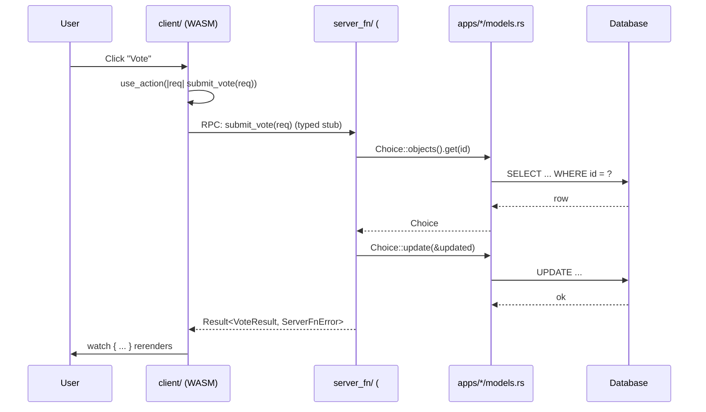

+++
title = "Part 3: Server Functions and Client Components"
weight = 30

[extra]
sidebar_weight = 30
+++

# Part 3: Server Functions and Client Components

In this tutorial, we'll create a modern WASM-based frontend using reinhardt-pages with server-side rendering (SSR) support, and learn how to use server functions for type-safe RPC communication.

## Understanding reinhardt-pages Architecture

reinhardt-pages provides a reactive frontend framework with three layers. These layers correspond 1:1 to directories in the pages template (and to [`examples/examples-tutorial-basis/src/`](https://github.com/kent8192/reinhardt-web/tree/main/examples/examples-tutorial-basis/src)):

- **`src/client/`** — WASM UI components that run in the browser (`#[cfg(wasm)]`)
- **`src/server_fn/`** — server functions that run on the server (bodies are `#[cfg(native)]`, but the function signatures compile for both targets so the client sees a typed stub)
- **`src/shared/`** — DTOs and forms used by both client and server

### "Views" ≡ Server Functions in the Pages Architecture

In a classic Django-style stack, a *view* is a function that receives an HTTP request and returns a response. In the pages architecture, the same role is played by **server functions** declared with `#[server_fn]`:

- They are `async fn` with typed parameters and a typed return `Result<T, ServerFnError>`.
- The server implementation runs natively (database access, business logic).
- The WASM client receives a **typed client stub** that performs the RPC over HTTP.
- There is no hand-written URL + serializer + HTTP client boilerplate — the macro generates it.

The data flow for one user interaction looks like this:



Three takeaways:

1. The client never constructs URLs or parses JSON by hand — it calls `submit_vote(...).await`.
2. The function signature is shared between client and server, so renaming a field in `shared/types.rs` fails to compile on both sides simultaneously (a *fail-early* win, per the Reinhardt design philosophy).
3. DTOs in `src/shared/types.rs` are the *only* types that cross the WASM/native boundary.

This architecture enables:

- **Type-safe RPC**: server functions are called from WASM like regular async functions
- **SSR support**: components can be pre-rendered on the server
- **Reactive UI**: state management with `use_action()` hooks and `watch { ... }` blocks

## Project Setup

### Simplified Conditional Compilation

Starting from Rust 2024 edition, Reinhardt supports simplified conditional compilation attributes for WASM/server targets. Instead of verbose `#[cfg(target_arch = "wasm32")]`, you can use shorter aliases:

- **`#[cfg(wasm)]`** - Code runs only in WASM (browser)
- **`#[cfg(native)]`** - Code runs only on native (server)

This is configured in your `build.rs` using the `cfg_aliases` crate:

```rust
use cfg_aliases::cfg_aliases;

fn main() {
	// Rust 2024 edition requires explicit check-cfg declarations
	println!("cargo::rustc-check-cfg=cfg(wasm)");
	println!("cargo::rustc-check-cfg=cfg(native)");

	cfg_aliases! {
		// Platform aliases for simpler conditional compilation.
		// Use `#[cfg(wasm)]` for browser-only code.
		wasm: { all(target_family = "wasm", target_os = "unknown") },
		// Use `#[cfg(native)]` for server / CLI code.
		native: { not(all(target_family = "wasm", target_os = "unknown")) },
	}

	println!("cargo:rerun-if-changed=build.rs");
}
```

**Benefits:**
- **Shorter code**: `#[cfg(wasm)]` vs `#[cfg(all(target_family = "wasm", target_os = "unknown"))]`
- **Clearer intent**: `wasm` and `native` name exactly what differs (the target family), matching the reference example
- **Easier maintenance**: Less typing, less visual noise

Throughout this tutorial, we use the simplified `#[cfg(wasm)]` and `#[cfg(native)]` syntax. If you see `#[cfg(target_arch = "wasm32")]` in older code, they are equivalent when the build.rs configuration is in place.

### 1. Update Cargo.toml

Add WASM support and reinhardt-pages dependency:

```toml
[lib]
crate-type = ["cdylib", "rlib"]  # cdylib for WASM, rlib for server

# WASM-specific dependencies
# (We select the target by family/os because Cargo does not yet resolve custom
# `cfg_aliases` on the left-hand side of `[target.'cfg(...)'...]` headers.)
[target.'cfg(all(target_family = "wasm", target_os = "unknown"))'.dependencies]
reinhardt = { workspace = true, features = ["pages", "client-router"] }
wasm-bindgen = "0.2"
web-sys = { version = "0.3", features = [
	"Window", "Document", "Element",
] }
console_error_panic_hook = "0.1"

# Server-specific dependencies
[target.'cfg(not(all(target_family = "wasm", target_os = "unknown")))'.dependencies]
reinhardt = { workspace = true, features = [
	"full", "pages", "conf", "commands", "db-sqlite", "forms", "client-router",
] }
tokio = { version = "1", features = ["full"] }
```

> These `[target.'cfg(...)'...]` headers must use the raw `target_family` /
> `target_os` predicates (not the `wasm` / `native` aliases), because Cargo
> evaluates them before `build.rs` registers the aliases. Inside your source
> files, however, you freely use `#[cfg(wasm)]` / `#[cfg(native)]`.

### 2. Create Build Configuration

Create `index.html`:

```html
<!DOCTYPE html>
<html lang="en">
<head>
	<meta charset="UTF-8">
	<meta name="viewport" content="width=device-width, initial-scale=1.0">
	<title>Polls App - Reinhardt Tutorial</title>
	
	<!-- UnoCSS Runtime CDN (for development) -->
	<script src="https://cdn.jsdelivr.net/npm/@unocss/runtime"></script>
	<script>
	window.__unocss = {
		presets: [
			() => ({
				name: 'preset-mini',
				rules: [
					[/^m-(\d+)$/, ([, d]) => ({ margin: `${d / 4}rem` })],
					[/^mt-(\d+)$/, ([, d]) => ({ 'margin-top': `${d / 4}rem` })],
					[/^mb-(\d+)$/, ([, d]) => ({ 'margin-bottom': `${d / 4}rem` })],
					[/^ms-(\d+)$/, ([, d]) => ({ 'margin-left': `${d / 4}rem` })],
					[/^p-(\d+)$/, ([, d]) => ({ padding: `${d / 4}rem` })],
					[/^text-(.+)$/, ([, c]) => ({ color: c })],
					[/^bg-(.+)$/, ([, c]) => ({ 'background-color': c })],
					[/^w-(\d+)$/, ([, d]) => ({ width: `${d / 4}rem` })],
					[/^h-(\d+)$/, ([, d]) => ({ height: `${d / 4}rem` })],
				],
				shortcuts: {
					'container': 'mx-auto max-w-7xl px-4',
					'btn': 'px-4 py-2 rounded cursor-pointer transition inline-block text-center',
					'btn-primary': 'bg-blue-500 text-white hover:bg-blue-600',
					'btn-secondary': 'bg-gray-500 text-white hover:bg-gray-600',
					'spinner': 'animate-spin rounded-full border-2 border-b-transparent',
					'alert': 'px-4 py-3 rounded border',
					'alert-danger': 'bg-red-100 border-red-400 text-red-700',
					'alert-warning': 'bg-yellow-100 border-yellow-400 text-yellow-700',
					'card': 'bg-white rounded shadow',
					'card-body': 'p-6',
					'list-group': 'space-y-2',
					'list-group-item': 'block p-4 bg-white rounded border hover:bg-gray-50',
					'form-check': 'flex items-center space-x-2',
					'badge': 'px-2 py-1 rounded text-sm',
					'badge-primary': 'bg-blue-500 text-white',
				}
			})
		]
	}
	</script>
</head>
<body class="bg-gray-50">
	<div id="root">
		<div class="container mt-20 text-center">
			<div class="spinner w-12 h-12 border-blue-500 inline-block" role="status">
				<span class="sr-only">Loading...</span>
			</div>
		</div>
	</div>
	<script type="module">
		// wasm-bindgen generated module
		import init from './polls_app.js';
		init();
	</script>
</body>
</html>
```

**Note:** This example uses UnoCSS Runtime CDN for development. For production, consider using the build-time UnoCSS compiler for better performance.

### 3. Create Directory Structure

```bash
mkdir -p src/client/components
mkdir -p src/server_fn
mkdir -p src/shared
```

Update `src/lib.rs`:

```rust
// Server-only re-exports for macro-generated code
#[cfg(native)]
mod server_only {
	pub use reinhardt::core::async_trait;
	pub use reinhardt::reinhardt_apps;
	pub use reinhardt::reinhardt_core;
	pub use reinhardt::reinhardt_di::params;
	pub use reinhardt::reinhardt_http;
}
#[cfg(native)]
pub use server_only::*;

// Applications (server-only, polls uses ServerRouter)
#[cfg(native)]
pub mod apps;

// Configuration (urls unconditional, rest server-only)
pub mod config;

// Client-only modules (WASM)
#[cfg(wasm)]
pub mod client;

// Shared modules (both WASM and server)
pub mod server_fn;
pub mod shared;

// Re-exports
#[cfg(native)]
pub use config::settings::get_settings;
```

## Creating Shared Types

Create `src/shared.rs`:

```rust
#[cfg(native)]
pub mod forms;
pub mod types;
```

Create `src/shared/types.rs`:

```rust
use chrono::{DateTime, Utc};
use serde::{Deserialize, Serialize};

#[derive(Debug, Clone, Serialize, Deserialize)]
pub struct QuestionInfo {
	pub id: i64,
	pub question_text: String,
	pub pub_date: DateTime<Utc>,
}

#[derive(Debug, Clone, Serialize, Deserialize)]
pub struct ChoiceInfo {
	pub id: i64,
	pub question_id: i64,
	pub choice_text: String,
	pub votes: i32,
}

#[derive(Debug, Clone, Serialize, Deserialize)]
pub struct VoteRequest {
	pub question_id: i64,
	pub choice_id: i64,
}

// Server-side conversions (not available in WASM)
#[cfg(native)]
impl From<crate::apps::polls::models::Question> for QuestionInfo {
	fn from(question: crate::apps::polls::models::Question) -> Self {
		QuestionInfo {
			id: question.id(),
			question_text: question.question_text().to_string(),
			pub_date: question.pub_date(),
		}
	}
}

#[cfg(native)]
impl From<crate::apps::polls::models::Choice> for ChoiceInfo {
	fn from(choice: crate::apps::polls::models::Choice) -> Self {
		ChoiceInfo {
			id: choice.id(),
			question_id: *choice.question_id(),
			choice_text: choice.choice_text().to_string(),
			votes: choice.votes(),
		}
	}
}
```

## Implementing Server Functions

Create `src/apps/polls/server/server_fn.rs`:

```rust
use crate::shared::types::{ChoiceInfo, QuestionInfo, VoteRequest};
use reinhardt::pages::server_fn::{ServerFnError, server_fn};

// Server-only imports
#[cfg(native)]
use {
	crate::shared::forms::create_vote_form,
	reinhardt::forms::wasm_compat::{FormExt, FormMetadata},
};

/// Get all questions (latest 5)
#[server_fn]
pub async fn get_questions(
	#[inject] _db: reinhardt::DatabaseConnection,
) -> std::result::Result<Vec<QuestionInfo>, ServerFnError> {
	use crate::apps::polls::models::Question;
	use reinhardt::Model;

	let manager = Question::objects();
	let questions = manager
		.all()
		.all()
		.await
		.map_err(|e| ServerFnError::application(e.to_string()))?;

	// Take latest 5 questions
	let latest: Vec<QuestionInfo> = questions
		.into_iter()
		.take(5)
		.map(QuestionInfo::from)
		.collect();

	Ok(latest)
}

/// Get question detail with choices
#[server_fn]
pub async fn get_question_detail(
	question_id: i64,
	#[inject] _db: reinhardt::DatabaseConnection,
) -> std::result::Result<(QuestionInfo, Vec<ChoiceInfo>), ServerFnError> {
	use crate::apps::polls::models::{Choice, Question};
	use reinhardt::Model;
	use reinhardt::db::orm::{FilterOperator, FilterValue};

	// Get question
	let question_manager = Question::objects();
	let question = question_manager
		.get(question_id)
		.first()
		.await
		.map_err(|e| ServerFnError::application(e.to_string()))?
		.ok_or_else(|| ServerFnError::server(404, "Question not found"))?;

	// Get choices
	let choice_manager = Choice::objects();
	let choices = choice_manager
		.filter(
			Choice::field_question_id(),
			FilterOperator::Eq,
			FilterValue::Int(question_id),
		)
		.all()
		.await
		.map_err(|e| ServerFnError::application(e.to_string()))?;

	let question_info = QuestionInfo::from(question);
	let choice_infos: Vec<ChoiceInfo> = choices.into_iter().map(ChoiceInfo::from).collect();

	Ok((question_info, choice_infos))
}

/// Get question results
///
/// Returns the question and all its choices with vote counts.
#[server_fn]
pub async fn get_question_results(
	question_id: i64,
	#[inject] _db: reinhardt::DatabaseConnection,
) -> std::result::Result<(QuestionInfo, Vec<ChoiceInfo>, i32), ServerFnError> {
	use crate::apps::polls::models::{Choice, Question};
	use reinhardt::Model;
	use reinhardt::db::orm::{FilterOperator, FilterValue};

	// Get question
	let question_manager = Question::objects();
	let question = question_manager
		.get(question_id)
		.first()
		.await
		.map_err(|e| ServerFnError::application(e.to_string()))?
		.ok_or_else(|| ServerFnError::server(404, "Question not found"))?;

	// Get choices
	let choice_manager = Choice::objects();
	let choices = choice_manager
		.filter(
			Choice::field_question_id(),
			FilterOperator::Eq,
			FilterValue::Int(question_id),
		)
		.all()
		.await
		.map_err(|e| ServerFnError::application(e.to_string()))?;

	// Calculate total votes
	let total_votes: i32 = choices.iter().map(|c| c.votes()).sum();

	let question_info = QuestionInfo::from(question);
	let choice_infos: Vec<ChoiceInfo> = choices.into_iter().map(ChoiceInfo::from).collect();

	Ok((question_info, choice_infos, total_votes))
}

/// Vote for a choice
///
/// Increments the vote count for the selected choice.
#[server_fn]
pub async fn vote(
	request: VoteRequest,
	#[inject] db: reinhardt::DatabaseConnection,
) -> std::result::Result<ChoiceInfo, ServerFnError> {
	vote_internal(request, db).await
}

/// Get vote form metadata for WASM client rendering
///
/// Returns form metadata with CSRF token for the voting form.
#[cfg(native)]
#[server_fn]
pub async fn get_vote_form_metadata() -> std::result::Result<FormMetadata, ServerFnError> {
	let form = create_vote_form();
	Ok(form.to_metadata())
}

/// Submit vote via form! macro
///
/// Wrapper function that accepts individual field values from form! macro's submit.
/// Converts String field values to the required types and calls the underlying vote function.
#[server_fn]
pub async fn submit_vote(
	question_id: String,
	choice_id: String,
	#[inject] db: reinhardt::DatabaseConnection,
) -> std::result::Result<ChoiceInfo, ServerFnError> {
	let question_id: i64 = question_id
		.parse()
		.map_err(|_| ServerFnError::application("Invalid question_id"))?;
	let choice_id: i64 = choice_id
		.parse()
		.map_err(|_| ServerFnError::application("Invalid choice_id"))?;

	let request = VoteRequest {
		question_id,
		choice_id,
	};

	// Reuse the existing vote logic
	vote_internal(request, db).await
}

/// Internal vote implementation (shared between vote and submit_vote)
#[cfg(native)]
async fn vote_internal(
	request: VoteRequest,
	db: reinhardt::DatabaseConnection,
) -> std::result::Result<ChoiceInfo, ServerFnError> {
	use crate::apps::polls::models::Choice;
	use reinhardt::Model;
	use reinhardt::atomic;

	// Wrap read-modify-write in a transaction to prevent race conditions
	let updated_choice = atomic(&db, || async {
		let choice_manager = Choice::objects();

		// Get the choice
		let mut choice = choice_manager
			.get(request.choice_id)
			.first()
			.await
			.map_err(|e| anyhow::anyhow!(e.to_string()))?
			.ok_or_else(|| anyhow::anyhow!("Choice not found"))?;

		// Verify the choice belongs to the question
		if *choice.question_id() != request.question_id {
			return Err(anyhow::anyhow!("Choice does not belong to this question"));
		}

		// Increment vote count
		choice.vote();

		// Update in database
		let updated = choice_manager
			.update(&choice)
			.await
			.map_err(|e| anyhow::anyhow!(e.to_string()))?;

		Ok(updated)
	})
	.await
	.map_err(|e| ServerFnError::application(e.to_string()))?;

	Ok(ChoiceInfo::from(updated_choice))
}
```

**Key points:**

- `#[server_fn]`: Enables dependency injection for database connections
- `#[inject]` attribute: Automatically injects dependencies like `DatabaseConnection`
- The `#[server_fn]` macro automatically generates WASM client stubs — no manual conditional compilation needed
- Type-safe RPC: Client calls server functions as regular async functions

### Understanding Server Functions in Depth

#### Request/Response Cycle

Server functions provide type-safe RPC communication between WASM client and server:

```
WASM Client                Server
    |                         |
    | 1. Call server_fn       |
    |------------------------>|
    |    (JSON-RPC request)   |
    |                         |
    |                         | 2. Execute with #[inject] deps
    |                         | 3. Return Result<T, ServerFnError>
    |                         |
    | 4. Deserialize response |
    |<------------------------|
    |    (JSON-RPC response)  |
```

**Key Points**:
- Automatic serialization via serde
- Type safety across network boundary
- Transparent error propagation

#### Automatic Serialization

All server function parameters and return types must implement `Serialize` and `Deserialize`:

```rust
use serde::{Serialize, Deserialize};

#[derive(Serialize, Deserialize)]
pub struct VoteRequest {
	pub question_id: i64,
	pub choice_id: i64,
}

#[server_fn]
pub async fn vote(
	request: VoteRequest,  // Automatically deserialized from JSON
	#[inject] db: DatabaseConnection,
) -> Result<ChoiceInfo, ServerFnError> {
	// Return value automatically serialized to JSON
	Ok(ChoiceInfo { /* ... */ })
}
```

**How it works**:
1. Client calls `vote(VoteRequest { ... })` in WASM
2. `#[server_fn]` macro serializes request to JSON
3. HTTP POST to `/api/vote` with JSON body
4. Server deserializes JSON to `VoteRequest`
5. Function executes with injected dependencies
6. Return value serialized to JSON
7. Client receives and deserializes to `Result<ChoiceInfo, ServerFnError>`

#### Error Handling

`ServerFnError` provides centralized error handling across the network boundary:

```rust
use reinhardt::pages::server_fn::ServerFnError;

#[server_fn]
pub async fn get_question(
	id: i64,
	#[inject] db: DatabaseConnection,
) -> Result<QuestionInfo, ServerFnError> {
	// Database error → ServerFnError
	let question = Question::find_by_id(&db, id).await
		.map_err(|e| ServerFnError::application(e.to_string()))?;

	Ok(QuestionInfo::from(question))
}
```

**Common error conversions**:
- `anyhow::Error` → `ServerFnError::application(String)`
- `serde_json::Error` → `ServerFnError::Deserialization(String)`
- Custom errors → implement `From<YourError> for ServerFnError`

**Client-side error handling with `use_action`**:

When using `use_action`, error handling is built into the `Action` type. The action automatically captures errors and exposes them reactively:

```rust
let vote_action = use_action(|req: VoteRequest| async move {
	vote(req).await.map_err(|e| e.to_string())
});

// In page! macro, use watch blocks to react to action state
page!(|vote_action: Action<ChoiceInfo, String>| {
	watch {
		if vote_action.error().is_some() {
			div { class: "alert-danger", { vote_action.error().unwrap_or_default() } }
		}
	}
	watch {
		if vote_action.result().is_some() {
			// Success: navigate or update UI
		}
	}
})
```

#### Automatic WASM Stub Generation

The `#[server_fn]` macro automatically handles conditional compilation. You only need to write the server-side implementation — the macro generates the WASM client stub automatically:

```rust
#[server_fn]
pub async fn vote(
	request: VoteRequest,
	#[inject] db: DatabaseConnection,
) -> Result<ChoiceInfo, ServerFnError> {
	// Server-side implementation only
	let mut choice = Choice::find_by_id(&db, request.choice_id).await
		.map_err(|e| ServerFnError::application(e.to_string()))?;

	choice.vote();
	choice.save(&db).await
		.map_err(|e| ServerFnError::application(e.to_string()))?;

	Ok(ChoiceInfo::from(choice))
}
```

**What happens under the hood:**

When you call `vote(...)` in WASM code, the `#[server_fn]` macro intercepts the call and:
1. Serializes the request to JSON
2. Sends HTTP POST to `/api/vote`
3. Deserializes the response
4. Returns `Result<ChoiceInfo, ServerFnError>`

No manual conditional compilation or `unreachable!()` stubs are needed.

## Creating Client Components

Create `src/client.rs`:

```rust
pub mod lib;
pub mod router;
pub mod pages;
pub mod components;
```

### Polls Index Component

Create `src/client/components.rs`:

```rust
pub mod polls;
```

Create `src/client/components/polls.rs`:

```rust
use crate::shared::types::{ChoiceInfo, QuestionInfo};
use reinhardt::pages::component::Page;
use reinhardt::pages::form;
use reinhardt::pages::page;
use reinhardt::pages::reactive::hooks::{Action, use_action, use_effect};

use crate::server_fn::polls::{
	get_question_detail, get_question_results, get_questions, submit_vote,
};

/// Polls index page - List all polls
pub fn polls_index() -> Page {
	let load_questions =
		use_action(|_: ()| async move { get_questions().await.map_err(|e| e.to_string()) });
	load_questions.dispatch(());

	let load_questions_error = load_questions.clone();
	let load_questions_signal = load_questions.clone();

	page!(|load_questions_error: Action<Vec<QuestionInfo>, String>, load_questions_signal: Action<Vec<QuestionInfo>, String>| {
		div {
			class: "max-w-4xl mx-auto px-4 mt-12",
			h1 {
				class: "mb-4",
				"Polls"
			}
			watch {
				if load_questions_error.error().is_some() {
					div {
						class: "alert-danger",
						{ load_questions_error.error().unwrap_or_default() }
					}
				}
			}
			watch {
				if load_questions_signal.is_pending() {
					div {
						class: "text-center",
						div {
							class: "spinner w-8 h-8",
							role: "status",
							span {
								class: "sr-only",
								"Loading..."
							}
						}
					}
				} else if load_questions_signal.result().unwrap_or_default().is_empty() {
					p {
						class: "text-gray-500",
						"No polls are available."
					}
				} else {
					div {
						class: "space-y-2",
						{
							Page::Fragment(
									load_questions_signal
										.result()
										.unwrap_or_default()
										.iter()
										.map(|question| {
											let href = format!("/polls/{}/", question.id);
											let question_text = question.question_text.clone();
											let pub_date = question.pub_date.format("%Y-%m-%d %H:%M").to_string();
											page!(
												| href : String, question_text : String, pub_date : String | { a {
												href : href, class :
												"block p-4 border rounded hover:bg-gray-50 transition-colors", div {
												class : "flex w-full justify-between", h5 { class : "mb-1", {
												question_text } } small { { pub_date } } } } }
											)(href, question_text, pub_date)
										})
										.collect::<Vec<_>>(),
								)
						}
					}
				}
			}
		}
	})(load_questions_error, load_questions_signal)
}

/// Poll detail page - Show question and voting form
///
/// Uses form! macro with Dynamic ChoiceField for declarative form handling.
/// CSRF protection is automatically injected for POST method.
pub fn polls_detail(question_id: i64) -> Page {
	let qid = question_id;

	// Create action for loading question detail
	let load_detail =
		use_action(
			|qid: i64| async move { get_question_detail(qid).await.map_err(|e| e.to_string()) },
		);

	// Create the voting form using form! macro
	// - server_fn: submit_vote accepts (question_id: String, choice_id: String)
	// - method: Post enables automatic CSRF token injection
	// - state: loading/error signals for form submission feedback
	// - watch blocks for reactive UI updates
	let voting_form = form! {
		name: VotingForm,
		server_fn: submit_vote,
		method: Post,
		state: { loading, error },

		fields: {
			question_id: HiddenField {
				initial: qid.to_string(),
			},
			choice_id: ChoiceField {
				widget: RadioSelect,
				required,
				label: "Select your choice",
				class: "form-check",
				choices_from: "choices",
				choice_value: "id",
				choice_label: "choice_text",
			},
		},

		watch: {
			submit_button: |form| {
				let is_loading = form.loading().get();
				page!(|is_loading: bool| {
					div {
						class: "mt-3",
						button {
							type: "submit",
							class: if is_loading { "btn-primary opacity-50 cursor-not-allowed" } else { "btn-primary" },
							disabled: is_loading,
							{ if is_loading { "Voting..." } else { "Vote" } }
						}
						a {
							href: "/",
							class: "btn-secondary ml-2",
							"Back to Polls"
						}
					}
				})(is_loading)
			},
			error_display: |form| {
				let err = form.error().get();
				page!(|err: Option<String>| {
					watch {
						if let Some(e) = err.clone() {
							div {
								class: "alert-danger mt-3",
								{ e }
							}
						}
					}
				})(err)
			},
			success_navigation: |form| {
				let is_loading = form.loading().get();
				let err = form.error().get();
				page!(|is_loading: bool, err: Option<String>| {
					watch {
						if ! is_loading &&err.is_none() {
							#[cfg(target_arch = "wasm32")]
									{
										if let Some(window) = web_sys::window() {
											let pathname = window.location().pathname().ok();
											if let Some(path) = pathname {
												let parts: Vec<&str> = path.split('/').collect();
												if parts.len() >= 3 && parts[1] == "polls" {
													if let Ok(question_id) = parts[2].parse::<i64>() {
														let results_url = format!("/polls/{}/results/", question_id);
														let _ = window.location().set_href(&results_url);
													}
												}
											}
										}
									}
						}
					}
				})(is_loading, err)
			},
		},
	};

	// Bridge load_detail results to form choices via use_effect
	{
		let load_detail_for_effect = load_detail.clone();
		let voting_form_for_effect = voting_form.clone();
		use_effect(move || {
			if let Some((_, ref choices)) = load_detail_for_effect.result() {
				let choice_options: Vec<(String, String)> = choices
					.iter()
					.map(|c| (c.id.to_string(), c.choice_text.clone()))
					.collect();
				voting_form_for_effect
					.choice_id_choices()
					.set(choice_options);
			}
		});
	}

	// Dispatch the action to load question data
	load_detail.dispatch(qid);

	let load_detail_signal = load_detail.clone();

	// Loading state
	if load_detail_signal.is_pending() {
		return page!(|| {
			div {
				class: "max-w-4xl mx-auto px-4 mt-12 text-center",
				div {
					class: "spinner w-8 h-8",
					role: "status",
					span {
						class: "sr-only",
						"Loading..."
					}
				}
			}
		})();
	}

	// Error state
	if let Some(err) = load_detail_signal.error() {
		return page!(|err: String, question_id: i64| {
			div {
				class: "max-w-4xl mx-auto px-4 mt-12",
				div {
					class: "alert-danger",
					{ err }
				}
				a {
					href: format!("/polls/{}/", question_id),
					class: "btn-secondary",
					"Try Again"
				}
				a {
					href: "/",
					class: "btn-primary ml-2",
					"Back to Polls"
				}
			}
		})(err, question_id);
	}

	// Question found - render voting form
	if let Some((ref q, _)) = load_detail_signal.result() {
		let question_text = q.question_text.clone();
		let form_view = voting_form.into_page();

		page!(|question_text: String, form_view: Page| {
			div {
				class: "max-w-4xl mx-auto px-4 mt-12",
				h1 {
					class: "mb-4",
					{ question_text }
				}
				{ form_view }
			}
		})(question_text, form_view)
	} else {
		// Question not found
		page!(|| {
			div {
				class: "max-w-4xl mx-auto px-4 mt-12",
				div {
					class: "alert-warning",
					"Question not found"
				}
				a {
					href: "/",
					class: "btn-primary",
					"Back to Polls"
				}
			}
		})()
	}
}

/// Poll results page - Show voting results
///
/// Displays the question with vote counts for each choice.
/// Uses watch blocks for reactive UI updates when async data loads.
pub fn polls_results(question_id: i64) -> Page {
	let load_results =
		use_action(
			|qid: i64| async move { get_question_results(qid).await.map_err(|e| e.to_string()) },
		);
	load_results.dispatch(question_id);

	let load_results_signal = load_results.clone();

	page!(|load_results_signal: Action<(QuestionInfo, Vec<ChoiceInfo>, i32), String>, question_id: i64| {
		div {
			watch {
				if load_results_signal.is_pending() {
					div {
						class: "max-w-4xl mx-auto px-4 mt-12 text-center",
						div {
							class: "spinner w-8 h-8",
							role: "status",
							span {
								class: "sr-only",
								"Loading..."
							}
						}
					}
				} else if load_results_signal.error().is_some() {
					div {
						class: "max-w-4xl mx-auto px-4 mt-12",
						div {
							class: "alert-danger",
							{ load_results_signal.error().unwrap_or_default() }
						}
						a {
							href: "/",
							class: "btn-primary",
							"Back to Polls"
						}
					}
				} else if load_results_signal.result().is_some() {
					div {
						class: "max-w-4xl mx-auto px-4 mt-12",
						h1 {
							class: "mb-4",
							{
								load_results_signal
										.result()
										.map(|(q, _, _)| q.question_text.clone())
										.unwrap_or_default()
							}
						}
						div {
							class: "card",
							div {
								class: "card-body",
								h5 {
									class: "text-xl font-bold",
									"Results"
								}
								div {
									class: "divide-y divide-gray-200",
									{
										Page::Fragment(
										        load_results_signal
										            .result()
										            .map(|(_, choices, total)| {
										                choices
										                    .iter()
										                    .map(|choice| {
										                        let percentage = if total > 0 {
										                            (choice.votes as f64 / total as f64 * 100.0) as i32
										                        } else {
										                            0
										                        };
										                        let choice_text = choice.choice_text.clone();
										                        let votes = choice.votes;
										                        page!(
										                            | choice_text : String, votes : i32, percentage : i32 | { div
										                            { class : "py-4", div { class :
										                            "flex justify-between items-center mb-2", strong { {
										                            choice_text } } span { class :
										                            "inline-flex items-center bg-brand rounded-full px-2.5 py-0.5 text-xs font-medium text-white",
										                            { format!("{} votes", votes) } } } div { class :
										                            "w-full bg-gray-200 rounded-full h-2.5", div { class :
										                            "bg-brand h-2.5 rounded-full", role : "progressbar", style :
										                            format!("width: {}%", percentage), aria_valuenow : percentage
										                            .to_string(), aria_valuemin : "0", aria_valuemax : "100", {
										                            format!("{}%", percentage) } } } } }
										                        )(choice_text, votes, percentage)
										                    })
										                    .collect::<Vec<_>>()
										            })
										            .unwrap_or_default(),
										    )
									}
								}
								div {
									class: "mt-3",
									p {
										class: "text-gray-500",
										{
											format!(
													"Total votes: {}",
													load_results_signal
														.result()
														.map(|(_, _, total)| total)
														.unwrap_or(0)
												)
										}
									}
								}
							}
						}
						div {
							class: "mt-3",
							a {
								href: format!("/polls/{}/", question_id),
								class: "btn-primary",
								"Vote Again"
							}
							a {
								href: "/",
								class: "btn-secondary ml-2",
								"Back to Polls"
							}
						}
					}
				} else {
					div {
						class: "max-w-4xl mx-auto px-4 mt-12",
						div {
							class: "alert-warning",
							"Question not found"
						}
						a {
							href: "/",
							class: "btn-primary",
							"Back to Polls"
						}
					}
				}
			}
		}
	})(load_results_signal, question_id)
}
```

**Component patterns:**

- **`page!` macro**: JSX-like syntax for simple HTML structures
- **`use_action()`**: Async data loading and server function calls with built-in loading/error states
- **`form!` macro**: Declarative form handling with server function integration
- **`watch` blocks**: Reactive conditional rendering based on `Action` state
- **`use_effect()`**: Side effects for bridging action results to form state
- **`Action<T, E>`**: Reactive async action type with `is_pending()`, `result()`, `error()` methods
- **`Page`**: Component type returned by `page!` macro (replaces `View`)

### Client-Side Routing

Create `src/client/router.rs`:

```rust
use crate::client::pages::{index_page, polls_detail_page, polls_results_page};
use reinhardt::pages::component::Page;
use reinhardt::pages::page;
use reinhardt::pages::router::Router;
use std::cell::RefCell;

thread_local! {
	static ROUTER: RefCell<Option<Router>> = const { RefCell::new(None) };
}

pub fn init_global_router() {
	ROUTER.with(|r| {
		*r.borrow_mut() = Some(init_router());
	});
}

pub fn with_router<F, R>(f: F) -> R
where
	F: FnOnce(&Router) -> R,
{
	ROUTER.with(|r| {
		f(r.borrow().as_ref()
			.expect("Router not initialized. Call init_global_router() first."))
	})
}

fn init_router() -> Router {
	Router::new()
		.route("/", || index_page())
		.route("/polls/{question_id}/", || {
			with_router(|r| {
				let params = r.current_params().get();
				let question_id_str = params.get("question_id")
					.cloned().unwrap_or_else(|| "0".to_string());

				match question_id_str.parse::<i64>() {
					Ok(question_id) => polls_detail_page(question_id),
					Err(_) => error_page("Invalid question ID"),
				}
			})
		})
		.route("/polls/{question_id}/results/", || {
			with_router(|r| {
				let params = r.current_params().get();
				let question_id_str = params.get("question_id")
					.cloned().unwrap_or_else(|| "0".to_string());

				match question_id_str.parse::<i64>() {
					Ok(question_id) => polls_results_page(question_id),
					Err(_) => error_page("Invalid question ID"),
				}
			})
		})
		.not_found(|| error_page("Page not found"))
}

fn error_page(message: &str) -> Page {
	let message = message.to_string();
	page!(|message: String| {
		div {
			class: "container mt-5",
			div {
				class: "alert alert-danger",
				{ message }
			}
			a {
				href: "/",
				class: "btn btn-primary",
				"Back to Home"
			}
		}
	})(message)
}
```

Create `src/client/pages.rs`:

```rust
use reinhardt::pages::component::Page;

pub fn index_page() -> Page {
	crate::client::components::polls::polls_index()
}

pub fn polls_detail_page(question_id: i64) -> Page {
	crate::client::components::polls::polls_detail(question_id)
}

pub fn polls_results_page(question_id: i64) -> Page {
	crate::client::components::polls::polls_results(question_id)
}
```

### WASM Entry Point

Create `src/client/lib.rs`:

```rust
//! WASM entry point

use reinhardt::pages::dom::Element;
use wasm_bindgen::prelude::*;

use super::router;

pub use router::{init_global_router, with_router};

#[wasm_bindgen(start)]
pub fn main() -> Result<(), JsValue> {
	// Set panic hook for better error messages
	console_error_panic_hook::set_once();

	// Initialize router
	router::init_global_router();

	// Get root element and mount app
	let window = web_sys::window().expect("no global `window` exists");
	let document = window.document().expect("should have a document on window");
	let root = document.get_element_by_id("root")
		.expect("should have #root element");

	// Clear loading spinner
	root.set_inner_html("");

	// Mount router's current view
	router::with_router(|router| {
		let view = router.render_current();
		let root_element = Element::new(root.clone());
		let _ = view.mount(&root_element);
	});

	Ok(())
}
```

## Running the Application

### Install WASM Build Tools (First Time Only)

```bash
cargo make install-wasm-tools
```

This installs:
- `wasm32-unknown-unknown` target for Rust
- `wasm-pack` for building, testing, and publishing Rust-generated WebAssembly
- `wasm-opt` for optimization (via binaryen)

### Development Server

```bash
cargo make dev
```

Visit `http://127.0.0.1:8000/` in your browser.

**Features:**
- WASM automatically built before server starts
- Static files served from same server as API
- SPA mode with index.html fallback for client-side routing

### Watch Mode (Auto-Rebuild)

```bash
cargo make dev-watch
```

This watches for file changes and automatically rebuilds WASM.

### Production Build

```bash
cargo make wasm-build-release
```

Output files in `dist/` directory with optimized WASM.

## Advanced Topics (Optional)

The reinhardt-pages pattern shown in this tutorial focuses on server functions for type-safe RPC communication. For other API patterns supported by Reinhardt, see the REST API tutorial series.

> **Note**: For GraphQL support with Reinhardt, refer to the GraphQL documentation (coming soon) or the REST API tutorial series.

### Server Functions with reinhardt-pages

The server functions pattern demonstrated in this tutorial provides:

- **Type-safe RPC**: Server functions called from WASM like regular async functions
- **Automatic serialization**: serde handles request/response encoding
- **Dependency injection**: `#[inject]` attribute for database connections
- **SSR support**: Components can be pre-rendered on the server

**When to use:**
- Building full-stack Rust applications (WASM + SSR)
- Need seamless client-server integration
- Want reactive UI with server-side data

**Example:** See [examples/examples-twitter](../../../../examples/examples-twitter) for a complete implementation.

### Recommendation

**For different project types:**

- **WASM + SSR Apps** → reinhardt-pages (this tutorial)
- **REST APIs** → DefaultRouter with HTTP method decorators
- **GraphQL APIs** → async-graphql integration

The examples mentioned above demonstrate production-ready patterns for each approach.

> **Note**: The example project (`examples-tutorial-basis`) also includes a REST API layer in `apps/polls/` (views, serializers, URLs) demonstrating the traditional server-side approach alongside the reinhardt-pages approach covered in this tutorial. For REST API patterns, see the [REST API Tutorial series](/quickstart/tutorials/rest/).

## Summary

In this tutorial, you learned:

- How to set up a reinhardt-pages project with WASM support
- How to create shared types for client-server communication
- How to implement server functions with dependency injection
- How to build reactive UI components with `page!` macro and `form!` macro
- How to use `use_action()` hooks for async data loading with built-in loading/error states
- How to set up client-side routing with dynamic parameters
- How to run development server with `cargo make dev`

## What's Next?

In the next tutorial, we'll explore form processing and validation in reinhardt-pages applications.

Continue to [Part 4: Forms and Generic Views](../4-forms-and-generic-views/).
