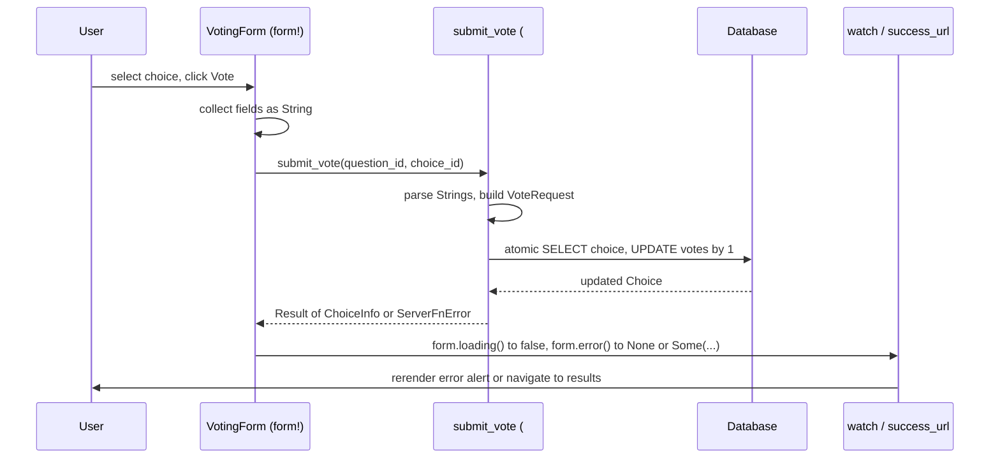

+++
title = "Part 4: Client-Side Forms and Component Patterns"
weight = 40

[extra]
sidebar_weight = 40
+++

# Part 4: Client-Side Forms and Component Patterns

In this chapter we add the interactive layer of the polling app: the voting form, the question CUD pages, and the choice CUD pages. The work splits across three files of the reference implementation:

- [`src/shared/types.rs`](https://github.com/kent8192/reinhardt-web/tree/main/examples/examples-tutorial-basis/src/shared/types.rs) — DTOs that cross the WASM/native boundary, plus the `#[derive(Validate)]` rules that run *only* on the server.
- [`src/shared/forms.rs`](https://github.com/kent8192/reinhardt-web/tree/main/examples/examples-tutorial-basis/src/shared/forms.rs) — server-only `form!` definitions whose metadata and runtime contract are pinned with `use_form(&form).build()` in unit tests.
- [`src/apps/polls/client/components.rs`](https://github.com/kent8192/reinhardt-web/tree/main/examples/examples-tutorial-basis/src/apps/polls/client/components.rs) — the `form!` macro pages backed by `#[server_fn]` mutations in [`src/apps/polls/server_fn.rs`](https://github.com/kent8192/reinhardt-web/tree/main/examples/examples-tutorial-basis/src/apps/polls/server_fn.rs).

If you are coming from Django, this is roughly the chapter where "forms + ModelForm + class-based generic views" would appear. The pages template solves the same problem with a different cast: typed DTO validators, a server-side `form!` contract for metadata/runtime checks, and the **`form!`** macro on the client that renders the UI and dispatches to a `#[server_fn]`.

There is no `ListView` or `DetailView` to import. The closest equivalent is the page factory functions you wrote in Part 3 (`polls_index`, `polls_detail`, …) composed with the reactive `page!` / `form!` / `use_resource` primitives. We will not introduce any new "generic view" concept — the parts you already have are enough, and we will lean on them harder.

## The Two Flavors of Validation in This Tutorial

Reinhardt offers two complementary validation paths and the tutorial uses both. Knowing which goes where keeps the WASM bundle small and the server checks honest:

| Flavor | Where it lives | What it validates | What enforces it |
|---|---|---|---|
| **DTO field validation** | `src/shared/types.rs` | The shape of a single request payload (lengths, non-empty, etc.) | The server, by calling `request.validate()` inside a `#[server_fn]` |
| **Form metadata + runtime contract** | `src/shared/forms.rs` (server-only) | The HTML form schema and default runtime state | The generated `form!` submit path |

Notice what *neither* does: client-side mirror validation. We deliberately do not derive `Validate` on the WASM side — the server is the source of truth, and shaving the validator crate off the browser bundle is worth the round trip for a server error message.

### Flavor 1: DTO field validation in `shared/types.rs`

The `LoginRequest` and `RegisterRequest` DTOs both live in `src/shared/types.rs`. They are normal `serde` payloads, decorated with the **`#[dto]`** attribute macro — `#[dto]` is the convention-driven entry point that wraps `Validate` (and an OpenAPI `Schema`) `derive` behind `cfg(native)` for you, so the per-field `#[validate(...)]` attributes can be written plainly without any `#[cfg_attr(...)]` noise:

```rust
// src/shared/types.rs

use chrono::{DateTime, Utc};
use reinhardt::dto;
use serde::{Deserialize, Serialize};

/// Login request (DTO)
///
/// Sent from the WASM client to the server when submitting the login form.
///
/// The `#[dto]` macro emits `Validate` (and an OpenAPI `Schema`)
/// derive behind `cfg(native)` so the WASM client does not pull in the
/// validator-crate machinery — the server is the only side that runs
/// `request.validate()` before hitting the database.
#[dto]
#[derive(Debug, Clone, Serialize, Deserialize)]
pub struct LoginRequest {
	#[validate(length(
		min = 1,
		max = 150,
		message = "Username must be between 1 and 150 characters"
	))]
	pub username: String,

	#[validate(length(min = 1, message = "Password must not be empty"))]
	pub password: String,
}

/// Register request (DTO)
///
/// Sent from the WASM client to the server when submitting the sign-up form.
/// `password_confirmation` is matched against `password` server-side; both
/// fields travel in the clear over HTTPS just like the login form and are
/// never persisted — only the Argon2 hash of `password` is stored.
///
/// Validation gating is handled by `#[dto]` (same rationale as on
/// [`LoginRequest`]). Field-level rules (length / non-empty) run through
/// `request.validate()`; the password-confirmation equality check is
/// expressed as a dedicated [`RegisterRequest::validate_passwords_match`]
/// helper because the validator crate's `must_match` is brittle across
/// versions (mirroring the pattern used by the tutorial examples).
#[dto]
#[derive(Debug, Clone, Serialize, Deserialize)]
pub struct RegisterRequest {
	#[validate(length(
		min = 1,
		max = 150,
		message = "Username must be between 1 and 150 characters"
	))]
	pub username: String,

	#[validate(length(min = 8, message = "Password must be at least 8 characters"))]
	pub password: String,

	#[validate(length(
		min = 8,
		message = "Password confirmation must be at least 8 characters"
	))]
	pub password_confirmation: String,
}
```

Three details are load-bearing:

1. **`#[dto]`** — this single attribute is the convention. It emits `#[cfg_attr(native, derive(Validate, Schema))]` for you so the validator-crate `derive` (and the OpenAPI `Schema` derive) are server-only. On WASM the struct still serialises and deserialises, but it has no `validate()` method and pulls in neither dependency.
2. **Plain `#[validate(...)]`** on every rule — no `#[cfg_attr(...)]` wrapping needed. `#[dto]` propagates the native-only gating to these attributes too, so the validator crate is not pulled into the browser bundle at all.
3. **No `must_match` for password confirmation.** Cross-field equality lives in a hand-written helper rather than the derive macro:

```rust
// src/shared/types.rs (continued)

#[cfg(native)]
impl RegisterRequest {
	/// Confirm that `password` and `password_confirmation` match.
	///
	/// Kept out of the derived `Validate` because the validator crate's
	/// `must_match` argument is positional (string field name), brittle
	/// across versions, and produces an awkward error message at the
	/// struct level rather than against the confirmation field. The
	/// server function calls this immediately after `request.validate()`
	/// so the two checks surface as the same kind of `ServerFnError`.
	pub fn validate_passwords_match(&self) -> Result<(), &'static str> {
		if self.password == self.password_confirmation {
			Ok(())
		} else {
			Err("Passwords do not match")
		}
	}
}
```

A server function that consumes `RegisterRequest` first runs `request.validate()?` (the derived field-level checks), then `request.validate_passwords_match()?` (the manual cross-field check). Both produce the same `ServerFnError::server(400, …)` shape so the client treats them identically.

### Flavor 2: Form metadata + runtime contract in `shared/forms.rs`

The other piece we need is *not* about a DTO payload — it is about HTML
forms: which fields exist, what widgets they render with, and what
initial runtime state the generated form exposes. That lives in
`src/shared/forms.rs`, which is gated `#[cfg(native)] pub mod forms;`
from `src/shared.rs`:

```rust
// src/shared.rs

//! Shared types and utilities
//!
//! This module contains types and utilities shared between client and server.

#[cfg(native)]
pub mod forms;
pub mod types;
```

```rust
// src/shared/forms.rs

//! Form definitions for examples-tutorial-basis.
//!
//! The static form shape is declared with `form!`; runtime state is derived
//! from the generated form contract through `use_form`.

use crate::apps::polls::server_fn::submit_vote;
use reinhardt::pages::{StaticFormMetadata, form, use_form};

/// Create vote form metadata from the generated form definition.
///
/// This form is primarily used to expose metadata for the voting form.
/// Runtime behavior is still instantiated here through `use_form` so the
/// metadata and runtime contract are generated from the same `form!` source.
pub fn create_vote_form() -> StaticFormMetadata {
	let form = form! {
		name: VoteForm,
		server_fn: submit_vote,
		method: Post,
		fields: {
			question_id: HiddenField {
				initial: String::new(),
			}
			choice_id: HiddenField {
				initial: String::new(),
				label: "Choice",
				required,
			}
		}
	};
	let _runtime = use_form(&form).build();
	form.metadata()
}
```

That is the entire file. It does three things and nothing else:

1. Declares the static voting form shape with `form!`.
2. Builds the runtime contract with `use_form(&form).build()` so tests
   exercise the same generated surface the client relies on.
3. Returns `StaticFormMetadata` through `form.metadata()`.

This helper never runs in the browser — it cannot, because the `forms`
module is `#[cfg(native)]`. Its job is to pin the native metadata and
runtime contract to the same `form!` source instead of hand-building a
second, drifting representation.

A small unit test in the same file shows the metadata shape:

```rust
// src/shared/forms.rs (continued)

#[cfg(test)]
mod tests {
	use super::*;
	use rstest::rstest;

	#[rstest]
	fn test_vote_form_metadata() {
		let metadata = create_vote_form();

		assert_eq!(metadata.fields.len(), 2);
		assert_eq!(metadata.fields[0].name, "question_id");
		assert_eq!(metadata.fields[1].name, "choice_id");
		assert!(metadata.fields[1].required);
	}

	#[rstest]
	fn test_vote_form_runtime_contract() {
		let form = form! {
			name: VoteForm,
			server_fn: submit_vote,
			method: Post,
			fields: {
				question_id: HiddenField {
					initial: String::new(),
				}
				choice_id: HiddenField {
					initial: String::new(),
					label: "Choice",
					required,
				}
			}
		};
		let runtime = use_form(&form).build();

		assert_eq!(runtime.get_values().question_id, String::new());
		assert_eq!(runtime.get_values().choice_id, String::new());
		assert!(!runtime.form_state().is_dirty.get());
		assert!(!runtime.get_field_state(form.choice_id_field()).is_dirty);
	}
}
```

`form.metadata()` is the bridge from the static generated form contract to
serialisable metadata. `use_form(&form).build()` verifies the runtime
surface that code using the generated form expects.

## Exposing the Form to the WASM Client

The WASM client cannot call `create_vote_form()` directly — that function exists only when `#[cfg(native)]` is set. But it does not have to: the `form!` macro that drives the voting page (covered in the next section) handles the metadata plumbing internally. When a `form!` block declares `server_fn: submit_vote` + `method: Post`, the macro emits the matching metadata and wires submission to the generated server-function client stub. CSRF for WASM submissions is supplied by that stub through `X-CSRFToken` and verified by middleware before the handler runs; it is no longer modeled as a trailing business argument in `submit_vote`.

This is the convention the reference example settled on. Earlier iterations of the tutorial exposed a `get_vote_form_metadata` server function for this purpose, and that pattern is still viable for one-off bespoke forms — but the typed `form!` macro removes the need from the canonical voting case, so the project no longer ships that handler.

## The `form!` Macro on the Client

Now the interesting part: `form!`. This is the single recommended path for forms in this tutorial — and in nearly every production reinhardt-pages component. It is declarative, it integrates with `#[server_fn]`, and it lets you trade a few lines of macro syntax for what would otherwise be dozens of lines of imperative `use_state` plumbing.

We will walk through the voting form from `src/apps/polls/client/components.rs`. The shape is dense; here is the core path, then we will break it down.

### The voting form, core path

```rust
// src/apps/polls/client/components.rs (extract)

use crate::shared::types::{ChoiceInfo, QuestionInfo, UserInfo};
use reinhardt::pages::component::Page;
use reinhardt::pages::form;
use reinhardt::pages::page;
use reinhardt::pages::reactive::{Resource, ResourceState, Signal, use_resource};

use crate::apps::polls::server_fn::{
	create_choice, create_question, delete_choice, delete_question, get_question_detail,
	get_question_results, get_questions, submit_vote, update_choice, update_question,
};
use crate::apps::polls::urls::client_router as polls_routes;
use crate::apps::users::server_fn::current_user;

/// Poll detail page - Show question and voting form
pub fn polls_detail(question_id: i64) -> Page {
	let qid = question_id;

	let load_detail = use_resource(
		move || async move { get_question_detail(qid).await.map_err(|e| e.to_string()) },
		(),
	);

	let load_current_user = use_resource(
		|| async move { current_user().await.map_err(|e| e.to_string()) },
		(),
	);

	// Keep this form instance stable for the lifetime of the route component;
	// recreating it inside the reactive render branch would reset the selected
	// radio value immediately after a change event.
	//
	// - server_fn: submit_vote accepts (question_id, choice_id)
	// - method: Post enables CSRF hidden input rendering for non-WASM submits
	// - success_url navigates through the SPA router after a successful vote
	let voting_form = form! {
		name: VotingForm,
		server_fn: submit_vote,
		method: Post,
		success_url: |_form| polls_routes::reverse("results", &[("question_id", qid.to_string().as_str())]),
		fields: {
			question_id: HiddenField {
				initial: qid.to_string(),
			}
			choice_id: ChoiceField {
				widget: RadioSelect,
				required,
				label: "Select your choice",
				class: "poll-choice-input",
				wrapper_class: "poll-choice-field",
				label_class: "poll-choice-label",
				choices_from: "choices",
				choice_value: "id",
				choice_label: "choice_text",
			}
		}
		watch: {
			submit_button: |form| {
				let is_loading = form.loading().get();
				let back_href = polls_routes::reverse("index", &[]);
				page!(|is_loading: bool, back_href: String| {
					div {
						class: "mt-3",
						button {
							type: "submit",
							class: if is_loading { "btn-primary opacity-50 cursor-not-allowed" } else { "btn-primary" },
							disabled: is_loading,
							{
								if is_loading { "Voting..." } else { "Vote" }
							}
						}
						a {
							href: back_href,
							class: "btn-secondary ml-2",
							"Back to Polls"
						}
					}
				})(is_loading, back_href)
			},
			error_display: |form| {
				let err = form.error().get();
				page!(|err: Option<String>| { {
					err.clone().map(|e| page!(|e: String| {
						div {
							class: "alert-danger mt-3",
							{ self::format_server_error(&e) }
						}
					})(e)).unwrap_or(Page::Empty)
				} })(err)
			},
		}
	};
	let choice_options_signal = voting_form.choice_id_choices().clone();
	let voting_form_page = voting_form.into_page();

	page!(|load_detail: Resource<(QuestionInfo, Vec<ChoiceInfo>), String>, load_current_user: Resource<Option<UserInfo>, String>, choice_options_signal: Signal<Vec<(String, String)>>, voting_form_page: Page, question_id: i64| {
		div { {
			match load_detail.get() {
				ResourceState::Loading => page!(|| {
					div {
						class: "max-w-4xl mx-auto px-4 mt-12 text-center",
						"Loading..."
					}
				})(),
				ResourceState::Error(error) => page!(|error: String| {
					div {
						class: "alert-danger",
						{ self::format_server_error(&error) }
					}
				})(error),
				ResourceState::Success((q, choices)) => {
					let is_author = matches!(
						load_current_user.get(),
						ResourceState::Success(Some(ref u)) if u.id == q.author_id
					);
					let choices_view = if choices.is_empty() {
						page!(|| {
							div {
								class: "alert-warning",
								"This question has no choices yet. Add one below to start voting."
							}
						})()
					} else {
						let choice_options: Vec<(String, String)> = choices
							.iter()
							.map(|c| (c.id.to_string(), c.choice_text.clone()))
							.collect();
						if choice_options_signal.get_untracked() != choice_options {
							choice_options_signal.set(choice_options);
						}
						voting_form_page.clone()
					};
					page!(|q: QuestionInfo, is_author: bool, choices_view: Page, question_id: i64| {
						div {
							h1 { { q.question_text.clone() } }
							a {
								href: polls_routes::reverse("results", &[("question_id", question_id.to_string().as_str())]),
								class: "btn-secondary",
								"View results"
							}
							{ choices_view }
							if is_author {
								a {
									href: polls_routes::reverse("choice_new", &[("question_id", question_id.to_string().as_str())]),
									class: "btn-secondary",
									"Add choice"
								}
							}
						}
					})(q, is_author, choices_view, question_id)
				}
			}
		} }
	})(load_detail, load_current_user, choice_options_signal, voting_form_page, question_id)
}
```

### Reading the macro top-to-bottom

The block above is doing six things; the cleanest way to internalise `form!` is to map each clause back to what it produces.

| Clause | What it means |
|---|---|
| `name: VotingForm` | Names the generated struct (`VotingForm`) and DOM id (`voting-form`). Used by `<button form="…">` references later. |
| `server_fn: submit_vote` | Picks the `#[server_fn]` this form submits to. The macro generates a client-side call to it on submit. |
| `method: Post` | Tells the macro this is a mutating form. The generated `#[server_fn]` client stub handles CSRF transport for WASM submissions. |
| `success_url: |_form| …` | Resolves the route to navigate to after a successful submit. The example uses `polls_routes::reverse("results", …)` so navigation stays tied to the app router. |
| `fields: { … }` | Declares the form fields. `HiddenField`, `CharField`, `ChoiceField`, etc., correspond to widget builders the macro knows about. |
| `watch: { … }` | Reactive view fragments — small `page!` blocks whose output is re-evaluated whenever the signals they capture change. |

Two behaviours are worth flagging because they are easy to miss:

1. **All fields submit as `String`.** This is tracked upstream as [reinhardt-web#4397](https://github.com/kent8192/reinhardt-web/issues/4397). Once that ships, the matching `#[server_fn]` will be able to accept typed parameters directly. Until then, every server function reachable from `form!` accepts `String` and parses inside the handler — we will see this in the next section.
2. **CSRF is transport-level for the WASM path.** The `#[server_fn]` client stub attaches `X-CSRFToken`, and middleware verifies it before the handler runs. Do not add an extra CSRF field to the business signature just to satisfy `form!`.

### What the generated `voting_form` value gives you

The macro returns a struct value (here, `voting_form: VotingForm`) with three useful surfaces:

- `voting_form.loading()` and `voting_form.error()` — compatibility submit signals generated by `form!`.
- `voting_form.choice_id_choices()` — a setter signal generated because the `choice_id` field carries `choices_from: "choices"`. We populate it dynamically below.
- `voting_form.into_page()` — converts the form into a `Page` you can drop inside an outer `page! { … }`.

This is the entirety of the macro's public surface — there is no hidden registry, no global state, no decorator stack to climb.

## Reactive UI Patterns: `page!`, `watch`, `use_resource`

Three primitives appear over and over in the components. They are the entire reactive vocabulary the tutorial uses.

### `page!`

`page!(|deps: Type, …| { html-like body })(deps, …)` builds a `Page` whose body is recomputed whenever the captured dependencies change. The closure-then-arguments shape is what lets the macro track exactly which signals each fragment depends on. You can see it used both at the top level (returning the full page) and inside `watch` clauses (returning fragment trees).

### `watch { … }`

A `watch { … }` block is a *conditional fragment*. The block's body is re-evaluated whenever any signal it references changes value; if the condition is false the fragment disappears from the DOM. In the voting form above, two `watch` fragments live inside the `watch:` clause of `form!`:

- `submit_button` re-renders when `form.loading()` flips, swapping the button label between *Vote* and *Voting…* and toggling the `opacity-50 cursor-not-allowed` classes.
- `error_display` mounts an `alert-danger` div when `form.error()` becomes `Some(…)`, and unmounts it when it returns to `None`.

Success navigation is not a separate watch block here. It belongs in the
`success_url` clause, where the generated form submit path can navigate
through the route table after the server function succeeds.

### `use_resource`

`use_resource(fetcher, deps)` runs an async fetcher and exposes its state
as `ResourceState::Loading`, `ResourceState::Error`, or
`ResourceState::Success`. In the detail page we have:

```rust
let load_detail = use_resource(
	move || async move { get_question_detail(qid).await.map_err(|e| e.to_string()) },
	(),
);
```

The full `polls_detail` function reads `load_detail.get()` once inside the
outer `page!` block and matches on the resource state to render a spinner,
an error card, or the question and voting form. The second resource,
`load_current_user`, resolves the current session user so owner-only links
can be hidden without mixing authorization into the route component.

## Connecting Form Metadata + Resource Data: the Voting Lifecycle

The voting form's choices are not known at compile time — they come from
the database. The pattern that wires loaded data into a `form!` is to keep
the form instance stable, clone its generated choices signal, and update
that signal from the `ResourceState::Success` branch that already has the
loaded `Vec<ChoiceInfo>`:

```rust
// src/apps/polls/client/components.rs (continued)

let choice_options_signal = voting_form.choice_id_choices().clone();
let voting_form_page = voting_form.into_page();

// Later, inside ResourceState::Success((q, choices)):
let choice_options: Vec<(String, String)> = choices
	.iter()
	.map(|c| (c.id.to_string(), c.choice_text.clone()))
	.collect();
if choice_options_signal.get_untracked() != choice_options {
	choice_options_signal.set(choice_options);
}
voting_form_page.clone()
```

The `Vec<ChoiceInfo>` becomes the `Vec<(String, String)>` shape that
`choices_from: "choices"` expects — value first, label second. The
`get_untracked()` guard avoids re-setting the signal to the same value on
every render. Keeping `voting_form_page` outside the success branch also
keeps the radio input state stable across reactive updates.

When the user picks a choice and presses Vote, the complete round-trip looks like this:



The CSRF check happens *before* `submit_vote` runs — it is a middleware concern, not a handler concern.

Here is the matching server function in full, including the `String`-typed workaround commented at the top of the CUD block:

```rust
// src/apps/polls/server_fn.rs

/// Submit vote via form! macro
///
/// Wrapper function that accepts individual field values from form! macro's submit.
/// Converts String field values to the required types and calls the underlying vote function.
///
/// CSRF is supplied by the `#[server_fn]` client stub through `X-CSRFToken`
/// and verified by middleware before this handler runs.
#[server_fn]
pub async fn submit_vote(
	question_id: String,
	choice_id: String,
	#[inject] db: reinhardt::DatabaseConnection,
) -> std::result::Result<ChoiceInfo, ServerFnError> {
	let question_id: i64 = question_id
		.parse()
		.map_err(|_| ServerFnError::application("Invalid question_id"))?;
	let choice_id: i64 = choice_id
		.parse()
		.map_err(|_| ServerFnError::application("Invalid choice_id"))?;

	let request = VoteRequest {
		question_id,
		choice_id,
	};

	// Reuse the existing vote logic
	vote_internal(request, db).await
}
```

`vote_internal` is the reusable native helper (already covered in Part 3); it wraps the read-modify-write in `atomic(&db, …)` so two simultaneous voters cannot race past one another. Notice that the typed `vote` server function still exists alongside `submit_vote` — that one accepts a real `VoteRequest` and is the better entry point for code that calls server functions directly (e.g. tests, native code, future clients). `submit_vote` is the `form!` adapter.

## Question CUD via `form!`

The voting form is the headline use case, but the same pattern composes naturally for create / update / delete. The Question CUD handlers in `src/apps/polls/server_fn.rs` show what an authenticated mutation looks like when stitched together with the `String`-based ABI and the session-user DI factory (see Part 3 for the factory definition):

```rust
// src/apps/polls/server_fn.rs

// =========================================================================
// Question CUD (Phase 2)
// =========================================================================
//
// All three mutations below follow the same conventions:
//
// * Every form field is received as `String` because `form!` currently
//   serializes all fields as strings on submit. This is tracked upstream as
//   reinhardt-web#4397 — once that ships, the `String` + `.parse()` dance
//   below can be replaced with the typed signatures shown next to each
//   handler. CSRF is handled by the generated server-function client stub
//   and middleware, so it is not part of these business signatures.
// * Authentication is required: `Depends<Result<User, SessionError>>` is
//   resolved by the request-scoped factory in `apps::polls::di` and
//   exposes `.as_ref().map_err(ServerFnError::from)?` for the 401/403/500
//   surface.
// * For `update_question` and `delete_question`, ownership is enforced by
//   comparing `question.author_id()` with the current user's id; mismatched
//   ownership returns a 403.

/// Create a new question owned by the current user.
///
/// Ideal implementation (without the form! String workaround tracked in #4397):
///   pub async fn create_question(
///       question_text: String,
///       #[inject] _db: reinhardt::DatabaseConnection,
///       #[inject] session_user: Depends<Result<User, SessionError>>,
///   ) -> std::result::Result<QuestionInfo, ServerFnError> { ... }
#[server_fn]
pub async fn create_question(
	question_text: String,
	#[inject] _db: reinhardt::DatabaseConnection,
	#[inject] session_user: Depends<Result<User, SessionError>>,
) -> std::result::Result<QuestionInfo, ServerFnError> {
	use crate::apps::polls::models::Question;

	let user = (*session_user).as_ref().map_err(ServerFnError::from)?;

	let trimmed = question_text.trim();
	if trimmed.is_empty() || trimmed.len() > 200 {
		return Err(ServerFnError::server(
			400,
			"Question text must be between 1 and 200 characters",
		));
	}

	let manager = Question::objects();
	let new_question = Question::build()
		.question_text(trimmed)
		.author(user.id())
		.finish();
	let saved = manager
		.create(&new_question)
		.await
		.map_err(|e| ServerFnError::application(format!("Database error: {}", e)))?;

	Ok(QuestionInfo::from(saved))
}
```

`(*session_user).as_ref().map_err(ServerFnError::from)?` is the shared 401/403/500 gate, layered on the session-user DI factory in `apps::polls::di`. The factory does the "load user_id from session, fetch the row, classify Anonymous / active / Inactive / Unavailable" dance once per request and returns a `Result<User, SessionError>`; each authenticated handler just borrows the result and converts the error via `From<&SessionError>`:

```rust
// src/apps/polls/di.rs (extract)

/// Error variants for the session-based user lookup factory.
///
/// Three failure modes are distinguished so handlers can surface the
/// correct HTTP status *and* so that an operational outage (DB
/// connection drop, query timeout) does not get silently rewritten into
/// a fake 401:
///
/// - `Anonymous` — no `user_id` in the session, or the row has been
///   deleted between login and request. Surfaced as **401** via
///   `From<&SessionError> for ServerFnError`.
/// - `Inactive` — a row exists but `is_active = false`. Surfaced as **403**.
/// - `Unavailable` — the user-lookup query itself failed (DB down, pool
///   exhausted, schema mismatch, …). Surfaced as **500** so the client sees
///   an operational error instead of being pushed into a misleading re-auth
///   loop.
#[derive(Clone, Debug)]
pub enum SessionError {
	Anonymous,
	Inactive,
	Unavailable(String),
}

/// Convert a `SessionError` reference to a `ServerFnError` with the
/// appropriate HTTP status code.
///
/// Handlers use this via `user.as_ref().map_err(ServerFnError::from)?`
/// to surface a 401, 403, or 500 depending on the failure mode.
impl From<&SessionError> for ServerFnError {
	fn from(err: &SessionError) -> Self {
		match err {
			SessionError::Anonymous => ServerFnError::server(401, "Authentication required"),
			SessionError::Inactive => ServerFnError::server(403, "User account is inactive"),
			SessionError::Unavailable(_) => {
				ServerFnError::server(500, "User lookup temporarily unavailable")
			}
		}
	}
}

#[injectable_factory(scope = "request")]
async fn session_user_factory(
	#[inject] session: SessionData,
) -> Result<User, SessionError> { /* ... */ }
```

`update_question` and `delete_question` follow the same shape; the only difference is the ownership check after loading the row:

```rust
// src/apps/polls/server_fn.rs (continued)

/// Update a question's text. Only the author may update.
///
/// Ideal implementation (without the form! String workaround tracked in #4397):
///   pub async fn update_question(
///       question_id: i64,
///       question_text: String,
///       ...
///   ) -> std::result::Result<QuestionInfo, ServerFnError> { ... }
#[server_fn]
pub async fn update_question(
	question_id: String,
	question_text: String,
	#[inject] _db: reinhardt::DatabaseConnection,
	#[inject] session_user: Depends<Result<User, SessionError>>,
) -> std::result::Result<QuestionInfo, ServerFnError> {
	use crate::apps::polls::models::Question;

	let user = (*session_user).as_ref().map_err(ServerFnError::from)?;

	let question_id: i64 = question_id
		.parse()
		.map_err(|_| ServerFnError::application("Invalid question_id"))?;

	let trimmed = question_text.trim();
	if trimmed.is_empty() || trimmed.len() > 200 {
		return Err(ServerFnError::server(
			400,
			"Question text must be between 1 and 200 characters",
		));
	}

	let manager = Question::objects();
	let mut question = manager
		.get(question_id)
		.first()
		.await
		.map_err(|e| ServerFnError::application(format!("Database error: {}", e)))?
		.ok_or_else(|| ServerFnError::server(404, "Question not found"))?;

	if *question.author_id() != user.id() {
		return Err(ServerFnError::server(
			403,
			"Only the question's author can edit it",
		));
	}

	question.question_text = trimmed.to_string();

	let updated = manager
		.update(&question)
		.await
		.map_err(|e| ServerFnError::application(format!("Database error: {}", e)))?;

	Ok(QuestionInfo::from(updated))
}

/// Delete a question. Only the author may delete.
///
/// Ideal implementation (without the form! String workaround tracked in #4397):
///   pub async fn delete_question(
///       question_id: i64,
///       ...
///   ) -> std::result::Result<(), ServerFnError> { ... }
#[server_fn]
pub async fn delete_question(
	question_id: String,
	#[inject] _db: reinhardt::DatabaseConnection,
	#[inject] session_user: Depends<Result<User, SessionError>>,
) -> std::result::Result<(), ServerFnError> {
	use crate::apps::polls::models::Question;

	let user = (*session_user).as_ref().map_err(ServerFnError::from)?;

	let question_id: i64 = question_id
		.parse()
		.map_err(|_| ServerFnError::application("Invalid question_id"))?;

	let manager = Question::objects();
	let question = manager
		.get(question_id)
		.first()
		.await
		.map_err(|e| ServerFnError::application(format!("Database error: {}", e)))?
		.ok_or_else(|| ServerFnError::server(404, "Question not found"))?;

	if *question.author_id() != user.id() {
		return Err(ServerFnError::server(
			403,
			"Only the question's author can delete it",
		));
	}

	manager
		.delete(question.id())
		.await
		.map_err(|e| ServerFnError::application(format!("Database error: {}", e)))?;

	Ok(())
}
```

The "ideal implementation" comments in the source are not aspirational decoration — they are the literal signatures the handlers will collapse to once `form!` ships typed-field serialisation (#4397). The intent is that the only thing that needs to change in this file then is the parameter types and the deletion of the `.parse()` lines; the rest of the body, the session check, and the ownership check stay put.

### What the client side of CUD looks like

The matching client pages are short. Here is the "new question" page — it is the entire pattern in one block:

```rust
// src/apps/polls/client/components.rs (extract)

/// New question page (`/polls/new/`).
pub fn question_new() -> Page {
	let new_form = form! {
		name: NewQuestionForm,
		server_fn: create_question,
		method: Post,
		redirect_on_success: "/",

		fields: {
			question_text: CharField {
				label: "Question",
				placeholder: "What do you want to ask?",
				max_length: 200,
				class: "form-control",
			}
		}
	};

	let loading_signal = new_form.loading().clone();
	let error_signal = new_form.error().clone();
	let form_view = new_form.into_page();
	let cancel_href = polls_routes::reverse("index", &[]);

	page!(|loading_signal: Signal<bool>, error_signal: Signal<Option<String>>, form_view: Page, cancel_href: String| {
		div {
			class: "max-w-4xl mx-auto px-4 mt-12",
			h1 {
				class: "mb-4",
				"New Question"
			}
			{
				error_signal.get().map(|message| page!(|message: String| {
					div {
						class: "alert-danger mb-3",
						{
							self::format_server_error(&message)
						}
					}
				})(message)).unwrap_or(Page::Empty)
			}
			{ form_view }
			div {
				class: "mt-3",
				{
					let is_loading = loading_signal.get();
					page!(|is_loading: bool| {
						button {
							type: "submit",
							class: if is_loading { "btn-primary opacity-50 cursor-not-allowed" } else { "btn-primary" },
							disabled: is_loading,
							form: "new-question-form",
							{
								if is_loading { "Creating..." } else { "Create" }
							}
						}
					})(is_loading)
				}
				a {
					href: cancel_href,
					class: "btn-secondary ml-2",
					"Cancel"
				}
			}
		}
	})(loading_signal, error_signal, form_view, cancel_href)
}
```

Two things make this shorter than the voting form:

- **`redirect_on_success: "/"`** — `form!` knows how to navigate on its own; you do not have to write a manual redirect watcher by hand.
- **No `watch:` clause inside `form!`** — the page renders the button and error display *outside* `form!`. Both patterns are valid; the choice is purely aesthetic.

`question_edit` and `question_delete_confirm` follow the same shape, adding a `HiddenField` for `question_id` and (for edit) a `use_resource` load plus a retained `use_effect` that pre-fills the form when the resource resolves. The choice CUD pages (`choice_new`, `choice_edit`, `choice_delete_confirm`) are structurally identical — see `src/apps/polls/client/components.rs` for the full set.

## Choice CUD: Ownership Through the Parent

Choices have no author field of their own; ownership is derived from the parent question. The `create_choice` server function shows the composition pattern with the shared `require_question_author` helper:

```rust
// src/apps/polls/server_fn.rs

/// Internal helper: load a Question by id and ensure the given user is its
/// author. Returns 401/403/404 as appropriate.
#[cfg(native)]
async fn require_question_author(
	question_id: i64,
	user: &User,
) -> std::result::Result<crate::apps::polls::models::Question, ServerFnError> {
	use crate::apps::polls::models::Question;

	let question = Question::objects()
		.get(question_id)
		.first()
		.await
		.map_err(|e| ServerFnError::application(format!("Database error: {}", e)))?
		.ok_or_else(|| ServerFnError::server(404, "Question not found"))?;

	if *question.author_id() != user.id() {
		return Err(ServerFnError::server(
			403,
			"Only the question's author can manage its choices",
		));
	}

	Ok(question)
}

/// Create a new Choice on a Question. Only the question's author may add
/// choices.
#[server_fn]
pub async fn create_choice(
	question_id: String,
	choice_text: String,
	#[inject] _db: reinhardt::DatabaseConnection,
	#[inject] session_user: Depends<Result<User, SessionError>>,
) -> std::result::Result<ChoiceInfo, ServerFnError> {
	use crate::apps::polls::models::Choice;

	let user = (*session_user).as_ref().map_err(ServerFnError::from)?;
	let question_id: i64 = question_id
		.parse()
		.map_err(|_| ServerFnError::application("Invalid question_id"))?;
	let question = require_question_author(question_id, user).await?;

	let trimmed = choice_text.trim();
	if trimmed.is_empty() || trimmed.len() > 200 {
		return Err(ServerFnError::server(
			400,
			"Choice text must be between 1 and 200 characters",
		));
	}

	let manager = Choice::objects();
	let new_choice = Choice::build()
		.choice_text(trimmed)
		.votes(0)
		.question(question.id())
		.finish();
	let saved = manager
		.create(&new_choice)
		.await
		.map_err(|e| ServerFnError::application(format!("Database error: {}", e)))?;

	Ok(ChoiceInfo::from(saved))
}
```

Read this top-to-bottom and the layering becomes obvious:

1. `(*session_user).as_ref().map_err(ServerFnError::from)?` — authentication, resolved via the `Depends<Result<User, SessionError>>` DI factory.
2. `question_id.parse()?` — workaround for the `String`-only ABI.
3. `require_question_author(question_id, &user).await?` — authorization, *through the parent row*.
4. Local content validation (length).
5. `Choice::build() … .finish()` — typed model construction (from Part 2).
6. `Choice::objects().create(...).await?` — the actual mutation.

The pattern repeats for `update_choice` (load choice → look up parent question → check author) and `delete_choice`. Each tiered check returns its own `ServerFnError::server(status, message)`, which surfaces directly on the client through the form's `error` signal. There is no shared exception class to design or middleware to register — the server function simply returns the error, and the `form!` macro plumbs it to `form.error()`.

## What This Chapter Does NOT Teach

If you are coming from Django or another classic server-rendered framework, you may be wondering where the generic views went. In short: the pages template does not have them, and does not need them.

- **`ListView` / `DetailView`** are replaced by **page factory functions** — `polls_index`, `polls_detail`, `polls_results`, `question_new`, `question_edit`, `choice_new`, … each defined in `src/apps/polls/client/components.rs` and wrapped from `src/client/pages.rs`. We wrote them in Part 3.
- **The reusability story** is **component composition with `page!` + `form!` + `use_resource`**, not subclassing. The voting page composes a `page!` outer shell, a stable `form!` instance, resource-state matching, route reversal, and small reactive form fragments — each piece has one job.
- **Form rendering** is **the `form!` macro**, not a templating language with form tags. The HTML is in your component.

There is also no client-side validator block. The tutorial does *not* mirror DTO validation into the WASM bundle: server-side `request.validate()` plus the `form.error()` signal closes the loop with a smaller bundle and one canonical source of truth. (Historically a `client_validators` block existed; it is deprecated and not used in this tutorial — see [reinhardt-web#3769](https://github.com/kent8192/reinhardt-web/issues/3769).)

If you absolutely need a lower-level form-handling path — multi-step wizards with branching that `form!` cannot express, drag-and-drop form builders with runtime-defined fields, or integration with a third-party state management library — you can drop down to `use_state` and assemble the form imperatively. That escape hatch exists, but it is not part of the basis tutorial, and it should not be reached for unless `form!` truly cannot express what you need.

## Recap

You now have everything Part 4 set out to deliver:

- DTO field-level validation lives in `src/shared/types.rs`, with `#[dto]` emitting `derive(Validate)` (and OpenAPI `Schema`) behind `cfg(native)` so the WASM bundle stays small.
- The voting form's metadata is emitted by the `form!` macro; the server-only `create_vote_form()` in `src/shared/forms.rs` uses the same `form!` source with `use_form(&form).build()` so metadata and runtime-state tests stay tied to the generated contract.
- The `form!` macro in `src/apps/polls/client/components.rs` declares the UI, dispatches to `submit_vote`, serialises every field as `String`, lets the generated server-function client stub handle CSRF transport, and surfaces success/error reactively through the generated `loading()` / `error()` signals and matching `watch` blocks.
- Question and Choice CUD reuse the same `form!` + `#[server_fn]` shape, composing `(*session_user).as_ref().map_err(ServerFnError::from)?` (authentication, via the `Depends<Result<User, SessionError>>` DI factory) and `require_question_author` (authorization) on top of typed model builders.
- "Generic views" are not a separate concept in the pages template — they are the page factory functions you already have, glued together with the reactive primitives above.

In the next chapter we put this layer under test: native integration tests with `rstest` + `reinhardt-test` + `sqlx` + `tempfile`, plus a WASM-only target that mocks the server function HTTP calls with MSW.

Continue to [Part 5: Testing](../5-testing/).
