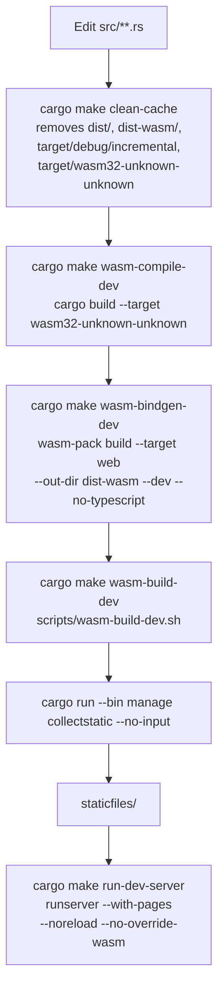

+++
title = "Part 6: Static Files and Styling"
weight = 60

[extra]
sidebar_weight = 60
+++

# Part 6: Static Files and Styling

The previous chapters wired up models, server functions, forms, and tests against the [`examples/examples-tutorial-basis/`](https://github.com/kent8192/reinhardt-web/tree/main/examples/examples-tutorial-basis) reference project. This chapter explains how that project actually ships its frontend: how the Rust WASM bundle gets out of `cargo build` and into the browser, what `cargo make collectstatic` is for, and what `index.html` does with it once it arrives.

You will not find the classic Django `STATICFILES_DIRS` plumbing here. Reinhardt's pages template has its own WASM-aware static pipeline built around the `AppStaticFilesConfig` inventory registration and the `cargo make` task graph defined in `Makefile.toml`. The rest of this chapter walks through both.

## The Two Static-Asset Tiers

The example project has two on-disk locations for static assets, and they have very different purposes:

| Tier | Directory | Populated by | Purpose |
|------|-----------|--------------|---------|
| WASM build output | `dist-wasm/` | `wasm-pack build --target web --out-dir dist-wasm` (via `cargo make wasm-bindgen-dev` / `wasm-bindgen-release`) | The compiled SPA bundle: `examples_tutorial_basis.js` + `examples_tutorial_basis_bg.wasm` |
| Aggregated static root | `staticfiles/` | `cargo make collectstatic` | The Django-style `STATIC_ROOT` — a flat tree that mirrors every registered `AppStaticFilesConfig` and is what gets served at `/static/` when the production server runs |

Both directories live at the project root and are both git-ignored build artifacts. They are intentionally separate: `dist-wasm/` is a *build product* that `wasm-pack` overwrites every time you compile, while `staticfiles/` is the *deployable artifact* that the `collectstatic` manage command assembles by copying every registered static directory into one place.

The bridge between the two is `src/config/wasm.rs`. It is a one-time inventory registration that tells `collectstatic` "there is a static directory called `dist-wasm/`, please collect it under url prefix `""` when you run":

```rust
//! WASM artifacts registration for collectstatic
//!
//! This module registers the dist-wasm directory containing WASM build artifacts
//! so that collectstatic can automatically discover and collect them to the final
//! distribution directory.

use reinhardt::reinhardt_apps::AppStaticFilesConfig;

inventory::submit! {
	AppStaticFilesConfig {
		app_label: "examples-tutorial-basis-wasm",
		static_dir: "dist-wasm",
		url_prefix: "",
	}
}
```

This file is included from `src/config.rs` under `#[cfg(native)]` (the WASM target neither runs `collectstatic` nor needs to register inventory entries). `app_label` is the namespace `collectstatic` uses to disambiguate file collisions; `static_dir` is a path relative to the crate root; `url_prefix = ""` means "collect under the root of `STATIC_ROOT`" rather than nesting under a subdirectory.

### Why two tiers instead of one?

Three reasons, all enforced by the example project's structure:

1. **`dist-wasm/` is owned by `wasm-pack`.** Anything you put there manually will be deleted on the next build. So you cannot use it as the source of truth for hand-authored CSS, fonts, or images — those need to live somewhere stable.
2. **`staticfiles/` is the production artifact.** When you deploy, you copy `staticfiles/` to a CDN or behind nginx. You never deploy `dist-wasm/` directly because it is incomplete: it has the WASM bundle but none of the other apps' static directories.
3. **`collectstatic` resolves naming conflicts.** If two apps each register a file called `logo.png`, the `app_label` field of `AppStaticFilesConfig` lets `collectstatic` either namespace them or fail loudly. Skipping the `collectstatic` step would put that conflict resolution back on the developer.

## The Build Pipeline

The `cargo make dev` and `cargo make dev-release` task graphs encapsulate the full pipeline. The diagram below traces what happens when you change a Rust file and want to see the result in the browser:



The right-hand column is what each step actually shells out to, copied verbatim from `Makefile.toml`. Each task is small enough to run in isolation, but in practice you always invoke them through one of the two umbrella tasks `dev` or `dev-release`. The next sections cover the individual pieces.

### `cargo make clean-cache`

The script `scripts/clean-cache.sh` is short enough to quote in full:

```bash
#!/usr/bin/env bash
# `cargo make clean-cache` body: drop the WASM bundles and Rust
# incremental cache so the next `cargo make dev` / `dev-release` rebuilds
# everything from scratch. Used as the first dependency of those
# pipelines to avoid serving stale wasm.
set -euo pipefail

echo "🧹 Cleaning build cache..."

# WASM artifacts
if [ -d "dist-wasm" ]; then
	rm -rf dist-wasm
	echo "  ✓ Removed dist-wasm/"
fi

if [ -d "dist" ]; then
	rm -rf dist
	echo "  ✓ Removed dist/"
fi

# Rust incremental build cache
if [ -d "target/debug/incremental" ]; then
	rm -rf target/debug/incremental
	echo "  ✓ Removed target/debug/incremental/"
fi

# WASM target build cache
if [ -d "target/wasm32-unknown-unknown" ]; then
	rm -rf target/wasm32-unknown-unknown
	echo "  ✓ Removed target/wasm32-unknown-unknown/"
fi

echo "✨ Build cache cleaned"
```

It exists because `wasm-pack` plus Rust incremental compilation can get into states where a new build silently emits the previous build's `*_bg.wasm`. The combination of removing `dist-wasm/`, `dist/`, the incremental cache, and the WASM-target build cache is a tested set that always forces a clean rebuild. You usually do not run it by hand — both `dev` and `dev-release` depend on it as their first step.

### `cargo make wasm-compile-dev` and `cargo make wasm-bindgen-dev`

These are the two underlying calls that `wasm-pack` orchestrates:

```toml
[tasks.wasm-compile-dev]
description = "Compile WASM binary (debug mode)"
command = "cargo"
args = ["build", "--target", "wasm32-unknown-unknown"]

[tasks.wasm-bindgen-dev]
description = "Generate WASM bindings using wasm-pack (debug mode)"
dependencies = ["wasm-compile-dev"]
command = "wasm-pack"
args = [
	"build",
	"--target", "web",
	"--out-dir", "dist-wasm",
	"--dev",
	"--no-typescript"
]
```

`wasm-compile-dev` runs the raw `cargo build` against the `wasm32-unknown-unknown` target, which produces the `.wasm` binary under `target/wasm32-unknown-unknown/debug/`. `wasm-bindgen-dev` then invokes `wasm-pack` to:

1. Re-run the underlying `cargo build` if needed (no-op when `wasm-compile-dev` already ran).
2. Run `wasm-bindgen` against the resulting `.wasm` to generate the JavaScript glue (`examples_tutorial_basis.js`) and the bindgen-rewritten `_bg.wasm`.
3. Place both files in `dist-wasm/`.

The `--target web` flag is what makes the generated JS module loadable directly by the browser via `import init from "/static/examples_tutorial_basis.js"` (no bundler required). `--dev` skips release-mode optimisation passes for a faster iteration cycle, and `--no-typescript` avoids emitting `.d.ts` files since this project does not have a TypeScript consumer.

### `cargo make wasm-build-dev`

This is the orchestrating task: it depends on `wasm-bindgen-dev`, then runs `scripts/wasm-build-dev.sh`:

```bash
#!/usr/bin/env bash
# Post-step for `cargo make wasm-build-dev`: after `wasm-pack` writes the
# debug bundle into `dist-wasm/`, copy it (plus other static assets) into
# the runserver's `--static-dir`. `--no-input` skips the interactive
# overwrite prompt so this runs cleanly in cargo-make.
set -euo pipefail

echo "Running collectstatic..."
cargo run --bin manage collectstatic --no-input
echo "✓ WASM build and collectstatic completed"
```

So `wasm-build-dev` is `wasm-bindgen-dev` plus a `collectstatic` call. The `--no-input` flag suppresses the "overwrite existing files? [y/N]" prompt that the manage command would otherwise emit, which would deadlock cargo-make's non-interactive shell.

### `cargo make collectstatic`

The task itself is a thin wrapper:

```toml
[tasks.collectstatic]
description = "Collect static files into STATIC_ROOT"
command = "cargo"
args = ["run", "--bin", "manage", "collectstatic"]
```

What it does at runtime is walk every `AppStaticFilesConfig` registered via `inventory::submit!` (including the one in `src/config/wasm.rs`) and copy each `static_dir` into the configured `STATIC_ROOT` (which defaults to `./staticfiles/` for the example). Files are placed under their declared `url_prefix`; in the WASM registration `url_prefix = ""`, so the WASM bundle lands directly at the root of `staticfiles/`.

After it runs you will see:

```
staticfiles/
├── examples_tutorial_basis.js
├── examples_tutorial_basis_bg.wasm
└── …other registered static directories, namespaced by app_label
```

### `cargo make dev`

This is the everyday task. Its definition in `Makefile.toml` is just a dependency chain:

```toml
[tasks.dev]
description = "Build WASM and start development server with frontend"
dependencies = ["clean-cache", "wasm-build-dev", "run-dev-server"]
```

So `cargo make dev` runs `clean-cache` → `wasm-build-dev` (which itself chains `wasm-compile-dev` → `wasm-bindgen-dev` → `collectstatic`) → `run-dev-server`. The last step is `scripts/run-dev-server.sh`:

```bash
#!/usr/bin/env bash
# Final step of `cargo make dev`: start the development server against the
# wasm bundle that `wasm-build-dev` already produced. The directory check
# guards against running `cargo make dev` from a parent directory — that
# happens to find this Makefile.toml via cargo-make's upward search but
# would still build the wrong project, so fail loudly instead.
#
# Flags:
#   --with-pages         hosts the SPA frontend alongside the API.
#   --noreload           we explicitly skip the runserver's own file
#                        watcher because `dev` already rebuilds the bundle.
#   --no-override-wasm   suppress runserver's internal wasm rebuild so it
#                        does not stomp on the artifacts wasm-build-dev
#                        just placed under `dist/`.
set -euo pipefail

CURRENT_DIR=$(basename "$PWD")
if [ "$CURRENT_DIR" != "examples-tutorial-basis" ]; then
	echo "Error: This command must be run from examples/examples-tutorial-basis directory"
	echo "Current directory: $PWD"
	echo "Please run: cd examples/examples-tutorial-basis && cargo make dev"
	exit 1
fi

echo "🚀 Starting development server with WASM frontend..."
cargo run --bin manage -- runserver --with-pages --noreload --no-override-wasm
```

Two flags are worth calling out:

- `--with-pages` hosts the SPA frontend alongside the JSON API. Without it `runserver` would still serve `/admin/` and the server-rendered REST endpoints in `views.rs` but would not mount the SPA shell.
- `--no-override-wasm` is what tells `runserver` *not* to re-invoke its own internal WASM rebuild — since `wasm-build-dev` has just produced the bundle, letting `runserver` do it again would either be wasted work or, worse, overwrite the just-built artifacts.

`runserver` itself depends on `migrate`, so by the time the dev server is listening, the SQLite database file `db.sqlite3` has its schema applied. You never have to run `cargo make migrate` by hand when starting a fresh worktree — the `runserver` task pulls it in automatically.

### `cargo make dev-release`

The release-mode equivalent chains a different set of tasks:

```toml
[tasks.dev-release]
description = "Build optimized WASM and start server"
dependencies = ["clean-cache", "wasm-build-release", "collectstatic", "run-dev-release-server"]
```

Three differences from `dev`:

1. `wasm-build-release` instead of `wasm-build-dev`. Internally this depends on `wasm-finalize-release`, which calls `scripts/wasm-finalize-release.sh` to run `wasm-opt -O3` against the bundle if Binaryen is on `PATH`:

   ```bash
   #!/usr/bin/env bash
   # Optional post-step for `cargo make wasm-build-release`: shrink the
   # release wasm bundle with `wasm-opt -O3` when the Binaryen toolchain is
   # available. Falls back to a no-op (with a warning) if wasm-opt is not on
   # PATH so the release build still completes on machines without
   # Binaryen installed.
   set -euo pipefail

   if command -v wasm-opt &> /dev/null; then
   	echo "Running wasm-opt..."
   	WASM_FILE="dist-wasm/examples_tutorial_basis_bg.wasm"
   	wasm-opt -O3 -o "$WASM_FILE.opt" "$WASM_FILE"
   	mv "$WASM_FILE.opt" "$WASM_FILE"
   	echo "✓ WASM optimized"
   else
   	echo "⚠️  wasm-opt not found, skipping optimization"
   fi
   ```

2. An explicit `collectstatic` dependency. `wasm-build-release` already calls `collectstatic` internally (via `scripts/wasm-build-release.sh`), but listing it as a separate dependency makes the intent explicit and ensures a re-run picks up any external app static directories added between the wasm build and the server start.
3. `run-dev-release-server` instead of `run-dev-server` — same flags (`--with-pages --noreload --no-override-wasm`) but with `cargo run --release` so the *server* binary is also release-mode.

The takeaway is that `dev` is for iteration and `dev-release` is for verifying the optimised bundle. Neither is the same as production deployment, but `dev-release` is the closest thing to it that still uses the dev-server harness.

### Where each task touches what

The matrix below summarises which directories each task reads or writes:

| Task | Reads | Writes |
|------|-------|--------|
| `clean-cache` | (none) | Removes `dist/`, `dist-wasm/`, `target/debug/incremental/`, `target/wasm32-unknown-unknown/` |
| `wasm-compile-dev` | `src/`, `Cargo.toml` | `target/wasm32-unknown-unknown/debug/` |
| `wasm-bindgen-dev` | `target/wasm32-unknown-unknown/debug/` | `dist-wasm/` |
| `wasm-build-dev` | `dist-wasm/`, every registered `AppStaticFilesConfig` | `staticfiles/` (via `collectstatic`) |
| `collectstatic` | every registered `AppStaticFilesConfig` (incl. `dist-wasm/`) | `staticfiles/` |
| `wasm-finalize-release` | `dist-wasm/examples_tutorial_basis_bg.wasm` | overwrites the same file in place |
| `wasm-build-release` | same as `wasm-bindgen-release` + finalize | `dist-wasm/`, `staticfiles/` |
| `run-dev-server` | `dist-wasm/` (during dev), `staticfiles/` | (none — serves) |
| `dev` | (delegates) | (delegates) |
| `dev-release` | (delegates) | (delegates) |

A subtle point: under `cargo make dev`, the server is *not* serving from `staticfiles/`. It is serving from `dist-wasm/` because that directory is registered via `AppStaticFilesConfig` and `runserver --with-pages` honours the inventory list directly during development. The `collectstatic` step that `wasm-build-dev` runs is mostly there to keep `staticfiles/` in sync for ad-hoc inspection; the SPA bundle that the browser actually loads comes from the inventory registration. Under `cargo make dev-release`, the explicit `collectstatic` dependency does become functionally important because the production-shaped server expects the aggregated tree.

## `index.html`: The SPA Shell

`index.html` lives at the project root and is copied (verbatim) into the directory that the dev server serves at `/`. It is what the browser fetches when a user visits `http://127.0.0.1:8000/` for the first time. The entire file is short enough to read top to bottom:

```html
<!DOCTYPE html>
<html lang="en">
<head>
	<meta charset="UTF-8">
	<meta name="viewport" content="width=device-width, initial-scale=1.0">
	<title>Polls App - Reinhardt Tutorial</title>
	<link rel="icon" type="image/png" href="/favicon.png">

	<!-- UnoCSS Reset -->
	<link rel="stylesheet" href="https://cdn.jsdelivr.net/npm/@unocss/reset/tailwind.min.css">

	<!-- UnoCSS Configuration -->
	<script>
		window.__unocss = {
			theme: {
				colors: {
					brand: '#4a90e2',
					'brand-hover': '#357abd',
				},
			},
			shortcuts: [
				['btn', 'inline-flex items-center px-4 py-2 rounded-full font-semibold'],
				['btn-primary', 'btn bg-brand text-white hover:bg-brand-hover'],
				['btn-secondary', 'btn bg-gray-600 text-white hover:bg-gray-700'],
				['spinner', 'animate-spin rounded-full border-2 border-gray-200 border-t-brand'],
				['card', 'bg-white rounded-lg shadow-md'],
				['card-body', 'p-6'],
				['form-check', 'flex items-center p-3 mb-2 border rounded cursor-pointer hover:bg-gray-50'],
				['alert-danger', 'bg-red-100 border border-red-400 text-red-700 px-4 py-3 rounded'],
				['alert-warning', 'bg-yellow-100 border border-yellow-400 text-yellow-700 px-4 py-3 rounded'],
			],
		};
	</script>

	<!-- UnoCSS Runtime -->
	<script src="https://cdn.jsdelivr.net/npm/@unocss/runtime"></script>

	<style>
		body {
			background-color: #f8f9fa;
		}
	</style>
</head>
<body class="bg-gray-50 text-gray-900 antialiased">
	<div id="root">
		<div class="flex items-center justify-center min-h-screen">
			<div class="text-center">
				<div class="spinner w-12 h-12 mx-auto mb-4"></div>
				<p class="text-gray-600">Loading...</p>
			</div>
		</div>
	</div>
</body>
</html>
```

Three things deserve attention.

First, the `#root` `<div>` is where the SPA mounts. Recall from Part 3 that `src/client/lib.rs` calls `ClientLauncher::new("#root").router_client(...).launch()` — that selector matches this element. The placeholder content inside `#root` (the spinner plus "Loading…") is what the user sees during the brief window between the HTML being parsed and the WASM bundle being instantiated. Once the launcher takes over, it replaces the entire subtree with the router's first page.

Second, there is no explicit `<script type="module">` here that imports the WASM bundle. The pages template's `ClientLauncher` is responsible for locating and instantiating `examples_tutorial_basis.js` and `examples_tutorial_basis_bg.wasm` from the same origin — the SPA shell does not need to hand-wire `init(wasmUrl)`. This is deliberate: the shell stays static while the framework controls how the bundle is loaded.

Third, UnoCSS is delivered straight from a CDN with a small inline configuration. The `window.__unocss` object pre-declares the theme colour `brand` (used as `text-brand`, `bg-brand`, `border-brand` on the framework's atomic utilities) and a handful of shortcuts (`btn`, `btn-primary`, `card`, `card-body`, `form-check`, `spinner`, `alert-danger`, `alert-warning`). Those shortcuts are exactly the class names the `page!` macros in `src/client/components/` reach for, so adding a new shortcut here is the quickest way to keep the markup terse without writing custom CSS files. The CDN URL is left unpinned in the example because the runtime script is small and the project does not need bit-for-bit reproducibility for it; if you want offline builds, mirror it into a registered static directory and reference that local copy instead.

## The `msw` Feature

The example's `Cargo.toml` defines a third feature flag that is directly relevant to how the static pipeline interacts with testing:

```toml
[features]
default = ["with-reinhardt", "client-router"]
# client-router: Enable client-side routing support (required for #[routes] macro with UnifiedRouter)
client-router = []
with-reinhardt = []
# `msw` is forwarded to the facade so `#[server_fn]` generates the
# `MockableServerFn` markers consumed by `tests/wasm/polls_mock_test.rs`.
# This feature only resolves once the framework `msw` facade flag ships
# (tracked in #4287 / PR #4288); until then, leaving it absent makes the
# typed MSW test target skip cleanly via its `required-features = ["msw"]`.
msw = []
```

The `msw` feature here is a thin pass-through: enabling it on the example crate forwards to the `reinhardt` facade so that `#[server_fn]` generates the `MockableServerFn` markers that the WASM-only test target `tests/wasm/polls_mock_test.rs` consumes for Mock Service Worker–style interception. The opt-in shape is deliberate because the facade flag is still in flight (tracked in upstream `#4287` and its PR `#4288`); until that lands, leaving the feature out of `default` keeps `cargo nextest run` and `wasm-pack test` both green via the `required-features = ["msw"]` clause on the test declaration:

```toml
[[test]]
name = "polls_mock_test"
path = "tests/wasm/polls_mock_test.rs"
required-features = ["msw"]
```

That is, the test target is *declared* but is not compiled unless `--features msw` is passed. Once the upstream facade ships, flipping the example to `default = ["with-reinhardt", "client-router", "msw"]` makes the typed mock tests light up without any other code change.

This matters in the static-files chapter for one reason: the MSW-style mocks intercept the HTTP requests that the SPA makes from inside the browser, so they are exercising the *served* WASM bundle, not the source `.wasm` on disk. If `wasm-build-dev` has not run, there is nothing for the test harness to load, and the failure mode looks like "the test page is blank". The `wasm-test` task documents the related quirk:

```toml
# `--no-default-features` is forwarded to the underlying `cargo build --tests
# --target wasm32-unknown-unknown` so the `with-reinhardt`-gated `manage` bin
# (native-only, uses tokio / reinhardt::commands / async fn main) is skipped
# via its `required-features`. Without this flag the wasm test build pulls
# the bin in and fails to compile.
[tasks.wasm-test]
description = "Run WASM tests in headless Chrome"
command = "wasm-pack"
args = ["test", "--headless", "--chrome", "--", "--no-default-features"]
```

The cross-reference between Part 5's testing chapter and this one is that the `msw` feature is what makes the test target compile, the `wasm-test` task is what *runs* it, and the static pipeline described above is what produces the bundle that the test target instantiates inside headless Chrome.

## What This Chapter Does Not Cover

It is worth being explicit about what *isn't* part of Reinhardt's pages static pipeline, since the analogy with classic Django sometimes leads to wrong expectations:

- **There is no `STATICFILES_DIRS` array configured in `settings/base.toml`.** Look at the file from Part 1 — it has `[core]`, `[core.security]`, and `[database]`, but no `[static]` section. The pages template registers static directories programmatically via `AppStaticFilesConfig` + `inventory::submit!`, not declaratively via a settings list. If you want to register an additional static directory (say, a `static/` folder for hand-authored CSS), you add another `inventory::submit!` block alongside `src/config/wasm.rs` rather than appending to a TOML array.
- **There is no `STATICFILES_STORAGE` to swap in for hashed filenames or S3 uploads.** The example uses the framework's default storage, which is a plain filesystem copy into `STATIC_ROOT`. CDN integration and content-hashed asset names are out of scope for this tutorial's example project; they are framework-level concerns that the pages template intentionally leaves to deployment configuration.
- **There is no per-app `static/` directory convention enforced by the framework.** Django auto-collects from any app's `static/` folder; Reinhardt does not. Each static source is registered explicitly via `AppStaticFilesConfig`, which means there are no surprises at collect time — you can `grep` the codebase for `AppStaticFilesConfig` to see every static-asset source the project ships with.
- **There is no `` template tag in `index.html`.** The shell HTML is served as-is, without template rendering. Substitution happens (if at all) inside the WASM bundle once it runs, not before.

These omissions are intentional. The pages template's static story is "build the WASM bundle, register the build output for collection, copy everything into a known root, and serve from there" — concrete, scriptable, and free of the implicit per-app discovery that Django uses.

## Troubleshooting

The two failure modes you will hit during a tutorial session are both easy to diagnose:

### The SPA stays on the "Loading…" spinner

The shell rendered (so the server is up) but the WASM bundle never instantiated. Almost always this is a stale `dist-wasm/` left over from a previous build that no longer matches the source:

```bash
cargo make clean-cache && cargo make wasm-build-dev
```

`clean-cache` removes `dist/`, `dist-wasm/`, and the Rust incremental cache; `wasm-build-dev` rebuilds the bundle and runs `collectstatic`. After that, reload the browser. If the spinner is still there, open the browser devtools console — an outdated `*_bg.wasm` will surface as a bindgen mismatch error there, while a missing file will surface as a `404` in the network panel.

### `cargo make dev` builds but the database has no tables

This should not happen with the example as shipped — the `runserver` task explicitly depends on `migrate`, so a fresh `db.sqlite3` gets its schema applied before the server starts listening. If you somehow get a `no such table: polls_question` error after `cargo make dev`, run `cargo make migrate` once by hand to confirm the migration target works, then re-run `cargo make dev`. The dependency chain in `Makefile.toml` does not skip steps unless you have edited it, so this is mostly a "did you wipe `db.sqlite3` while the server was running" check.

### `cargo make wasm-test` fails to compile

This is the failure mode the `wasm-test` task description warns about:

```text
error[E0432]: unresolved import `tokio::main`
```

It means `cargo build --tests --target wasm32-unknown-unknown` pulled the native-only `manage` binary in. The fix is already baked into the task definition: `wasm-pack test … -- --no-default-features` passes `--no-default-features` down, which drops the `with-reinhardt` feature, which gates the `manage` bin via its `required-features = ["with-reinhardt"]` clause. So always invoke the WASM tests through `cargo make wasm-test` rather than calling `wasm-pack test` directly.

## What's Next?

In the final chapter, you will look at the project's admin layout: how `src/apps/polls/admin.rs` registers `QuestionAdmin` and `ChoiceAdmin` via `#[admin(model, for = …)]`, and how `src/config/admin.rs` composes them into a project-wide `AdminSite` that `src/config/urls.rs` mounts at `/admin/`.

Continue to [Part 7: Admin Customization](../7-admin-customization/).
